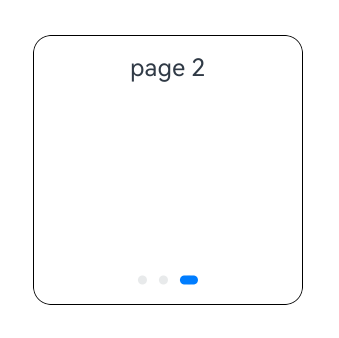

# Class (PageSwitchActionProposal)

智慧手势翻页动作处理，默认方向为向前翻页，包括向右和向下。当通过[registerMonitor](https://developer.huawei.com/consumer/cn/doc/harmonyos-references/arkts-apis-uicontext-smartgesturecontroller#registermonitor)接口动态自定义智慧手势行为时，设置返回值[Class (GestureHandlingResolution)](https://developer.huawei.com/consumer/cn/doc/harmonyos-references/arkts-apis-uicontext-gesturehandlingresolution)的selectedProposal为该类型对象，会触发目标组件的翻页操作。

起始版本： 26.0.0

#### constructor

constructor(node: FrameNode, pageCount: number)

智慧手势翻页动作处理的构造函数。

起始版本： 26.0.0

模型约束： 此接口仅可在Stage模型下使用。

元服务API： 从API版本26.0.0开始，该接口支持在元服务中使用。

系统能力： SystemCapability.ArkUI.ArkUI.Full

参数：

| 参数名 | 类型 | 必填 | 说明 |
| --- | --- | --- | --- |
| node | [FrameNode](https://developer.huawei.com/consumer/cn/doc/harmonyos-references/js-apis-arkui-framenode#framenode-1) | 是 | 响应翻页动作的目标节点。 |
| pageCount | number | 是 | 翻页数量。 取值范围：[0, +∞)，小于0时按0处理。 单位为页。 |

#### 属性

起始版本： 26.0.0

模型约束： 此接口仅可在Stage模型下使用。

元服务API： 从API版本26.0.0开始，该接口支持在元服务中使用。

系统能力： SystemCapability.ArkUI.ArkUI.Full

| 名称 | 类型 | 只读 | 可选 | 说明 |
| --- | --- | --- | --- | --- |
| pageCount | number | 否 | 否 | 智慧手势翻页数量。 取值范围：[0, +∞)，小于0时按0处理。 单位为页。 |

示例：

本示例实现了在智慧手势监听回调中，自定义智慧手势动作处理为智慧手势翻页动作处理，完整示例请参考[示例1（启用智慧手势并自定义动作处理）](https://developer.huawei.com/consumer/cn/doc/harmonyos-references/arkts-apis-uicontext-smartgesturecontroller#示例1启用智慧手势并自定义动作处理)。

```
import {
  BaseGestureHandlingProposal,
  GestureHandlingResolution,
  PageSwitchActionProposal,
} from '@kit.ArkUI';

@Entry
@Component
struct SmartGestureControllerExample {
  private controller = this.getUIContext().getSmartGestureController();
  private smartGestureMonitor = (proposal: BaseGestureHandlingProposal) => {
    let result = new GestureHandlingResolution(true);
    let node = this.getUIContext().getFrameNodeById('target_swiper');
    if (node) {
      let pageSwitchProposal = new PageSwitchActionProposal(node, 2);
      result.selectedProposal = pageSwitchProposal;
    }
    return result;
  };

  aboutToAppear(): void {
    this.controller.enableSmartTapAndSlideGestures(true);
    this.controller.registerMonitor(this.smartGestureMonitor);
  }

  aboutToDisappear(): void {
    this.controller.clearMonitors();
    this.controller.enableSmartTapAndSlideGestures(false);
  }

  build() {
    Scroll() {
      Column({ space: 12 }) {
        Swiper() {
          Column({ space: 8 }) {
            Text('page 0')
          }
          .justifyContent(FlexAlign.Start)
          .padding(12)

          Column({ space: 8 }) {
            Text('page 1')
          }
          .justifyContent(FlexAlign.Start)
          .padding(12)

          Column({ space: 8 }) {
            Text('page 2')
          }
          .justifyContent(FlexAlign.Start)
          .padding(12)
        }
        .width(180)
        .height(180)
        .id('target_swiper')
        .index(0)
        .loop(false)
        .borderRadius(12)
        .borderWidth(1)
      }.width('100%')
    }
    .layoutWeight(1)
    .width('100%')
    .height('100%')
    .padding(12)
  }
}
```
 
