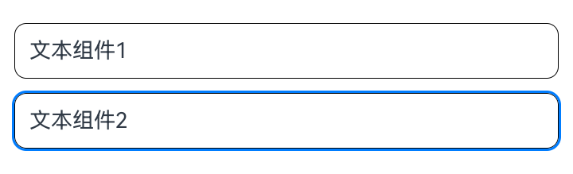

# Class (SelectActionProposal)

智慧手势选中动作处理。当通过[registerMonitor](https://developer.huawei.com/consumer/cn/doc/harmonyos-references/arkts-apis-uicontext-smartgesturecontroller#registermonitor)接口动态自定义智慧手势行为时，设置返回值[Class (GestureHandlingResolution)](https://developer.huawei.com/consumer/cn/doc/harmonyos-references/arkts-apis-uicontext-gesturehandlingresolution)的selectedProposal为该类型对象，会使目标组件被选中。

起始版本： 26.0.0

#### constructor

constructor(node: FrameNode)

智慧手势选中动作处理的构造函数。

起始版本： 26.0.0

模型约束： 此接口仅可在Stage模型下使用。

元服务API： 从API版本26.0.0开始，该接口支持在元服务中使用。

系统能力： SystemCapability.ArkUI.ArkUI.Full

参数：

| 参数名 | 类型 | 必填 | 说明 |
| --- | --- | --- | --- |
| node | [FrameNode](https://developer.huawei.com/consumer/cn/doc/harmonyos-references/js-apis-arkui-framenode#framenode-1) | 是 | 响应选中动作的目标节点。 |

示例：

本示例实现了在智慧手势监听回调中，自定义智慧手势动作处理为智慧手势选中动作处理，完整示例请参考[示例1（启用智慧手势并自定义动作处理）](https://developer.huawei.com/consumer/cn/doc/harmonyos-references/arkts-apis-uicontext-smartgesturecontroller#示例1启用智慧手势并自定义动作处理)。

```
import {
  BaseGestureHandlingProposal,
  GestureHandlingResolution,
  SelectActionProposal,
} from '@kit.ArkUI';

@Entry
@Component
struct SmartGestureControllerExample {
  private controller = this.getUIContext().getSmartGestureController();
  private smartGestureMonitor = (proposal: BaseGestureHandlingProposal) => {
    let result = new GestureHandlingResolution(true);
    let node = this.getUIContext().getFrameNodeById('target_text2');
    if (node) {
      let selectProposal = new SelectActionProposal(node);
      result.selectedProposal = selectProposal;
    }
    return result;
  };

  aboutToAppear(): void {
    this.controller.enableSmartTapAndSlideGestures(true);
    this.controller.registerMonitor(this.smartGestureMonitor);
  }

  aboutToDisappear(): void {
    this.controller.clearMonitors();
    this.controller.enableSmartTapAndSlideGestures(false);
  }

  build() {
    Scroll() {
      Column({ space: 12 }) {
        Text('文本组件1')
          .id('target_text1')
          .fontSize(18)
          .width('100%')
          .padding(12)
          .borderRadius(10)
          .borderWidth(1)
          .smartGestureShortcut({ action: GestureShortcut.PRIMARY, enabled: true, selectable: true })
          .onClick(() => {
            console.info('smartGesture click is triggered');
          })
        Text('文本组件2')
          .id('target_text2')
          .fontSize(18)
          .width('100%')
          .padding(12)
          .borderRadius(10)
          .borderWidth(1)
          .smartGestureShortcut({ action: GestureShortcut.PRIMARY, enabled: true, selectable: true })
          .onClick(() => {
            console.info('smartGesture click is triggered');
          })
      }.width('100%')
    }
    .layoutWeight(1)
    .width('100%')
    .height('100%')
    .padding(12)
  }
}
```
 
