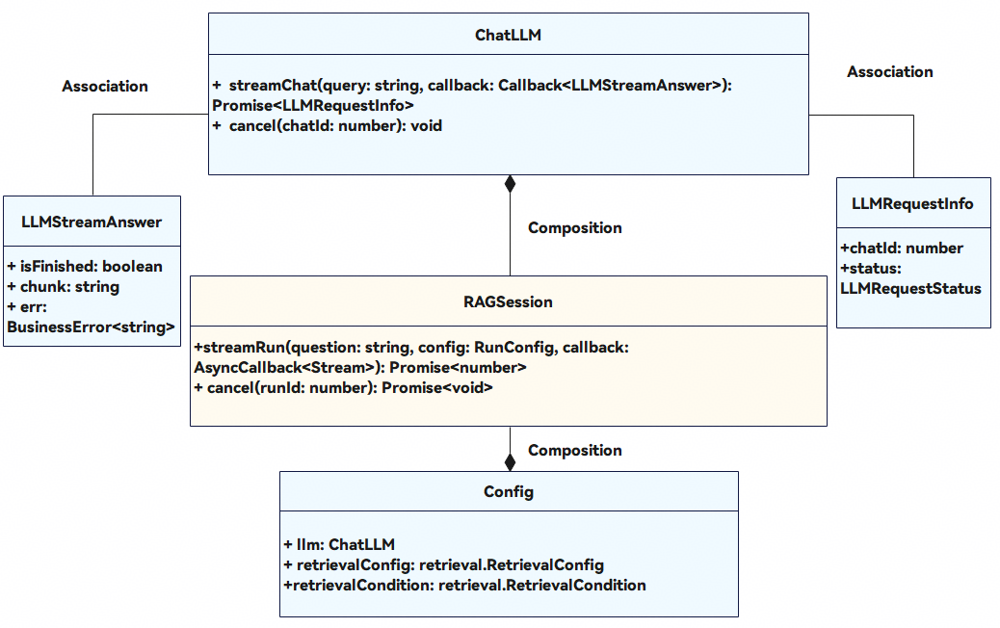

# rag（检索增强生成）

本模块提供创建和关闭会话（[RagSession](#ragsession)）、流式请求大语言模型（[ChatLLM](#chatllm)）以及流式问答（[streamRun](#streamrun)）的能力。

起始版本： 6.0.0(20)

#### 模块概述

RAG（Retrieval-Augmented Generation，检索增强生成）模块提供基于知识库的智能问答能力。其工作流程如下：

1. 开发者通过[createRagSession](#createragsession)创建RagSession会话实例，同时配置大模型（Large Language Model，简称LLM）和检索相关参数。
2. 调用[RagSession.streamRun](#streamrun)发起流式问答，系统首先根据问题从知识库检索相关内容。
3. 检索结果与问题一并提交给大语言模型，由模型生成最终答案。
4. 开发者可通过[RagSession.cancel](#cancel-1)取消正在进行的问答。
5. 问答完成后，开发者可通过[feedback](#feedback)接口上报用户反馈信息。
6. 不再使用时，调用[RagSession.close](#close)关闭会话，释放资源。

使用约束： 此模块不支持多线程调用，即同一时刻仅能有一个RAG会话执行streamRun或cancel操作。

#### 关键Class/Interface介绍

#### [h2]核心类型概览

| 名称 | 类型 | 说明 |
| --- | --- | --- |
| [ChatLLM](#chatllm) | 抽象类 | LLM流式请求抽象类，应用需继承实现[streamChat](#streamchat)和[cancel](#cancel)方法 |
| [RagSession](#ragsession) | 接口 | RAG会话，用于知识库问答，提供[streamRun](#streamrun)和[cancel](#cancel-1)方法 |
| [Config](#config) | 接口 | 会话配置，包含LLM实例和检索配置 |

#### [h2]UML类图



#### 导入模块

```
import { rag } from '@kit.DataAugmentationKit';
```

#### LLMStreamAnswer

大模型流式问答的单次结果。

模型约束： 此接口仅可在Stage模型下使用。

系统能力： SystemCapability.DataAugmentation.RAG

起始版本： 6.0.0(20)

| 名称 | 类型 | 只读 | 可选 | 说明 |
| --- | --- | --- | --- | --- |
| isFinished | boolean | 否 | 否 | 表示LLM流式输出是否已经结束。true表示已结束，false表示后续还有答案输出。 |
| chunk | string | 否 | 否 | 表示LLM流式输出过程中单轮返回的chunk（被拆分后的文本单元）内容。单轮流式返回结果无固定上限，单次问答所有流式返回结果长度上限为8192字节。 |
| err | [BusinessError](https://developer.huawei.com/consumer/cn/doc/harmonyos-references/js-apis-base#businesserror) | 否 | 是 | 表示LLM流式输出过程中出现的错误。[code](https://developer.huawei.com/consumer/cn/doc/harmonyos-references/js-apis-base#businesserror)取值范围为[1021011000, 1021012000)，超过范围则会报错[1021000000](https://developer.huawei.com/consumer/cn/doc/harmonyos-references/errorcode-dataaugmentation#section1021000000-系统资源不足或内存访问异常)。基类必选参数name和message的长度上限为1000字符，超出部分将被截断。不带本参数则认为无错误发生。 |

#### LLMRequestStatus

流式请求大语言模型请求状态的枚举值。

模型约束： 此接口仅可在Stage模型下使用。

系统能力： SystemCapability.DataAugmentation.RAG

起始版本： 6.0.0(20)

| 名称 | 值 | 说明 |
| --- | --- | --- |
| LLM_SUCCESS | 0 | 请求LLM成功。表示streamChat已成功发起LLM调用并获得有效响应。 |
| LLM_REQUEST_ERROR | 1 | 请求错误。表示在请求LLM过程中发生了错误（如网络问题、参数错误等），建议检查网络连接和query参数是否符合要求。 |
| LLM_LOAD_FAILED | 2 | LLM加载失败。表示LLM模型未能成功加载，可能是模型资源缺失或内存不足导致。建议确保设备有足够的存储空间和内存。 |
| LLM_TIMEOUT | 3 | LLM请求超时。表示LLM响应时间超过了预期上限，可能是模型繁忙或网络延迟导致。建议稍后重试。 |
| LLM_BUSY | 4 | LLM繁忙。表示当前LLM实例正在处理其他请求，无法接受新的请求。建议等待一段时间后重试。 |

#### LLMRequestInfo

流式请求大语言模型请求结果的信息。

模型约束： 此接口仅可在Stage模型下使用。

系统能力： SystemCapability.DataAugmentation.RAG

起始版本： 6.0.0(20)

| 名称 | 类型 | 只读 | 可选 | 说明 |
| --- | --- | --- | --- | --- |
| chatId | number | 否 | 否 | 表示大模型的请求ID。取值范围：[0, 2147483647]。开发者需要自行维护chatId与实际HTTP请求的映射关系，以便后续调用[cancel](#cancel)时能够取消对应的请求。 |
| status | [LLMRequestStatus](#llmrequeststatus) | 否 | 否 | 表示[streamChat](#streamchat)请求的状态。通过此字段，调用方可以判断本次LLM调用是否成功，以及失败的具体原因。 |

#### ChatLLM

用于请求大模型的抽象类。开发者需继承此类并根据业务逻辑实现各接口逻辑。

模型约束： 此接口仅可在Stage模型下使用。

系统能力： SystemCapability.DataAugmentation.RAG

起始版本： 6.0.0(20)

#### [h2]streamChat

abstract streamChat(query: string, callback: Callback<LLMStreamAnswer>): Promise<LLMRequestInfo>

流式请求大语言模型，用于与大语言模型交互。使用Promise异步回调。

模型约束： 此接口仅可在Stage模型下使用。

系统能力： SystemCapability.DataAugmentation.RAG

起始版本： 6.0.0(20)

参数：

| 参数名 | 类型 | 必填 | 说明 |
| --- | --- | --- | --- |
| query | string | 是 | 与大模型交互时的请求内容，根据输入问题、问题预处理、检索等结果动态拼接，最大长度为20000字节。使用的API模型不同最大长度不同，开发者使用相关模型时注意对应的最大长度。说明： 其中已带有需要带给大模型的提示prompt，无需额外附加内容，且提示prompt中的示例数据均只是提示大模型按照预期输出的模拟数据，无其他额外用途。 |
| callback | Callback | 是 | 将与大语言模型交互后得到的结果返回给RAG基础框架的回调。 |

返回值：

| 类型 | 说明 |
| --- | --- |
| Promise | Promise对象，返回LLM请求信息对象。其中chatId用于标识本次LLM请求，开发者需要在后续cancel时传入相同的chatId；status表示请求状态，LLM_SUCCESS表示成功，其他值表示失败。 |

示例：

```
import { BusinessError } from '@kit.BasicServicesKit';
import { http } from '@kit.NetworkKit';
import { rag } from '@kit.DataAugmentationKit';

class MyChatLLM extends rag.ChatLLM {
  httpRequest: http.HttpRequest | null = http.createHttp();
  cancel(chatId: number) {
    // 请开发者按需实现chatId与请求之前的映射关系，取消时请取消chatId相应的请求
    this.httpRequest?.off('dataReceive');
  }
  async streamChat(query: string, callback: Callback<rag.LLMStreamAnswer>): Promise<rag.LLMRequestInfo> {
    let info: rag.LLMRequestInfo = {
      chatId: 0,
      status: rag.LLMRequestStatus.LLM_SUCCESS,
    };
    try {
      // 此处开发者可自行选择想要使用的大语言模型以及对应实现
      // 假设通过httpRequest.on('dataReceive', callback)从大语言模型得到了答案：
      let err: BusinessError<string> = {
        code: 1021011000,  // 自定义错误码，取值范围[1021011000, 1021012000)
        name: 'Fill custom error name here',  // 超出1000字符部分将被截断
        message: 'Fill custom error message here'  // 超出1000字符部分将被截断
      }
      let answer: rag.LLMStreamAnswer = {
        isFinished: true,  // 可根据大语言模型回复进行判断，如果是最后一条回复则为true，反之则为false
        chunk: 'This is the last chunk',
        err: err
      }
      callback(answer);
    } catch (err) {
      // 此处示例统一返回LLM_REQUEST_ERROR，开发者可根据需要判断err.code并返回相应LLMRequestStatus
      info.status = rag.LLMRequestStatus.LLM_REQUEST_ERROR;
    }
    return info;
  }
}
```

#### [h2]cancel

abstract cancel(chatId: number): void

取消流式请求大语言模型，用于暂停与大语言模型交互。

模型约束： 此接口仅可在Stage模型下使用。

系统能力： SystemCapability.DataAugmentation.RAG

起始版本： 6.0.0(20)

参数：

| 参数名 | 类型 | 必填 | 说明 |
| --- | --- | --- | --- |
| chatId | number | 是 | 需要被取消的请求LLM的ID。与[streamChat](#streamchat)返回值[LLMRequestInfo](#llmrequestinfo)中填入的chatId保持一致。取值范围：[0, 2147483647]。开发者需要在streamChat被调用时保存chatId与实际HTTP请求的映射关系，以便在cancel时能够找到对应的请求并取消。 |

示例：

```
import { http } from '@kit.NetworkKit';
import { rag } from '@kit.DataAugmentationKit';

class MyChatLLM extends rag.ChatLLM {
  httpRequest: http.HttpRequest | null = http.createHttp();
  cancel(chatId: number) {
    // 请开发者按需实现chatId与请求之前的映射关系，取消时请取消chatId相应的请求
    this.httpRequest?.off('dataReceive');
  }
  async streamChat(query: string, callback: Callback<rag.LLMStreamAnswer>): Promise<rag.LLMRequestInfo> {
    // 省略streamChat实现，其具体使用见streamChat接口说明
    return {
      chatId: 0,
      status: rag.LLMRequestStatus.LLM_SUCCESS,
    };
  }
}
```

#### Config

RAG会话的配置项。

模型约束： 此接口仅可在Stage模型下使用。

系统能力： SystemCapability.DataAugmentation.RAG

起始版本： 6.0.0(20)

| 名称 | 类型 | 只读 | 可选 | 说明 |
| --- | --- | --- | --- | --- |
| llm | [ChatLLM](#chatllm) | 否 | 否 | 表示[ChatLLM](#chatllm)的提供者。开发者需要创建ChatLLM子类的实例并传入。当需要使用RAG进行问答时，必须配置此项。llm实例负责与实际的大语言模型交互。 |
| retrievalConfig | [retrieval.RetrievalConfig](https://developer.huawei.com/consumer/cn/doc/harmonyos-references/dataaugmentation-retrieval-api#retrievalconfig) | 否 | 否 | 表示检索使用的配置。包括向量数据库连接信息、检索通道配置等。当需要从知识库检索相关内容时，需要配置此项。 |
| retrievalCondition | [retrieval.RetrievalCondition](https://developer.huawei.com/consumer/cn/doc/harmonyos-references/dataaugmentation-retrieval-api#retrievalcondition) | 否 | 否 | 表示检索的条件。包括召回条件、过滤条件等。当需要对知识库检索进行更精细的控制时，需要配置此项。 |

示例：

```
import { rag, retrieval } from '@kit.DataAugmentationKit';
// MyChatLlm对应文件，是自定义实现的rag.ChatLLM类MyChatLLM所在的文件，具体实现见ChatLLM章节示例
import MyChatLLM from './MyChatLlm';

let retrievalConfig: retrieval.RetrievalConfig = {
  channelConfigs: [
    // 假设已经按需配置
  ]
};

let retrievalCondition: retrieval.RetrievalCondition = {
  recallConditions: [
    // 假设已经按需配置
  ]
};

let config: rag.Config = {
  llm: new MyChatLLM(),
  retrievalConfig: retrievalConfig,
  retrievalCondition: retrievalCondition
};
```

#### Answer

流式问答的数据。

模型约束： 此接口仅可在Stage模型下使用。

系统能力： SystemCapability.DataAugmentation.RAG

起始版本： 6.0.0(20)

| 名称 | 类型 | 只读 | 可选 | 说明 |
| --- | --- | --- | --- | --- |
| chunk | string | 否 | 否 | 表示问题摘要的答案。长度上限为8192字节。 |
| data | Array | 否 | 是 | 表示检索的匹配结果。最多返回600个chunk。 |

#### StreamType

流式问答回答的类型。

模型约束： 此接口仅可在Stage模型下使用。

系统能力： SystemCapability.DataAugmentation.RAG

起始版本： 6.0.0(20)

| 名称 | 值 | 说明 |
| --- | --- | --- |
| THOUGHT | 0 | 思考过程数据。表示LLM在生成最终答案前的推理过程或中间思考内容。部分LLM会输出思考过程。 |
| REFERENCE | 1 | 检索到的文档或知识的来源。表示RAG框架从知识库中检索到的相关内容，作为LLM生成答案的参考。 |
| ANSWER | 2 | 生成的内容的最终结果。表示LLM基于检索结果生成的最终回答。 |

#### Stream

流式问答中一次回答的结果信息。

模型约束： 此接口仅可在Stage模型下使用。

系统能力： SystemCapability.DataAugmentation.RAG

起始版本： 6.0.0(20)

| 名称 | 类型 | 只读 | 可选 | 说明 |
| --- | --- | --- | --- | --- |
| type | [StreamType](#streamtype) | 否 | 否 | 表示答案的数据类型。 |
| answer | [Answer](#answer) | 否 | 否 | 表示答案的数据。 |
| isFinished | boolean | 否 | 否 | 表示流输出是否结束。true表示本轮问答已结束，false表示本轮本轮问答还有后续回答。 |

#### RunConfig

流式问答的配置项。

模型约束： 此接口仅可在Stage模型下使用。

系统能力： SystemCapability.DataAugmentation.RAG

起始版本： 6.0.0(20)

| 名称 | 类型 | 只读 | 可选 | 说明 |
| --- | --- | --- | --- | --- |
| answerTypes | Array | 否 | 否 | 用于指定流式输出的数据类型。 |

#### FeedbackInfo

用户反馈信息。

模型约束： 此接口仅可在Stage模型下使用。

系统能力： SystemCapability.DataAugmentation.RAG

起始版本： 6.0.0(20)

| 名称 | 类型 | 只读 | 可选 | 说明 |
| --- | --- | --- | --- | --- |
| runId | number | 否 | 否 | 会话内特定流式问答的唯一标识符。取值范围：[0, 2147483647]。 |
| score | number | 否 | 否 | 用户对返回答案的评分。取值范围：[1, 5]。 |
| source | Record | 否 | 是 | 用户采用的答案信息。 |
| comment | string | 否 | 是 | 用户反馈的文本信息。长度上限为1000字节。 |

#### RagSession

RAG会话，用以提供基于知识库的智能问答能力。

模型约束： 此接口仅可在Stage模型下使用。

系统能力： SystemCapability.DataAugmentation.RAG

起始版本： 6.0.0(20)

#### [h2]streamRun

streamRun(question: string, config: RunConfig, callback: AsyncCallback<Stream>): Promise<number>

流式问答，答案是流式传输的，使用Promise异步回调。不支持多线程调用。

模型约束： 此接口仅可在Stage模型下使用。

系统能力： SystemCapability.DataAugmentation.RAG

起始版本： 6.0.0(20)

参数：

| 参数名 | 类型 | 必填 | 说明 |
| --- | --- | --- | --- |
| question | string | 是 | 表示本次提出的问题。长度上限为1000字节。 |
| config | [RunConfig](#runconfig) | 是 | 表示本次提问的配置。 |
| callback | AsyncCallback | 是 | 回调函数。当流式问答成功，err取值为BusinessError，data为获取到的数据內容；否则为错误对象。 |

返回值：

| 类型 | 说明 |
| --- | --- |
| Promise | Promise对象，返回本次调用的ID。 |

错误码：

以下错误码的详细介绍请参见[通用错误码](https://developer.huawei.com/consumer/cn/doc/harmonyos-references/errorcode-universal)和[数据增强错误码](https://developer.huawei.com/consumer/cn/doc/harmonyos-references/errorcode-dataaugmentation)。

| 错误码ID | 错误信息 |
| --- | --- |
| [1021000000](https://developer.huawei.com/consumer/cn/doc/harmonyos-references/errorcode-dataaugmentation#section1021000000-系统资源不足或内存访问异常) | Insufficient system resources or memory access exception. |
| [1021000001](https://developer.huawei.com/consumer/cn/doc/harmonyos-references/errorcode-dataaugmentation#section1021000001-调用llm超时) | A timeout occurred when calling the LLM. |
| [1021000002](https://developer.huawei.com/consumer/cn/doc/harmonyos-references/errorcode-dataaugmentation#section1021000002-调用llm加载失败) | A loading failure occurred when calling the LLM. |
| [1021000003](https://developer.huawei.com/consumer/cn/doc/harmonyos-references/errorcode-dataaugmentation#section1021000003-调用llm时发生请求失败) | A request failure occurred when calling the LLM. |
| [1021000004](https://developer.huawei.com/consumer/cn/doc/harmonyos-references/errorcode-dataaugmentation#section1021000004-llm繁忙) | The LLM chat is busy. |
| [1021000005](https://developer.huawei.com/consumer/cn/doc/harmonyos-references/errorcode-dataaugmentation#section1021000005-llm输出不符合约束) | The output of LLM chat does not comply with the constraints. |
| [1021000007](https://developer.huawei.com/consumer/cn/doc/harmonyos-references/errorcode-dataaugmentation#section1021000007-rag会话繁忙) | The RAG session is busy. |
| [1021000008](https://developer.huawei.com/consumer/cn/doc/harmonyos-references/errorcode-dataaugmentation#section1021000008-rag会话已关闭) | The RAG session is Already closed. |
| [1021000009](https://developer.huawei.com/consumer/cn/doc/harmonyos-references/errorcode-dataaugmentation#section1021000009-用户已取消streamrun) | User has canceled the stream run. |
| [1021000010](https://developer.huawei.com/consumer/cn/doc/harmonyos-references/errorcode-dataaugmentation#section1021000010-会话中发生超时) | A timeout occurred in the session. |
| [1021000011](https://developer.huawei.com/consumer/cn/doc/harmonyos-references/errorcode-dataaugmentation#section1021000011-某些参数不满足约束条件) | Some parameter does not meet the constraints. Possible causes: 1. The length of the string parameter or the length of the numeric parameter does not comply with the constraints. 2. The string parameter contains invalid characters. |
| [1021000012](https://developer.huawei.com/consumer/cn/doc/harmonyos-references/errorcode-dataaugmentation#section1021000012-知识库不可用) | The knowledge base is not available. |
| [1021000013](https://developer.huawei.com/consumer/cn/doc/harmonyos-references/errorcode-dataaugmentation#section1021000013-retrieval-检索过程中发生错误) | Retrieval: An error occurred during the Retrieval. |
| [1021000014](https://developer.huawei.com/consumer/cn/doc/harmonyos-references/errorcode-dataaugmentation#section1021000014-retrieval-存在无效的主键) | Retrieval: There are invalid primary keys. |
| [1021000015](https://developer.huawei.com/consumer/cn/doc/harmonyos-references/errorcode-dataaugmentation#section1021000015-retrieval-使用了不支持复合主键的重排序算法) | Retrieval: A re-ranking algorithm that does not support composite primary keys was used. |
| [1021000016](https://developer.huawei.com/consumer/cn/doc/harmonyos-references/errorcode-dataaugmentation#section1021000016-retrieval-筛选器输入无效) | Retrieval: The filter input is invalid. |
| [1021000017](https://developer.huawei.com/consumer/cn/doc/harmonyos-references/errorcode-dataaugmentation#section1021000017-retrieval-recallcondition中存在无效的召回名称) | Retrieval: There are invalid recall names in RecallCondition. |
| [1021000018](https://developer.huawei.com/consumer/cn/doc/harmonyos-references/errorcode-dataaugmentation#section1021000018-retrieval-vectorquery中的向量相似度阈值高于vectorrerankparameter中的分层阈值) | Retrieval: The vector similarity threshold in VectorQuery is higher than the tiered threshold in VectorRerankParameter. |
| [1021000019](https://developer.huawei.com/consumer/cn/doc/harmonyos-references/errorcode-dataaugmentation#section1021000019-retrieval-rerankmethod参数与通道类型不匹配) | Retrieval: RerankMethod parameters do not match the channel type. |

示例：

```
import { hilog } from '@kit.PerformanceAnalysisKit';
import { BusinessError } from '@kit.BasicServicesKit';
import { rag } from '@kit.DataAugmentationKit';
import { common } from '@kit.AbilityKit';

let context = AppStorage.get<common.UIAbilityContext>("Context") as common.UIAbilityContext;
let session: rag.RagSession | null; // 需要先使用createRagSession接口创建session
let runConfig: rag.RunConfig = {
  answerTypes: [ rag.StreamType.THOUGHT, rag.StreamType.REFERENCE, rag.StreamType.ANSWER ]
};
let output: string = "";

if (session != null) {
  session.streamRun("提出的问题", runConfig, ((err: BusinessError, stream: rag.Stream) => {
    if (err) {
      hilog.error(0, 'test', `streamRun inner failed. code is ${err.code}, message is ${err.message}`);
    } else {
      hilog.info(0, 'Index', 'StreamType: %{public}d', stream.type);
      output += stream.answer.chunk;
      if (stream.isFinished) {
        output += "回答结束。";
      }
    }
  })).then((data) => {
    hilog.info(0, 'Index', 'runId: %{public}d', data);
  }).catch((e: BusinessError) => {
    hilog.error(0, 'test', `streamRun failed. code is ${e.code}, message is ${e.message}`);
  });
}
```

#### [h2]cancel

cancel(runId: number): Promise<void>

取消本次问答，使用Promise异步回调。

模型约束： 此接口仅可在Stage模型下使用。

系统能力： SystemCapability.DataAugmentation.RAG

起始版本： 6.0.0(20)

参数：

| 参数名 | 类型 | 必填 | 说明 |
| --- | --- | --- | --- |
| runId | number | 是 | 表示需要取消的问答ID。与[streamRun](#streamrun)返回值保持一致。 |

返回值：

| 类型 | 说明 |
| --- | --- |
| Promise | Promise对象，无返回结果。 |

错误码：

以下错误码的详细介绍请参见[通用错误码](https://developer.huawei.com/consumer/cn/doc/harmonyos-references/errorcode-universal)和[数据增强错误码](https://developer.huawei.com/consumer/cn/doc/harmonyos-references/errorcode-dataaugmentation)。

| 错误码ID | 错误信息 |
| --- | --- |
| [1021000000](https://developer.huawei.com/consumer/cn/doc/harmonyos-references/errorcode-dataaugmentation#section1021000000-系统资源不足或内存访问异常) | Insufficient system resources or memory access exception. |
| [1021000008](https://developer.huawei.com/consumer/cn/doc/harmonyos-references/errorcode-dataaugmentation#section1021000008-rag会话已关闭) | The RAG session is Already closed. |

示例：

```
import { hilog } from '@kit.PerformanceAnalysisKit';
import { BusinessError } from '@kit.BasicServicesKit';
import { rag } from '@kit.DataAugmentationKit';

let session: rag.RagSession | null; // 需要先使用createRagSession接口创建session

if (session != null) {
  let runId: number = 0;  // 请开发者填入streamRun实际返回值
  session.cancel(runId).then(() => {
    hilog.info(0, 'test', 'cancel successfully');
  }).catch((e: BusinessError) => {
    hilog.error(0, 'test', `cancel failed. code is ${e.code}, message is ${e.message}`);
  });
}
```

#### [h2]close

close(): Promise<void>

关闭会话，使用Promise异步回调。

模型约束： 此接口仅可在Stage模型下使用。

系统能力： SystemCapability.DataAugmentation.RAG

起始版本： 6.0.0(20)

返回值：

| 类型 | 说明 |
| --- | --- |
| Promise | Promise对象，无返回结果。 |

错误码：

以下错误码的详细介绍请参见[通用错误码](https://developer.huawei.com/consumer/cn/doc/harmonyos-references/errorcode-universal)和[数据增强错误码](https://developer.huawei.com/consumer/cn/doc/harmonyos-references/errorcode-dataaugmentation)。

| 错误码ID | 错误信息 |
| --- | --- |
| [1021000000](https://developer.huawei.com/consumer/cn/doc/harmonyos-references/errorcode-dataaugmentation#section1021000000-系统资源不足或内存访问异常) | Insufficient system resources or memory access exception. |

示例：

```
import { rag } from '@kit.DataAugmentationKit';

let session: rag.RagSession | null; // 需要先使用createRagSession接口创建session

function WindowStageDestroy(): void {
  // Main window is destroyed, release UI related resources
  hilog.info(0, 'testTag', '%{public}s', 'Ability onWindowStageDestroy');

  if (session != null) {
    session.close();
  }
}
```

#### createRagSession

createRagSession(context: common.Context, config: Config): Promise<RagSession>

获得一个会话，使用Promise异步回调。不支持多线程调用。

模型约束： 此接口仅可在Stage模型下使用。

系统能力： SystemCapability.DataAugmentation.RAG

起始版本： 6.0.0(20)

参数：

| 参数名 | 类型 | 必填 | 说明 |
| --- | --- | --- | --- |
| context | [common.Context](https://developer.huawei.com/consumer/cn/doc/harmonyos-references/js-apis-inner-application-context) | 是 | 表示当前应用上下文。 |
| config | [Config](#config) | 是 | 表示与此[RagSession](#ragsession)相关的配置。包括LLM、retrievalConfig、retrievalCondition等。 |

返回值：

| 类型 | 说明 |
| --- | --- |
| Promise | Promise对象，返回[RagSession](#ragsession)对象。 |

错误码：

以下错误码的详细介绍请参见[通用错误码](https://developer.huawei.com/consumer/cn/doc/harmonyos-references/errorcode-universal)和[数据增强错误码](https://developer.huawei.com/consumer/cn/doc/harmonyos-references/errorcode-dataaugmentation)。

| 错误码ID | 错误信息 |
| --- | --- |
| [1021000000](https://developer.huawei.com/consumer/cn/doc/harmonyos-references/errorcode-dataaugmentation#section1021000000-系统资源不足或内存访问异常) | Insufficient system resources or memory access exception. |
| [1021000006](https://developer.huawei.com/consumer/cn/doc/harmonyos-references/errorcode-dataaugmentation#section1021000006-rag会话已存在) | The RAG session already exists. |

示例：

```
import { AbilityConstant, ConfigurationConstant, UIAbility, Want, common } from '@kit.AbilityKit';
import { hilog } from '@kit.PerformanceAnalysisKit';
import { rag, retrieval } from '@kit.DataAugmentationKit';
import { window } from '@kit.ArkUI';
// MyChatLlm对应文件，是自定义实现的rag.ChatLLM类MyChatLLM所在的文件，具体实现见ChatLLM章节示例
import MyChatLLM from './MyChatLlm';

let session: rag.RagSession | null = null;

export default class EntryAbility extends UIAbility {
  onWindowStageCreate(windowStage: window.WindowStage): void {
    // Main window is created, set main page for this ability
    hilog.info(0x0000, 'testTag', '%{public}s', 'Ability onWindowStageCreate');

    windowStage.loadContent('pages/Index', (err) => {
      if (err.code) {
        hilog.error(0x0000, 'testTag', 'Failed to load the content. Cause: %{public}s', JSON.stringify(err));
        return;
      }
      hilog.info(0x0000, 'testTag', 'Succeeded in loading the content.');
    });

    let retrievalConfig: retrieval.RetrievalConfig = {
      channelConfigs: [
        // 假设已经按需配置
      ]
    };

    let retrievalCondition: retrieval.RetrievalCondition = {
      recallConditions: [
        // 假设已经按需配置
      ]
    };

    let config: rag.Config = {
      llm: new MyChatLLM(),
      retrievalConfig: retrievalConfig,
      retrievalCondition: retrievalCondition
    };

    rag.createRagSession(this.context, config).then((result) => {
      session = result;
    }).catch((err: BusinessError) => {
      hilog.error(0x0000, 'testTag', `createRagSession failed, code is ${err.code},message is ${err.message}.`);
    })
  }
}
```

#### feedback

feedback(context: common.Context, feedbackInfo: FeedbackInfo): Promise<void>

接受用户反馈的信息。用户使用问答结束之后，可以使用该接口对回答结果进行上报反馈。使用Promise异步回调。

模型约束： 此接口仅可在Stage模型下使用。

系统能力： SystemCapability.DataAugmentation.RAG

起始版本： 6.0.0(20)

参数：

| 参数名 | 类型 | 必填 | 说明 |
| --- | --- | --- | --- |
| context | [common.Context](https://developer.huawei.com/consumer/cn/doc/harmonyos-references/js-apis-inner-application-context) | 是 | 表示当前应用上下文。 |
| feedbackInfo | [FeedbackInfo](#feedbackinfo) | 是 | 表示用户反馈的信息。 |

返回值：

| 类型 | 说明 |
| --- | --- |
| Promise | Promise对象，无返回结果。 |

错误码：

以下错误码的详细介绍请参见[通用错误码](https://developer.huawei.com/consumer/cn/doc/harmonyos-references/errorcode-universal)和[数据增强错误码](https://developer.huawei.com/consumer/cn/doc/harmonyos-references/errorcode-dataaugmentation)。

| 错误码ID | 错误信息 |
| --- | --- |
| [1021000000](https://developer.huawei.com/consumer/cn/doc/harmonyos-references/errorcode-dataaugmentation#section1021000000-系统资源不足或内存访问异常) | Insufficient system resources or memory access exception. |
| [1021000011](https://developer.huawei.com/consumer/cn/doc/harmonyos-references/errorcode-dataaugmentation#section1021000011-某些参数不满足约束条件) | Some parameter does not meet the constraints. Possible causes: 1. The length of the string parameter or the length of the numeric parameter does not comply with the constraints. 2. The string parameter contains invalid characters. |

示例：

```
import { rag, retrieval } from '@kit.DataAugmentationKit';
import { relationalStore } from '@kit.ArkData';
import { common } from '@kit.AbilityKit';

let context = AppStorage.get<common.UIAbilityContext>("Context") as common.UIAbilityContext;

async function feedback() {
    // 定义ValueType类型的变量
  let valueTypeA: relationalStore.ValueType = 1
  let valueTypeRecord: Record<string, relationalStore.ValueType> = {
    "a": valueTypeA,
    "b": valueTypeA,
  }
    // 定义召回分数
  let recallScoreA: retrieval.RecallScore = {
    score: 0,
    isReverseQuery: false
  }
  let recallScoreRecord: Record<string, retrieval.RecallScore> = {
    "a": recallScoreA,
    "b": recallScoreA,
    "c": recallScoreA
  }

  let channelTypeRecord: Record<number, Record<string, retrieval.RecallScore>> = {
    0: recallScoreRecord,
    1: recallScoreRecord
  }
    // 定义检索项信息
  let itemInfo: retrieval.ItemInfo = {
    primaryKey: '',
    columns: valueTypeRecord,
    score: 0,
    recallScores: channelTypeRecord,
    features: {
      "111": 1,
      "222": 2
    },
    similarityLevel: retrieval.SimilarityLevel.LOW
  }
    // 定义答案信息
  let answerB: rag.Answer = {
    chunk: '111',
    data: [itemInfo]
  };
    // 定义来源信息Record，key为StreamType枚举值
  let sources: Record<number, rag.Answer> = {
    0: answerB,
    1: answerB,
    2: answerB,
  }
  let feedbackInfo: rag.FeedbackInfo = {
    runId: 444,
    score: 5,
    comment: "111222333",
    source: sources
  }
  rag.feedback(context, feedbackInfo);
}
```
