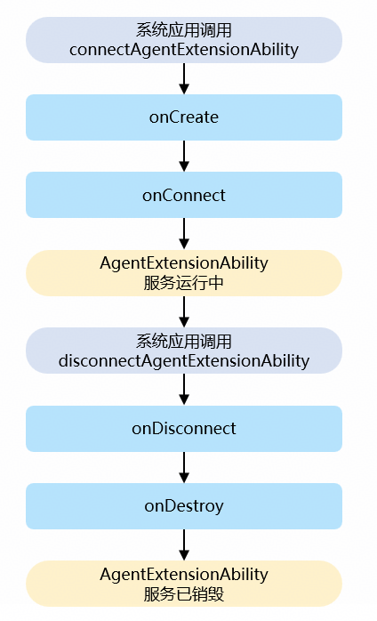

# @ohos.app.agent.AgentExtensionAbility (智能体扩展组件)

AgentExtensionAbility继承自[ExtensionAbility](https://developer.huawei.com/consumer/cn/doc/harmonyos-references/js-apis-app-ability-extensionability)，提供智能体扩展能力，包括智能体服务的创建、销毁、连接、断开的生命周期回调接口，以及接收客户端所发送数据和安全认证的回调接口。

本文将AgentExtensionAbility组件提供方称为服务端，将AgentExtensionAbility组件使用方称为客户端。

 本模块首批接口从API version 24开始支持。后续版本的新增接口，采用上角标单独标记接口的起始版本。

本模块接口仅可在Stage模型下使用。

本模块接口不支持在[har](https://developer.huawei.com/consumer/cn/doc/harmonyos-guides/har-package)包中使用。

#### 导入模块

```
import { AgentExtensionAbility } from '@kit.AbilityKit';
```

#### 生命周期

图1 AgentExtensionAbility生命周期



- **onCreate** 当AgentExtensionAbility实例创建完成时，系统会触发该回调，开发者可在该回调中执行初始化逻辑（如定义变量、加载资源等）。
- **onConnect** 当客户端连接AgentExtensionAbility成功后，系统会触发该回调。
- **onDisconnect** 当客户端与AgentExtensionAbility断开连接时，系统会触发该回调。
- **onDestroy** 当AgentExtensionAbility被销毁时，系统会触发该回调。

#### AgentExtensionAbility

#### [h2]属性

元服务API： 从API version 24开始，该属性支持在元服务中使用。

系统能力：SystemCapability.Ability.AgentRuntime.Core

| 名称 | 类型 | 只读 | 可选 | 说明 |
| --- | --- | --- | --- | --- |
| context | [AgentExtensionContext](https://developer.huawei.com/consumer/cn/doc/harmonyos-references/js-apis-inner-application-agentextensioncontext) | 否 | 否 | AgentExtensionAbility的上下文环境，继承自[ExtensionContext](https://developer.huawei.com/consumer/cn/doc/harmonyos-references/js-apis-inner-application-extensioncontext)。 |

#### [h2]onCreate

onCreate(want: Want): void

当AgentExtensionAbility实例创建完成时，系统会触发该回调，开发者可在该回调中执行初始化逻辑（如定义变量、加载资源等）。

元服务API： 从API version 24开始，该接口支持在元服务中使用。

系统能力：SystemCapability.Ability.AgentRuntime.Core

参数：

| 参数名 | 类型 | 必填 | 说明 |
| --- | --- | --- | --- |
| want | [Want](https://developer.huawei.com/consumer/cn/doc/harmonyos-references/js-apis-app-ability-want) | 是 | 当前AgentExtensionAbility相关的[Want](https://developer.huawei.com/consumer/cn/doc/harmonyos-references/js-apis-app-ability-want)类型信息，包括Ability名称、Bundle名称等。 |

示例：

```
import { AgentExtensionAbility, Want } from '@kit.AbilityKit';
import { hilog } from '@kit.PerformanceAnalysisKit';

const TAG: string = '[AppServiceExtAbility]';

export default class AgentExt extends AgentExtensionAbility {
  // 创建AgentExtensionAbility
  onCreate(want: Want) {
    hilog.info(0x0000, TAG, `onCreate, want: ${want.abilityName}, bundlename: ${want.bundleName}`);
  }
}
```

#### [h2]onConnect

onConnect(want: Want, proxy: AgentHostProxy): void

当客户端连接AgentExtensionAbility成功后，系统会触发该回调。

元服务API： 从API version 24开始，该接口支持在元服务中使用。

系统能力：SystemCapability.Ability.AgentRuntime.Core

参数：

| 参数名 | 类型 | 必填 | 说明 |
| --- | --- | --- | --- |
| want | [Want](https://developer.huawei.com/consumer/cn/doc/harmonyos-references/js-apis-app-ability-want) | 是 | 当前AgentExtensionAbility相关的[Want](https://developer.huawei.com/consumer/cn/doc/harmonyos-references/js-apis-app-ability-want)类型信息，包括Ability名称、Bundle名称等。 |
| proxy | [AgentHostProxy](https://developer.huawei.com/consumer/cn/doc/harmonyos-references/js-apis-inner-application-agenthostproxy) | 是 | [AgentHostProxy](https://developer.huawei.com/consumer/cn/doc/harmonyos-references/js-apis-inner-application-agenthostproxy)对象，用于与客户端进行通信。 |

示例：

```
import { AgentExtensionAbility, Want, common} from '@kit.AbilityKit';
import { hilog } from '@kit.PerformanceAnalysisKit';

const TAG: string = '[AgentExtensionAbility]';

export default class AgentExt extends AgentExtensionAbility {
  onConnect(want: Want, proxy: common.AgentHostProxy){
    hilog.info(0x0000, TAG, `onConnect, want: ${want.abilityName}, bundlename: ${want.bundleName}`);
  }
}
```

#### [h2]onDisconnect

onDisconnect(want: Want, proxy: AgentHostProxy): void

当客户端与AgentExtensionAbility断开连接时，系统会触发该回调。

元服务API： 从API version 24开始，该接口支持在元服务中使用。

系统能力：SystemCapability.Ability.AgentRuntime.Core

参数：

| 参数名 | 类型 | 必填 | 说明 |
| --- | --- | --- | --- |
| want | [Want](https://developer.huawei.com/consumer/cn/doc/harmonyos-references/js-apis-app-ability-want) | 是 | 当前AgentExtensionAbility相关的[Want](https://developer.huawei.com/consumer/cn/doc/harmonyos-references/js-apis-app-ability-want)类型信息，包括Ability名称、Bundle名称等。 |
| proxy | [AgentHostProxy](https://developer.huawei.com/consumer/cn/doc/harmonyos-references/js-apis-inner-application-agenthostproxy) | 是 | [AgentHostProxy](https://developer.huawei.com/consumer/cn/doc/harmonyos-references/js-apis-inner-application-agenthostproxy)对象，用于与客户端进行通信。 |

示例：

```
import { AgentExtensionAbility, Want, common } from '@kit.AbilityKit';
import { hilog } from '@kit.PerformanceAnalysisKit';

const TAG: string = '[AgentExtensionAbility]';

export default class AgentExt extends AgentExtensionAbility {
  onDisconnect(want: Want, proxy: common.AgentHostProxy) {
    hilog.info(0x0000, TAG, `onDisconnect, want: ${want.abilityName}, bundlename: ${want.bundleName}`);
  }
}
```

#### [h2]onData

onData(proxy: AgentHostProxy, data: string): void

当AgentExtensionAbility接收到客户端发送的数据时，系统会触发该回调。服务端可以在此回调中通过[AgentHostProxy.senddata](https://developer.huawei.com/consumer/cn/doc/harmonyos-references/js-apis-inner-application-agenthostproxy#senddata)向客户端发送数据。

元服务API： 从API version 24开始，该接口支持在元服务中使用。

系统能力：SystemCapability.Ability.AgentRuntime.Core

参数：

| 参数名 | 类型 | 必填 | 说明 |
| --- | --- | --- | --- |
| proxy | [AgentHostProxy](https://developer.huawei.com/consumer/cn/doc/harmonyos-references/js-apis-inner-application-agenthostproxy) | 是 | [AgentHostProxy](https://developer.huawei.com/consumer/cn/doc/harmonyos-references/js-apis-inner-application-agenthostproxy)对象，用于与客户端进行通信。 |
| data | string | 是 | 表示接收到的数据。 |

示例：

```
import { AgentExtensionAbility, common} from '@kit.AbilityKit';
import { hilog } from '@kit.PerformanceAnalysisKit';

const TAG: string = '[AgentExtensionAbility]';

export default class AgentExt extends AgentExtensionAbility {
  onData(proxy : common.AgentHostProxy, data : string ){
    hilog.info(0x0000, TAG, `onData, data: ${data}`);
  }
}
```

#### [h2]onAuth

onAuth(proxy: AgentHostProxy, handshakeData: string): void

当AgentExtensionAbility接收到客户端发送的安全认证请求时，系统会触发该回调。服务端可以在此回调中处理接收到的安全认证请求，并通过[AgentHostProxy.authorize](https://developer.huawei.com/consumer/cn/doc/harmonyos-references/js-apis-inner-application-agenthostproxy#authorize)向客户端发送安全认证请求。

元服务API： 从API version 24开始，该接口支持在元服务中使用。

系统能力：SystemCapability.Ability.AgentRuntime.Core

参数：

| 参数名 | 类型 | 必填 | 说明 |
| --- | --- | --- | --- |
| proxy | [AgentHostProxy](https://developer.huawei.com/consumer/cn/doc/harmonyos-references/js-apis-inner-application-agenthostproxy) | 是 | [AgentHostProxy](https://developer.huawei.com/consumer/cn/doc/harmonyos-references/js-apis-inner-application-agenthostproxy)对象，用于向客户端发送安全认证请求。 |
| handshakeData | string | 是 | 表示接收到的安全认证数据。 |

示例：

```
import { AgentExtensionAbility, common} from '@kit.AbilityKit';
import { hilog } from '@kit.PerformanceAnalysisKit';

const TAG: string = '[AgentExtensionAbility]';

export default class AgentExt extends AgentExtensionAbility {
  onAuth(proxy : common.AgentHostProxy, handshakeData : string ){
    hilog.info(0x0000, TAG, `onAuth, handshakeData: ${handshakeData}`);
  }
}
```

#### [h2]onDestroy

onDestroy(): void

当AgentExtensionAbility被销毁时，系统会触发该回调。

元服务API： 从API version 24开始，该接口支持在元服务中使用。

系统能力：SystemCapability.Ability.AgentRuntime.Core

示例：

```
import { AgentExtensionAbility } from '@kit.AbilityKit';
import { hilog } from '@kit.PerformanceAnalysisKit';

const TAG: string = '[AgentExtensionAbility]';

export default class AgentExt extends AgentExtensionAbility {
  onDestroy() {
    hilog.info(0x0000, TAG, `onDestroy`);
  }
}
```
