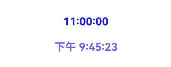

# @ohos.arkui.theme(主题换肤)

支持自定义主题风格，实现App组件风格跟随Theme切换。


- 本模块首批接口从API version 12开始支持。后续版本的新增接口，采用上角标单独标记接口的起始版本。
- 本模块接口仅可在Stage模型下使用。

#### 导入模块

```
import { Theme, ThemeControl, CustomColors, Colors, CustomTheme, CustomDarkColors } from '@kit.ArkUI';
```

#### Theme

当前生效的主题风格对象，可从[onWillApplyTheme](https://developer.huawei.com/consumer/cn/doc/harmonyos-references/ts-custom-component-lifecycle#onwillapplytheme12)中获取。

元服务API： 从API version 12开始，该接口支持在元服务中使用。

系统能力： SystemCapability.ArkUI.ArkUI.Full

| 名称 | 类型 | 只读 | 可选 | 说明 |
| --- | --- | --- | --- | --- |
| colors | [Colors](#colors) | 否 | 否 | 主题颜色资源。 |

#### Colors

主题颜色资源。

系统能力： SystemCapability.ArkUI.ArkUI.Full

 颜色对应的组件可参考[文本色与图标色](https://developer.huawei.com/consumer/cn/doc/design-guides/color-0000001776857164#section137153164914)。

| 名称 | 类型 | 只读 | 可选 | 说明 |
| --- | --- | --- | --- | --- |
| brand | [ResourceColor](https://developer.huawei.com/consumer/cn/doc/harmonyos-references/ts-types#resourcecolor) | 否 | 否 | 品牌色。当使用[ResourceColor](https://developer.huawei.com/consumer/cn/doc/harmonyos-references/ts-types#resourcecolor)中非[Resource](https://developer.huawei.com/consumer/cn/doc/harmonyos-references/ts-types#resource)类型设置该颜色时，backgroundEmphasize、compBackgroundEmphasize、compEmphasizeSecondary、compEmphasizeTertiary、interactiveFocus、interactiveSelect的缺省值会随映射关系发生变化，具体参考对应颜色属性说明。 **影响组件：** [TextInput](https://developer.huawei.com/consumer/cn/doc/harmonyos-references/ts-basic-components-textinput)、[Search](https://developer.huawei.com/consumer/cn/doc/harmonyos-references/ts-basic-components-search)。 **元服务API：** 从API version 12开始，该接口支持在元服务中使用。 |
| primary | [ResourceColor](https://developer.huawei.com/consumer/cn/doc/harmonyos-references/ts-types#resourcecolor) | 否 | 是 | 主色。默认值undefined，代表不生效primary主题色。从API版本26.0.0开始，当使用[ResourceColor](https://developer.huawei.com/consumer/cn/doc/harmonyos-references/ts-types#resourcecolor)中非[Resource](https://developer.huawei.com/consumer/cn/doc/harmonyos-references/ts-types#resource)类型设置该颜色时，fontPrimary、fontSecondary、fontTertiary、fontFourth、iconPrimary、iconSecondary、iconTertiary、iconFourth的缺省值会随映射关系发生变化，具体参考对应颜色属性说明。 **影响组件：** 暂无组件使用。 **起始版本：** 26.0.0 **元服务API：** 从API版本26.0.0开始，该接口支持在元服务中使用。 |
| onPrimary | [ResourceColor](https://developer.huawei.com/consumer/cn/doc/harmonyos-references/ts-types#resourcecolor) | 否 | 是 | 主色反转颜色。默认值undefined，代表不生效onPrimary主题色。从API版本26.0.0开始，当使用[ResourceColor](https://developer.huawei.com/consumer/cn/doc/harmonyos-references/ts-types#resourcecolor)中非[Resource](https://developer.huawei.com/consumer/cn/doc/harmonyos-references/ts-types#resource)类型设置该颜色时，fontOnPrimary、fontOnSecondary、fontOnTertiary、fontOnFourth、iconOnPrimary、iconOnSecondary、iconOnTertiary、iconOnFourth的缺省值会随映射关系发生变化，具体参考对应颜色属性说明。 **影响组件：** 暂无组件使用。 **起始版本：** 26.0.0 **元服务API：** 从API版本26.0.0开始，该接口支持在元服务中使用。 |
| container | [ResourceColor](https://developer.huawei.com/consumer/cn/doc/harmonyos-references/ts-types#resourcecolor) | 否 | 是 | 容器色。默认值undefined，代表不生效container主题色。从API版本26.0.0开始，当使用[ResourceColor](https://developer.huawei.com/consumer/cn/doc/harmonyos-references/ts-types#resourcecolor)中非[Resource](https://developer.huawei.com/consumer/cn/doc/harmonyos-references/ts-types#resource)类型设置该颜色时，compBackgroundSecondary、compBackgroundTertiary、compDivider、interactiveHover、interactivePressed、interactiveClick的缺省值会随映射关系发生变化，具体参考对应颜色属性说明。 **影响组件：** 暂无组件使用。 **起始版本：** 26.0.0 **元服务API：** 从API版本26.0.0开始，该接口支持在元服务中使用。 |
| warning | [ResourceColor](https://developer.huawei.com/consumer/cn/doc/harmonyos-references/ts-types#resourcecolor) | 否 | 否 | 一级警示色。 **影响组件：** [TipsDialog](https://developer.huawei.com/consumer/cn/doc/harmonyos-references/ohos-arkui-advanced-dialog#tipsdialog)、[AlertDialog](https://developer.huawei.com/consumer/cn/doc/harmonyos-references/ohos-arkui-advanced-dialog#alertdialog)、[CustomContentDialog](https://developer.huawei.com/consumer/cn/doc/harmonyos-references/ohos-arkui-advanced-dialog#customcontentdialog12)、 [Badge](https://developer.huawei.com/consumer/cn/doc/harmonyos-references/ts-container-badge)、[Button](https://developer.huawei.com/consumer/cn/doc/harmonyos-references/ts-basic-components-button)。 **元服务API：** 从API version 12开始，该接口支持在元服务中使用。 |
| alert | [ResourceColor](https://developer.huawei.com/consumer/cn/doc/harmonyos-references/ts-types#resourcecolor) | 否 | 否 | 二级提示色。 **影响组件：** 暂无组件使用。 **元服务API：** 从API version 12开始，该接口支持在元服务中使用。 |
| confirm | [ResourceColor](https://developer.huawei.com/consumer/cn/doc/harmonyos-references/ts-types#resourcecolor) | 否 | 否 | 确认色。 **影响组件：** 暂无组件使用。 **元服务API：** 从API version 12开始，该接口支持在元服务中使用。 |
| fontPrimary | [ResourceColor](https://developer.huawei.com/consumer/cn/doc/harmonyos-references/ts-types#resourcecolor) | 否 | 否 | 一级文本字体颜色。 **说明：** 从API版本26.0.0开始，当作为[CustomColors](#customcolors)的属性被使用时，若设置了primary，fontPrimary在浅色模式和深色模式下的缺省值均为primary的颜色值叠加90%透明度。 **影响组件：** [EditableTitleBar](https://developer.huawei.com/consumer/cn/doc/harmonyos-references/ohos-arkui-advanced-editabletitlebar)、[LoadingDialog](https://developer.huawei.com/consumer/cn/doc/harmonyos-references/ohos-arkui-advanced-dialog#loadingdialog)、[TipsDialog](https://developer.huawei.com/consumer/cn/doc/harmonyos-references/ohos-arkui-advanced-dialog#tipsdialog)、 [ConfirmDialog](https://developer.huawei.com/consumer/cn/doc/harmonyos-references/ohos-arkui-advanced-dialog#confirmdialog)、[AlertDialog](https://developer.huawei.com/consumer/cn/doc/harmonyos-references/ohos-arkui-advanced-dialog#alertdialog)、[SelectDialog](https://developer.huawei.com/consumer/cn/doc/harmonyos-references/ohos-arkui-advanced-dialog#selectdialog)、 [CustomContentDialog](https://developer.huawei.com/consumer/cn/doc/harmonyos-references/ohos-arkui-advanced-dialog#customcontentdialog12)、[Swiper](https://developer.huawei.com/consumer/cn/doc/harmonyos-references/ts-container-swiper)、[Text](https://developer.huawei.com/consumer/cn/doc/harmonyos-references/ts-basic-components-text)、 [SubHeader](https://developer.huawei.com/consumer/cn/doc/harmonyos-references/ohos-arkui-advanced-subheader)、[ProgressButton](https://developer.huawei.com/consumer/cn/doc/harmonyos-references/ohos-arkui-advanced-progressbutton)、[AlphabetIndexer](https://developer.huawei.com/consumer/cn/doc/harmonyos-references/ts-container-alphabet-indexer)、 [Popup](https://developer.huawei.com/consumer/cn/doc/harmonyos-references/ohos-arkui-advanced-popup)、[Select](https://developer.huawei.com/consumer/cn/doc/harmonyos-references/ts-basic-components-select)、[Chip](https://developer.huawei.com/consumer/cn/doc/harmonyos-references/ohos-arkui-advanced-chip)、 [ToolBar](https://developer.huawei.com/consumer/cn/doc/harmonyos-references/ohos-arkui-advanced-toolbar)、[Menu](https://developer.huawei.com/consumer/cn/doc/harmonyos-references/ts-basic-components-menu)、[TextInput](https://developer.huawei.com/consumer/cn/doc/harmonyos-references/ts-basic-components-textinput)、 [Search](https://developer.huawei.com/consumer/cn/doc/harmonyos-references/ts-basic-components-search)、[TimePicker](https://developer.huawei.com/consumer/cn/doc/harmonyos-references/ts-basic-components-timepicker)、[DatePicker](https://developer.huawei.com/consumer/cn/doc/harmonyos-references/ts-basic-components-datepicker)、 [TextPicker](https://developer.huawei.com/consumer/cn/doc/harmonyos-references/ts-basic-components-textpicker)、[ComposeListItem](https://developer.huawei.com/consumer/cn/doc/harmonyos-references/ohos-arkui-advanced-composelistitem)、[TreeView](https://developer.huawei.com/consumer/cn/doc/harmonyos-references/ohos-arkui-advanced-treeview)。从API版本26.0.0开始，新增[CalendarPicker](https://developer.huawei.com/consumer/cn/doc/harmonyos-references/ts-basic-components-calendarpicker)、[UIPickerComponent](https://developer.huawei.com/consumer/cn/doc/harmonyos-references/ts-container-ui-picker-component)、[RichEditor](https://developer.huawei.com/consumer/cn/doc/harmonyos-references/ts-basic-components-richeditor)、[MenuItem](https://developer.huawei.com/consumer/cn/doc/harmonyos-references/ts-basic-components-menuitem)、[MenuItemGroup](https://developer.huawei.com/consumer/cn/doc/harmonyos-references/ts-basic-components-menuitemgroup)、[Counter](https://developer.huawei.com/consumer/cn/doc/harmonyos-references/ts-container-counter)。 **元服务API：** 从API version 12开始，该接口支持在元服务中使用。 |
| fontSecondary | [ResourceColor](https://developer.huawei.com/consumer/cn/doc/harmonyos-references/ts-types#resourcecolor) | 否 | 否 | 二级文本字体颜色。 **说明：** 从API版本26.0.0开始，当作为[CustomColors](#customcolors)的属性被使用时，若设置了primary，fontSecondary在浅色模式和深色模式下的缺省值均为primary的颜色值叠加60%透明度。 **影响组件：** [EditableTitleBar](https://developer.huawei.com/consumer/cn/doc/harmonyos-references/ohos-arkui-advanced-editabletitlebar)、[AlertDialog](https://developer.huawei.com/consumer/cn/doc/harmonyos-references/ohos-arkui-advanced-dialog#alertdialog)、[CustomContentDialog](https://developer.huawei.com/consumer/cn/doc/harmonyos-references/ohos-arkui-advanced-dialog#customcontentdialog12)、 [SubHeader](https://developer.huawei.com/consumer/cn/doc/harmonyos-references/ohos-arkui-advanced-subheader)、[AlphabetIndexer](https://developer.huawei.com/consumer/cn/doc/harmonyos-references/ts-container-alphabet-indexer)、[Popup](https://developer.huawei.com/consumer/cn/doc/harmonyos-references/ohos-arkui-advanced-popup)、 [TextInput](https://developer.huawei.com/consumer/cn/doc/harmonyos-references/ts-basic-components-textinput)、[Search](https://developer.huawei.com/consumer/cn/doc/harmonyos-references/ts-basic-components-search)、[ComposeListItem](https://developer.huawei.com/consumer/cn/doc/harmonyos-references/ohos-arkui-advanced-composelistitem)、 [TreeView](https://developer.huawei.com/consumer/cn/doc/harmonyos-references/ohos-arkui-advanced-treeview)、[TextClock](https://developer.huawei.com/consumer/cn/doc/harmonyos-references/ts-basic-components-textclock)。从API版本26.0.0开始，新增[MenuItem](https://developer.huawei.com/consumer/cn/doc/harmonyos-references/ts-basic-components-menuitem)、[MenuItemGroup](https://developer.huawei.com/consumer/cn/doc/harmonyos-references/ts-basic-components-menuitemgroup)。 **元服务API：** 从API version 12开始，该接口支持在元服务中使用。 |
| fontTertiary | [ResourceColor](https://developer.huawei.com/consumer/cn/doc/harmonyos-references/ts-types#resourcecolor) | 否 | 否 | 三级文本字体颜色。 **说明：** 从API版本26.0.0开始，当作为[CustomColors](#customcolors)的属性被使用时，若设置了primary，fontTertiary在浅色模式和深色模式下的缺省值均为primary的颜色值叠加40%透明度。 **影响组件：** [ComposeListItem](https://developer.huawei.com/consumer/cn/doc/harmonyos-references/ohos-arkui-advanced-composelistitem)。 **元服务API：** 从API version 12开始，该接口支持在元服务中使用。 |
| fontFourth | [ResourceColor](https://developer.huawei.com/consumer/cn/doc/harmonyos-references/ts-types#resourcecolor) | 否 | 否 | 四级文本字体颜色。 **说明：** 从API版本26.0.0开始，当作为[CustomColors](#customcolors)的属性被使用时，若设置了primary，fontFourth在浅色模式和深色模式下的缺省值均为primary的颜色值叠加20%透明度。 **影响组件：** 暂无组件使用。 **元服务API：** 从API version 12开始，该接口支持在元服务中使用。 |
| fontEmphasize | [ResourceColor](https://developer.huawei.com/consumer/cn/doc/harmonyos-references/ts-types#resourcecolor) | 否 | 否 | 高亮字体颜色。 **影响组件：** [TipsDialog](https://developer.huawei.com/consumer/cn/doc/harmonyos-references/ohos-arkui-advanced-dialog#tipsdialog)、[ConfirmDialog](https://developer.huawei.com/consumer/cn/doc/harmonyos-references/ohos-arkui-advanced-dialog#confirmdialog)、[AlertDialog](https://developer.huawei.com/consumer/cn/doc/harmonyos-references/ohos-arkui-advanced-dialog#alertdialog)、 [SelectDialog](https://developer.huawei.com/consumer/cn/doc/harmonyos-references/ohos-arkui-advanced-dialog#selectdialog)、[CustomContentDialog](https://developer.huawei.com/consumer/cn/doc/harmonyos-references/ohos-arkui-advanced-dialog#customcontentdialog12)、[SubHeader](https://developer.huawei.com/consumer/cn/doc/harmonyos-references/ohos-arkui-advanced-subheader)、 [AlphabetIndexer](https://developer.huawei.com/consumer/cn/doc/harmonyos-references/ts-container-alphabet-indexer)、[Popup](https://developer.huawei.com/consumer/cn/doc/harmonyos-references/ohos-arkui-advanced-popup)、[Button](https://developer.huawei.com/consumer/cn/doc/harmonyos-references/ts-basic-components-button)、 [Select](https://developer.huawei.com/consumer/cn/doc/harmonyos-references/ts-basic-components-select)、[ToolBar](https://developer.huawei.com/consumer/cn/doc/harmonyos-references/ohos-arkui-advanced-toolbar)、[Search](https://developer.huawei.com/consumer/cn/doc/harmonyos-references/ts-basic-components-search)、 [TimePicker](https://developer.huawei.com/consumer/cn/doc/harmonyos-references/ts-basic-components-timepicker)、[DatePicker](https://developer.huawei.com/consumer/cn/doc/harmonyos-references/ts-basic-components-datepicker)、[TextPicker](https://developer.huawei.com/consumer/cn/doc/harmonyos-references/ts-basic-components-textpicker)。从API版本26.0.0开始，新增[RichEditor](https://developer.huawei.com/consumer/cn/doc/harmonyos-references/ts-basic-components-richeditor)。 **元服务API：** 从API version 12开始，该接口支持在元服务中使用。 |
| fontOnPrimary | [ResourceColor](https://developer.huawei.com/consumer/cn/doc/harmonyos-references/ts-types#resourcecolor) | 否 | 否 | 一级文本反转颜色，用于彩色背景。 **说明：** 从API版本26.0.0开始，当作为[CustomColors](#customcolors)的属性被使用时，若设置了onPrimary，fontOnPrimary在浅色模式和深色模式下的缺省值均为onPrimary的颜色值叠加100%透明度。 **影响组件：** [Badge](https://developer.huawei.com/consumer/cn/doc/harmonyos-references/ts-container-badge)、[Button](https://developer.huawei.com/consumer/cn/doc/harmonyos-references/ts-basic-components-button)、[Chip](https://developer.huawei.com/consumer/cn/doc/harmonyos-references/ohos-arkui-advanced-chip)。 **元服务API：** 从API version 12开始，该接口支持在元服务中使用。 |
| fontOnSecondary | [ResourceColor](https://developer.huawei.com/consumer/cn/doc/harmonyos-references/ts-types#resourcecolor) | 否 | 否 | 二级文本反转颜色，用于彩色背景。 **说明：** 从API版本26.0.0开始，当作为[CustomColors](#customcolors)的属性被使用时，若设置了onPrimary，fontOnSecondary在浅色模式和深色模式下的缺省值均为onPrimary的颜色值叠加60%透明度。 **影响组件：** 暂无组件使用。 **元服务API：** 从API version 12开始，该接口支持在元服务中使用。 |
| fontOnTertiary | [ResourceColor](https://developer.huawei.com/consumer/cn/doc/harmonyos-references/ts-types#resourcecolor) | 否 | 否 | 三级文本反转颜色，用于彩色背景。 **说明：** 从API版本26.0.0开始，当作为[CustomColors](#customcolors)的属性被使用时，若设置了onPrimary，fontOnTertiary在浅色模式和深色模式下的缺省值均为onPrimary的颜色值叠加40%透明度。 **影响组件：** 暂无组件使用。 **元服务API：** 从API version 12开始，该接口支持在元服务中使用。 |
| fontOnFourth | [ResourceColor](https://developer.huawei.com/consumer/cn/doc/harmonyos-references/ts-types#resourcecolor) | 否 | 否 | 四级文本反转颜色，用于彩色背景。 **说明：** 从API版本26.0.0开始，当作为[CustomColors](#customcolors)的属性被使用时，若设置了onPrimary，fontOnFourth在浅色模式和深色模式下的缺省值均为onPrimary的颜色值叠加20%透明度。 **影响组件：** 暂无组件使用。 **元服务API：** 从API version 12开始，该接口支持在元服务中使用。 |
| iconPrimary | [ResourceColor](https://developer.huawei.com/consumer/cn/doc/harmonyos-references/ts-types#resourcecolor) | 否 | 否 | 一级图标颜色。 **说明：** 从API版本26.0.0开始，当作为[CustomColors](#customcolors)的属性被使用时，若设置了primary，iconPrimary在浅色模式和深色模式下的缺省值均为primary的颜色值叠加90%透明度。 **影响组件：** [EditableTitleBar](https://developer.huawei.com/consumer/cn/doc/harmonyos-references/ohos-arkui-advanced-editabletitlebar)、[Swiper](https://developer.huawei.com/consumer/cn/doc/harmonyos-references/ts-container-swiper)、[ToolBar](https://developer.huawei.com/consumer/cn/doc/harmonyos-references/ohos-arkui-advanced-toolbar)、 [TreeView](https://developer.huawei.com/consumer/cn/doc/harmonyos-references/ohos-arkui-advanced-treeview)。从API版本26.0.0开始，新增[MenuItem](https://developer.huawei.com/consumer/cn/doc/harmonyos-references/ts-basic-components-menuitem)。 **元服务API：** 从API version 12开始，该接口支持在元服务中使用。 |
| iconSecondary | [ResourceColor](https://developer.huawei.com/consumer/cn/doc/harmonyos-references/ts-types#resourcecolor) | 否 | 否 | 二级图标颜色。 **说明：** 从API版本26.0.0开始，当作为[CustomColors](#customcolors)的属性被使用时，若设置了primary，iconSecondary在浅色模式和深色模式下的缺省值均为primary的颜色值叠加60%透明度。 **影响组件：** [LoadingDialog](https://developer.huawei.com/consumer/cn/doc/harmonyos-references/ohos-arkui-advanced-dialog#loadingdialog)、[SubHeader](https://developer.huawei.com/consumer/cn/doc/harmonyos-references/ohos-arkui-advanced-subheader)、 [Popup](https://developer.huawei.com/consumer/cn/doc/harmonyos-references/ohos-arkui-advanced-popup)、[Chip](https://developer.huawei.com/consumer/cn/doc/harmonyos-references/ohos-arkui-advanced-chip)、[Search](https://developer.huawei.com/consumer/cn/doc/harmonyos-references/ts-basic-components-search)、 [TreeView](https://developer.huawei.com/consumer/cn/doc/harmonyos-references/ohos-arkui-advanced-treeview)。从API版本26.0.0开始，新增[LoadingProgress](https://developer.huawei.com/consumer/cn/doc/harmonyos-references/ts-basic-components-loadingprogress)。 **元服务API：** 从API version 12开始，该接口支持在元服务中使用。 |
| iconTertiary | [ResourceColor](https://developer.huawei.com/consumer/cn/doc/harmonyos-references/ts-types#resourcecolor) | 否 | 否 | 三级图标颜色。 **说明：** 从API版本26.0.0开始，当作为[CustomColors](#customcolors)的属性被使用时，若设置了primary，iconTertiary在浅色模式和深色模式下的缺省值均为primary的颜色值叠加40%透明度。 **影响组件：** [SubHeader](https://developer.huawei.com/consumer/cn/doc/harmonyos-references/ohos-arkui-advanced-subheader)。 **元服务API：** 从API version 12开始，该接口支持在元服务中使用。 |
| iconFourth | [ResourceColor](https://developer.huawei.com/consumer/cn/doc/harmonyos-references/ts-types#resourcecolor) | 否 | 否 | 四级图标颜色。 **说明：** 从API版本26.0.0开始，当作为[CustomColors](#customcolors)的属性被使用时，若设置了primary，iconFourth在浅色模式和深色模式下的缺省值均为primary的颜色值叠加20%透明度。 **影响组件：** [Checkbox](https://developer.huawei.com/consumer/cn/doc/harmonyos-references/ts-basic-components-checkbox)、[CheckboxGroup](https://developer.huawei.com/consumer/cn/doc/harmonyos-references/ts-basic-components-checkboxgroup)、[Radio](https://developer.huawei.com/consumer/cn/doc/harmonyos-references/ts-basic-components-radio)。 **元服务API：** 从API version 12开始，该接口支持在元服务中使用。 |
| iconEmphasize | [ResourceColor](https://developer.huawei.com/consumer/cn/doc/harmonyos-references/ts-types#resourcecolor) | 否 | 否 | 高亮图标颜色。 **影响组件：** [ToolBar](https://developer.huawei.com/consumer/cn/doc/harmonyos-references/ohos-arkui-advanced-toolbar)。 **元服务API：** 从API version 12开始，该接口支持在元服务中使用。 |
| iconSubEmphasize | [ResourceColor](https://developer.huawei.com/consumer/cn/doc/harmonyos-references/ts-types#resourcecolor) | 否 | 否 | 高亮辅助图标颜色。 **影响组件：** 暂无组件使用。 **元服务API：** 从API version 12开始，该接口支持在元服务中使用。 |
| iconOnPrimary | [ResourceColor](https://developer.huawei.com/consumer/cn/doc/harmonyos-references/ts-types#resourcecolor) | 否 | 否 | 一级图标反转颜色，用于彩色背景。 **说明：** 从API版本26.0.0开始，当作为[CustomColors](#customcolors)的属性被使用时，若设置了onPrimary，iconOnPrimary在浅色模式和深色模式下的缺省值均为onPrimary的颜色值叠加100%透明度。 **影响组件：** [Checkbox](https://developer.huawei.com/consumer/cn/doc/harmonyos-references/ts-basic-components-checkbox)、[CheckboxGroup](https://developer.huawei.com/consumer/cn/doc/harmonyos-references/ts-basic-components-checkboxgroup)、[Radio](https://developer.huawei.com/consumer/cn/doc/harmonyos-references/ts-basic-components-radio)。 **元服务API：** 从API version 12开始，该接口支持在元服务中使用。 |
| iconOnSecondary | [ResourceColor](https://developer.huawei.com/consumer/cn/doc/harmonyos-references/ts-types#resourcecolor) | 否 | 否 | 二级图标反转颜色，用于彩色背景。 **说明：** 从API版本26.0.0开始，当作为[CustomColors](#customcolors)的属性被使用时，若设置了onPrimary，iconOnSecondary在浅色模式和深色模式下的缺省值均为onPrimary的颜色值叠加60%透明度。 **影响组件：** [Chip](https://developer.huawei.com/consumer/cn/doc/harmonyos-references/ohos-arkui-advanced-chip)。 **元服务API：** 从API version 12开始，该接口支持在元服务中使用。 |
| iconOnTertiary | [ResourceColor](https://developer.huawei.com/consumer/cn/doc/harmonyos-references/ts-types#resourcecolor) | 否 | 否 | 三级图标反转颜色，用于彩色背景。 **说明：** 从API版本26.0.0开始，当作为[CustomColors](#customcolors)的属性被使用时，若设置了onPrimary，iconOnTertiary在浅色模式和深色模式下的缺省值均为onPrimary的颜色值叠加40%透明度。 **影响组件：** 暂无组件使用。 **元服务API：** 从API version 12开始，该接口支持在元服务中使用。 |
| iconOnFourth | [ResourceColor](https://developer.huawei.com/consumer/cn/doc/harmonyos-references/ts-types#resourcecolor) | 否 | 否 | 四级图标反转颜色，用于彩色背景。 **说明：** 从API版本26.0.0开始，当作为[CustomColors](#customcolors)的属性被使用时，若设置了onPrimary，iconOnFourth在浅色模式和深色模式下的缺省值均为onPrimary的颜色值叠加20%透明度。 **影响组件：** [ProgressButton](https://developer.huawei.com/consumer/cn/doc/harmonyos-references/ohos-arkui-advanced-progressbutton)。 **元服务API：** 从API version 12开始，该接口支持在元服务中使用。 |
| backgroundPrimary | [ResourceColor](https://developer.huawei.com/consumer/cn/doc/harmonyos-references/ts-types#resourcecolor) | 否 | 否 | 一级背景颜色（实色，不透明）。 **影响组件：** [TextInput](https://developer.huawei.com/consumer/cn/doc/harmonyos-references/ts-basic-components-textinput)、[QRCode](https://developer.huawei.com/consumer/cn/doc/harmonyos-references/ts-basic-components-qrcode)。 **元服务API：** 从API version 12开始，该接口支持在元服务中使用。 |
| backgroundSecondary | [ResourceColor](https://developer.huawei.com/consumer/cn/doc/harmonyos-references/ts-types#resourcecolor) | 否 | 否 | 二级背景颜色（实色，不透明）。 **影响组件：** 暂无组件使用。 **元服务API：** 从API version 12开始，该接口支持在元服务中使用。 |
| backgroundTertiary | [ResourceColor](https://developer.huawei.com/consumer/cn/doc/harmonyos-references/ts-types#resourcecolor) | 否 | 否 | 三级背景颜色（实色，不透明）。 **影响组件：** 暂无组件使用。 **元服务API：** 从API version 12开始，该接口支持在元服务中使用。 |
| backgroundFourth | [ResourceColor](https://developer.huawei.com/consumer/cn/doc/harmonyos-references/ts-types#resourcecolor) | 否 | 否 | 四级背景颜色（实色，不透明）。 **影响组件：** 暂无组件使用。 **元服务API：** 从API version 12开始，该接口支持在元服务中使用。 |
| backgroundEmphasize | [ResourceColor](https://developer.huawei.com/consumer/cn/doc/harmonyos-references/ts-types#resourcecolor) | 否 | 否 | 高亮背景颜色（实色，不透明）。 **说明：** 当作为[CustomColors](#customcolors)的属性被使用时，若设置了brand，backgroundEmphasize在浅色模式和深色模式下的缺省值均为brand的颜色值叠加100%透明度。 **影响组件：** [Progress](https://developer.huawei.com/consumer/cn/doc/harmonyos-references/ts-basic-components-progress)、[Button](https://developer.huawei.com/consumer/cn/doc/harmonyos-references/ts-basic-components-button)、[Slider](https://developer.huawei.com/consumer/cn/doc/harmonyos-references/ts-basic-components-slider)。 **元服务API：** 从API version 12开始，该接口支持在元服务中使用。 |
| compForegroundPrimary | [ResourceColor](https://developer.huawei.com/consumer/cn/doc/harmonyos-references/ts-types#resourcecolor) | 否 | 否 | 前景色。 **影响组件：** [QRCode](https://developer.huawei.com/consumer/cn/doc/harmonyos-references/ts-basic-components-qrcode)。 **元服务API：** 从API version 12开始，该接口支持在元服务中使用。 |
| compBackgroundPrimary | [ResourceColor](https://developer.huawei.com/consumer/cn/doc/harmonyos-references/ts-types#resourcecolor) | 否 | 否 | 白色背景。 **影响组件：** 暂无组件使用。 **元服务API：** 从API version 12开始，该接口支持在元服务中使用。 |
| compBackgroundPrimaryTran | [ResourceColor](https://developer.huawei.com/consumer/cn/doc/harmonyos-references/ts-types#resourcecolor) | 否 | 否 | 白色透明背景。 **影响组件：** 暂无组件使用。 **元服务API：** 从API version 12开始，该接口支持在元服务中使用。 |
| compBackgroundPrimaryContrary | [ResourceColor](https://developer.huawei.com/consumer/cn/doc/harmonyos-references/ts-types#resourcecolor) | 否 | 否 | 反转背景。 **影响组件：** [Toggle](https://developer.huawei.com/consumer/cn/doc/harmonyos-references/ts-basic-components-toggle)、[Slider](https://developer.huawei.com/consumer/cn/doc/harmonyos-references/ts-basic-components-slider)。 **元服务API：** 从API version 12开始，该接口支持在元服务中使用。 |
| compBackgroundGray | [ResourceColor](https://developer.huawei.com/consumer/cn/doc/harmonyos-references/ts-types#resourcecolor) | 否 | 否 | 灰色背景。 **影响组件：** 暂无组件使用。 **元服务API：** 从API version 12开始，该接口支持在元服务中使用。 |
| compBackgroundSecondary | [ResourceColor](https://developer.huawei.com/consumer/cn/doc/harmonyos-references/ts-types#resourcecolor) | 否 | 否 | 二级背景。 **说明：** 从API版本26.0.0开始，当作为[CustomColors](#customcolors)的属性被使用时，若设置了container，compBackgroundSecondary在浅色模式和深色模式下的缺省值均为container的颜色值叠加10%透明度。 **影响组件：** [Swiper](https://developer.huawei.com/consumer/cn/doc/harmonyos-references/ts-container-swiper)、[Slider](https://developer.huawei.com/consumer/cn/doc/harmonyos-references/ts-basic-components-slider)。 **元服务API：** 从API version 12开始，该接口支持在元服务中使用。 |
| compBackgroundTertiary | [ResourceColor](https://developer.huawei.com/consumer/cn/doc/harmonyos-references/ts-types#resourcecolor) | 否 | 否 | 三级背景。 **说明：** 从API版本26.0.0开始，当作为[CustomColors](#customcolors)的属性被使用时，若设置了container，compBackgroundTertiary在浅色模式下的缺省值为container的颜色值叠加5%透明度，在深色模式下的缺省值为container的颜色值叠加10%透明度。 **影响组件：** [EditableTitleBar](https://developer.huawei.com/consumer/cn/doc/harmonyos-references/ohos-arkui-advanced-editabletitlebar)、[Progress](https://developer.huawei.com/consumer/cn/doc/harmonyos-references/ts-basic-components-progress)、[AlphabetIndexer](https://developer.huawei.com/consumer/cn/doc/harmonyos-references/ts-container-alphabet-indexer)、 [Button](https://developer.huawei.com/consumer/cn/doc/harmonyos-references/ts-basic-components-button)、[Select](https://developer.huawei.com/consumer/cn/doc/harmonyos-references/ts-basic-components-select)、[Toggle](https://developer.huawei.com/consumer/cn/doc/harmonyos-references/ts-basic-components-toggle)、 [Chip](https://developer.huawei.com/consumer/cn/doc/harmonyos-references/ohos-arkui-advanced-chip)、[TextInput](https://developer.huawei.com/consumer/cn/doc/harmonyos-references/ts-basic-components-textinput)、[Search](https://developer.huawei.com/consumer/cn/doc/harmonyos-references/ts-basic-components-search)。从API版本26.0.0开始，新增[UIPickerComponent](https://developer.huawei.com/consumer/cn/doc/harmonyos-references/ts-container-ui-picker-component)、[TextPicker](https://developer.huawei.com/consumer/cn/doc/harmonyos-references/ts-basic-components-textpicker)。 **元服务API：** 从API version 12开始，该接口支持在元服务中使用。 |
| compBackgroundEmphasize | [ResourceColor](https://developer.huawei.com/consumer/cn/doc/harmonyos-references/ts-types#resourcecolor) | 否 | 否 | 高亮背景。 **说明：** 从API版本26.0.0开始，当作为[CustomColors](#customcolors)的属性被使用时，若设置了brand，compBackgroundEmphasize在浅色模式和深色模式下的缺省值均为brand的颜色值叠加100%透明度。 **影响组件：** [Swiper](https://developer.huawei.com/consumer/cn/doc/harmonyos-references/ts-container-swiper)、[Toggle](https://developer.huawei.com/consumer/cn/doc/harmonyos-references/ts-basic-components-toggle)、[Chip](https://developer.huawei.com/consumer/cn/doc/harmonyos-references/ohos-arkui-advanced-chip)、 [Checkbox](https://developer.huawei.com/consumer/cn/doc/harmonyos-references/ts-basic-components-checkbox)、[CheckboxGroup](https://developer.huawei.com/consumer/cn/doc/harmonyos-references/ts-basic-components-checkboxgroup)、[Radio](https://developer.huawei.com/consumer/cn/doc/harmonyos-references/ts-basic-components-radio)。 **元服务API：** 从API version 12开始，该接口支持在元服务中使用。 |
| compBackgroundNeutral | [ResourceColor](https://developer.huawei.com/consumer/cn/doc/harmonyos-references/ts-types#resourcecolor) | 否 | 否 | 黑色中性高亮背景颜色。 **影响组件：** [PatternLock](https://developer.huawei.com/consumer/cn/doc/harmonyos-references/ts-basic-components-patternlock)。 **元服务API：** 从API version 12开始，该接口支持在元服务中使用。 |
| compEmphasizeSecondary | [ResourceColor](https://developer.huawei.com/consumer/cn/doc/harmonyos-references/ts-types#resourcecolor) | 否 | 否 | 20%高亮背景颜色。 **说明：** 当作为[CustomColors](#customcolors)的属性被使用时，若设置了brand，compEmphasizeSecondary在浅色模式和深色模式下的缺省值均为brand的颜色值叠加20%透明度。 **影响组件：** [Progress](https://developer.huawei.com/consumer/cn/doc/harmonyos-references/ts-basic-components-progress)、[ProgressButton](https://developer.huawei.com/consumer/cn/doc/harmonyos-references/ohos-arkui-advanced-progressbutton)、[AlphabetIndexer](https://developer.huawei.com/consumer/cn/doc/harmonyos-references/ts-container-alphabet-indexer)、 [Select](https://developer.huawei.com/consumer/cn/doc/harmonyos-references/ts-basic-components-select)、[Toggle](https://developer.huawei.com/consumer/cn/doc/harmonyos-references/ts-basic-components-toggle)。 **元服务API：** 从API version 12开始，该接口支持在元服务中使用。 |
| compEmphasizeTertiary | [ResourceColor](https://developer.huawei.com/consumer/cn/doc/harmonyos-references/ts-types#resourcecolor) | 否 | 否 | 10%高亮背景颜色。 **说明：** 当作为[CustomColors](#customcolors)的属性被使用时，若设置了brand，compEmphasizeTertiary在浅色模式和深色模式下的缺省值均为brand的颜色值叠加10%透明度。 **影响组件：** 暂无组件使用。 **元服务API：** 从API version 12开始，该接口支持在元服务中使用。 |
| compDivider | [ResourceColor](https://developer.huawei.com/consumer/cn/doc/harmonyos-references/ts-types#resourcecolor) | 否 | 否 | 通用分割线颜色。 **说明：** 从API版本26.0.0开始，当作为[CustomColors](#customcolors)的属性被使用时，若设置了container，compDivider在浅色模式和深色模式下的缺省值均为container的颜色值叠加20%透明度。 **影响组件：** [SelectDialog](https://developer.huawei.com/consumer/cn/doc/harmonyos-references/ohos-arkui-advanced-dialog#selectdialog)、[PatternLock](https://developer.huawei.com/consumer/cn/doc/harmonyos-references/ts-basic-components-patternlock)、[Divider](https://developer.huawei.com/consumer/cn/doc/harmonyos-references/ts-basic-components-divider)。从API版本26.0.0开始，新增[UIPickerComponent](https://developer.huawei.com/consumer/cn/doc/harmonyos-references/ts-container-ui-picker-component)、[TextPicker](https://developer.huawei.com/consumer/cn/doc/harmonyos-references/ts-basic-components-textpicker)、[MenuItem](https://developer.huawei.com/consumer/cn/doc/harmonyos-references/ts-basic-components-menuitem)、[MenuItemGroup](https://developer.huawei.com/consumer/cn/doc/harmonyos-references/ts-basic-components-menuitemgroup)、[Select](https://developer.huawei.com/consumer/cn/doc/harmonyos-references/ts-basic-components-select)。 **元服务API：** 从API version 12开始，该接口支持在元服务中使用。 |
| compCommonContrary | [ResourceColor](https://developer.huawei.com/consumer/cn/doc/harmonyos-references/ts-types#resourcecolor) | 否 | 否 | 通用反转颜色。 **影响组件：** 暂无组件使用。 **元服务API：** 从API version 12开始，该接口支持在元服务中使用。 |
| compBackgroundFocus | [ResourceColor](https://developer.huawei.com/consumer/cn/doc/harmonyos-references/ts-types#resourcecolor) | 否 | 否 | 获焦态背景颜色。 **影响组件：** 暂无组件使用。 **元服务API：** 从API version 12开始，该接口支持在元服务中使用。 |
| compFocusedPrimary | [ResourceColor](https://developer.huawei.com/consumer/cn/doc/harmonyos-references/ts-types#resourcecolor) | 否 | 否 | 获焦态一级反转颜色。 **影响组件：** 暂无组件使用。 **元服务API：** 从API version 12开始，该接口支持在元服务中使用。 |
| compFocusedSecondary | [ResourceColor](https://developer.huawei.com/consumer/cn/doc/harmonyos-references/ts-types#resourcecolor) | 否 | 否 | 获焦态二级反转颜色。 **影响组件：** 暂无组件使用。 **元服务API：** 从API version 12开始，该接口支持在元服务中使用。 |
| compFocusedTertiary | [ResourceColor](https://developer.huawei.com/consumer/cn/doc/harmonyos-references/ts-types#resourcecolor) | 否 | 否 | 获焦态三级反转颜色。 **影响组件：** [Scroll](https://developer.huawei.com/consumer/cn/doc/harmonyos-references/ts-container-scroll)。 **元服务API：** 从API version 12开始，该接口支持在元服务中使用。 |
| interactiveHover | [ResourceColor](https://developer.huawei.com/consumer/cn/doc/harmonyos-references/ts-types#resourcecolor) | 否 | 否 | 通用悬停交互式颜色。 **说明：** 从API版本26.0.0开始，当作为[CustomColors](#customcolors)的属性被使用时，若设置了container，interactiveHover在浅色模式下的缺省值为container的颜色值叠加5%透明度，在深色模式下的缺省值为container的颜色值叠加10%透明度。 **影响组件：** [EditableTitleBar](https://developer.huawei.com/consumer/cn/doc/harmonyos-references/ohos-arkui-advanced-editabletitlebar)、[Chip](https://developer.huawei.com/consumer/cn/doc/harmonyos-references/ohos-arkui-advanced-chip)、[TreeView](https://developer.huawei.com/consumer/cn/doc/harmonyos-references/ohos-arkui-advanced-treeview)。从API版本26.0.0开始，新增[RichEditor](https://developer.huawei.com/consumer/cn/doc/harmonyos-references/ts-basic-components-richeditor)、[MenuItem](https://developer.huawei.com/consumer/cn/doc/harmonyos-references/ts-basic-components-menuitem)、[Select](https://developer.huawei.com/consumer/cn/doc/harmonyos-references/ts-basic-components-select)。 **元服务API：** 从API version 12开始，该接口支持在元服务中使用。 |
| interactivePressed | [ResourceColor](https://developer.huawei.com/consumer/cn/doc/harmonyos-references/ts-types#resourcecolor) | 否 | 否 | 通用按压交互式颜色。 **说明：** 从API版本26.0.0开始，当作为[CustomColors](#customcolors)的属性被使用时，若设置了container，interactivePressed在浅色模式下的缺省值为container的颜色值叠加10%透明度，在深色模式下的缺省值为container的颜色值叠加15%透明度。 **影响组件：** [EditableTitleBar](https://developer.huawei.com/consumer/cn/doc/harmonyos-references/ohos-arkui-advanced-editabletitlebar)、[Chip](https://developer.huawei.com/consumer/cn/doc/harmonyos-references/ohos-arkui-advanced-chip)、[TreeView](https://developer.huawei.com/consumer/cn/doc/harmonyos-references/ohos-arkui-advanced-treeview)。从API版本26.0.0开始，新增[RichEditor](https://developer.huawei.com/consumer/cn/doc/harmonyos-references/ts-basic-components-richeditor)。 **元服务API：** 从API version 12开始，该接口支持在元服务中使用。 |
| interactiveFocus | [ResourceColor](https://developer.huawei.com/consumer/cn/doc/harmonyos-references/ts-types#resourcecolor) | 否 | 否 | 通用获焦交互式颜色。 **说明：** 当作为[CustomColors](#customcolors)的属性被使用时，若设置了brand，interactiveFocus在浅色模式和深色模式下的缺省值均为brand的颜色值叠加100%透明度。 **影响组件：** [EditableTitleBar](https://developer.huawei.com/consumer/cn/doc/harmonyos-references/ohos-arkui-advanced-editabletitlebar)、[Chip](https://developer.huawei.com/consumer/cn/doc/harmonyos-references/ohos-arkui-advanced-chip)、[TreeView](https://developer.huawei.com/consumer/cn/doc/harmonyos-references/ohos-arkui-advanced-treeview)。 **元服务API：** 从API version 12开始，该接口支持在元服务中使用。 |
| interactiveActive | [ResourceColor](https://developer.huawei.com/consumer/cn/doc/harmonyos-references/ts-types#resourcecolor) | 否 | 否 | 通用激活交互式颜色。 **影响组件：** [TreeView](https://developer.huawei.com/consumer/cn/doc/harmonyos-references/ohos-arkui-advanced-treeview)。 **元服务API：** 从API version 12开始，该接口支持在元服务中使用。 |
| interactiveSelect | [ResourceColor](https://developer.huawei.com/consumer/cn/doc/harmonyos-references/ts-types#resourcecolor) | 否 | 否 | 通用选择交互式颜色。 **说明：** 当作为[CustomColors](#customcolors)的属性被使用时，若设置了brand，interactiveSelect在浅色模式和深色模式下的缺省值均为brand的颜色值叠加20%透明度。 **影响组件：** [TreeView](https://developer.huawei.com/consumer/cn/doc/harmonyos-references/ohos-arkui-advanced-treeview)。 **元服务API：** 从API version 12开始，该接口支持在元服务中使用。 |
| interactiveClick | [ResourceColor](https://developer.huawei.com/consumer/cn/doc/harmonyos-references/ts-types#resourcecolor) | 否 | 否 | 通用点击交互式颜色。 **说明：** 从API版本26.0.0开始，当作为[CustomColors](#customcolors)的属性被使用时，若设置了container，interactiveClick在浅色模式下的缺省值为container的颜色值叠加10%透明度，在深色模式下的缺省值为container的颜色值叠加15%透明度。 **影响组件：** 从API版本26.0.0开始，新增[MenuItem](https://developer.huawei.com/consumer/cn/doc/harmonyos-references/ts-basic-components-menuitem)、[Select](https://developer.huawei.com/consumer/cn/doc/harmonyos-references/ts-basic-components-select)。 **元服务API：** 从API version 12开始，该接口支持在元服务中使用。 |

#### CustomTheme

自定义主题风格对象。

系统能力： SystemCapability.ArkUI.ArkUI.Full

| 名称 | 类型 | 只读 | 可选 | 说明 |
| --- | --- | --- | --- | --- |
| colors | [CustomColors](#customcolors) | 否 | 是 | 自定义浅色主题颜色资源。 **元服务API：** 从API version 12开始，该接口支持在元服务中使用。 |
| darkColors20+ | [CustomDarkColors](#customdarkcolors20) | 否 | 是 | 自定义深色主题颜色资源。 **说明**：如果未设置darkColors，则使用浅色模式下的colors配置，并且不会随着系统深浅色模式的切换而变化；如果对应颜色通过dark目录下的资源进行设置，则会优先使用dark目录下的资源。 **元服务API：** 从API version 20开始，该接口支持在元服务中使用。 |

#### CustomColors

type CustomColors = Partial<Colors>

自定义主题颜色资源类型。

元服务API： 从API version 12开始，该接口支持在元服务中使用。

系统能力： SystemCapability.ArkUI.ArkUI.Full

| 类型 | 说明 |
| --- | --- |
| Partial | 自定义主题颜色资源类型。 |

#### CustomDarkColors20+

type CustomDarkColors = Partial<Colors>

自定义深色主题颜色资源类型。

元服务API： 从API version 20开始，该接口支持在元服务中使用。

系统能力： SystemCapability.ArkUI.ArkUI.Full

| 类型 | 说明 |
| --- | --- |
| Partial | 自定义深色主题颜色资源类型。 |

#### ThemeControl

ThemeControl将自定义Theme应用于App组件内，实现App组件风格跟随Theme切换。

元服务API： 从API version 12开始，该接口支持在元服务中使用。

系统能力： SystemCapability.ArkUI.ArkUI.Full

#### [h2]setDefaultTheme

setDefaultTheme(theme: [CustomTheme](#customtheme)): void

将用户自定义Theme设置为应用级默认主题，以实现应用风格跟随Theme切换。若在页面中使用此接口设置应用级默认主题，需确保该接口在页面build前执行。若在UIAbility中使用此接口设置应用级默认主题，需确保该接口在onWindowStageCreate阶段里windowStage.[loadContent](https://developer.huawei.com/consumer/cn/doc/harmonyos-references/arkts-apis-window-windowstage#loadcontent9)接口调用完成的回调函数中执行。详细代码可参考[设置应用内组件自定义主题色](https://developer.huawei.com/consumer/cn/doc/harmonyos-guides/theme_skinning#设置应用内组件自定义主题色)。

元服务API： 从API version 12开始，该接口支持在元服务中使用。

系统能力： SystemCapability.ArkUI.ArkUI.Full

参数：

| 参数名 | 类型 | 必填 | 说明 |
| --- | --- | --- | --- |
| theme | [CustomTheme](#customtheme) | 是 | 自定义主题风格对象。 |

#### 示例

#### [h2]示例1（使用setDefaultTheme）

该示例主要演示[ThemeControl](#themecontrol).[setDefaultTheme](#setdefaulttheme)的使用。

```
import { CustomTheme, CustomColors, ThemeControl } from '@kit.ArkUI';
// 自定义主题颜色
class BlueColors implements CustomColors {
  fontPrimary = '#FF707070'; // 一级文本字体颜色
  backgroundPrimary = '#FF2787D9'; // 一级背景颜色
  brand = '#FFEEAAFF'; // 品牌色
}

class PageCustomTheme implements CustomTheme {
  colors?: CustomColors;

  constructor(colors: CustomColors) {
    this.colors = colors;
  }
}
// 创建实例
const blueColorsTheme = new PageCustomTheme(new BlueColors());
// 在页面build之前执行ThemeControl.setDefaultTheme，设置App默认样式风格为blueColorsTheme。
ThemeControl.setDefaultTheme(blueColorsTheme);

@Entry
@Component
struct Index {

  build() {
    Row() {
      Column() {
        // 文本颜色应用fontPrimary
        Text('这是一段文本')
          .fontSize(30)
          .fontWeight(FontWeight.Bold)
          .margin('5%')
        // 二维码背景色应用backgroundPrimary
        QRCode('Hello')
          .width(100)
          .height(100)
        // 输入框光标颜色应用brand
        TextInput({placeholder: 'input your word...'})
          .width('80%')
          .height(40)
          .margin(20)
      }
      .width('100%')
    }
    .height('100%')
  }
}
```
 


#### [h2]示例2（设置组件主题色）

该示例主要演示使用[Colors](#colors)中的brand、primary、onPrimary和container设置组件主题色。

从API版本26.0.0开始，Colors新增primary、onPrimary和container属性。

```
import { CustomColors } from '@kit.ArkUI';

class AppColors implements CustomColors {
  brand?: ResourceColor;
  primary?: ResourceColor;
  onPrimary?: ResourceColor;
  container?: ResourceColor;

  constructor(brand?: ResourceColor, primary?: ResourceColor, onPrimary?: ResourceColor, container?: ResourceColor) {
    this.brand = brand;
    this.primary = primary;
    this.onPrimary = onPrimary;
    this.container = container;
  }
}

@Entry({ routeName: 'text' })
@Component
struct TextPage {
  @State appColors: AppColors = new AppColors(
    '#ff0000', '#0000ff', '#00ff00', '#ff00ff'
  );
  controller: TextClockController = new TextClockController();
  @State accumulateTime: number = 0;

  build() {
    WithTheme({
      theme: {
        colors: this.appColors
      }
    }) {
      Column({ space: 15 }) {
        Text('11:00:00')
          .fontWeight(FontWeight.Bold)
          .fontSize(30)

        TextClock({ timeZoneOffset: -8, controller: this.controller })
          .format('aa hh:mm:ss')
          .onDateChange((value: number) => {
            this.accumulateTime = value;
          })
          .margin(20)
          .fontSize(30)
          .fontWeight(FontWeight.Bold)
      }
      .width('100%')
      .margin({ top: 30 })
      .padding(16)
    }
  }
}
```
 
