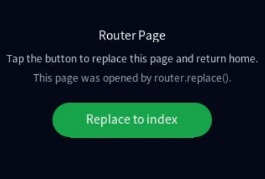

# @system.router (页面路由)

通过不同的uri访问不同的页面。


- 从API version 8 开始，该接口不再维护，推荐使用新接口[@ohos.router](https://developer.huawei.com/consumer/cn/doc/harmonyos-references/js-apis-router)。
- 本模块首批接口从API version 3开始支持。后续版本的新增接口，采用上角标单独标记接口的起始版本。

#### 导入模块

```
import router from '@system.router';
```

#### router.push

push(options: RouterOptions): void

跳转到应用内的指定页面。

系统能力： SystemCapability.ArkUI.ArkUI.Full

参数：

| 参数名 | 类型 | 必填 | 说明 |
| --- | --- | --- | --- |
| options | [RouterOptions](#routeroptions) | 是 | 页面路由参数，详细请参考RouterOptions。 |

示例：

```
// 在当前页面中
import router from '@system.router';
class A{
  pushPage() {
    router.push({
      uri: 'pages/routerpage2/routerpage2',
      params: {
        data1: 'message',
        data2: {
          data3: [123, 456, 789]
        }
      }
    });
  }
}
export default new A()
```
 
```
// 在routerpage2页面中
class B{
  data:Record<string,string> = {'data1': 'default'}
  data2:Record<string,number[]> = {'data3': [1, 2, 3]}
  onInit() {
    console.info('showData1:' + this.data.data1);
    console.info('showData3:' + this.data2.data3);
  }
}
export default new B()
```
  页面路由栈支持的最大Page数量为32。

#### router.replace

replace(options: RouterOptions): void

用应用内的某个页面替换当前页面，并销毁被替换的页面。

系统能力： SystemCapability.ArkUI.ArkUI.Lite

参数：

| 参数名 | 类型 | 必填 | 说明 |
| --- | --- | --- | --- |
| options | [RouterOptions](#routeroptions) | 是 | 页面路由参数，详细请参考RouterOptions。 |

示例：

```
// 在当前页面中
import router from '@system.router';
class C{
  replacePage() {
    router.replace({
      uri: 'pages/detail/detail',
      params: {
        data1: 'message'
      }
    });
  }
}
export default new C()
```
 
```
// 在detail页面中
class Area {
  data:Record<string,string> = {'data1': 'default'}
  onInit() {
    console.info(`showData1: ${JSON.stringify(this.data)}`);
  }
}
export default new Area()
```

#### router.back

back(options?: BackRouterOptions): void

返回上一页面或指定的页面。

系统能力： SystemCapability.ArkUI.ArkUI.Full

参数：

| 参数名 | 类型 | 必填 | 说明 |
| --- | --- | --- | --- |
| options | [BackRouterOptions](#backrouteroptions) | 否 | 详细请参考BackRouterOptions。 |

示例：

```
// index页面
import router from '@system.router';
class D{
  indexPushPage() {
    router.push({
      uri: 'pages/detail/detail'
    });
  }
}
export default new D()
```
 
```
// detail页面
import router from '@system.router';
class E{
  detailPushPage() {
    router.push({
      uri: 'pages/mall/mall'
    });
  }
}
export default new E()
```
 
```
// mall页面通过back，将返回detail页面
import router from '@system.router';
class F{
  mallBackPage() {
    router.back();
  }
}
export default new F()
```
 
```
// detail页面通过back，将返回index页面
import router from '@system.router';
class G{
  defaultBack() {
    router.back();
  }
}
export default new G()
```
 
```
// 通过back，返回到detail页面
import router from '@system.router';
class H{
  backToDetail() {
    router.back({uri:'pages/detail/detail'});
  }
}
export default new H()
```
  示例中的uri字段是页面路由，由配置文件中的pages列表指定。

#### router.getParams7+

getParams(): ParamsInterface

获取当前页面的参数信息。

系统能力： SystemCapability.ArkUI.ArkUI.Full

返回值：

| 类型 | 说明 |
| --- | --- |
| [ParamsInterface](#paramsinterface) | 详细请参见ParamsInterface。 |

#### router.clear

clear(): void

清空页面栈中的所有历史页面，仅保留当前页面作为栈顶页面。

系统能力： SystemCapability.ArkUI.ArkUI.Full

示例：

```
import router from '@system.router';
class I{
  clearPage() {
    router.clear();
  }
}
export default new I()
```

#### router.getLength

getLength(): string

获取当前在页面栈内的页面数量。

系统能力： SystemCapability.ArkUI.ArkUI.Full

返回值：

| 类型 | 说明 |
| --- | --- |
| string | 页面数量，页面栈支持最大数值是32。 |

示例：

```
import router from '@system.router';
class J{
  getLength() {
    let size = router.getLength();
    console.info('pages stack size = ' + size);
  }
}
export default new J()
```

#### router.getState

getState(): RouterState

获取当前页面的状态信息。

系统能力： SystemCapability.ArkUI.ArkUI.Full

返回值：

| 参数类型 | 说明 |
| --- | --- |
| [RouterState](#routerstate) | 详细请参见RouterState。 |

示例：

```
import router from '@system.router';
class K{
  getState() {
    let page = router.getState();
    console.info('current index = ' + page.index);
    console.info('current name = ' + page.name);
    console.info('current path = ' + page.path);
  }
}
export default new K()
```

#### router.enableAlertBeforeBackPage6+

enableAlertBeforeBackPage(options: EnableAlertBeforeBackPageOptions): void

开启页面返回询问对话框。

系统能力： SystemCapability.ArkUI.ArkUI.Full

参数：

| 参数名 | 类型 | 必填 | 说明 |
| --- | --- | --- | --- |
| options | [EnableAlertBeforeBackPageOptions](#enablealertbeforebackpageoptions6) | 是 | 详细请参见EnableAlertBeforeBackPageOptions。 |

示例：

```
import router from '@system.router';
class L{
  enableAlertBeforeBackPage() {
    router.enableAlertBeforeBackPage({
      message: 'Message Info',
      success: ()=> {
        console.info('success');
      },
      cancel: ()=> {
        console.info('cancel');
      }
    });
  }
}
export default new L()
```

#### router.disableAlertBeforeBackPage6+

disableAlertBeforeBackPage(options?: DisableAlertBeforeBackPageOptions): void

禁用页面返回询问对话框。

系统能力： SystemCapability.ArkUI.ArkUI.Full

参数：

| 参数名 | 类型 | 必填 | 说明 |
| --- | --- | --- | --- |
| options | [DisableAlertBeforeBackPageOptions](#disablealertbeforebackpageoptions6) | 否 | 详细请参见DisableAlertBeforeBackPageOptions。 |

示例：

```
import router from '@system.router';
class Z{
  disableAlertBeforeBackPage() {
    router.disableAlertBeforeBackPage({
      success: ()=> {
        console.info('success');
      },
      cancel: ()=> {
        console.info('cancel');
      }
    });
  }
}
export default new Z()
```

#### RouterOptions

定义路由器的选项。

系统能力： 以下各项对应的系统能力均为SystemCapability.ArkUI.ArkUI.Lite

| 名称 | 类型 | 必填 | 说明 |
| --- | --- | --- | --- |
| uri | string | 是 | 目标页面的uri，可以是以下的两种格式： 1. 页面的绝对路径，由config.json文件中的页面列表提供。例如： - pages/index/index - pages/detail/detail 2. 特定路径。如果URI为斜杠（/），则显示主页。 |
| params | Object | 否 | 表示路由跳转时要同时传递到目标页面的数据。跳转到目标页面后，使用router.getParams()获取传递的参数，此外，在类web范式中，参数也可以在页面中直接使用，如this.keyValue(keyValue为跳转时params参数中的key值)，如果目标页面中已有该字段，则其值会被传入的字段值覆盖。 |

#### BackRouterOptions

定义路由器返回的选项。

系统能力： 以下各项对应的系统能力有所不同，详见下表。

| 名称 | 类型 | 必填 | 说明 |
| --- | --- | --- | --- |
| uri7+ | string | 否 | 返回到指定uri的界面，如果页面栈上没有uri页面，则不响应该情况。如果uri未设置，则返回上一页。 **系统能力：** SystemCapability.ArkUI.ArkUI.Full |
| params7+ | Object | 否 | 返回时要同时传递到目标页面的数据。 **系统能力：** SystemCapability.ArkUI.ArkUI.Lite |

#### RouterState

定义路由器的状态。

系统能力： 以下各项对应的系统能力均为SystemCapability.ArkUI.ArkUI.Full

| 名称 | 类型 | 必填 | 说明 |
| --- | --- | --- | --- |
| index | number | 是 | 表示当前页面在页面栈中的索引。从栈底到栈顶，index从1开始递增。 |
| name | string | 是 | 表示当前页面的名称，即对应文件名。 |
| path | string | 是 | 表示当前页面的路径。 |

#### EnableAlertBeforeBackPageOptions6+

定义EnableAlertBeforeBackPage选项。

系统能力： 以下各项对应的系统能力均为SystemCapability.ArkUI.ArkUI.Full

| 名称 | 类型 | 必填 | 说明 |
| --- | --- | --- | --- |
| message | string | 是 | 询问对话框内容。 |
| success | (errMsg: string) => void | 否 | 用户选择对话框确认按钮时触发，errMsg表示返回信息。 |
| cancel | (errMsg: string) => void | 否 | 用户选择对话框取消按钮时触发，errMsg表示返回信息。 |
| complete | () => void | 否 | 当对话框关闭时触发该回调。 |

#### DisableAlertBeforeBackPageOptions6+

定义DisableAlertBeforeBackPage参数选项。

系统能力： 以下各项对应的系统能力均为SystemCapability.ArkUI.ArkUI.Full

| 名称 | 类型 | 必填 | 说明 |
| --- | --- | --- | --- |
| success | (errMsg: string) => void | 否 | 关闭询问对话框成功时触发，errMsg表示返回信息。 |
| cancel | (errMsg: string) => void | 否 | 关闭询问对话框失败时触发，errMsg表示返回信息。 |
| complete | () => void | 否 | 当对话框关闭时触发该回调。 |

#### ParamsInterface

| 名称 | 参数类型 | 说明 |
| --- | --- | --- |
| [key: string] | object | 路由参数列表。 |

#### 示例

该示例展示了类Web范式下router.[replace](#routerreplace)接口的跳转功能。

示例树状结构如下：

```
pages
├─ index
│  ├─ index.css
│  ├─ index.hml
│  └─ index.js
└─ routerPages
   ├─ routerPage.css
   ├─ routerPage.hml
   └─ routerPage.js
```
 
```
/* index.css */
.page {
  width: 100%;
  height: 100%;
  flex-direction: column;
  justify-content: center;
  align-items: center;
  padding-left: 20px;
  padding-right: 20px;
  background-color: #050816;
}

.page-name {
  width: 78%;
  margin-top: 10px;
  font-size: 14px;
  text-align: center;
  color: #f8fafc;
}

.tips {
  width: 82%;
  margin-top: 12px;
  font-size: 12px;
  text-align: center;
  color: #cbd5e1;
}

.status {
  width: 82%;
  margin-top: 8px;
  font-size: 12px;
  text-align: center;
  color: #94a3b8;
}

.action-button {
  width: 190px;
  height: 42px;
  margin-top: 22px;
  border-radius: 21px;
  background-color: #2563eb;
  color: #ffffff;
  font-size: 14px;
  text-align: center;
}
```
 
```
<!--index.hml-->
<div class="page">
    <text class="page-name">{{ pageName }}</text>
    <text class="tips">{{ tips }}</text>
    <text class="status">{{ statusText }}</text>
    <input class="action-button" type="button" value="Replace to routerPage" onclick="replaceToRouterPage"></input>
</div>
```
 
```
// index.js
import router from '@system.router';

export default {
    data: {
        pageName: 'Index Page',
        tips: 'Tap the button to replace this page.',
        statusText: 'Current page: index'
    },
    replaceToRouterPage: function() {
        router.replace({
            uri: 'pages/routerPages/routerPage',
            params: {
                data1: 'This page was opened by router.replace().'
            }
        });
    }
}
```
 
```
/* routerPage.css */
.page {
  width: 100%;
  height: 100%;
  flex-direction: column;
  justify-content: center;
  align-items: center;
  padding-left: 20px;
  padding-right: 20px;
  background-color: #050816;
}

.page-name {
  width: 78%;
  margin-top: 10px;
  font-size: 14px;
  text-align: center;
  color: #f8fafc;
}

.tips {
  width: 82%;
  margin-top: 12px;
  font-size: 12px;
  text-align: center;
  color: #cbd5e1;
}

.status {
  width: 82%;
  margin-top: 8px;
  font-size: 12px;
  text-align: center;
  color: #94a3b8;
}

.action-button {
  width: 190px;
  height: 42px;
  margin-top: 22px;
  border-radius: 21px;
  background-color: #16a34a;
  color: #ffffff;
  font-size: 14px;
  text-align: center;
}
```
 
```
<!--routerPage.hml-->
<div class="page">
    <text class="page-name">{{ pageName }}</text>
    <text class="tips">{{ tips }}</text>
    <text class="status">{{ statusText }}</text>
    <input class="action-button" type="button" value="Replace to index" onclick="replaceToIndex"></input>
</div>
```
 
```
// routerPage.js
import router from '@system.router';

export default {
    data: {
        pageName: 'Router Page',
        tips: 'Tap the button to replace this page and return home.',
        statusText: 'Current page: routerPage',
        data1: 'Waiting for router.replace params.'
    },
    onInit: function() {
        if (this.data1) {
            this.statusText = this.data1;
        }
    },
    replaceToIndex: function() {
        router.replace({
            uri: 'pages/index/index'
        });
    }
}
```
 
