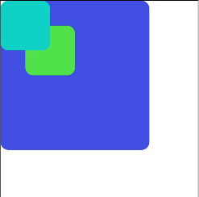

# stack

 从API version 4开始支持。后续版本如有新增内容，则采用上角标单独标记该内容的起始版本。

堆叠容器，子组件按照顺序依次入栈，后一个子组件覆盖前一个子组件。

#### 权限列表

无

#### 子组件

支持。

#### 属性

支持[通用属性](https://developer.huawei.com/consumer/cn/doc/harmonyos-references/js-components-common-attributes)。

#### 样式

支持[通用样式](https://developer.huawei.com/consumer/cn/doc/harmonyos-references/js-components-common-styles)。

#### 事件

支持[通用事件](https://developer.huawei.com/consumer/cn/doc/harmonyos-references/js-components-common-events)。

#### 方法

支持[通用方法](https://developer.huawei.com/consumer/cn/doc/harmonyos-references/js-components-common-methods)。

#### 示例

```
<!-- xxx.hml -->
<stack class="stack-parent">
  <div class="back-child bd-radius"></div>
  <div class="positioned-child bd-radius"></div>
  <div class="front-child bd-radius"></div>
</stack>
```
 
```
/* xxx.css */
.stack-parent {
  width: 400px;
  height: 400px;
  background-color: #ffffff;
  border-width: 1px;
  border-style: solid;
}
.back-child {
  width: 300px;
  height: 300px;
  background-color: #3f56ea;
}
.front-child {
  width: 100px;
  height: 100px;
  background-color: #00bfc9;
}
.positioned-child {
  width: 100px;
  height: 100px;
  left: 50px;
  top: 50px;
  background-color: #47cc47;
}
.bd-radius {
  border-radius: 16px;
}
```
 
