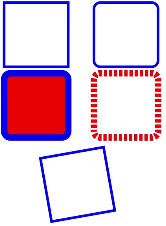

# rect

 该组件从API version 7开始支持。后续版本如有新增内容，则采用上角标单独标记该内容的起始版本。

用于绘制矩形、圆角矩形。

#### 权限列表

无

#### 子组件

支持[animate](https://developer.huawei.com/consumer/cn/doc/harmonyos-references/js-components-svg-animate)、[animateMotion](https://developer.huawei.com/consumer/cn/doc/harmonyos-references/js-components-svg-animatemotion)、[animateTransform](https://developer.huawei.com/consumer/cn/doc/harmonyos-references/js-components-svg-animatetransform)。

#### 属性

支持Svg组件[通用属性](https://developer.huawei.com/consumer/cn/doc/harmonyos-references/js-components-svg-common-attributes)和以下属性。

| 名称 | 类型 | 默认值 | 必填 | 描述 |
| --- | --- | --- | --- | --- |
| id | string | - | 否 | 组件的唯一标识。 |
| width | | | 0 | 否 | 设置矩形的宽度。支持属性动画。 |
| height | | | 0 | 否 | 设置矩形的高度。支持属性动画。 |
| x | | | 0 | 否 | 设置矩形左上角x轴坐标。支持属性动画。 |
| y | | | 0 | 否 | 设置矩形左上角y轴坐标。支持属性动画。 |
| rx | | | 0 | 否 | 设置矩形圆角x方向半径。支持属性动画。 |
| ry | | | 0 | 否 | 设置矩形圆角y方向半径。支持属性动画。 |

#### 示例

```
<!-- xxx.hml -->
<div class="container">
  <svg fill="white" width="400" height="400">
    <rect width="100" height="100" x="10" y="20" stroke-width="4" stroke="blue" id="rectId"></rect>
    <rect width="100" height="100" x="150" y="20" stroke-width="4" stroke="blue" rx="10" ry="10"></rect>
    <rect width="100" height="100" x="10" y="130" stroke-width="10" fill="red" stroke="blue" rx="10" ry="10"></rect>
    <rect width="100" height="100" x="150" y="130" stroke-width="10" stroke="red" rx="10" ry="10" stroke-dasharray="5 3" stroke-dashoffset="3"></rect>
    <rect width="100" height="100" x="20" y="270" stroke-width="4" stroke="blue" transform="rotate(-10)"></rect>
  </svg>
</div>
```
 
