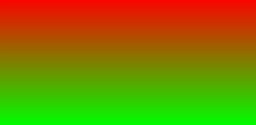

# 渐变样式

组件普遍支持在style或css中设置渐变样式，可以平稳过渡两个或多个指定的颜色。

 从API version 8开始支持。后续版本如有新增内容，则采用上角标单独标记该内容的起始版本。

开发框架支持线性渐变 (linear-gradient)和重复线性渐变 (repeating-linear-gradient)两种渐变效果。

#### 线性渐变/重复线性渐变

使用渐变样式，需要定义过渡方向和过渡颜色。

#### [h2]过渡方向

通过direction或者angle指定过渡方向。

- direction：进行方向渐变。
- angle：进行角度渐变。

```
background: linear-gradient(direction/angle, color, color, ...);
background: repeating-linear-gradient(direction/angle, color, color, ...);
```

#### [h2]过渡颜色

支持以下四种方式：#ff0000、#ffff0000、rgb(255, 0, 0)、rgba(255, 0, 0, 1)，需要指定至少两种颜色。

参数：

| 名称 | 类型 | 默认值 | 必填 | 描述 |
| --- | --- | --- | --- | --- |
| direction | to = [left | right] || [top | bottom] | to bottom (由上到下渐变) | 否 | 指定过渡方向，如：to left (从右向左渐变) ，或者to bottom right (从左上角到右下角)。 |
| angle | | 180deg | 否 | 指定过渡方向，以元素几何中心为坐标原点，水平方向为X轴，angle指定了渐变线与Y轴的夹角(顺时针方向)。 |
| color | [|] | - | 是 | 定义使用渐变样式区域内颜色的渐变效果。 |

示例：

1. 默认渐变方向为从上向下渐变。 
```
#gradient {
  height: 300px;
  width: 600px;
  /* 从顶部开始向底部由红色向绿色渐变 */
  background: linear-gradient(red, #00ff00);
}
```
 
2. 45度夹角渐变。 
```
/* 45度夹角，从红色渐变到绿色 */
background: linear-gradient(45deg, rgb(255, 0, 0),rgb(0, 255, 0));
```
 
3. 设置方向从左向右渐变。 
```
/* 从左向右渐变，在距离左边90px和距离左边360px (600*0.6) 之间270px宽度形成渐变 */
background: linear-gradient(to right, rgb(255, 0, 0) 90px, rgb(0, 255, 0) 60%);
```
 
4. 重复渐变。 
```
/* 从左向右重复渐变，重复渐变区域30px（60-30）透明度0.5 */
background: repeating-linear-gradient(to right, rgba(255, 255, 0, 1) 30vp,rgba(0, 0, 255, .5) 60vp);
```
 
