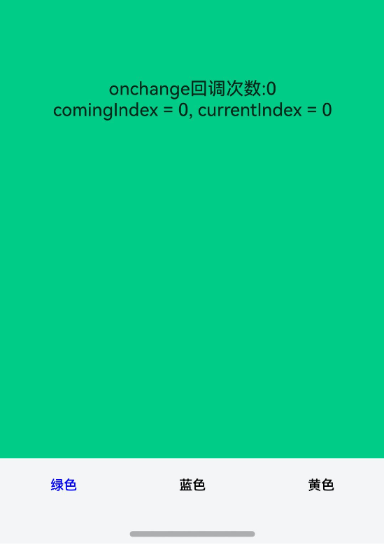
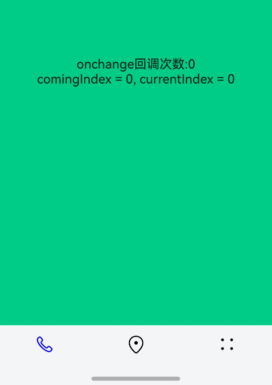
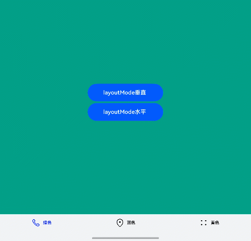

# AtomicServiceTabs

AtomicServiceTabs高级组件，对Tabs组件中不需要暴露给用户进行自定义的属性进行简化，限制最多显示5个页签，固定页签的样式、位置和大小。

 该组件从API version 12开始支持。后续版本的新增接口，采用上角标单独标记接口的起始版本。

#### 导入模块

```
import { AtomicServiceTabs, TabBarOptions, TabBarPosition, OnContentWillChangeCallback } from '@kit.ArkUI';
```

#### 子组件

无。

#### 属性

不支持[通用属性](https://developer.huawei.com/consumer/cn/doc/harmonyos-references/ts-component-general-attributes)。

#### AtomicServiceTabs

```
AtomicServiceTabs({
   tabContents?: [ TabContentBuilder?,
                    TabContentBuilder?,
                  TabContentBuilder?,
                  TabContentBuilder?,
                  TabContentBuilder?
                ],
   tabBarOptionsArray: [ TabBarOptions,
                        TabBarOptions,
                        TabBarOptions?,
                        TabBarOptions?,
                        TabBarOptions?
                      ],
   tabBarPosition?: TabBarPosition,
   layoutMode?: LayoutMode,
   barBackgroundColor?: ResourceColor,
   index?: number,
   barOverlap?: boolean,
   controller?: TabsController,
   onChange?: Callback<number>,
   onTabBarClick?: Callback<number>,
   onContentWillChange?: OnContentWillChangeCallback,
})
```
 装饰器类型：@Component

元服务API： 从API version 12开始，该接口支持在元服务中使用。

系统能力： SystemCapability.ArkUI.ArkUI.Full

参数：

| 名称 | 类型 | 必填 | 装饰器类型 | 说明 |
| --- | --- | --- | --- | --- |
| tabContents | [[TabContentBuilder?](#tabcontentbuilder),[TabContentBuilder?](#tabcontentbuilder), [TabContentBuilder?](#tabcontentbuilder),[TabContentBuilder?](#tabcontentbuilder), [TabContentBuilder?](#tabcontentbuilder)] | 否 | @BuilderParam | 内容视图容器数组，最多支持5个页签，默认值为空。 |
| tabBarOptionsArray | [[TabBarOptions](#tabbaroptions),[TabBarOptions](#tabbaroptions), [TabBarOptions?](#tabbaroptions),[TabBarOptions?](#tabbaroptions), [TabBarOptions?](#tabbaroptions)] | 是 | @Prop | 页签选项数组，最多支持5个页签。 |
| tabBarPosition | [TabBarPosition](#tabbarposition) | 否 | @Prop | 设置页签栏位置，默认值为TabBarPosition.BOTTOM。 |
| layoutMode18+ | [LayoutMode](https://developer.huawei.com/consumer/cn/doc/harmonyos-references/ts-container-tabcontent#layoutmode10) | 否 | @Prop | 设置底部页签的图片、文字排布的方式，默认值为LayoutMode.VERTICAL。 **元服务API：** 从API version 18开始，该接口支持在元服务中使用。 |
| barBackgroundColor | [ResourceColor](https://developer.huawei.com/consumer/cn/doc/harmonyos-references/ts-types#resourcecolor) | 否 | @Prop | 设置TabBar的背景颜色，默认值为透明。 |
| index | number | 否 | @Prop | 设置当前显示页签的索引，索引值从0开始，取值范围为[0, 页签数-1]，最大不超过4。默认值为0。 |
| barOverlap | boolean | 否 | @Prop | 设置TabBar是否背景变模糊并叠加在TabContent之上。true表示TabBar背景变模糊并叠加在TabContent之上，false表示TabBar背景不变模糊且不叠加在TabContent之上。默认值为true。 |
| controller | [TabsController](https://developer.huawei.com/consumer/cn/doc/harmonyos-references/ts-container-tabs#tabscontroller) | 否 | - | Tabs组件的控制器，用于控制页签切换。默认值为new TabsController()。 |
| onChange | Callback | 否 | - | Tabs页签切换后触发的事件，回调参数为切换后的页签索引，索引值从0开始。当onContentWillChange回调返回false拦截页面切换时，该事件不会被触发。默认值为空。 |
| onTabBarClick | Callback | 否 | - | Tabs页签点击后触发的事件，回调参数为被点击页签的索引值，索引值从0开始。默认值为空。 |
| onContentWillChange | [OnContentWillChangeCallback](#oncontentwillchangecallback) | 否 | - | Tabs页面切换拦截事件，新页面即将显示时触发该回调。当回调返回false拦截页面切换时，onChange事件不会被触发。默认值为空。 |

#### TabContentBuilder

type TabContentBuilder = () => void

内容视图构建器，用于构建TabContent页签内容的函数。

元服务API： 从API version 12开始，该接口支持在元服务中使用。

系统能力： SystemCapability.ArkUI.ArkUI.Full

#### TabBarOptions

页签选项。

#### [h2]constructor

constructor(icon: ResourceStr | TabBarSymbol, text: ResourceStr, unselectedColor?: ResourceColor, selectedColor?: ResourceColor)

TabBarOptions的构造函数。

元服务API： 从API version 12开始，该接口支持在元服务中使用。

系统能力： SystemCapability.ArkUI.ArkUI.Full

参数：

| 参数名 | 类型 | 必填 | 说明 |
| --- | --- | --- | --- |
| icon | [ResourceStr](https://developer.huawei.com/consumer/cn/doc/harmonyos-references/ts-types#resourcestr) | [TabBarSymbol](https://developer.huawei.com/consumer/cn/doc/harmonyos-references/ts-container-tabcontent#tabbarsymbol12对象说明) | 是 | 页签内的图标内容。 |
| text | [ResourceStr](https://developer.huawei.com/consumer/cn/doc/harmonyos-references/ts-types#resourcestr) | 是 | 页签内的文字内容。 |
| unselectedColor | [ResourceColor](https://developer.huawei.com/consumer/cn/doc/harmonyos-references/ts-types#resourcecolor) | 否 | 未选择时的页签颜色，默认值为#99182431。 |
| selectedColor | [ResourceColor](https://developer.huawei.com/consumer/cn/doc/harmonyos-references/ts-types#resourcecolor) | 否 | 已选择时的页签颜色，默认值为#FF007DFF。 |

#### TabBarPosition

设置页签栏位置，默认值为TabBarPosition.BOTTOM。

元服务API： 从API version 12开始，该接口支持在元服务中使用。

系统能力： SystemCapability.ArkUI.ArkUI.Full

| 名称 | 值 | 说明 |
| --- | --- | --- |
| LEFT | 0 | 设置TabBar位于屏幕左侧 |
| BOTTOM | 1 | 设置TabBar位于屏幕底部 |

#### OnContentWillChangeCallback

type OnContentWillChangeCallback = (currentIndex: number, comingIndex: number) => boolean

页面内容即将发生变化时触发的回调函数，用于拦截页面切换，开发者可通过返回值控制是否允许切换。

元服务API： 从API version 12开始，该接口支持在元服务中使用。

系统能力： SystemCapability.ArkUI.ArkUI.Full

参数：

| 参数名 | 类型 | 必填 | 说明 |
| --- | --- | --- | --- |
| currentIndex | number | 是 | 当前页签索引。 |
| comingIndex | number | 是 | 即将切换的页签索引。 |

返回值：

| 类型 | 说明 |
| --- | --- |
| boolean | 返回true表示允许切换到即将显示的页面，返回false表示不允许切换，仍然显示当前页面内容。 |

#### 示例

#### [h2]示例1(纯文本样式)

```
// Index.ets
import { AtomicServiceTabs, TabBarOptions, TabBarPosition, OnContentWillChangeCallback } from '@kit.ArkUI';

@Entry
@Component
struct Index {
  @State onClickNumber: number = 0;
  @State currentIndex: number = 0;
  @State comingIndex: number = 0;
  onContentWillChangeCallback: OnContentWillChangeCallback = (currentIndex: number, comingIndex: number): boolean => {
    this.currentIndex = currentIndex;
    this.comingIndex = comingIndex;
    console.info('OnContentWillChangeCallback');
    return true;
  }
  onTabClick: Callback<number> = (index: number) => {
    this.onClickNumber++;
    console.info('onTabClick');
  }
  @Builder
  tabContent1() {
    Column().width('100%').height('100%').alignItems(HorizontalAlign.Center).backgroundColor('#00CB87')
  }

  @Builder
  tabContent2() {
    Column().width('100%').height('100%').backgroundColor('#007DFF')
  }

  @Builder
  tabContent3() {
    Column().width('100%').height('100%').backgroundColor('#FFBF00')
  }

  build() {
    Stack() {
    AtomicServiceTabs({
      tabContents: [
        () => {
          this.tabContent1()
        },
        () => {
          this.tabContent2()
        },
        () => {
          this.tabContent3()
        }
      ],
      tabBarOptionsArray: [
        new TabBarOptions('', '绿色', Color.Black, Color.Green),
        new TabBarOptions('', '蓝色', Color.Black, Color.Blue),
        new TabBarOptions('', '黄色', Color.Black, Color.Yellow),
      ],
      tabBarPosition: TabBarPosition.BOTTOM,
      barBackgroundColor: $r('sys.color.ohos_id_color_bottom_tab_bg'),
      onTabBarClick: this.onTabClick,
      onContentWillChange: this.onContentWillChangeCallback,
    })
    Column() {
      Text('onTabBarClick回调次数: ' + this.onClickNumber)
      Text('comingIndex = ' + this.comingIndex + ', currentIndex = ' + this.currentIndex)
    }.margin({top:500})
    }.height('100%')
  }
}
```
 

#### [h2]示例2(纯图标样式)

```
// Index.ets
import { AtomicServiceTabs, TabBarOptions, TabBarPosition, OnContentWillChangeCallback } from '@kit.ArkUI';

@Entry
@Component
struct Index {
  @State onClickNumber: number = 0;
  @State currentIndex: number = 0;
  @State comingIndex: number = 0;
  onContentWillChangeCallback: OnContentWillChangeCallback = (currentIndex: number, comingIndex: number): boolean => {
    this.currentIndex = currentIndex;
    this.comingIndex = comingIndex;
    console.info('OnContentWillChangeCallback');
    return true;
  }
  onTabClick: Callback<number> = (index: number) => {
    this.onClickNumber++;
    console.info('onTabClick');
  }
  @Builder
  tabContent1() {
    Column().width('100%').height('100%').alignItems(HorizontalAlign.Center).backgroundColor('#00CB87')
  }

  @Builder
  tabContent2() {
    Column().width('100%').height('100%').backgroundColor('#007DFF')
  }

  @Builder
  tabContent3() {
    Column().width('100%').height('100%').backgroundColor('#FFBF00')
  }

  build() {
    Stack() {
    AtomicServiceTabs({
      tabContents: [
        () => {
          this.tabContent1()
        },
        () => {
          this.tabContent2()
        },
        () => {
          this.tabContent3()
        }
      ],
      tabBarOptionsArray: [
        new TabBarOptions($r('sys.media.ohos_ic_public_phone'), '', Color.Black, Color.Blue),
        new TabBarOptions($r('sys.media.ohos_ic_public_location'), '', Color.Black, Color.Blue),
        new TabBarOptions($r('sys.media.ohos_ic_public_more'), '', Color.Black, Color.Blue),
      ],
      tabBarPosition: TabBarPosition.BOTTOM,
      barBackgroundColor: $r('sys.color.ohos_id_color_bottom_tab_bg'),
      onTabBarClick: this.onTabClick,
      onContentWillChange: this.onContentWillChangeCallback,
    })
    Column() {
      Text('onTabBarClick回调次数: ' + this.onClickNumber)
      Text('comingIndex = ' + this.comingIndex + ', currentIndex = ' + this.currentIndex)
    }.margin({top:500})
    }.height('100%')
  }
}
```
 

#### [h2]示例3(图标加文本，自定义图文排布)

```
// Index.ets
import { AtomicServiceTabs, TabBarOptions, TabBarPosition, OnContentWillChangeCallback } from '@kit.ArkUI';

@Entry
@Component
struct Index {
  @State onClickNumber: number = 0;
  @State currentIndex: number = 0;
  @State comingIndex: number = 0;
  @State layoutMode: LayoutMode = LayoutMode.VERTICAL;
  onContentWillChangeCallback: OnContentWillChangeCallback = (currentIndex: number, comingIndex: number): boolean => {
    this.currentIndex = currentIndex;
    this.comingIndex = comingIndex;
    console.info('OnContentWillChangeCallback');
    return true;
  }
  onTabClick: Callback<number> = (index: number) => {
    this.onClickNumber++;
    console.info('onTabClick');
  }
  onChange: Callback<number> = (index: number) => {
    console.info('onChange');
  }

  @Builder
  tabContent1() {
    Column().width('100%').height('100%').alignItems(HorizontalAlign.Center).backgroundColor('#00CB87')
  }

  @Builder
  tabContent2() {
    Column().width('100%').height('100%').backgroundColor(Color.Blue)
  }

  @Builder
  tabContent3() {
    Column().width('100%').height('100%').backgroundColor('#FFBF00')
  }

  build() {
    Stack() {
      AtomicServiceTabs({
        tabContents: [
          () => {
            this.tabContent1()
          },
          () => {
            this.tabContent2()
          },
          () => {
            this.tabContent3()
          },
        ],
        tabBarOptionsArray: [
        new TabBarOptions($r('sys.media.ohos_ic_public_phone'), '绿色', Color.Black, Color.Blue),
        new TabBarOptions($r('sys.media.ohos_ic_public_location'), '蓝色', Color.Black, Color.Blue),
        new TabBarOptions($r('sys.media.ohos_ic_public_more'), '黄色', Color.Black, Color.Blue),
        ],
        tabBarPosition: TabBarPosition.BOTTOM,
        barBackgroundColor: $r('sys.color.ohos_id_color_bottom_tab_bg'),
        onTabBarClick: this.onTabClick,
        onContentWillChange: this.onContentWillChangeCallback,
        onChange: this.onChange,
        layoutMode: this.layoutMode,
      })

      Column() {
        Button('layoutMode垂直')
          .width('30%')
          .height(50)
          .margin({ top: 5 })
          .onClick((event?: ClickEvent) => {
            this.layoutMode = LayoutMode.VERTICAL;
          })
        Button('layoutMode水平')
          .width('30%')
          .height(50)
          .margin({ top: 5 })
          .onClick((event?: ClickEvent) => {
            this.layoutMode = LayoutMode.HORIZONTAL;
          })
      }.margin({ top: 10 })
    }.height('100%')
  }
}
```
 
