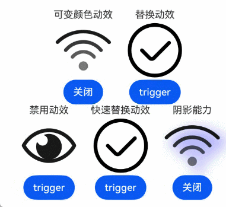
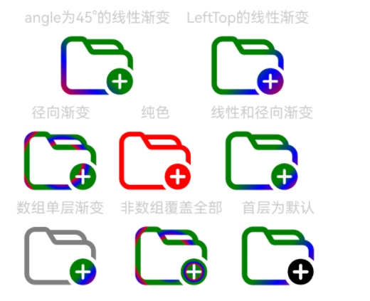

# SymbolGlyph

显示图标小符号的组件。相关资源可参考[系统图标](https://developer.huawei.com/consumer/cn/doc/design-guides/system-icons-0000001929854962)。


- 该组件从API version 11开始支持。后续版本如有新增内容，则采用上角标单独标记该内容的起始版本。
- 本模块接口仅可在Stage模型下使用。

#### 子组件

不支持子组件。

#### 接口

SymbolGlyph(value?: Resource)

卡片能力： 从API version 12开始，该接口支持在ArkTS卡片中使用。

元服务API： 从API version 12开始，该接口支持在元服务中使用。

系统能力： SystemCapability.ArkUI.ArkUI.Full

参数：

| 参数名 | 类型 | 必填 | 说明 |
| --- | --- | --- | --- |
| value | [Resource](https://developer.huawei.com/consumer/cn/doc/harmonyos-references/ts-types#resource) | 否 | SymbolGlyph组件的资源名，如 $r('sys.symbol.ohos_wifi')。 |

 $r('sys.symbol.ohos_wifi')中引用的资源为系统预置，SymbolGlyph仅支持系统预置的symbol资源名，引用非symbol资源将显示异常。

#### 属性

支持[通用属性](https://developer.huawei.com/consumer/cn/doc/harmonyos-references/ts-component-general-attributes)，不支持文本通用属性，仅支持以下特有属性：

#### [h2]fontColor

fontColor(value: Array<ResourceColor>)

设置SymbolGlyph组件字体颜色。

 从API version 12开始，该接口支持在[attributeModifier](https://developer.huawei.com/consumer/cn/doc/harmonyos-references/ts-universal-attributes-attribute-modifier#attributemodifier)中调用。

卡片能力： 从API version 12开始，该接口支持在ArkTS卡片中使用。

元服务API： 从API version 12开始，该接口支持在元服务中使用。

系统能力： SystemCapability.ArkUI.ArkUI.Full

参数：

| 参数名 | 类型 | 必填 | 说明 |
| --- | --- | --- | --- |
| value | Array | 是 | SymbolGlyph组件字体颜色。 当value为undefined时，使用图标的默认颜色，默认颜色跟随主题。 |

#### [h2]fontColor

fontColor(value: Array<ResourceColor | ColorMetrics> | undefined)

设置SymbolGlyph组件的字体颜色，相比[fontColor](#fontcolor)接口，本接口支持传入[ColorMetrics](https://developer.huawei.com/consumer/cn/doc/harmonyos-references/js-apis-arkui-graphics#colormetrics12)类型参数。

 该接口支持在[attributeModifier](https://developer.huawei.com/consumer/cn/doc/harmonyos-references/ts-universal-attributes-attribute-modifier#attributemodifier)中调用。

起始版本： 26.0.0

卡片能力： 从API版本26.0.0开始，该接口支持在ArkTS卡片中使用。

元服务API： 从API版本26.0.0开始，该接口支持在元服务中使用。

系统能力： SystemCapability.ArkUI.ArkUI.Full

模型约束： 此接口仅可在Stage模型下使用。

参数：

| 参数名 | 类型 | 必填 | 说明 |
| --- | --- | --- | --- |
| value | Array | undefined | 是 | SymbolGlyph组件字体颜色。支持传入ResourceColor或ColorMetrics类型的数组。 当value为undefined时，使用图标的默认颜色，默认颜色跟随主题。 |

#### [h2]fontSize

fontSize(value: number | string | Resource)

设置SymbolGlyph组件字体大小。设置string类型时，支持number类型取值的字符串形式，可以附带单位，例如"10"、"10fp"。

组件的图标显示大小由fontSize控制，设置width或height后，其他通用属性仅对组件的占位大小生效。

 从API version 12开始，该接口支持在[attributeModifier](https://developer.huawei.com/consumer/cn/doc/harmonyos-references/ts-universal-attributes-attribute-modifier#attributemodifier)中调用。

卡片能力： 从API version 12开始，该接口支持在ArkTS卡片中使用。

元服务API： 从API version 12开始，该接口支持在元服务中使用。

系统能力： SystemCapability.ArkUI.ArkUI.Full

参数：

| 参数名 | 类型 | 必填 | 说明 |
| --- | --- | --- | --- |
| value | number | string | [Resource](https://developer.huawei.com/consumer/cn/doc/harmonyos-references/ts-types#resource) | 是 | SymbolGlyph组件字体大小。 默认值：16fp 单位：[fp](https://developer.huawei.com/consumer/cn/doc/harmonyos-references/ts-pixel-units#基本像素单位) 不支持设置百分比字符串。 |

#### [h2]fontWeight

fontWeight(value: number | FontWeight | string)

设置SymbolGlyph组件字体粗细。number类型取值[100,900]，取值间隔为100，默认为400，取值越大，字体越粗。string类型仅支持number类型取值的字符串形式，例如"400"，以及"bold"、"bolder"、"lighter"、"regular" 、"medium"分别对应FontWeight中相应的枚举值。

sys.symbol.ohos_lungs图标不支持设置fontWeight。

 从API version 12开始，该接口支持在[attributeModifier](https://developer.huawei.com/consumer/cn/doc/harmonyos-references/ts-universal-attributes-attribute-modifier#attributemodifier)中调用。

卡片能力： 从API version 12开始，该接口支持在ArkTS卡片中使用。

元服务API： 从API version 12开始，该接口支持在元服务中使用。

系统能力： SystemCapability.ArkUI.ArkUI.Full

参数：

| 参数名 | 类型 | 必填 | 说明 |
| --- | --- | --- | --- |
| value | number | [FontWeight](https://developer.huawei.com/consumer/cn/doc/harmonyos-references/ts-appendix-enums#fontweight) | string | 是 | SymbolGlyph组件字体粗细。 默认值：FontWeight.Normal |

#### [h2]renderingStrategy

renderingStrategy(value: SymbolRenderingStrategy)

设置SymbolGlyph组件渲染策略。

 从API version 12开始，该接口支持在[attributeModifier](https://developer.huawei.com/consumer/cn/doc/harmonyos-references/ts-universal-attributes-attribute-modifier#attributemodifier)中调用。

卡片能力： 从API version 12开始，该接口支持在ArkTS卡片中使用。

元服务API： 从API version 12开始，该接口支持在元服务中使用。

系统能力： SystemCapability.ArkUI.ArkUI.Full

参数：

| 参数名 | 类型 | 必填 | 说明 |
| --- | --- | --- | --- |
| value | [SymbolRenderingStrategy](#symbolrenderingstrategy11枚举说明) | 是 | SymbolGlyph组件渲染策略。 默认值：SymbolRenderingStrategy.SINGLE |

不同渲染策略效果可参考以下示意图。


#### [h2]effectStrategy

effectStrategy(value: SymbolEffectStrategy)

设置SymbolGlyph组件动效策略。

 从API version 12开始，该接口支持在[attributeModifier](https://developer.huawei.com/consumer/cn/doc/harmonyos-references/ts-universal-attributes-attribute-modifier#attributemodifier)中调用。

卡片能力： 从API version 12开始，该接口支持在ArkTS卡片中使用。

元服务API： 从API version 12开始，该接口支持在元服务中使用。

系统能力： SystemCapability.ArkUI.ArkUI.Full

参数：

| 参数名 | 类型 | 必填 | 说明 |
| --- | --- | --- | --- |
| value | [SymbolEffectStrategy](#symboleffectstrategy11枚举说明) | 是 | SymbolGlyph组件动效策略。 默认值：SymbolEffectStrategy.NONE |

#### [h2]symbolEffect12+

symbolEffect(symbolEffect: SymbolEffect, isActive?: boolean)

设置SymbolGlyph组件动效策略及播放状态。

卡片能力： 从API version 12开始，该接口支持在ArkTS卡片中使用。

元服务API： 从API version 12开始，该接口支持在元服务中使用。

系统能力： SystemCapability.ArkUI.ArkUI.Full

参数：

| 参数名 | 类型 | 必填 | 说明 |
| --- | --- | --- | --- |
| symbolEffect | [SymbolEffect](#symboleffect12对象说明) | 是 | SymbolGlyph组件动效策略。 默认值：[SymbolEffect](#symboleffect12对象说明) |
| isActive | boolean | 否 | SymbolGlyph组件动效播放状态。 true表示播放，false表示不播放。 默认值：false |

#### [h2]symbolEffect12+

symbolEffect(symbolEffect: SymbolEffect, triggerValue?: number)

设置SymbolGlyph组件动效策略及播放触发器。

卡片能力： 从API version 12开始，该接口支持在ArkTS卡片中使用。

元服务API： 从API version 12开始，该接口支持在元服务中使用。

系统能力： SystemCapability.ArkUI.ArkUI.Full

参数：

| 参数名 | 类型 | 必填 | 说明 |
| --- | --- | --- | --- |
| symbolEffect | [SymbolEffect](#symboleffect12对象说明) | 是 | SymbolGlyph组件动效策略。 默认值：[SymbolEffect](#symboleffect12对象说明) |
| triggerValue | number | 否 | SymbolGlyph组件动效播放触发器，在数值变更时触发动效。 如果首次不希望触发动效，设置-1。 |

 动效属性，仅支持使用effectStrategy属性或单个symbolEffect属性，不支持多种动效属性混合使用。

#### [h2]minFontScale18+

minFontScale(scale: Optional<number | Resource>)

设置SymbolGlyph组件最小的字体缩放倍数。

元服务API： 从API version 18开始，该接口支持在元服务中使用。

系统能力： SystemCapability.ArkUI.ArkUI.Full

参数：

| 参数名 | 类型 | 必填 | 说明 |
| --- | --- | --- | --- |
| scale | [Optional](https://developer.huawei.com/consumer/cn/doc/harmonyos-references/ts-universal-attributes-custom-property#optionalt) | 是 | SymbolGlyph组件最小的字体缩放倍数。 取值范围：[0, 1] 设置为0，缩放最小。 **说明：** 设置的值小于0时，按值为0处理。设置的值大于1，按值为1处理。异常值默认不生效。 |

#### [h2]maxFontScale18+

maxFontScale(scale: Optional<number | Resource>)

设置SymbolGlyph组件最大的字体缩放倍数。

元服务API： 从API version 18开始，该接口支持在元服务中使用。

系统能力： SystemCapability.ArkUI.ArkUI.Full

参数：

| 参数名 | 类型 | 必填 | 说明 |
| --- | --- | --- | --- |
| scale | [Optional](https://developer.huawei.com/consumer/cn/doc/harmonyos-references/ts-universal-attributes-custom-property#optionalt) | 是 | SymbolGlyph组件最大的字体缩放倍数。 取值范围：[1, +∞) **说明：** 设置的值小于1时，按值为1处理，异常值默认不生效。 |

#### [h2]shaderStyle20+

shaderStyle(shader: Array<ShaderStyle | undefined> | ShaderStyle)

设置SymbolGlyph组件的渐变色效果。

可以显示为径向渐变[RadialGradientStyle](https://developer.huawei.com/consumer/cn/doc/harmonyos-references/ts-text-common#radialgradientstyle20)或线性渐变[LinearGradientStyle](https://developer.huawei.com/consumer/cn/doc/harmonyos-references/ts-text-common#lineargradientstyle20)或纯色[ColorShaderStyle](https://developer.huawei.com/consumer/cn/doc/harmonyos-references/ts-text-common#colorshaderstyle20)的效果，shaderStyle的优先级高于[fontColor](https://developer.huawei.com/consumer/cn/doc/harmonyos-references/ts-basic-components-symbolspan#fontcolor)和AI识别，纯色建议使用[fontColor](https://developer.huawei.com/consumer/cn/doc/harmonyos-references/ts-basic-components-symbolspan#fontcolor)。

元服务API： 从API version 20开始，该接口支持在元服务中使用。

系统能力： SystemCapability.ArkUI.ArkUI.Full

参数：

| 参数名 | 类型 | 必填 | 说明 |
| --- | --- | --- | --- |
| shader | Array | [ShaderStyle](https://developer.huawei.com/consumer/cn/doc/harmonyos-references/ts-text-common#shaderstyle20) | 是 | 径向渐变或线性渐变或纯色。 传入ShaderStyle时，覆盖所有层；传入数组时，数据项是ShaderStyle，则应用该层；数组项是undefined，则该层使用SymbolGlyph默认颜色，未设置的层也应用默认颜色。根据传入的参数区分处理径向渐变[RadialGradientStyle](https://developer.huawei.com/consumer/cn/doc/harmonyos-references/ts-text-common#radialgradientstyle20)或线性渐变[LinearGradientStyle](https://developer.huawei.com/consumer/cn/doc/harmonyos-references/ts-text-common#lineargradientstyle20)或纯色[ColorShaderStyle](https://developer.huawei.com/consumer/cn/doc/harmonyos-references/ts-text-common#colorshaderstyle20)，最终设置到SymbolGlyph组件上显示为渐变色效果。 **说明：** 单位：[vp](https://developer.huawei.com/consumer/cn/doc/harmonyos-references/ts-pixel-units#基本像素单位) 中心点请按百分比使用。如果使用的是非百分比（例如10PX），效果等同于设置1000%。 半径建议使用百分比。 百分比是基于图标大小的百分比，建议取值范围[0, 1)。 |

#### [h2]symbolShadow20+

symbolShadow(shadow: Optional<ShadowOptions>)

设置SymbolGlyph组件的阴影效果。

卡片能力： 从API version 20开始，该接口支持在ArkTS卡片中使用。

元服务API： 从API version 20开始，该接口支持在元服务中使用。

系统能力： SystemCapability.ArkUI.ArkUI.Full

参数：

| 参数名 | 类型 | 必填 | 说明 |
| --- | --- | --- | --- |
| shadow | [Optional](https://developer.huawei.com/consumer/cn/doc/harmonyos-references/ts-universal-attributes-custom-property#optionalt) | 是 | SymbolGlyph组件的阴影效果。 单位：[vp](https://developer.huawei.com/consumer/cn/doc/harmonyos-references/ts-pixel-units#基本像素单位) 默认值：{ radius：0, color：Color.Black, offsetX：0, offsetY：0 } 不支持fill、type属性和color中的ColoringStrategy枚举值。 |

#### ScaleSymbolEffect12+

ScaleSymbolEffect继承自父类SymbolEffect。

卡片能力： 从API version 12开始，该接口支持在ArkTS卡片中使用。

元服务API： 从API version 12开始，该接口支持在元服务中使用。

系统能力： SystemCapability.ArkUI.ArkUI.Full

#### [h2]属性

| 名称 | 类型 | 只读 | 可选 | 说明 |
| --- | --- | --- | --- | --- |
| scope | [EffectScope](#effectscope12枚举说明) | 否 | 是 | 动效范围。 默认值：EffectScope.LAYER |
| direction | [EffectDirection](#effectdirection12枚举说明) | 否 | 是 | 动效方向。 默认值：EffectDirection.DOWN |

#### [h2]constructor12+

constructor(scope?: EffectScope, direction?: EffectDirection)

ScaleSymbolEffect的构造函数，缩放动效。

卡片能力： 从API version 12开始，该接口支持在ArkTS卡片中使用。

元服务API： 从API version 12开始，该接口支持在元服务中使用。

系统能力： SystemCapability.ArkUI.ArkUI.Full

参数：

| 参数名 | 类型 | 必填 | 说明 |
| --- | --- | --- | --- |
| scope | [EffectScope](#effectscope12枚举说明) | 否 | 动效范围。 默认值：EffectScope.LAYER |
| direction | [EffectDirection](#effectdirection12枚举说明) | 否 | 动效方向。 默认值：EffectDirection.DOWN |

#### HierarchicalSymbolEffect12+

HierarchicalSymbolEffect继承自父类SymbolEffect。

卡片能力： 从API version 12开始，该接口支持在ArkTS卡片中使用。

元服务API： 从API version 12开始，该接口支持在元服务中使用。

系统能力： SystemCapability.ArkUI.ArkUI.Full

#### [h2]属性

| 名称 | 类型 | 只读 | 可选 | 说明 |
| --- | --- | --- | --- | --- |
| fillStyle | [EffectFillStyle](#effectfillstyle12枚举说明) | 否 | 是 | 动效模式。 默认值：EffectFillStyle.CUMULATIVE |

#### [h2]constructor12+

constructor(fillStyle?: EffectFillStyle)

HierarchicalSymbolEffect的构造函数，层级动效。

卡片能力： 从API version 12开始，该接口支持在ArkTS卡片中使用。

元服务API： 从API version 12开始，该接口支持在元服务中使用。

系统能力： SystemCapability.ArkUI.ArkUI.Full

参数：

| 参数名 | 类型 | 必填 | 说明 |
| --- | --- | --- | --- |
| fillStyle | [EffectFillStyle](#effectfillstyle12枚举说明) | 否 | 动效模式。 默认值：EffectFillStyle.CUMULATIVE |

#### AppearSymbolEffect12+

AppearSymbolEffect继承自父类SymbolEffect。

卡片能力： 从API version 12开始，该接口支持在ArkTS卡片中使用。

元服务API： 从API version 12开始，该接口支持在元服务中使用。

系统能力： SystemCapability.ArkUI.ArkUI.Full

#### [h2]属性

| 名称 | 类型 | 只读 | 可选 | 说明 |
| --- | --- | --- | --- | --- |
| scope | [EffectScope](#effectscope12枚举说明) | 否 | 是 | 动效范围。 默认值：EffectScope.LAYER |

#### [h2]constructor12+

constructor(scope?: EffectScope)

AppearSymbolEffect的构造函数，出现动效。

卡片能力： 从API version 12开始，该接口支持在ArkTS卡片中使用。

元服务API： 从API version 12开始，该接口支持在元服务中使用。

系统能力： SystemCapability.ArkUI.ArkUI.Full

参数：

| 参数名 | 类型 | 必填 | 说明 |
| --- | --- | --- | --- |
| scope | [EffectScope](#effectscope12枚举说明) | 否 | 动效范围。 默认值：EffectScope.LAYER |

#### DisappearSymbolEffect12+

DisappearSymbolEffect继承自父类SymbolEffect。

卡片能力： 从API version 12开始，该接口支持在ArkTS卡片中使用。

元服务API： 从API version 12开始，该接口支持在元服务中使用。

系统能力： SystemCapability.ArkUI.ArkUI.Full

#### [h2]属性

| 名称 | 类型 | 只读 | 可选 | 说明 |
| --- | --- | --- | --- | --- |
| scope | [EffectScope](#effectscope12枚举说明) | 否 | 是 | 动效范围。 默认值：EffectScope.LAYER |

#### [h2]constructor12+

constructor(scope?: EffectScope)

DisappearSymbolEffect的构造函数，消失动效。

卡片能力： 从API version 12开始，该接口支持在ArkTS卡片中使用。

元服务API： 从API version 12开始，该接口支持在元服务中使用。

系统能力： SystemCapability.ArkUI.ArkUI.Full

参数：

| 参数名 | 类型 | 必填 | 说明 |
| --- | --- | --- | --- |
| scope | [EffectScope](#effectscope12枚举说明) | 否 | 动效范围。 默认值：EffectScope.LAYER |

#### BounceSymbolEffect12+

BounceSymbolEffect继承自父类SymbolEffect。

卡片能力： 从API version 12开始，该接口支持在ArkTS卡片中使用。

元服务API： 从API version 12开始，该接口支持在元服务中使用。

系统能力： SystemCapability.ArkUI.ArkUI.Full

#### [h2]属性

| 名称 | 类型 | 只读 | 可选 | 说明 |
| --- | --- | --- | --- | --- |
| scope | [EffectScope](#effectscope12枚举说明) | 否 | 是 | 动效范围。 默认值：EffectScope.LAYER |
| direction | [EffectDirection](#effectdirection12枚举说明) | 否 | 是 | 动效方向。 默认值：EffectDirection.DOWN |

#### [h2]constructor12+

constructor(scope?: EffectScope, direction?: EffectDirection)

BounceSymbolEffect的构造函数，弹跳动效。

卡片能力： 从API version 12开始，该接口支持在ArkTS卡片中使用。

元服务API： 从API version 12开始，该接口支持在元服务中使用。

系统能力： SystemCapability.ArkUI.ArkUI.Full

参数：

| 参数名 | 类型 | 必填 | 说明 |
| --- | --- | --- | --- |
| scope | [EffectScope](#effectscope12枚举说明) | 否 | 动效范围。 默认值：EffectScope.LAYER |
| direction | [EffectDirection](#effectdirection12枚举说明) | 否 | 动效方向。 默认值：EffectDirection.DOWN |

#### ReplaceSymbolEffect12+

ReplaceSymbolEffect继承自父类SymbolEffect。

卡片能力： 从API version 12开始，该接口支持在ArkTS卡片中使用。

元服务API： 从API version 12开始，该接口支持在元服务中使用。

系统能力： SystemCapability.ArkUI.ArkUI.Full

#### [h2]属性

系统能力： SystemCapability.ArkUI.ArkUI.Full

| 名称 | 类型 | 只读 | 可选 | 说明 |
| --- | --- | --- | --- | --- |
| scope | [EffectScope](#effectscope12枚举说明) | 否 | 是 | 动效范围。 默认值：EffectScope.LAYER **卡片能力：** 从API version 12开始，该接口支持在ArkTS卡片中使用。 **元服务API：** 从API version 12开始，该接口支持在元服务中使用。 |
| replaceType20+ | [ReplaceEffectType](#replaceeffecttype20枚举说明) | 否 | 是 | 替换动效类型。 默认值：ReplaceEffectType.SEQUENTIAL **卡片能力：** 从API version 20开始，该接口支持在ArkTS卡片中使用。 **元服务API：** 从API version 20开始，该接口支持在元服务中使用。 |

#### [h2]constructor12+

constructor(scope?: EffectScope)

ReplaceSymbolEffect的构造函数，替换动效。

卡片能力： 从API version 12开始，该接口支持在ArkTS卡片中使用。

元服务API： 从API version 12开始，该接口支持在元服务中使用。

系统能力： SystemCapability.ArkUI.ArkUI.Full

参数：

| 参数名 | 类型 | 必填 | 说明 |
| --- | --- | --- | --- |
| scope | [EffectScope](#effectscope12枚举说明) | 否 | 动效范围。 默认值：EffectScope.LAYER |

#### [h2]constructor20+

constructor(scope?: EffectScope, replaceType?: ReplaceEffectType)

ReplaceSymbolEffect的构造函数，替换动效。支持指定具体的替换动效类型。

卡片能力： 从API version 20开始，该接口支持在ArkTS卡片中使用。

元服务API： 从API version 20开始，该接口支持在元服务中使用。

系统能力： SystemCapability.ArkUI.ArkUI.Full

参数：

| 参数名 | 类型 | 必填 | 说明 |
| --- | --- | --- | --- |
| scope | [EffectScope](#effectscope12枚举说明) | 否 | 动效范围。 默认值：EffectScope.LAYER |
| replaceType | [ReplaceEffectType](#replaceeffecttype20枚举说明) | 否 | 替换动效类型。 默认值：ReplaceEffectType.SEQUENTIAL |

#### SymbolEffectStrategy11+枚举说明

动效类型的枚举值。设置动效后，动效启动即生效，无需触发。

卡片能力： 从API version 12开始，该接口支持在ArkTS卡片中使用。

元服务API： 从API version 12开始，该接口支持在元服务中使用。

系统能力： SystemCapability.ArkUI.ArkUI.Full

| 名称 | 值 | 说明 |
| --- | --- | --- |
| NONE | 0 | 无动效（默认值）。 |
| SCALE | 1 | 整体缩放动效。 |
| HIERARCHICAL | 2 | 层级动效。 |

#### SymbolRenderingStrategy11+枚举说明

渲染模式的枚举值。

卡片能力： 从API version 12开始，该接口支持在ArkTS卡片中使用。

元服务API： 从API version 12开始，该接口支持在元服务中使用。

系统能力： SystemCapability.ArkUI.ArkUI.Full

| 名称 | 值 | 说明 |
| --- | --- | --- |
| SINGLE | 0 | 单色模式（默认值）。 可以设置一个或者多个颜色，默认为黑色。 当设置多个颜色时，仅生效第一个颜色。 |
| MULTIPLE_COLOR | 1 | 多色模式。 最多可以设置三个颜色。当只设置一个颜色时，修改symbol图标的第一层颜色，其他颜色保持默认颜色。 颜色设置顺序与图标分层顺序匹配，当颜色数量大于图标分层时，多余的颜色不生效。 |
| MULTIPLE_OPACITY | 2 | 分层模式。 默认为黑色，可以设置一个或者多个颜色。当设置多个颜色时，仅生效第一个颜色。 不透明度与图层相关，symbol通用图标的默认第一层透明度为100%、第二层透明度为50%、第三层透明度为20%。当设置的颜色包含透明度时，设置的透明度与每个图层的默认透明度进行叠加。 |

#### SymbolEffect12+对象说明

定义SymbolEffect类。

卡片能力： 从API version 12开始，该接口支持在ArkTS卡片中使用。

元服务API： 从API version 12开始，该接口支持在元服务中使用。

系统能力： SystemCapability.ArkUI.ArkUI.Full

#### PulseSymbolEffect12+对象说明

PulseSymbolEffect继承自父类SymbolEffect，脉冲动效。

卡片能力： 从API version 12开始，该接口支持在ArkTS卡片中使用。

元服务API： 从API version 12开始，该接口支持在元服务中使用。

系统能力： SystemCapability.ArkUI.ArkUI.Full

#### EffectDirection12+枚举说明

卡片能力： 从API version 12开始，该接口支持在ArkTS卡片中使用。

元服务API： 从API version 12开始，该接口支持在元服务中使用。

系统能力： SystemCapability.ArkUI.ArkUI.Full

| 名称 | 值 | 说明 |
| --- | --- | --- |
| DOWN | 0 | 图标缩小再复原。 |
| UP | 1 | 图标放大再复原。 |

#### EffectScope12+枚举说明

卡片能力： 从API version 12开始，该接口支持在ArkTS卡片中使用。

元服务API： 从API version 12开始，该接口支持在元服务中使用。

系统能力： SystemCapability.ArkUI.ArkUI.Full

| 名称 | 值 | 说明 |
| --- | --- | --- |
| LAYER | 0 | 分层模式。 |
| WHOLE | 1 | 整体模式。 |

#### EffectFillStyle12+枚举说明

卡片能力： 从API version 12开始，该接口支持在ArkTS卡片中使用。

元服务API： 从API version 12开始，该接口支持在元服务中使用。

系统能力： SystemCapability.ArkUI.ArkUI.Full

| 名称 | 值 | 说明 |
| --- | --- | --- |
| CUMULATIVE | 0 | 累加模式。 |
| ITERATIVE | 1 | 迭代模式。 |

#### ReplaceEffectType20+枚举说明

替换动效类型的枚举值。

卡片能力： 从API version 20开始，该接口支持在ArkTS卡片中使用。

元服务API： 从API version 20开始，该接口支持在元服务中使用。

系统能力： SystemCapability.ArkUI.ArkUI.Full

| 名称 | 值 | 说明 |
| --- | --- | --- |
| SEQUENTIAL | 0 | 默认替换动效：当前symbol完全消失后，新symbol出现。 |
| CROSS_FADE | 1 | 快速替换动效：当前symbol淡出的同时，新symbol淡入，产生更流畅、更快速的过渡效果。 |
| SLASH_OVERLAY | 2 | 禁用动效：用带有斜杠遮罩层的symbol替换当前symbol，通常用于表示禁用或非活动状态。 |

#### 事件

支持[通用事件](https://developer.huawei.com/consumer/cn/doc/harmonyos-references/ts-component-general-events)。

#### 示例

#### [h2]示例1（设置渲染和动效策略）

从API version 11开始，该示例通过[renderingStrategy](#renderingstrategy)、[effectStrategy](#effectstrategy)属性展示了不同的渲染和动效策略。

```
// xxx.ets
@Entry
@Component
struct Index {
  build() {
    Column() {
      Row() {
        Column() {
          Text("Light")
          SymbolGlyph($r('sys.symbol.ohos_trash'))
            .fontWeight(FontWeight.Lighter)
            .fontSize(96)
        }

        Column() {
          Text("Normal")
          SymbolGlyph($r('sys.symbol.ohos_trash'))
            .fontWeight(FontWeight.Normal)
            .fontSize(96)
        }

        Column() {
          Text("Bold")
          SymbolGlyph($r('sys.symbol.ohos_trash'))
            .fontWeight(FontWeight.Bold)
            .fontSize(96)
        }
      }

      Row() {
        Column() {
          Text("单色")
          SymbolGlyph($r('sys.symbol.ohos_folder_badge_plus'))
            .fontSize(96)
            .renderingStrategy(SymbolRenderingStrategy.SINGLE)
            .fontColor([Color.Black, Color.Green, Color.White])
        }

        Column() {
          Text("多色")
          SymbolGlyph($r('sys.symbol.ohos_folder_badge_plus'))
            .fontSize(96)
            .renderingStrategy(SymbolRenderingStrategy.MULTIPLE_COLOR)
            .fontColor([Color.Black, Color.Green, Color.White])
        }

        Column() {
          Text("分层")
          SymbolGlyph($r('sys.symbol.ohos_folder_badge_plus'))
            .fontSize(96)
            .renderingStrategy(SymbolRenderingStrategy.MULTIPLE_OPACITY)
            .fontColor([Color.Black, Color.Green, Color.White])
        }
      }

      Row() {
        Column() {
          Text("无动效")
          SymbolGlyph($r('sys.symbol.ohos_wifi'))
            .fontSize(96)
            .effectStrategy(SymbolEffectStrategy.NONE)
        }

        Column() {
          Text("整体缩放动效")
          SymbolGlyph($r('sys.symbol.ohos_wifi'))
            .fontSize(96)
            .effectStrategy(SymbolEffectStrategy.SCALE)
        }

        Column() {
          Text("层级动效")
          SymbolGlyph($r('sys.symbol.ohos_wifi'))
            .fontSize(96)
            .effectStrategy(SymbolEffectStrategy.HIERARCHICAL)
        }
      }
    }
  }
}
```
 

#### [h2]示例2（设置动效和阴影）

从API version 12开始，该示例通过[symbolEffect](#symboleffect12)属性展示了各种动效的效果以及结合[symbolShadow](#symbolshadow20)（从API version 20开始）的阴影效果。

```
// xxx.ets
@Entry
@Component
struct Index {
  @State isActive: boolean = true;
  @State triggerValueReplace: number = 0;
  @State triggerValueReplace1: number = 0;
  @State triggerValueReplace2: number = 0;
  @State renderMode: number = 1;

  replaceFlag: boolean = true;
  replaceFlag1: boolean = true;
  replaceFlag2: boolean = true;

  options: ShadowOptions = {
    radius: 10.0,
    color: Color.Blue,
    offsetX: 10,
    offsetY: 10,
  };

  build() {
    Column() {
      Row() {
        Column() {
          Text("可变颜色动效")
          SymbolGlyph($r('sys.symbol.ohos_wifi'))
            .fontSize(96)
            .symbolEffect(new HierarchicalSymbolEffect(EffectFillStyle.ITERATIVE), this.isActive)
          Button(this.isActive ? '关闭' : '播放')
            .onClick(() => {
              this.isActive = !this.isActive;
            })
        }
        .margin({ right: 20 })
        Column() {
          Text("替换动效")
          SymbolGlyph(this.replaceFlag ? $r('sys.symbol.checkmark_circle') : $r('sys.symbol.repeat_1'))
            .fontSize(96)
            .symbolEffect(new ReplaceSymbolEffect(EffectScope.WHOLE), this.triggerValueReplace)
          Button('trigger')
            .onClick(() => {
              this.replaceFlag = !this.replaceFlag;
              this.triggerValueReplace = this.triggerValueReplace + 1;
            })
        }
        .margin({ right: 20 })
      }

      Row() {
        Column() {
          Text("禁用动效")
          SymbolGlyph(this.replaceFlag1 ? $r('sys.symbol.eye_slash') : $r('sys.symbol.eye'))
            .fontSize(96)
            .renderingStrategy(this.renderMode)
            .symbolEffect(new ReplaceSymbolEffect(EffectScope.LAYER, ReplaceEffectType.SLASH_OVERLAY), this.triggerValueReplace1)
          Button('trigger')
            .onClick(() => {
              this.replaceFlag1 = !this.replaceFlag1;
              this.triggerValueReplace1 = this.triggerValueReplace1 + 1;
            })
        }
        .margin({ right: 20 })
        Column() {
          Text("快速替换动效")
          SymbolGlyph(this.replaceFlag2 ? $r('sys.symbol.checkmark_circle') : $r('sys.symbol.repeat_1'))
            .fontSize(96)
            .symbolEffect(new ReplaceSymbolEffect(EffectScope.WHOLE, ReplaceEffectType.CROSS_FADE), this.triggerValueReplace2)
          Button('trigger')
            .onClick(() => {
              this.replaceFlag2 = !this.replaceFlag2;
              this.triggerValueReplace2 = this.triggerValueReplace2 + 1;
            })
        }
        .margin({ right: 20 })
        Column() {
          Text("阴影能力")
          SymbolGlyph($r('sys.symbol.ohos_wifi'))
            .fontSize(96)
            .symbolEffect(new HierarchicalSymbolEffect(EffectFillStyle.ITERATIVE), this.isActive)
            .symbolShadow(this.options)
          Button(this.isActive ? '关闭' : '播放')
            .onClick(() => {
              this.isActive = !this.isActive;
            })
        }
        .margin({ right: 20 })
      }
    }
    .margin({
      left: 45,
      top: 50
    })
  }
}
```
 

#### [h2]示例3（设置颜色渐变）

从API version 20开始，该示例通过[shaderStyle](#shaderstyle20)接口实现了symbolGlyph组件显示为渐变色的功能。

```
@Entry
@Component
struct Index {

  linearGradientOptions1: LinearGradientOptions = {
    angle: 45,
    colors: [[Color.Red, 0.0], [Color.Blue, 0.3], [Color.Green, 0.5]]
  };

  linearGradientOptions2: LinearGradientOptions = {
    direction: GradientDirection.LeftTop,
    colors: [[Color.Red, 0.0], [Color.Blue, 0.3], [Color.Green, 0.5]],
    repeating: true,
  };

  radialGradientOptions: RadialGradientOptions = {
    center: ["50%", "50%"],
    radius: "20%",
    colors: [[Color.Red, 0.0], [Color.Blue, 0.3], [Color.Green, 0.5]],
    repeating: true,
  };

  build() {
    Column() {
      Row() {
        Column() {
          Text('angle为45°的线性渐变')
            .fontSize(18)
            .fontColor(0xCCCCCC)
            .textAlign(TextAlign.Center)
          SymbolGlyph($r('sys.symbol.ohos_folder_badge_plus'))
            .fontSize(96)
            .shaderStyle([new LinearGradientStyle(this.linearGradientOptions1)])
        }
        .margin({ right: 20 })
        Column() {
          Text('LeftTop的线性渐变')
            .fontSize(18)
            .fontColor(0xCCCCCC)
            .textAlign(TextAlign.Center)
          SymbolGlyph($r('sys.symbol.ohos_folder_badge_plus'))
            .fontSize(96)
            .shaderStyle([new LinearGradientStyle(this.linearGradientOptions2)])
        }
        .margin({ right: 20 })
      }

      Row() {
        Column() {
          Text('径向渐变')
            .fontSize(18)
            .fontColor(0xCCCCCC)
            .textAlign(TextAlign.Center)
          SymbolGlyph($r('sys.symbol.ohos_folder_badge_plus'))
            .fontSize(96)
            .shaderStyle([new RadialGradientStyle(this.radialGradientOptions)])
        }
        .margin({ right: 20 })
        Column() {
          Text('纯色')
            .fontSize(18)
            .fontColor(0xCCCCCC)
            .textAlign(TextAlign.Center)
          SymbolGlyph($r('sys.symbol.ohos_folder_badge_plus'))
            .fontSize(96)
            .shaderStyle([new ColorShaderStyle(Color.Red)])
        }
        .margin({ right: 20 })
        Column() {
          Text('线性和径向渐变')
            .fontSize(18)
            .fontColor(0xCCCCCC)
            .textAlign(TextAlign.Center)
          SymbolGlyph($r('sys.symbol.ohos_folder_badge_plus'))
            .fontSize(96)
            .shaderStyle([
              new LinearGradientStyle(this.linearGradientOptions2),
              new LinearGradientStyle(this.linearGradientOptions2),
              new RadialGradientStyle(this.radialGradientOptions)
            ])
            .renderingStrategy(SymbolRenderingStrategy.MULTIPLE_OPACITY)
        }
        .margin({ right: 20 })
      }

      Row() {
        Column() {
          Text('数组单层渐变')
            .fontSize(18)
            .fontColor(0xCCCCCC)
            .textAlign(TextAlign.Center)
          SymbolGlyph($r('sys.symbol.ohos_folder_badge_plus'))
            .fontSize(96)
            .shaderStyle([
              new LinearGradientStyle(this.linearGradientOptions2),
            ])
            .renderingStrategy(SymbolRenderingStrategy.MULTIPLE_OPACITY)
        }.margin({ right: 20 })

        Column() {
          Text('非数组覆盖全部')
            .fontSize(18)
            .fontColor(0xCCCCCC)
            .textAlign(TextAlign.Center)
          SymbolGlyph($r('sys.symbol.ohos_folder_badge_plus'))
            .fontSize(96)
            .shaderStyle(new RadialGradientStyle(this.radialGradientOptions))
            .renderingStrategy(SymbolRenderingStrategy.MULTIPLE_OPACITY)
        }.margin({ right: 20 })

        Column() {
          Text('首层为默认')
            .fontSize(18)
            .fontColor(0xCCCCCC)
            .textAlign(TextAlign.Center)
          SymbolGlyph($r('sys.symbol.ohos_folder_badge_plus'))
            .fontSize(96)
            .shaderStyle([
              undefined,
              new LinearGradientStyle(this.linearGradientOptions2),
            ])
            .renderingStrategy(SymbolRenderingStrategy.MULTIPLE_OPACITY)
        }.margin({ right: 20 })
      }
    }
    .margin({
      left: 20,
      top: 50
    })
  }
}
```
 

#### [h2]示例4（设置SymbolGlyph颜色）

该示例通过[fontColor](#fontcolor-1)属性传入[ColorMetrics](https://developer.huawei.com/consumer/cn/doc/harmonyos-references/js-apis-arkui-graphics#colormetrics12)类型参数，设置SymbolGlyph组件的颜色。

从API版本26.0.0开始，新增支持[fontColor](#fontcolor-1)。

```
import { ColorMetrics } from '@kit.ArkUI';

// xxx.ets
@Entry
@Component
struct Index {
  blueColor: ColorMetrics[] = [ColorMetrics.resourceColor(Color.Blue)];
  greenColor: ColorMetrics[] = [ColorMetrics.numeric(0x00FF00)];
  blackColor: ColorMetrics[] = [ColorMetrics.rgba(0, 0, 0, 1.0)];

  build() {
    Column() {
      Row({ space: 20 }) {
        Column() {
          Text('resourceColor蓝色')
          SymbolGlyph($r('sys.symbol.ohos_folder_badge_plus'))
            .fontSize(96)
            .renderingStrategy(SymbolRenderingStrategy.SINGLE)
            .fontColor(this.blueColor)
        }

        Column() {
          Text('numeric绿色')
          SymbolGlyph($r('sys.symbol.ohos_folder_badge_plus'))
            .fontSize(96)
            .renderingStrategy(SymbolRenderingStrategy.SINGLE)
            .fontColor(this.greenColor)
        }

        Column() {
          Text('rgba黑色')
          SymbolGlyph($r('sys.symbol.ohos_folder_badge_plus'))
            .fontSize(96)
            .renderingStrategy(SymbolRenderingStrategy.SINGLE)
            .fontColor(this.blackColor)
        }
      }.width('100%')
    }.width('100%')
  }
}
```
 
