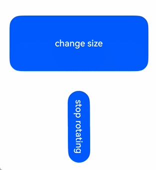
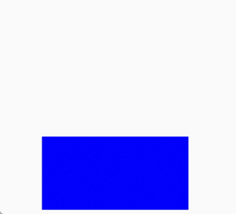

# 显式动画 (animateTo)

提供全局animateTo显式动画接口来指定由于闭包代码导致的状态变化插入过渡动效。同属性动画，对于改变布局类属性（如宽高）的动画，内容通常会直接跳转到最终状态，例如文字或[Canvas](https://developer.huawei.com/consumer/cn/doc/harmonyos-references/ts-components-canvas-canvas)中的内容。如果希望内容跟随宽高变化，可以使用[renderFit](https://developer.huawei.com/consumer/cn/doc/harmonyos-references/ts-universal-attributes-renderfit#renderfit)属性进行配置。

 从API version 7开始支持。后续版本如有新增内容，则采用上角标单独标记该内容的起始版本。

本模块功能依赖UI的执行上下文，不可在[UI上下文不明确](https://developer.huawei.com/consumer/cn/doc/harmonyos-guides/arkts-global-interface#ui上下文不明确)的地方使用，参见[UIContext](https://developer.huawei.com/consumer/cn/doc/harmonyos-references/arkts-apis-uicontext-uicontext)说明。

#### AnimateParam对象说明

动画效果相关参数。

系统能力： SystemCapability.ArkUI.ArkUI.Full

| 名称 | 类型 | 只读 | 可选 | 说明 |
| --- | --- | --- | --- | --- |
| duration | number | 否 | 是 | 动画持续时间，单位为毫秒。 默认值：1000 **说明**：1. API版本26.0.0之前，在ArkTS卡片上最大动画持续时间为1000毫秒，若超出则固定为1000毫秒。从API版本26.0.0开始，在ArkTS卡片上最大动画持续时间调整为2000毫秒。 2. 可以通过在持续时间为0的动画闭包函数中改变属性，以实现停止该属性动画的效果。 3. 设置小于0的值时按0处理。 4. 设置浮点型类型的值时，向下取整。例如，设置值为1.2，按照1处理。 5. curve配置[springMotion](https://developer.huawei.com/consumer/cn/doc/harmonyos-references/js-apis-curve#curvesspringmotion9)、[responsiveSpringMotion](https://developer.huawei.com/consumer/cn/doc/harmonyos-references/js-apis-curve#curvesresponsivespringmotion9)、[interpolatingSpring](https://developer.huawei.com/consumer/cn/doc/harmonyos-references/js-apis-curve#curvesinterpolatingspring10)曲线时，duration不生效。 **卡片能力：** 从API version 9开始，该接口支持在ArkTS卡片中使用。 **元服务API：** 从API version 11开始，该接口支持在元服务中使用。 |
| tempo | number | 否 | 是 | 动画播放速度，值越大动画播放越快，值越小播放越慢，为0时无动画效果。 当设置为+∞时，动画会在当帧结束，动画结束回调会立即执行。 默认值：1.0 取值范围：[0, +∞) **说明**：当设置小于0的值时按1处理。 **元服务API：** 从API version 11开始，该接口支持在元服务中使用。 |
| curve | [Curve](https://developer.huawei.com/consumer/cn/doc/harmonyos-references/ts-appendix-enums#curve) | string | [ICurve9+](#icurve9) | 否 | 是 | 动画曲线。 推荐以Curve或ICurve形式指定。 当类型为string时，为动画插值曲线，仅支持以下可选值： "linear"：动画线性变化。 "ease"：动画开始和结束时的速度较慢，cubic-bezier(0.25、0.1、0.25、1.0)。 "ease-in"：动画播放速度先慢后快，cubic-bezier(0.42, 0.0, 1.0, 1.0)。 "ease-out"：动画播放速度先快后慢，cubic-bezier(0.0, 0.0, 0.58, 1.0)。 "ease-in-out"：动画播放速度先加速后减速，cubic-bezier(0.42, 0.0, 0.58, 1.0)。 "fast-out-slow-in"：标准曲线，cubic-bezier(0.4, 0.0, 0.2, 1.0)。 "linear-out-slow-in"：减速曲线，cubic-bezier(0.0, 0.0, 0.2, 1.0)。 "fast-out-linear-in"：加速曲线，cubic-bezier(0.4, 0.0, 1.0, 1.0)。 "friction"：阻尼曲线，cubic-bezier(0.2, 0.0, 0.2, 1.0)。 "extreme-deceleration"：急缓曲线，cubic-bezier(0.0, 0.0, 0.0, 1.0)。 "rhythm"：节奏曲线，cubic-bezier(0.7, 0.0, 0.2, 1.0)。 "sharp"：锐利曲线，cubic-bezier(0.33, 0.0, 0.67, 1.0)。 "smooth"：平滑曲线，cubic-bezier(0.4, 0.0, 0.4, 1.0)。 "cubic-bezier(x1, y1, x2, y2)"：三次贝塞尔曲线，x1、x2的值必须处于0-1之间。例如"cubic-bezier(0.42, 0.0, 0.58, 1.0)"。 "steps(number,step-position)"：阶梯曲线，number必须设置，为正整数，step-position参数可选，支持设置start或end，默认值为end。例如"steps(3,start)"。 "interpolating-spring(velocity,mass,stiffness,damping)"：具体参数含义参考插值弹簧曲线[curves.interpolatingSpring](https://developer.huawei.com/consumer/cn/doc/harmonyos-references/js-apis-curve#curvesinterpolatingspring10)。 "responsive-spring-motion(response,dampingFraction,overlapDuration)"：具体参数含义参考弹性跟手动画曲线[curves.responsiveSpringMotion](https://developer.huawei.com/consumer/cn/doc/harmonyos-references/js-apis-curve#curvesresponsivespringmotion9)。 "spring(velocity,mass,stiffness,damping)"：具体参数含义参考弹簧曲线[curves.springCurve](https://developer.huawei.com/consumer/cn/doc/harmonyos-references/js-apis-curve#curvesspringcurve9)。 "spring-motion(response,dampingFraction,overlapDuration)"：具体参数含义参考弹性动画曲线[curves.springMotion](https://developer.huawei.com/consumer/cn/doc/harmonyos-references/js-apis-curve#curvesspringmotion9)。 默认值：Curve.EaseInOut **卡片能力：** 从API version 9开始，该接口支持在ArkTS卡片中使用。 **元服务API：** 从API version 11开始，该接口支持在元服务中使用。 |
| delay | number | 否 | 是 | 动画延迟播放时间，单位为ms(毫秒)，默认不延时播放。 默认值：0 取值范围：(-∞, +∞) **说明**：1.delay>=0为延迟播放，delay void | 否 | 是 | 动画播放完成回调。UIAbility从前台切换至后台时会立即结束仍在步进中的有限循环动画，触发播放完成回调。 在设置的开发者选项中关闭过渡动画，以及tempo设置为+∞时，动画播放完成回调会立即执行。 **卡片能力：** 从API version 9开始，该接口支持在ArkTS卡片中使用。 **元服务API：** 从API version 11开始，该接口支持在元服务中使用。 |
| finishCallbackType11+ | [FinishCallbackType](#finishcallbacktype11) | 否 | 是 | 在动画中定义onFinish回调的类型。 默认值：FinishCallbackType.REMOVED **卡片能力：** 从API version 11开始，该接口支持在ArkTS卡片中使用。 **元服务API：** 从API version 12开始，该接口支持在元服务中使用。 **模型约束：** 此接口仅可在Stage模型下使用。 |
| expectedFrameRateRange11+ | [ExpectedFrameRateRange](#expectedframeraterange11) | 否 | 是 | 设置动画的期望帧率。 **元服务API：** 从API version 12开始，该接口支持在元服务中使用。 **模型约束：** 此接口仅可在Stage模型下使用。 |


- PlayMode推荐使用PlayMode.Normal和PlayMode.Alternate，此场景下动画的第一轮是正向播放的。如使用PlayMode.Reverse和PlayMode.AlternateReverse，则动画的第一轮是逆向播放的，在动画刚开始时会跳变到终止状态，然后逆向播放动画。
- 使用PlayMode.Alternate或PlayMode.AlternateReverse时，开发者应保证动画最终状态和状态变量的取值一致，即应保证动画的最后一轮是正向播放的。使用PlayMode.Alternate时，iterations应为奇数。使用PlayMode.AlternateReverse时，iterations应为偶数。
- 不推荐使用PlayMode.Reverse，此场景下不仅会导致动画刚开始就跳变到终止状态，也会导致动画最终状态和状态变量的取值不同。

#### ICurve9+

曲线对象。

#### [h2]interpolate9+

interpolate(fraction: number): number

插值曲线的插值计算函数，可以通过传入的归一化时间参数返回当前的插值

元服务API： 从API version 11开始，该接口支持在元服务中使用。

系统能力： SystemCapability.ArkUI.ArkUI.Full

卡片能力： 从API version 9开始，该接口支持在ArkTS卡片中使用。

参数：

| 参数名 | 类型 | 必填 | 说明 |
| --- | --- | --- | --- |
| fraction | number | 是 | 当前的归一化时间参数。 取值范围：[0,1] **说明：** 设置的值小于0时，按0处理；设置的值大于1时，按1处理。 |

返回值：

| 类型 | 说明 |
| --- | --- |
| number | 返回归一化time时间点对应的曲线插值。 |

#### FinishCallbackType11+

动画中定义onFinish回调的类型。

卡片能力： 从API version 11开始，该接口支持在ArkTS卡片中使用。

元服务API： 从API version 12开始，该接口支持在元服务中使用。

模型约束： 此接口仅可在Stage模型下使用。

系统能力： SystemCapability.ArkUI.ArkUI.Full

| 名称 | 值 | 说明 |
| --- | --- | --- |
| REMOVED | 0 | 当整个动画结束并立即删除时，将触发回调。 |
| LOGICALLY | 1 | 当动画在逻辑上处于下降状态，但可能仍处于其长尾状态时，将触发回调。 |

#### ExpectedFrameRateRange11+

设置动画期望的帧率。

元服务API： 从API version 12开始，该接口支持在元服务中使用。

模型约束： 此接口仅可在Stage模型下使用。

系统能力： SystemCapability.ArkUI.ArkUI.Full

| 名称 | 类型 | 只读 | 可选 | 说明 |
| --- | --- | --- | --- | --- |
| min | number | 否 | 否 | 期望的最小帧率，单位为帧/秒（fps）。 取值范围为[0, 设备最大帧率]。 |
| max | number | 否 | 否 | 期望的最大帧率，单位为帧/秒（fps）。 取值范围为[min, 设备最大帧率]。 |
| expected | number | 否 | 否 | 期望的最优帧率，单位为帧/秒（fps）。 取值范围为[min, max]。设置为0时，将跟随应用的帧率。 |

#### animateTo(deprecated)

animateTo(value: AnimateParam, event: () => void): void

显式动画接口。在需要动画时，显式调用该接口改变状态以产生动画。


- 从API version 7开始支持，从API version 18开始废弃，建议使用[animateTo](https://developer.huawei.com/consumer/cn/doc/harmonyos-references/arkts-apis-uicontext-uicontext#animateto)替代。
- 从API version 10开始，可以通过使用[UIContext](https://developer.huawei.com/consumer/cn/doc/harmonyos-references/arkts-apis-uicontext-uicontext)中的[animateTo](https://developer.huawei.com/consumer/cn/doc/harmonyos-references/arkts-apis-uicontext-uicontext#animateto)来明确UI的执行上下文。
- 不推荐在aboutToAppear、aboutToDisappear中调用动画。
- 如果在[aboutToAppear](https://developer.huawei.com/consumer/cn/doc/harmonyos-references/ts-custom-component-lifecycle#abouttoappear)中调用动画，自定义组件内的build还未执行，内部组件还未创建，动画时机过早，动画属性没有初值无法对组件产生动画。
- 执行[aboutToDisappear](https://developer.huawei.com/consumer/cn/doc/harmonyos-references/ts-custom-component-lifecycle#abouttodisappear)时，组件即将销毁，不能在aboutToDisappear里面做动画。
- 在组件出现和消失时，可以通过[组件内转场](https://developer.huawei.com/consumer/cn/doc/harmonyos-references/ts-transition-animation-component)添加动画效果。
- 组件内转场不支持的属性，可以参考[示例2](#示例2动画执行结束后组件消失)，使用animateTo实现动画执行结束后组件消失的效果。
- 某些场景下，在[状态管理V2](https://developer.huawei.com/consumer/cn/doc/harmonyos-guides/arkts-state-management-overview#状态管理v2)中使用animateTo动画，会产生异常效果，具体可参考：[在状态管理V2中使用animateTo动画效果异常](https://developer.huawei.com/consumer/cn/doc/harmonyos-guides/arkts-new-local#在状态管理v2中使用animateto动画效果异常)。

卡片能力： 从API version 9开始，该接口支持在ArkTS卡片中使用。

元服务API： 从API version 11开始，该接口支持在元服务中使用。

系统能力： SystemCapability.ArkUI.ArkUI.Full

参数：

| 参数名 | 类型 | 必填 | 说明 |
| --- | --- | --- | --- |
| value | [AnimateParam](#animateparam对象说明) | 是 | 设置动画效果相关参数。 |
| event | () => void | 是 | 指定动效的闭包函数，在闭包函数中导致的状态变化系统会自动插入过渡动画。 |

#### 示例

#### [h2]示例1（在组件出现时创建动画）

 直接使用animateTo可能导致[UI上下文不明确](https://developer.huawei.com/consumer/cn/doc/harmonyos-guides/arkts-global-interface#ui上下文不明确)的问题，建议使用getUIContext()获取[UIContext](https://developer.huawei.com/consumer/cn/doc/harmonyos-references/arkts-apis-uicontext-uicontext)实例，并使用[animateTo](https://developer.huawei.com/consumer/cn/doc/harmonyos-references/arkts-apis-uicontext-uicontext#animateto)调用绑定实例的animateTo。

该示例通过在onAppear方法中创建组件出现时的动画效果。

```
// xxx.ets
@Entry
@Component
struct AnimateToExample {
  @State widthSize: number = 250;
  @State heightSize: number = 100;
  @State rotateAngle: number = 0;
  private flag: boolean = true;

  build() {
    Column() {
      Button('change size')
        .width(this.widthSize)
        .height(this.heightSize)
        .margin(30)
        .onClick(() => {
          if (this.flag) {
            // 建议使用this.getUIContext()?.animateTo()
            animateTo({
              duration: 2000,
              curve: Curve.EaseOut,
              iterations: 3,
              playMode: PlayMode.Normal,
              onFinish: () => {
                console.info('play end');
              }
            }, () => {
              this.widthSize = 150;
              this.heightSize = 60;
            })
          } else {
            // 建议使用this.getUIContext()?.animateTo()
            animateTo({}, () => {
              this.widthSize = 250;
              this.heightSize = 100;
            })
          }
          this.flag = !this.flag;
        })
      Button('stop rotating')
        .margin(50)
        .rotate({ x: 0, y: 0, z: 1, angle: this.rotateAngle })
        .onAppear(() => {
          // 组件出现时开始做动画
          // 建议使用this.getUIContext()?.animateTo()
          animateTo({
            duration: 1200,
            curve: Curve.Friction,
            delay: 500,
            iterations: -1, // 设置-1表示动画无限循环
            playMode: PlayMode.Alternate,
            expectedFrameRateRange: {
              min: 10,
              max: 120,
              expected: 60,
            }
          }, () => {
            this.rotateAngle = 90;
          })
        })
        .onClick(() => {
          // 建议使用this.getUIContext()?.animateTo()
          animateTo({ duration: 0 }, () => {
            // this.rotateAngle之前为90，在duration为0的动画中修改属性，可以停止该属性之前的动画，按新设置的属性显示
            this.rotateAngle = 0;
          })
        })
    }.width('100%').margin({ top: 5 })
  }
}
```
 

#### [h2]示例2（动画执行结束后组件消失）

该示例主要演示如何实现在动画执行结束后组件消失。

```
// xxx.ets
@Entry
@Component
struct AttrAnimationExample {
  @State heightSize: number = 100;
  @State isShow: boolean= true;
  @State count: number= 0;
  private isToBottom: boolean = true; // 向下

  build() {
    Column() {
      if (this.isShow) {
        Column()
          .width(200)
          .height(this.heightSize)
          .backgroundColor('blue')
          .onClick(() => {
            // 建议使用this.getUIContext()?.animateTo()
            animateTo({
              duration: 2000,
              curve: Curve.EaseOut,
              iterations: 1,
              playMode: PlayMode.Normal,
              onFinish: () => {
                this.count--;
                if (this.count == 0 && !this.isToBottom) { // 组件只有在向下做完动画才会消失
                  this.isShow = false;
                }
              }
            }, () => {
              this.count++;
              if (this.isToBottom) {
                this.heightSize = 60;
              } else {
                this.heightSize = 100;
              }
              this.isToBottom = !this.isToBottom;
            })
          })
      }
    }.width('100%').height('100%').margin({ top: 5 })
    .justifyContent(FlexAlign.End)
  }
}
```
 
