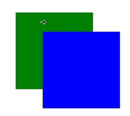

# 鼠标光标控制

鼠标光标控制用于设置鼠标光标的显示样式，支持设置多种预设光标样式及恢复默认箭头样式，适用于需要根据组件状态或交互区域切换光标样式的场景，解决默认光标样式无法匹配交互意图的问题，帮助提升用户的交互识别和操作反馈体验。


- 从API version 11开始支持。后续版本的新增接口，采用上角标单独标记接口的起始版本。
- 本模块接口仅可在Stage模型下使用。
- 直接使用cursorControl可能导致[UI上下文不明确](https://developer.huawei.com/consumer/cn/doc/harmonyos-guides/arkts-global-interface#ui上下文不明确)的问题，建议使用getUIContext()获取[UIContext](https://developer.huawei.com/consumer/cn/doc/harmonyos-references/arkts-apis-uicontext-uicontext)实例，并使用[getCursorController](https://developer.huawei.com/consumer/cn/doc/harmonyos-references/arkts-apis-uicontext-uicontext#getcursorcontroller12)获取绑定实例的cursorControl。

#### cursorControl

#### [h2]setCursor

setCursor(value: PointerStyle): void

在组件方法或事件回调中可使用的全局接口，调用该接口可设置当前的鼠标光标样式，例如在文本编辑区域悬浮时显示I型光标、在可拖拽元素上显示移动光标或在地图标记点悬浮时显示手指光标。

元服务API： 从API version 12开始，该接口支持在元服务中使用。

系统能力： SystemCapability.ArkUI.ArkUI.Full

参数：

| 参数名 | 类型 | 必填 | 说明 |
| --- | --- | --- | --- |
| value | [PointerStyle](#pointerstyle) | 是 | 设置的鼠标光标样式。 |

#### [h2]restoreDefault

restoreDefault(): void

在组件方法或事件回调中可使用的全局接口，调用该接口可将鼠标光标恢复成默认箭头样式，例如在鼠标离开悬浮区域、组件失焦或交互结束时恢复默认光标。

元服务API： 从API version 12开始，该接口支持在元服务中使用。

系统能力： SystemCapability.ArkUI.ArkUI.Full

#### PointerStyle

type PointerStyle = import('../api/@ohos.multimodalInput.pointer').default.PointerStyle

鼠标光标样式。

元服务API： 从API version 12开始，该接口支持在元服务中使用。

系统能力： SystemCapability.ArkUI.ArkUI.Full

| 类型 | 说明 |
| --- | --- |
| import('../api/@ohos.multimodalInput.pointer').default.[PointerStyle](https://developer.huawei.com/consumer/cn/doc/harmonyos-references/js-apis-pointer#pointerstyle) | 鼠标光标样式。 |

#### 示例

该示例通过setCursor实现了鼠标光标样式的设置。

```
// xxx.ets
import { pointer } from '@kit.InputKit';

@Entry
@Component
struct CursorControlExample {
  build() {
    Column() {
      Row()
        .height(200)
        .width(200)
        .backgroundColor(Color.Green)
        .position({ x: 60, y: 70 })
        .onHover((flag) => {
          if (flag) {
            // 建议使用this.getUIContext().getCursorController().setCursor()
            cursorControl.setCursor(pointer.PointerStyle.EAST);
          } else {
            // 建议使用this.getUIContext().getCursorController().restoreDefault()
            cursorControl.restoreDefault();
          }
        })
      Row()
        .height(200)
        .width(200)
        .backgroundColor(Color.Blue)
        .position({ x: 130, y: 120 })
        .onHover((flag) => {
          if (flag) {
            // 建议使用this.getUIContext().getCursorController().setCursor()
            cursorControl.setCursor(pointer.PointerStyle.WEST);
          } else {
            // 建议使用this.getUIContext().getCursorController().restoreDefault()
            cursorControl.restoreDefault();
          }
        })
    }.width('100%')
  }
}
```
 示意图：

当鼠标悬浮在蓝色区域时，显示：向西箭头光标样式。


当鼠标悬浮在绿色区域时，显示：向东箭头光标样式。


