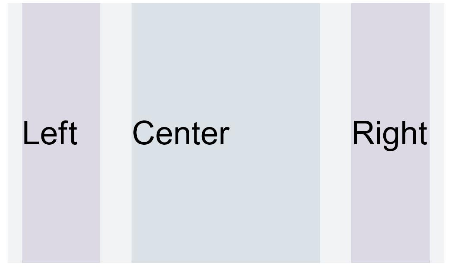
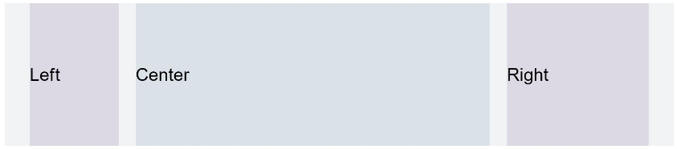

# 栅格设置

栅格设置可以为布局提供规律性的结构，解决多尺寸多设备的动态布局问题，保证不同设备上各个模块的布局一致性，适用于响应式布局开发、多设备UI适配、跨设备布局统一等场景。


- 从API version 7开始支持。后续版本的新增接口，采用上角标单独标记接口的起始版本。
- 从API version 9开始，该模块不再维护，推荐使用新组件[GridCol](https://developer.huawei.com/consumer/cn/doc/harmonyos-references/ts-container-gridcol)、[GridRow](https://developer.huawei.com/consumer/cn/doc/harmonyos-references/ts-container-gridrow)替代。其中useSizeType从API version 9开始废弃，gridSpan和gridOffset从API version 14开始废弃。
- 栅格布局的列宽、列间距由距离最近的[GridContainer](https://developer.huawei.com/consumer/cn/doc/harmonyos-references/ts-container-gridcontainer)父组件决定。GridContainer用于定义栅格系统的总列数、列间距、尺寸断点等参数。使用栅格属性的组件树上至少需要有1个GridContainer容器组件。
- useSizeType、gridSpan、gridOffset属性调用时其父组件或祖先组件必须是GridContainer。

#### 属性

系统能力： SystemCapability.ArkUI.ArkUI.Full

| 名称 | 参数类型 | 描述 |
| --- | --- | --- |
| useSizeType(deprecated) | { xs?: number | { span: number, offset: number }, sm?: number | { span: number, offset: number }, md?: number | { span: number, offset: number }, lg?: number | { span: number, offset: number } } | 设置在特定设备宽度类型下的占用列数和偏移列数，span：占用列数（需为非负整数）；offset：偏移列数。 当值为number类型时，仅设置列数，当格式如{"span": 1, "offset": 0}时，指同时设置占用列数与偏移列数。 - xs：指设备宽度类型为SizeType.XS（ 本示例展示的是已废弃接口的用法。建议使用新组件[GridCol](https://developer.huawei.com/consumer/cn/doc/harmonyos-references/ts-container-gridcol)、[GridRow](https://developer.huawei.com/consumer/cn/doc/harmonyos-references/ts-container-gridrow)来实现栅格布局。

```
// xxx.ets
@Entry
@Component
struct GridContainerExample1 {
  build() {
    Column() {
      Text('useSizeType').fontSize(15).fontColor(0xCCCCCC).width('90%')
      GridContainer() {
        Row() {
          Row() {
            Text('Left').fontSize(25)
          }
          .useSizeType({
            xs: { span: 1, offset: 0 }, sm: { span: 1, offset: 0 },
            md: { span: 1, offset: 0 }, lg: { span: 2, offset: 0 }
          })
          .height("100%")
          .backgroundColor(0x66bbb2cb)

          Row() {
            Text('Center').fontSize(25)
          }
          .useSizeType({
            xs: { span: 1, offset: 0 }, sm: { span: 2, offset: 1 },
            md: { span: 5, offset: 1 }, lg: { span: 7, offset: 2 }
          })
          .height("100%")
          .backgroundColor(0x66b6c5d1)

          Row() {
            Text('Right').fontSize(25)
          }
          .useSizeType({
            xs: { span: 1, offset: 0 }, sm: { span: 1, offset: 3 },
            md: { span: 2, offset: 6 }, lg: { span: 3, offset: 9 }
          })
          .height("100%")
          .backgroundColor(0x66bbb2cb)
        }
        .height(200)

      }
      .backgroundColor(0xf1f3f5)
      .margin({ top: 10 })

      // 单独设置组件的span和offset,在sm尺寸大小的设备上使用useSizeType中sm的数据实现一样的效果
      Text('gridSpan,gridOffset').fontSize(15).fontColor(0xCCCCCC).width('90%')
      GridContainer() {
        Row() {
          Row() {
            Text('Left').fontSize(25)
          }
          .gridSpan(1)
          .height("100%")
          .backgroundColor(0x66bbb2cb)

          Row() {
            Text('Center').fontSize(25)
          }
          .gridSpan(2)
          .gridOffset(1)
          .height("100%")
          .backgroundColor(0x66b6c5d1)

          Row() {
            Text('Right').fontSize(25)
          }
          .gridSpan(1)
          .gridOffset(3)
          .height("100%")
          .backgroundColor(0x66bbb2cb)
        }.height(200)
      }
    }
  }
}
```
 图1 设备宽度为SM



图2 设备宽度为MD


图3 设备宽度为LG



图4 单独设置gridSpan和gridOffset在特定屏幕大小下的效果与useSizeType效果一致


