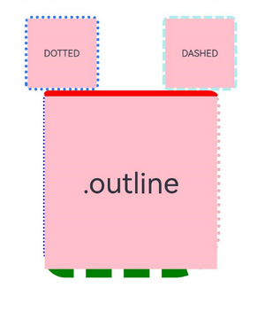

# 外描边设置

设置组件外描边（outline）样式。外描边绘制在组件的外侧，不影响布局，不会占用组件本身大小。


- 从API version 11开始支持。后续版本如有新增内容，则采用上角标单独标记该内容的起始版本。
- 本模块接口仅可在Stage模型下使用。

#### outline

outline(value: OutlineOptions): T

统一设置组件的外描边样式，可一次性设置外描边的宽度、颜色、圆角和样式。开发者也可通过outlineStyle、outlineWidth、outlineColor、outlineRadius方法分别设置各项外描边属性。两者同时设置时，后设置的属性生效。

卡片能力： 从API version 11开始，该接口支持在ArkTS卡片中使用。

元服务API： 从API version 12开始，该接口支持在元服务中使用。

系统能力： SystemCapability.ArkUI.ArkUI.Full

参数：

| 参数名 | 类型 | 必填 | 说明 |
| --- | --- | --- | --- |
| value | [OutlineOptions](https://developer.huawei.com/consumer/cn/doc/harmonyos-references/ts-types#outlineoptions11对象说明) | 是 | 外描边样式，其中width和radius不支持百分比；radius最大生效值为组件width/2 + outlineWidth或组件height/2 + outlineWidth。 |

返回值：

| 类型 | 说明 |
| --- | --- |
| T | 返回当前组件，用于链式调用。 |

#### outline18+

outline(options: Optional<OutlineOptions>): T

统一设置组件的外描边样式，外描边绘制在组件的外侧，不影响布局，不会占用组件本身大小。需设置outlineWidth大于0，外描边才可见。与[outline](#outline)相比，options参数新增了对undefined类型的支持。

卡片能力： 从API version 18开始，该接口支持在ArkTS卡片中使用。

元服务API： 从API version 18开始，该接口支持在元服务中使用。

系统能力： SystemCapability.ArkUI.ArkUI.Full

参数：

| 参数名 | 类型 | 必填 | 说明 |
| --- | --- | --- | --- |
| options | [Optional](https://developer.huawei.com/consumer/cn/doc/harmonyos-references/ts-universal-attributes-custom-property#optionalt) | 是 | 外描边样式。其中width和radius不支持百分比；radius最大生效值：组件width/2 + outlineWidth或组件height/2 + outlineWidth。 当options的值为undefined时，恢复为无外描边效果。 |

返回值：

| 类型 | 说明 |
| --- | --- |
| T | 返回当前组件，用于链式调用。 |

#### OutlineStyle枚举说明

外描边样式。

卡片能力： 从API version 11开始，该接口支持在ArkTS卡片中使用。

元服务API： 从API version 12开始，该接口支持在元服务中使用。

系统能力： SystemCapability.ArkUI.ArkUI.Full

| 名称 | 值 | 说明 |
| --- | --- | --- |
| SOLID | 0 | 显示为一条实线。 |
| DASHED | 1 | 显示为一系列短的方形虚线。 |
| DOTTED | 2 | 显示为一系列圆点，圆点半径为outlineWidth的一半。 |

#### outlineStyle

outlineStyle(value: OutlineStyle | EdgeOutlineStyles): T

设置元素的外描边样式，未设置时默认显示为一条实线。需设置outlineWidth大于0，外描边样式才可见。

卡片能力： 从API version 11开始，该接口支持在ArkTS卡片中使用。

元服务API： 从API version 12开始，该接口支持在元服务中使用。

系统能力： SystemCapability.ArkUI.ArkUI.Full

参数：

| 参数名 | 类型 | 必填 | 说明 |
| --- | --- | --- | --- |
| value | [OutlineStyle](#outlinestyle枚举说明) | [EdgeOutlineStyles](https://developer.huawei.com/consumer/cn/doc/harmonyos-references/ts-types#edgeoutlinestyles11对象说明) | 是 | 设置元素的外描边样式，未设置时默认显示为一条实线。 |

返回值：

| 类型 | 说明 |
| --- | --- |
| T | 返回当前组件，用于链式调用。 |

#### outlineStyle18+

outlineStyle(style: Optional<OutlineStyle | EdgeOutlineStyles>): T

设置元素的外描边样式。需设置outlineWidth大于0，外描边样式才可见。未设置时，默认显示为一条实线。与[outlineStyle](#outlinestyle)相比，style参数新增了对undefined类型的支持。

卡片能力： 从API version 18开始，该接口支持在ArkTS卡片中使用。

元服务API： 从API version 18开始，该接口支持在元服务中使用。

系统能力： SystemCapability.ArkUI.ArkUI.Full

参数：

| 参数名 | 类型 | 必填 | 说明 |
| --- | --- | --- | --- |
| style | [Optional](https://developer.huawei.com/consumer/cn/doc/harmonyos-references/ts-universal-attributes-custom-property#optionalt) | 是 | 设置元素的外描边样式，需设置outlineWidth大于0，外描边样式才可见。 当style的值为undefined时，恢复为外描边样式为实线的效果。 |

返回值：

| 类型 | 说明 |
| --- | --- |
| T | 返回当前组件，用于链式调用。 |

#### outlineWidth

outlineWidth(value: Dimension | EdgeOutlineWidths): T

设置元素的外描边宽度。未设置时，默认值为0，即无外描边宽度。

卡片能力： 从API version 11开始，该接口支持在ArkTS卡片中使用。

元服务API： 从API version 12开始，该接口支持在元服务中使用。

系统能力： SystemCapability.ArkUI.ArkUI.Full

参数：

| 参数名 | 类型 | 必填 | 说明 |
| --- | --- | --- | --- |
| value | [Dimension](https://developer.huawei.com/consumer/cn/doc/harmonyos-references/ts-types#dimension10) | [EdgeOutlineWidths](https://developer.huawei.com/consumer/cn/doc/harmonyos-references/ts-types#edgeoutlinewidths11对象说明) | 是 | 设置元素的外描边宽度，不支持百分比，未设置时默认值为0。 |

返回值：

| 类型 | 说明 |
| --- | --- |
| T | 返回当前组件，用于链式调用。 |

#### outlineWidth18+

outlineWidth(width: Optional<Dimension | EdgeOutlineWidths>): T

设置元素的外描边宽度。未设置时，默认值为0，即无外描边宽度。与[outlineWidth](#outlinewidth)相比，width参数新增了对undefined类型的支持。

卡片能力： 从API version 18开始，该接口支持在ArkTS卡片中使用。

元服务API： 从API version 18开始，该接口支持在元服务中使用。

系统能力： SystemCapability.ArkUI.ArkUI.Full

参数：

| 参数名 | 类型 | 必填 | 说明 |
| --- | --- | --- | --- |
| width | [Optional](https://developer.huawei.com/consumer/cn/doc/harmonyos-references/ts-universal-attributes-custom-property#optionalt) | 是 | 设置元素的外描边宽度，不支持百分比，传入百分比时不生效。 当width的值为undefined时，恢复为外描边宽度为0的效果。 |

返回值：

| 类型 | 说明 |
| --- | --- |
| T | 返回当前组件，用于链式调用。 |

#### outlineColor

outlineColor(value: ResourceColor | EdgeColors | LocalizedEdgeColors): T

设置元素的外描边颜色，需设置outlineWidth大于0，外描边颜色才可见。未设置时，默认显示为黑色。

卡片能力： 从API version 11开始，该接口支持在ArkTS卡片中使用。

元服务API： 从API version 12开始，该接口支持在元服务中使用。

系统能力： SystemCapability.ArkUI.ArkUI.Full

参数：

| 参数名 | 类型 | 必填 | 说明 |
| --- | --- | --- | --- |
| value | [ResourceColor](https://developer.huawei.com/consumer/cn/doc/harmonyos-references/ts-types#resourcecolor) | [EdgeColors](https://developer.huawei.com/consumer/cn/doc/harmonyos-references/ts-types#edgecolors9) | [LocalizedEdgeColors](https://developer.huawei.com/consumer/cn/doc/harmonyos-references/ts-types#localizededgecolors12)12+ | 是 | 设置元素的外描边颜色，未设置时默认显示为黑色。 |

返回值：

| 类型 | 说明 |
| --- | --- |
| T | 返回当前组件，用于链式调用。 |

#### outlineColor18+

outlineColor(color: Optional<ResourceColor | EdgeColors | LocalizedEdgeColors>): T

设置元素的外描边颜色，需设置outlineWidth大于0，外描边颜色才可见。未设置时，默认显示为黑色。与[outlineColor](#outlinecolor)相比，color参数新增了对undefined类型的支持。

卡片能力： 从API version 18开始，该接口支持在ArkTS卡片中使用。

元服务API： 从API version 18开始，该接口支持在元服务中使用。

系统能力： SystemCapability.ArkUI.ArkUI.Full

参数：

| 参数名 | 类型 | 必填 | 说明 |
| --- | --- | --- | --- |
| color | [Optional](https://developer.huawei.com/consumer/cn/doc/harmonyos-references/ts-universal-attributes-custom-property#optionalt) | 是 | 设置元素的外描边颜色。 当color的值为undefined时，恢复为外描边颜色为Color.Black的效果。 |

返回值：

| 类型 | 说明 |
| --- | --- |
| T | 返回当前组件，用于链式调用。 |

#### outlineRadius

outlineRadius(value: Dimension | OutlineRadiuses): T

设置元素的外描边圆角半径。需设置outlineWidth大于0，外描边圆角半径才可见。未设置时，默认外描边圆角半径为0。

卡片能力： 从API version 11开始，该接口支持在ArkTS卡片中使用。

元服务API： 从API version 12开始，该接口支持在元服务中使用。

系统能力： SystemCapability.ArkUI.ArkUI.Full

参数：

| 参数名 | 类型 | 必填 | 说明 |
| --- | --- | --- | --- |
| value | [Dimension](https://developer.huawei.com/consumer/cn/doc/harmonyos-references/ts-types#dimension10) | [OutlineRadiuses](https://developer.huawei.com/consumer/cn/doc/harmonyos-references/ts-types#outlineradiuses11对象说明) | 是 | 设置元素的外描边圆角半径，不支持百分比，未设置时默认值为0。 最大生效值：组件width/2 + outlineWidth或组件height/2 + outlineWidth。 |

返回值：

| 类型 | 说明 |
| --- | --- |
| T | 返回当前组件，用于链式调用。 |

#### outlineRadius18+

outlineRadius(radius: Optional<Dimension | OutlineRadiuses>): T

设置元素的外描边圆角半径。需设置outlineWidth大于0，外描边圆角半径才可见。未设置时，默认外描边圆角半径为0。与[outlineRadius](#outlineradius)相比，radius参数新增了对undefined类型的支持。

卡片能力： 从API version 18开始，该接口支持在ArkTS卡片中使用。

元服务API： 从API version 18开始，该接口支持在元服务中使用。

系统能力： SystemCapability.ArkUI.ArkUI.Full

参数：

| 参数名 | 类型 | 必填 | 说明 |
| --- | --- | --- | --- |
| radius | [Optional](https://developer.huawei.com/consumer/cn/doc/harmonyos-references/ts-universal-attributes-custom-property#optionalt) | 是 | 设置元素的外描边圆角半径，不支持百分比。 最大生效值：组件width/2 + outlineWidth或组件height/2 + outlineWidth。 当radius的值为undefined时，恢复为外描边圆角半径为0的效果。 |

返回值：

| 类型 | 说明 |
| --- | --- |
| T | 返回当前组件，用于链式调用。 |

#### 示例

#### [h2]示例1（使用外描边属性）

该示例主要演示如何通过[outline](#outline)来实现组件外描边。

```
// xxx.ets
@Entry
@Component
struct OutlineExample {
  build() {
    Column() {
      Flex({ justifyContent: FlexAlign.SpaceAround, alignItems: ItemAlign.Center }) {
        // 虚线
        Text('DASHED')
          .backgroundColor(Color.Pink)
          .outlineStyle(OutlineStyle.DASHED).outlineWidth(5).outlineColor(0xAFEEEE).outlineRadius(10)
          .width(120).height(120).textAlign(TextAlign.Center).fontSize(16)
        // 点线
        Text('DOTTED')
          .backgroundColor(Color.Pink)
          .outline({ width: 5, color: 0x317AF7, radius: 10, style: OutlineStyle.DOTTED })
          .width(120).height(120).textAlign(TextAlign.Center).fontSize(16)
      }.width('100%').height(150)

      Text('.outline')
        .backgroundColor(Color.Pink)
        .fontSize(50)
        .width(300)
        .height(300)
        .outline({
          width: { left: 3, right: 6, top: 10, bottom: 15 },
          color: { left: '#e3bbbb', right: Color.Blue, top: Color.Red, bottom: Color.Green },
          radius: { topLeft: 10, topRight: 20, bottomLeft: 40, bottomRight: 80 },
          style: {
            left: OutlineStyle.DOTTED,
            right: OutlineStyle.DOTTED,
            top: OutlineStyle.SOLID,
            bottom: OutlineStyle.DASHED
          }
        }).textAlign(TextAlign.Center)
    }
  }
}
```
 

#### [h2]示例2（使用LocalizedEdgeColors类型）

该示例将[outline](#outline)属性中的color属性值设置为[LocalizedEdgeColors](https://developer.huawei.com/consumer/cn/doc/harmonyos-references/ts-types#localizededgecolors12)类型。

```
// xxx.ets

@Entry
@Component
struct OutlineExample {
  build() {
    Column() {
      Flex({ justifyContent: FlexAlign.SpaceAround, alignItems: ItemAlign.Center }) {
        // 虚线
        Text('DASHED')
          .backgroundColor(Color.Pink)
          .outlineStyle(OutlineStyle.DASHED).outlineWidth(5).outlineColor(0xAFEEEE).outlineRadius(10)
          .width(120).height(120).textAlign(TextAlign.Center).fontSize(16)
        // 点线
        Text('DOTTED')
          .backgroundColor(Color.Pink)
          .outline({ width: 5, color: 0x317AF7, radius: 10, style: OutlineStyle.DOTTED })
          .width(120).height(120).textAlign(TextAlign.Center).fontSize(16)
      }.width('100%').height(150)

      Text('.outline')
        .backgroundColor(Color.Pink)
        .fontSize(50)
        .width(300)
        .height(300)
        .outline({
          width: { left: 3, right: 6, top: 10, bottom: 15 },
          // color使用LocalizedEdgeColors类型，start和end分别对应不同显示方向下的起始边和结束边颜色
          color: { start: '#e3bbbb', end: Color.Blue, top: Color.Red, bottom: Color.Green },
          radius: { topLeft: 10, topRight: 20, bottomLeft: 40, bottomRight: 80 },
          style: {
            left: OutlineStyle.DOTTED,
            right: OutlineStyle.DOTTED,
            top: OutlineStyle.SOLID,
            bottom: OutlineStyle.DASHED
          }
        }).textAlign(TextAlign.Center)
    }
  }
}
```
 从左至右显示语言示例图。


从右至左显示语言示例图。


