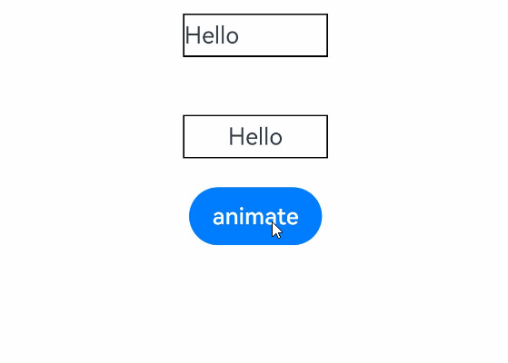

# 组件内容填充方式

用于决定在组件的宽高动画过程中，动画终态的组件内容在组件上的填充方式。适用于卡片展开、弹窗缩放等需要控制动画内容填充方式的场景。


- 从API version 10开始支持。后续版本如有新增内容，则采用上角标单独标记该内容的起始版本。
- 本模块接口仅可在Stage模型下使用。

#### renderFit

renderFit(fitMode: RenderFit): T

设置宽高动画过程中的组件内容填充方式。在宽高动画过程中，renderFit决定动画终态内容与动画中间尺寸组件的对齐和缩放方式。未设置时，保持动画终态的内容大小，并且内容始终与组件保持左上角对齐。

元服务API： 从API version 11开始，该接口支持在元服务中使用。

系统能力： SystemCapability.ArkUI.ArkUI.Full

卡片能力： 从API version 18开始，该接口支持在ArkTS卡片中使用。

参数：

| 参数名 | 类型 | 必填 | 说明 |
| --- | --- | --- | --- |
| fitMode | [RenderFit](https://developer.huawei.com/consumer/cn/doc/harmonyos-references/ts-appendix-enums#renderfit10) | 是 | 设置宽高动画过程中的组件内容填充方式。详见[RenderFit](https://developer.huawei.com/consumer/cn/doc/harmonyos-references/ts-appendix-enums#renderfit10)。对于背景色设置为不透明的纯黑色的SURFACE类型XComponent组件，在API version 18之前仅支持设置为RenderFit.RESIZE_FILL。不设置时默认保持动画终态内容大小且与组件左上角对齐（RenderFit.TOP_LEFT）。 |

返回值：

| 类型 | 说明 |
| --- | --- |
| T | 返回当前组件，用于链式调用。 |

#### renderFit18+

renderFit(fitMode: Optional<RenderFit>): T

设置宽高动画过程中的组件内容填充方式。未设置时，默认取值为RenderFit.TOP_LEFT，保持动画终态的内容大小，并且内容始终与组件保持左上角对齐。对于TEXTURE和SURFACE类型的XComponent组件，当不设置renderFit属性时，取默认值为RenderFit.RESIZE_FILL。与[renderFit](#renderfit)相比，fitMode参数新增了对undefined类型的支持。当fitMode的值为undefined时，恢复为RenderFit.TOP_LEFT的效果。对于TEXTURE和SURFACE类型的XComponent组件，恢复为RenderFit.RESIZE_FILL的效果。

元服务API： 从API version 18开始，该接口支持在元服务中使用。

系统能力： SystemCapability.ArkUI.ArkUI.Full

卡片能力： 从API version 18开始，该接口支持在ArkTS卡片中使用。

参数：

| 参数名 | 类型 | 必填 | 说明 |
| --- | --- | --- | --- |
| fitMode | [Optional](https://developer.huawei.com/consumer/cn/doc/harmonyos-references/ts-universal-attributes-custom-property#optionalt) | 是 | 设置宽高动画过程中的组件内容填充方式。 当fitMode的值为undefined时，恢复为RenderFit.TOP_LEFT的效果，即内容填充方式与组件保持左上角对齐。对于TEXTURE和SURFACE类型的XComponent组件，恢复为RenderFit.RESIZE_FILL的效果。 |

返回值：

| 类型 | 说明 |
| --- | --- |
| T | 返回当前组件，用于链式调用。 |

 对于TEXTURE和SURFACE类型的[XComponent](https://developer.huawei.com/consumer/cn/doc/harmonyos-references/ts-basic-components-xcomponent)组件，当不设置renderFit属性时，取默认值为RenderFit.RESIZE_FILL。

对于SURFACE类型的[XComponent](https://developer.huawei.com/consumer/cn/doc/harmonyos-references/ts-basic-components-xcomponent)组件，背景色设置为不透明的纯黑色，在API version 18之前，其renderFit通用属性仅支持设置为RenderFit.RESIZE_FILL，设置其他RenderFit枚举值时不生效，仍按RenderFit.RESIZE_FILL方式渲染；在API version 18及之后，支持所有的RenderFit枚举值。

对于使用[ArkUI NDK接口](https://developer.huawei.com/consumer/cn/doc/harmonyos-guides/ndk-access-the-arkts-page)创建的XComponent组件，不支持使用属性获取函数[getAttribute](https://developer.huawei.com/consumer/cn/doc/harmonyos-references/capi-arkui-nativemodule-arkui-nativenodeapi-1#getattribute)获取其renderFit属性值。

以上说明同样适用于[renderFit](#renderfit)接口。

#### 示例

该示例主要演示通过renderFit设置宽高动画过程中的组件内容不同填充方式。

```
// xxx.ets
@Entry
@Component
struct RenderFitExample {
  @State currentWidth: number = 100;
  @State currentHeight: number = 30;
  isExpanded: boolean = true;

  build() {
    Column() {
      Text('Hello')
        .width(this.currentWidth)
        .height(this.currentHeight)
        .borderWidth(1)
        .textAlign(TextAlign.Start)
        .renderFit(RenderFit.LEFT) // 设置LEFT的renderFit，动画过程中，动画的终态内容与组件保持左对齐
        .margin(20)

      Text('Hello')
        .width(this.currentWidth)
        .height(this.currentHeight)
        .textAlign(TextAlign.Center)
        .borderWidth(1)
        .renderFit(RenderFit.CENTER) // 设置CENTER的renderFit，动画过程中，动画的终态内容与组件保持中心对齐
        .margin(20)

      Button('animate')
        .onClick(() => {
          this.getUIContext()?.animateTo({ curve: Curve.Ease }, () => {
            if (this.isExpanded) {
              this.currentWidth = 150;
              this.currentHeight = 50;
            } else {
              this.currentWidth = 100;
              this.currentHeight = 30;
            }
            this.isExpanded = !this.isExpanded;
          })
        })
    }.width('100%').height('100%').alignItems(HorizontalAlign.Center)
  }
}
```
 
