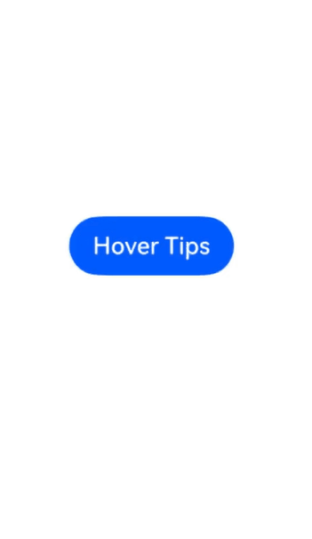
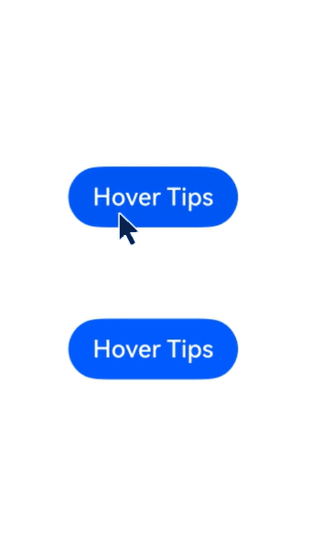

# Tips控制

为组件绑定Tips悬浮气泡，当鼠标悬浮在组件上时，自动显示提示信息；鼠标离开组件时，悬浮气泡自动隐藏。


- 从API version 19开始支持。后续版本如有新增内容，则采用上角标单独标记该内容的起始版本。
- 本模块接口仅可在Stage模型下使用。
- 目前支持通过外接鼠标、手写笔以及触控板触发。

#### bindTips

bindTips(message: TipsMessageType, options?: TipsOptions): T

为组件绑定Tips悬浮气泡。

 当绑定bindTips的组件设置通用属性[enable](https://developer.huawei.com/consumer/cn/doc/harmonyos-references/ts-universal-attributes-enable#enabled)为false时，仍支持弹出悬浮气泡。

元服务API： 从API version 19开始，该接口支持在元服务中使用。

系统能力： SystemCapability.ArkUI.ArkUI.Full

参数：

| 参数名 | 类型 | 必填 | 说明 |
| --- | --- | --- | --- |
| message | [TipsMessageType](#tipsmessagetype) | 是 | 弹窗信息内容。 |
| options | [TipsOptions](#tipsoptions类型说明) | 否 | 配置悬浮气泡的参数。 默认值： { appearingTime: 700, disappearingTime: 300, appearingTimeWithContinuousOperation: 300, disappearingTimeWithContinuousOperation: 0, enableArrow: true, arrowPointPosition: ArrowPointPosition.CENTER, arrowWidth: 16,arrowHeight: 8, showAtAnchor: TipsAnchorType.TARGET } |

返回值：

| 类型 | 说明 |
| --- | --- |
| T | 返回当前组件。 |

#### TipsOptions类型说明

悬浮气泡自定义参数。

系统能力： SystemCapability.ArkUI.ArkUI.Full

| 名称 | 类型 | 只读 | 可选 | 说明 |
| --- | --- | --- | --- | --- |
| appearingTime | number | 否 | 是 | 设置悬浮气泡的显示时延。显示时延的最大值为4000ms，设置超过4000ms的值以4000ms为准。 默认值：700 单位：ms **元服务API：** 从API version 19开始，该接口支持在元服务中使用。 |
| disappearingTime | number | 否 | 是 | 设置悬浮气泡的隐藏时延。隐藏时延的最大值为4000ms，设置超过4000ms的值以4000ms为准。 默认值：300 单位：ms **元服务API：** 从API version 19开始，该接口支持在元服务中使用。 |
| appearingTimeWithContinuousOperation | number | 否 | 是 | 多个组件连续弹出悬浮气泡时，悬浮气泡的显示时延。显示时延的最大值为4000ms，设置超过4000ms的值以4000ms为准。 默认值：300 单位：ms **元服务API：** 从API version 19开始，该接口支持在元服务中使用。 |
| disappearingTimeWithContinuousOperation | number | 否 | 是 | 多个组件连续弹出悬浮气泡时，悬浮气泡的隐藏时延。隐藏时延的最大值为4000ms，设置超过4000ms的值以4000ms为准。 默认值：0 单位：ms **元服务API：** 从API version 19开始，该接口支持在元服务中使用。 |
| enableArrow | boolean | 否 | 是 | 设置是否显示气泡箭头。 默认值：true true：显示箭头；false：不显示箭头。 **说明：** 当页面可用空间无法让气泡完全避让时，气泡会覆盖到组件上并且不显示气泡箭头。 **元服务API：** 从API version 19开始，该接口支持在元服务中使用。 |
| arrowPointPosition | [ArrowPointPosition](https://developer.huawei.com/consumer/cn/doc/harmonyos-references/ts-appendix-enums#arrowpointposition11) | 否 | 是 | 气泡箭头相对于父组件显示位置，气泡箭头在垂直和水平方向上有 “Start”、“Center”、“End”三个位置点可选。所有位置点均位于父组件区域范围内，不会超出父组件的边界范围，也不会覆盖圆角范围。 默认值：ArrowPointPosition.CENTER **元服务API：** 从API version 19开始，该接口支持在元服务中使用。 |
| arrowWidth | [Dimension](https://developer.huawei.com/consumer/cn/doc/harmonyos-references/ts-types#dimension10) | 否 | 是 | 设置气泡箭头宽度。若所设置的宽度超过所在边的长度减去两倍的气泡圆角大小，则不绘制气泡箭头。 默认值：16 单位：vp **说明：** 不支持设置百分比。 **元服务API：** 从API version 19开始，该接口支持在元服务中使用。 |
| arrowHeight | [Dimension](https://developer.huawei.com/consumer/cn/doc/harmonyos-references/ts-types#dimension10) | 否 | 是 | 设置气泡箭头高度。 默认值：8 单位：vp **说明：** 不支持设置百分比。 **元服务API：** 从API version 19开始，该接口支持在元服务中使用。 |
| showAtAnchor20+ | [TipsAnchorType](https://developer.huawei.com/consumer/cn/doc/harmonyos-references/ts-appendix-enums#tipsanchortype20) | 否 | 是 | 设置Tips跟随类型。 默认值：TipsAnchorType.TARGET **说明：** Tips的跟随类型为TipsAnchorType.CURSOR时，Tips不显示箭头。 **元服务API：** 从API version 20开始，该接口支持在元服务中使用。 |
| systemMaterial | [SystemUiMaterial](https://developer.huawei.com/consumer/cn/doc/harmonyos-references/ts-universal-attributes-image-effect#systemuimaterial) | 否 | 是 | 设置组件的系统材质。 默认值：undefined，会清除由该接口设置的材质效果。 **说明：** 不同系统材质对应不同的属性影响效果，该接口影响背景色[backgroundColor](https://developer.huawei.com/consumer/cn/doc/harmonyos-references/ts-universal-attributes-background#backgroundcolor)、边框颜色[borderColor](https://developer.huawei.com/consumer/cn/doc/harmonyos-references/ts-universal-attributes-border#bordercolor)、边框宽度[borderWidth](https://developer.huawei.com/consumer/cn/doc/harmonyos-references/ts-universal-attributes-border#borderwidth)、阴影[shadow](https://developer.huawei.com/consumer/cn/doc/harmonyos-references/ts-universal-attributes-image-effect#shadow)，当设置系统材质时，上述接口不生效。 **起始版本：** 26.0.0 **模型约束：** 此接口仅可在Stage模型下使用。 **元服务API：** 从API版本26.0.0开始，该接口支持在元服务中使用。 |

#### TipsMessageType

type TipsMessageType = ResourceStr | StyledString

悬浮气泡弹窗信息。

元服务API： 从API version 19开始，该接口支持在元服务中使用。

系统能力： SystemCapability.ArkUI.ArkUI.Full

| 类型 | 说明 |
| --- | --- |
| [ResourceStr](https://developer.huawei.com/consumer/cn/doc/harmonyos-references/ts-types#resourcestr) | 字符串类型，用于描述字符串入参可以使用的类型。 |
| [StyledString](https://developer.huawei.com/consumer/cn/doc/harmonyos-references/ts-universal-styled-string#styledstring) | 属性字符串。 |

#### 示例

示例效果请以真机运行为准，当前DevEco Studio预览器不支持。

#### [h2]示例1（悬浮气泡的显示和消失）

此示例为bindTips通过绑定Button产生悬浮气泡。

```
// xxx.ets
@Entry
@Component
struct TipsExample {
  build() {
    Flex({ direction: FlexDirection.Column }) {
      Button('Hover Tips')
        .bindTips("Tips", {
          appearingTime: 700,
          disappearingTime: 300,
          appearingTimeWithContinuousOperation: 300,
          disappearingTimeWithContinuousOperation: 0,
          enableArrow: true,
        })
        .position({ x: 100, y: 250 })
    }.width('100%').padding({ top: 5 })
  }
}
```
 

#### [h2]示例2（多个悬浮气泡的显示和消失）

此示例展示了如何使用bindTips配置多个悬浮气泡依次显示和消失。

```
// xxx.ets

@Entry
@Component
struct TipsExample {
  build() {
    Flex({ direction: FlexDirection.Column }) {
      Button('Hover Tips')
        .bindTips("Tips", {
          appearingTime: 700,
          disappearingTime: 300,
          appearingTimeWithContinuousOperation: 300,
          disappearingTimeWithContinuousOperation: 0,
          enableArrow: true,
        })
        .position({ x: 100, y: 250 })

      Button('Hover Tips')
        .bindTips("Tips", {
          appearingTime: 700,
          disappearingTime: 300,
          appearingTimeWithContinuousOperation: 300,
          disappearingTimeWithContinuousOperation: 0,
          enableArrow: true,
        })
        .position({ x: 100, y: 350 })

    }.width('100%').padding({ top: 5 })
  }
}
```
 

#### [h2]示例3（设置悬浮气泡的系统材质视效）

该示例通过设置[TipsOptions](#tipsoptions类型说明)中的systemMaterial属性，实现了bindTips的系统材质视效。

从API版本26.0.0开始，在TipsOptions中新增了systemMaterial属性。

```
// xxx.ets
import { uiMaterial } from '@kit.ArkUI';

@Entry
@Component
struct TipsExample {
  build() {
    Flex({ direction: FlexDirection.Column }) {
      Button('Hover Tips')
        .bindTips("悬浮气泡测试", {
          // 控制是否设置系统材质
          systemMaterial: new uiMaterial.ImmersiveMaterial({
            style: uiMaterial.ImmersiveStyle.THIN
          })
        })
        .position({ x: 100, y: 300 })
    }.width('100%').padding({ top: 5 })
    // 请开发者替换为实际资源文件
    .backgroundImage($r("app.media.img"))
    .backgroundImageSize({width: '100%', height: '100%'})
  }
}
```
 未设置系统材质时：


设置系统材质后：


