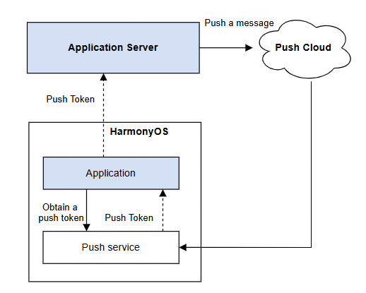
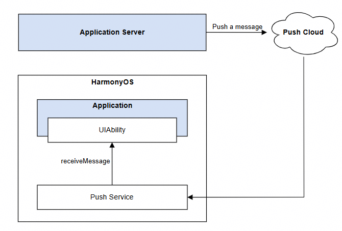

# pushService（推送服务基础能力）

本模块作为HarmonyOS消息推送的基础模块，提供Push Token管理、应用内多账号消息推送及消息接收等核心能力。

- **Push Token管理**

Push Token是Push Kit为应用分配的推送令牌，每台设备上每个应用的Push Token具有唯一性。开发者获取Push Token后需上报到应用服务器，用于向终端设备推送消息，Push Cloud将根据消息体中携带的Push Token，将消息下发至目标设备的目标应用。推送消息流程图如下。



若应用服务器未及时更新Push Token，将影响消息的正常推送。

Push Token一般情况不会变化，仅下列场景Push Token会发生变化：

- 卸载应用后重新安装。
- 设备恢复出厂设置。
- 应用显式调用[deleteToken](#pushservicedeletetoken)接口后重新调用[getToken](#pushservicegettoken)接口。
- 应用显式调用[deleteAAID](https://developer.huawei.com/consumer/cn/doc/harmonyos-references/push-aaid-api#aaiddeleteaaid)接口后重新调用[getToken](#pushservicegettoken)接口。
- 将设备带至海外其他国家或者地区后，Push Kit会更新设备的Push Token。更新后的Push Token通过[pushService.on('tokenUpdate')](#pushserviceontokenupdate)接口的回调返回。

开发者应建立和维护好设备、应用实例与Push Token之间的关系。HarmonyOS提供[ODID](https://developer.huawei.com/consumer/cn/doc/harmonyos-faqs/faq-basics-service-kit-14)（开发者匿名设备标识符），同一设备上运行的同一个开发者的应用，ODID相同。建议使用ODID作为设备标识、[AAID](https://developer.huawei.com/consumer/cn/doc/harmonyos-references/push-aaid-api)作为应用实例标识。

- **应用内多账号消息推送**

Push Token是设备与应用实例的唯一标识，与应用内账号无关。使用Push Token推送消息时，多账号场景下会出现消息推送异常。例如，在应用内先登录账号A，再切换至账号B，此时账号B仍能收到原本发给账号A的消息。为解决该问题，Push Kit提供应用内多账号消息推送能力，支持华为账号与应用账号两种类型。

开发者调用[bindAppProfileId](#pushservicebindappprofileid)接口建立应用内账号与Push Token的绑定关系，并在推送消息时指定Push Token及目标账号（参见[profileId](https://developer.huawei.com/consumer/cn/doc/harmonyos-references/push-scenariozed-api-request-param#notification)参数），Push Kit会校验应用内当前登录账号与推送目标账号是否一致，仅当二者匹配时，消息才会展示。

开发者也可以通过以下方式解决上述问题：Push Kit支持在应用内退出账号时调用deleteToken接口删除Push Token，避免因更新不及时导致消息无法正常推送，在应用内登录或切换账号时调用getToken接口重新申请Push Token。新Push Token需及时上报给应用服务器。

- **消息接收**

应用服务器调用REST API推送以下类型消息时，消息内容将传递给应用，由应用自行完成业务处理。

| 消息类型 | 限制 | 说明 |
| --- | --- | --- |
| 通知消息 | 应用在前台 | 推送消息时，开发者需在消息体中携带[foregroundShow](https://developer.huawei.com/consumer/cn/doc/harmonyos-references/push-scenariozed-api-request-param#notification)字段并赋值为false。 |
| 语音播报消息 | 应用在前台 | 推送语音播报消息时，应用需先对消息内容进行自主处理，再展示通知的场景。例如订单与物流类语音提醒，应用收到消息后，可将订单价格转换为语音进行播报，并在设备通知中心展示对应的订单通知。 |
| 应用内通话消息 | 无 | 当被叫方将应用切至后台或退出后，主叫方与被叫方之间将无法建立连接。通过接入Push Kit的应用内通话消息，可主动唤醒被叫方应用进程并接收通话消息，应用启动后即可正常建立主被叫之间的音视频通话的媒体通道。 |
| 后台消息 | 无 | 适用于内容更新不频繁的场景，该类消息不会展示通知、播放铃声或改变桌面角标。开发者可通过创建pushmessage.db数据库及t_push_message数据表，在设备收到后台消息后，无需唤醒应用，即可直接将消息数据写入应用本地数据库。 用户再次打开应用时，可从本地数据库快速获取相关信息。例如日程类应用，可通过后台消息推送日程信息，实现后台静默更新。 |

接收消息流程图如下：



模型约束： 此接口仅可在Stage模型下使用。

元服务API： 从版本5.0.0(12)开始，该接口支持在元服务中使用。

系统能力： SystemCapability.Push.PushService

起始版本： 4.0.0(10)

#### 导入模块

```
import { pushService } from '@kit.PushKit';
```

#### pushService.getToken

getToken(callback: AsyncCallback<string>): void

获取Push Token，使用callback异步回调。建议在应用启动时调用该接口，并将获取到的Push Token及时上报到应用服务器。

模型约束： 此接口仅可在Stage模型下使用。

元服务API： 从版本5.0.0(12)开始，该接口支持在元服务中使用。

系统能力： SystemCapability.Push.PushService

起始版本： 4.0.0(10)

参数：

| 参数名 | 类型 | 必填 | 说明 |
| --- | --- | --- | --- |
| callback | AsyncCallback | 是 | 回调函数。Token获取成功时，字符长度为112，err为undefined；Token获取失败时返回错误对象。长度可能会变化，建议预留长度大于112。 |

错误码：

以下错误码的详细介绍请参见[通用错误码](https://developer.huawei.com/consumer/cn/doc/harmonyos-references/errorcode-universal)和[ArkTS API错误码](https://developer.huawei.com/consumer/cn/doc/harmonyos-references/push-error-code)。

| 错误码ID | 错误信息 |
| --- | --- |
| 401 | Parameter error. Possible causes: 1. Mandatory parameters are left unspecified; 2. Incorrect parameter types. |
| 1000900001 | System internal error. |
| 1000900008 | Failed to connect to the push service. |
| 1000900009 | Internal error of the push service. |
| 1000900010 | Illegal application identity. |
| 1000900011 | The network is unavailable. |
| 1000900012 | Push rights are not activated. |
| 1000900013 | Cross-location application is not allowed to obtain the token. |
| 1000900014 | The device does not support getting token. |

示例：

```
import { AbilityConstant, UIAbility, Want } from '@kit.AbilityKit';
import { pushService } from '@kit.PushKit';
import { hilog } from '@kit.PerformanceAnalysisKit';
import { BusinessError } from '@kit.BasicServicesKit';

const LOG_DOMAIN = 0x0000;
const LOG_TAG = 'EntryAbility';

export default class EntryAbility extends UIAbility {

  private tokenRetryCount = 0;

  private readonly MAX_TOKEN_RETRY_COUNT = 3;

  private readonly RETRY_INTERVAL = 1000; // 重试间隔1s

  private readonly RETRY_ERROR_CODES = [
    1000900001,
    1000900008,
    1000900009,
    1000900011
  ];

  onCreate(want: Want, launchParam: AbilityConstant.LaunchParam): void {
    super.onCreate(want, launchParam);

    this.getToken();
  }

  /**
   * 获取Push Token
   */
  private getToken(): void {
    try {
      pushService.getToken((err: BusinessError, token: string) => {
        if (err) {
          hilog.error(LOG_DOMAIN, LOG_TAG, 'Failed to get push token: %{public}d %{public}s', err.code, err.message);
          // 重试
          this.handleTokenRetry(err.code);
        }else {
        hilog.info(LOG_DOMAIN, LOG_TAG, 'Succeeded in getting push token');
          this.reportToServer(token);// 将Push Token上报到应用服务器
        }
      });
    } catch (err) {
      const e = err as BusinessError;
      hilog.error(LOG_DOMAIN, LOG_TAG, 'Get push token occur err: %{public}d %{public}s', e.code, e.message);
    }
  }

  /**
   * 重试逻辑
   * 开发者可根据自身业务场景自行调用
   * @param errorCode 错误码
   */
  private handleTokenRetry(errorCode: number): void {
    if (this.tokenRetryCount < this.MAX_TOKEN_RETRY_COUNT && this.RETRY_ERROR_CODES.includes(errorCode)) {
      this.tokenRetryCount++;
      hilog.warn(LOG_DOMAIN, LOG_TAG, 'getToken retry count %{public}d', this.tokenRetryCount);

      // 延迟 1s 重试
      setTimeout(() => {
        this.getToken();
      }, this.RETRY_INTERVAL);
    }
  }

  /**
   * 上报 Token 到服务端
   */
  private reportToServer(_token: string): void {
    // 业务自行实现
  }
}
```

#### pushService.getToken

getToken(): Promise<string>

获取Push Token，使用Promise异步回调。建议在应用启动时调用该接口，并将获取到的Push Token及时上报到应用服务器。

模型约束： 此接口仅可在Stage模型下使用。

元服务API： 从版本5.0.0(12)开始，该接口支持在元服务中使用。

系统能力： SystemCapability.Push.PushService

起始版本： 4.0.0(10)

返回值：

| 类型 | 说明 |
| --- | --- |
| Promise | Promise对象。返回Token，字符长度为112。长度可能会变化，建议预留长度大于112。 |

错误码：

以下错误码的详细介绍请参见[ArkTS API错误码](https://developer.huawei.com/consumer/cn/doc/harmonyos-references/push-error-code)。

| 错误码ID | 错误信息 |
| --- | --- |
| 1000900001 | System internal error. |
| 1000900008 | Failed to connect to the push service. |
| 1000900009 | Internal error of the push service. |
| 1000900010 | Illegal application identity. |
| 1000900011 | The network is unavailable. |
| 1000900012 | Push rights are not activated. |
| 1000900013 | Cross-location application is not allowed to obtain the token. |
| 1000900014 | The device does not support getting token. |

示例：

```
import { AbilityConstant, Want, UIAbility } from '@kit.AbilityKit';
import { BusinessError } from '@kit.BasicServicesKit';
import { hilog } from '@kit.PerformanceAnalysisKit';
import { pushService } from '@kit.PushKit';

const LOG_DOMAIN = 0x0000;
const LOG_TAG = 'EntryAbility';

export default class EntryAbility extends UIAbility {
  private tokenRetryCount = 0;

  private readonly MAX_RETRY_COUNT = 3;

  private readonly RETRY_INTERVAL = 1000; // 重试间隔1s

  private readonly RETRY_ERROR_CODES = [
    1000900001,
    1000900008,
    1000900009,
    1000900011
  ];

  onCreate(want: Want, launchParam: AbilityConstant.LaunchParam): void {
    super.onCreate(want, launchParam);
    
    this.getToken();
  }

  /**
   * 获取Push Token
   */
  private getToken(): void {
    try {
      pushService.getToken()
        .then((token: string) => {
          hilog.info(LOG_DOMAIN, LOG_TAG, 'Succeeded in getting push token');
          this.reportToServer(token); // 将Push Token上报到应用服务器
        })
        .catch((err: BusinessError) => {
          hilog.error(LOG_DOMAIN, LOG_TAG, 'Failed to get push token: %{public}d %{public}s', err.code, err.message);
          this.handleTokenRetry(err.code); // 重试逻辑
        });
    } catch (err) {
      const e = err as BusinessError;
      hilog.error(LOG_DOMAIN, LOG_TAG, 'Get push token occur err: %{public}d %{public}s', e.code, e.message);
    }
  }

  /**
   * 重试逻辑
   * 开发者可根据自身业务场景自行调用
   * @param errorCode 错误码
   */
  private handleTokenRetry(errorCode: number): void {
    if (this.tokenRetryCount < this.MAX_RETRY_COUNT && this.RETRY_ERROR_CODES.includes(errorCode)) {
      this.tokenRetryCount++;
      hilog.warn(LOG_DOMAIN, LOG_TAG, 'getToken retry count %{public}d', this.tokenRetryCount);

      // 延迟重试，避免频繁调用
      setTimeout(() => {
        this.getToken();
      }, this.RETRY_INTERVAL);
    }
  }

  /**
   * 将Push Token上报到应用服务器
   */
  private reportToServer(_token: string): void {
    // 业务逻辑自行实现
  }
}
```

#### pushService.deleteToken

deleteToken(callback: AsyncCallback<void>): void

删除Push Token，使用callback异步回调。建议在社交类应用切换账号、金融类应用退出登录等场景下调用该接口主动删除Push Token，非必要场景请勿主动调用。

模型约束： 此接口仅可在Stage模型下使用。

元服务API： 从版本5.0.0(12)开始，该接口支持在元服务中使用。

系统能力： SystemCapability.Push.PushService

起始版本： 4.0.0(10)

参数：

| 参数名 | 类型 | 必填 | 说明 |
| --- | --- | --- | --- |
| callback | AsyncCallback | 是 | 回调函数。当删除Token成功，err为undefined，否则为错误对象。 |

错误码：

以下错误码的详细介绍请参见[通用错误码](https://developer.huawei.com/consumer/cn/doc/harmonyos-references/errorcode-universal)和[ArkTS API错误码](https://developer.huawei.com/consumer/cn/doc/harmonyos-references/push-error-code)。

| 错误码ID | 错误信息 |
| --- | --- |
| 401 | Parameter error. Possible causes: 1. Mandatory parameters are left unspecified; 2. Incorrect parameter types. |
| 1000900001 | System internal error. |
| 1000900008 | Failed to connect to the push service. |
| 1000900009 | Internal error of the push service. |
| 1000900010 | Illegal application identity. |
| 1000900011 | The network is unavailable. |

示例：

```
import{ UIAbility }from '@kit.AbilityKit';
import { BusinessError } from '@kit.BasicServicesKit';
import { hilog } from '@kit.PerformanceAnalysisKit';
import { pushService } from '@kit.PushKit';

const LOG_DOMAIN = 0x0000;
const LOG_TAG = 'EntryAbility';

export default class EntryAbility extends UIAbility {
  /**
   * 非必要不要删除Push Token，建议以下情况调用删除
   * 用户拒绝应用协议和隐私声明：当用户拒绝接受应用的使用协议和隐私声明时，应用可以主动删除Push Token，以确保用户不再接收到任何推送消息。
   * 用户主动退出账号或注销账户：在用户退出登录或注销账户时，为了保障用户隐私，可能需要删除与该设备关联的Push Token，避免后续消息推送。
   * 应用内提供消息推送开关：如果应用内提供了消息推送的开关选项，当用户关闭推送功能时，可以调用删除Token的接口，实现停止接收推送。
   * 测试或调试需求：在开发测试阶段，可能需要清理Token以验证重新获取Token的流程。
   */
  private deleteToken(): void {
    try {
      pushService.deleteToken((err: BusinessError) => {
        if (err) {
          hilog.error(LOG_DOMAIN, LOG_TAG, 'Failed to delete push token: %{public}d %{public}s', err.code, err.message);
      } else {
        hilog.info(LOG_DOMAIN, LOG_TAG, 'Succeeded in deleting push token.');
      }
    });
  } catch (err) {
    let e: BusinessError = err as BusinessError;
    hilog.error(LOG_DOMAIN, LOG_TAG, 'Push token occur err: %{public}d %{public}s', e.code, e.message);
    }
  }
}
```

#### pushService.deleteToken

deleteToken(): Promise<void>

删除Push Token，使用Promise异步回调。建议在社交类应用切换账号、金融类应用退出登录等场景下调用该接口主动删除Push Token，非必要场景请勿主动调用。

模型约束： 此接口仅可在Stage模型下使用。

元服务API： 从版本5.0.0(12)开始，该接口支持在元服务中使用。

系统能力： SystemCapability.Push.PushService

起始版本： 4.0.0(10)

返回值：

| 类型 | 说明 |
| --- | --- |
| Promise | Promise对象。无返回结果的Promise对象。 |

错误码：

以下错误码的详细介绍请参见[ArkTS API错误码](https://developer.huawei.com/consumer/cn/doc/harmonyos-references/push-error-code)。

| 错误码ID | 错误信息 |
| --- | --- |
| 1000900001 | System internal error. |
| 1000900008 | Failed to connect to the push service. |
| 1000900009 | Internal error of the push service. |
| 1000900010 | Illegal application identity. |
| 1000900011 | The network is unavailable. |

示例：

```
import { UIAbility } from '@kit.AbilityKit';
import { BusinessError } from '@kit.BasicServicesKit';
import { hilog } from '@kit.PerformanceAnalysisKit';
import { pushService } from '@kit.PushKit';

const LOG_DOMAIN = 0x0000;
const LOG_TAG = 'EntryAbility';

export default class EntryAbility extends UIAbility {
  /**
   * 非必要不要删除Push Token，建议以下情况调用删除
   * 1、用户拒绝应用协议和隐私声明：当用户拒绝接受应用的使用协议和隐私声明时，应用可以主动删除Push Token，以确保用户不再接收到任何推送消息。
   * 2、用户主动退出账号或注销账户：在用户退出登录或注销账户时，为了保障用户隐私，可能需要删除与该设备关联的Push Token，避免后续消息推送。
   * 3、应用内提供消息推送开关：如果应用内提供了消息推送的开关选项，当用户关闭推送功能时，可以调用删除Token的接口，实现停止接收推送。
   * 4、测试或调试需求：在开发测试阶段，可能需要清理Token以验证重新获取Token的流程。
   */
  private deleteToken(): void {
    try {
      pushService.deleteToken()
        .then(() => {
          hilog.info(LOG_DOMAIN, LOG_TAG, 'Succeeded in deleting push token.');
        })
        .catch((err: BusinessError) => {
          hilog.error(LOG_DOMAIN, LOG_TAG, 'Failed to delete push token: %{public}d %{public}s', err.code, err.message);
        });
    } catch (err) {
      let e: BusinessError = err as BusinessError;
      hilog.error(LOG_DOMAIN, LOG_TAG, 'push token occur err: %{public}d %{public}s', e.code, e.message);
    }
  }
}
```

#### pushService.bindAppProfileId

bindAppProfileId(appProfileType: pushCommon.AppProfileType, appProfileId: string, callback: AsyncCallback<void>): void

绑定应用内账号匿名标识，使用callback异步回调。在应用内登录或切换账号时，建立当前登录账号与Push Kit的绑定关系，Push Kit以该标识进行消息定向发送。

模型约束： 此接口仅可在Stage模型下使用。

系统能力： SystemCapability.Push.PushService

起始版本： 4.0.0(10)

参数：

| 参数名 | 类型 | 必填 | 说明 |
| --- | --- | --- | --- |
| appProfileType | pushCommon.[AppProfileType](https://developer.huawei.com/consumer/cn/doc/harmonyos-references/push-pushcommon#appprofiletype) | 是 | 绑定账号类型，分为华为账号和应用账号。 |
| appProfileId | string | 是 | 账号匿名标识，不可为空字符串。不建议使用真实的账号id，推荐使用账号id自行生成对应的匿名标识，能与该账号id建立唯一映射关系即可，生成算法无限制。最大长度为64，若长度超限，调用REST API接口会报错。 |
| callback | AsyncCallback | 是 | 回调函数。当绑定应用内账号成功，err为undefined，否则为错误对象。 |

错误码：

以下错误码的详细介绍请参见[通用错误码](https://developer.huawei.com/consumer/cn/doc/harmonyos-references/errorcode-universal)和[ArkTS API错误码](https://developer.huawei.com/consumer/cn/doc/harmonyos-references/push-error-code)。

| 错误码ID | 错误信息 |
| --- | --- |
| 401 | Parameter error. Possible causes: 1. Mandatory parameters are left unspecified; 2. Incorrect parameter types; 3. Parameter verification failed. |
| 1000900001 | System internal error. |
| 1000900008 | Failed to connect to the push service. |
| 1000900009 | Internal error of the push service. |
| 1000900010 | Illegal application identity. |
| 1000900015 | The number of bound profile-app relationships exceeds the maximum. |
| 1000900016 | The os distributed account is not logged in. |

示例：

```
import { AbilityConstant, UIAbility, Want } from '@kit.AbilityKit';
import { BusinessError } from '@kit.BasicServicesKit';
import { hilog } from '@kit.PerformanceAnalysisKit';
import { pushService, pushCommon } from '@kit.PushKit';
import { buffer, util } from '@kit.ArkTS';

const LOG_DOMAIN = 0x0000;
const LOG_TAG = 'EntryAbility';
const accountId: string = '1***9';

export default class EntryAbility extends UIAbility {
  onCreate(want: Want, launchParam: AbilityConstant.LaunchParam): void {
    super.onCreate(want, launchParam);
    this.bindAppProfileId();
  }

  /**
   * 生成应用内账号匿名标识profile，标识不可为空字符串且标识最大长度为64。
   * 不建议使用真实的账号id，推荐使用账号id自行生成对应的匿名标识，能与该账号id建立唯一映射关系即可，生成算法无限制
   */
  private generateProfileIdByAccountId(accountId: string): string {
    const arr: Uint8Array = new Uint8Array(buffer.from(accountId, 'utf-8').buffer);
    const base64 = new util.Base64Helper();
    return base64.encodeToStringSync(arr);
  }
  /**
   * 绑定应用内账号匿名标识
   */
  private bindAppProfileId(): void {
    const profileId: string = this.generateProfileIdByAccountId(accountId);
    try {
      pushService.bindAppProfileId(pushCommon.AppProfileType.PROFILE_TYPE_APPLICATION_ACCOUNT, profileId,
        (err: BusinessError) => {
          if (err) {
            hilog.error(LOG_DOMAIN, LOG_TAG, 'Failed to bind app profile id: %{public}d %{public}s', err.code, err.message);
          }else {
            hilog.info(LOG_DOMAIN, LOG_TAG, 'Succeeded in binding app profile id.');
          }
        });
    } catch (err) {
      const e = err as BusinessError;
      hilog.error(LOG_DOMAIN, LOG_TAG, 'Bind app profile id occur err: %{public}d %{public}s', e.code, e.message);
    }
  }
}
```

#### pushService.bindAppProfileId

bindAppProfileId(appProfileType: pushCommon.AppProfileType, appProfileId: string): Promise<void>

绑定应用内账号匿名标识，使用Promise异步回调。在应用内登录或切换账号时，建立当前登录账号与Push Kit的绑定关系，Push Kit以该标识进行消息定向发送。

模型约束： 此接口仅可在Stage模型下使用。

系统能力： SystemCapability.Push.PushService

起始版本： 4.0.0(10)

参数：

| 参数名 | 类型 | 必填 | 说明 |
| --- | --- | --- | --- |
| appProfileType | pushCommon.[AppProfileType](https://developer.huawei.com/consumer/cn/doc/harmonyos-references/push-pushcommon#appprofiletype) | 是 | 绑定账号类型，分为华为账号和应用账号。 |
| appProfileId | string | 是 | 账号匿名标识，不可为空字符串。不建议使用真实的账号id，推荐使用账号id自行生成对应的匿名标识，能与该账号id建立唯一映射关系即可，生成算法无限制。最大长度为64，若长度超限，调用REST API接口会报错。 |

返回值：

| 类型 | 说明 |
| --- | --- |
| Promise | Promise对象。无返回结果的Promise对象。 |

错误码：

以下错误码的详细介绍请参见[通用错误码](https://developer.huawei.com/consumer/cn/doc/harmonyos-references/errorcode-universal)和[ArkTS API错误码](https://developer.huawei.com/consumer/cn/doc/harmonyos-references/push-error-code)。

| 错误码ID | 错误信息 |
| --- | --- |
| 401 | Parameter error. Possible causes: 1. Mandatory parameters are left unspecified; 2. Incorrect parameter types; 3. Parameter verification failed. |
| 1000900001 | System internal error. |
| 1000900008 | Failed to connect to the push service. |
| 1000900009 | Internal error of the push service. |
| 1000900010 | Illegal application identity. |
| 1000900015 | The number of bound profile-app relationships exceeds the maximum. |
| 1000900016 | The os distributed account is not logged in. |

示例：

```
import { AbilityConstant, UIAbility, Want } from '@kit.AbilityKit';
import { BusinessError } from '@kit.BasicServicesKit';
import { hilog } from '@kit.PerformanceAnalysisKit';
import { pushService, pushCommon } from '@kit.PushKit';
import { buffer, util } from '@kit.ArkTS';

const LOG_DOMAIN = 0x0000;
const LOG_TAG = 'EntryAbility';
const accountId: string = '1***9';

export default class EntryAbility extends UIAbility {
  onCreate(want: Want, launchParam: AbilityConstant.LaunchParam): void {
    super.onCreate(want, launchParam);
    this.bindAppProfileId();
  }
  /**
   * 生成应用内账号匿名标识profile，标识不可为空字符串且标识最大长度为64。
   * 不建议使用真实的账号id，推荐使用账号id自行生成对应的匿名标识，能与该账号id建立唯一映射关系即可，生成算法无限制
   */
  private generateProfileIdByAccountId(accountId: string): string {
    const arr: Uint8Array = new Uint8Array(buffer.from(accountId, 'utf-8').buffer);
    const base64 = new util.Base64Helper();
    return base64.encodeToStringSync(arr);
  }
  
  /**
   * 绑定应用内账号匿名标识
   */
  private bindAppProfileId(): void {
    const profileId: string = this.generateProfileIdByAccountId(accountId);
    try {
      pushService.bindAppProfileId(pushCommon.AppProfileType.PROFILE_TYPE_APPLICATION_ACCOUNT, profileId
      ).then(() => {
        hilog.info(LOG_DOMAIN, LOG_TAG, 'Succeeded in binding app profile id.');
      }).catch((err: BusinessError) => {
        hilog.error(LOG_DOMAIN, LOG_TAG, 'Failed to bind app profile id: %{public}d %{public}s', err.code, err.message);
      });
    } catch (err) {
      const e = err as BusinessError;
      hilog.error(LOG_DOMAIN, LOG_TAG, 'Bind app profile id occur err: %{public}d %{public}s', e.code, e.message);
    }
  }
}
```

#### pushService.unbindAppProfileId

unbindAppProfileId(appProfileId: string, callback: AsyncCallback<void>): void

解绑应用内账号匿名标识，使用callback异步回调。在应用内退出账号时，解除账号与Push Kit的绑定关系。

模型约束： 此接口仅可在Stage模型下使用。

系统能力： SystemCapability.Push.PushService

起始版本： 4.0.0(10)

参数：

| 参数名 | 类型 | 必填 | 说明 |
| --- | --- | --- | --- |
| appProfileId | string | 是 | 账号匿名标识，配置为调用[bindAppProfileId](#pushservicebindappprofileid-1)()时设置的appProfileId。最大长度为64，若长度超限，调用REST API接口会报错。 |
| callback | AsyncCallback | 是 | 回调函数。当解绑应用内账号成功，err为undefined，否则为错误对象。 |

错误码：

以下错误码的详细介绍请参见[通用错误码](https://developer.huawei.com/consumer/cn/doc/harmonyos-references/errorcode-universal)和[ArkTS API错误码](https://developer.huawei.com/consumer/cn/doc/harmonyos-references/push-error-code)。

| 错误码ID | 错误信息 |
| --- | --- |
| 401 | Parameter error. Possible causes: 1. Mandatory parameters are left unspecified; 2. Incorrect parameter types; 3. Parameter verification failed. |
| 1000900001 | System internal error. |
| 1000900008 | Failed to connect to the push service. |
| 1000900009 | Internal error of the push service. |
| 1000900010 | Illegal application identity. |

示例：

```
import { AbilityConstant, UIAbility, Want } from '@kit.AbilityKit';
import { BusinessError } from '@kit.BasicServicesKit';
import { hilog } from '@kit.PerformanceAnalysisKit';
import { pushService, pushCommon } from '@kit.PushKit';

const LOG_DOMAIN = 0x0000;
const LOG_TAG = 'EntryAbility';
const profileId: string = '1***9';

export default class EntryAbility extends UIAbility {
  onCreate(want: Want, launchParam: AbilityConstant.LaunchParam): void {
    super.onCreate(want, launchParam);
    this.unbindAppProfileId();
  }

  /**
   * 解绑应用内账号匿名标识
   */
  private unbindAppProfileId(): void {
    try {
      pushService.unbindAppProfileId(profileId,
        (err: BusinessError) => {
          if (err) {
            hilog.error(LOG_DOMAIN, LOG_TAG, 'Failed to unbind app profile id: %{public}d %{public}s', err.code, err.message);
            return;
          }
          hilog.info(LOG_DOMAIN, LOG_TAG, 'Succeeded in unbinding app profile id.');
        }
      );
    } catch (err) {
      const e: BusinessError = err as BusinessError;
      hilog.error(LOG_DOMAIN, LOG_TAG, 'Unbind app profile id occur err: %{public}d %{public}s', e.code, e.message);
    }
  }
}
```

#### pushService.unbindAppProfileId

unbindAppProfileId(appProfileId: string): Promise<void>

解绑应用内账号匿名标识，使用Promise异步回调。在应用内退出账号时，解除账号与Push Kit的绑定关系。

模型约束： 此接口仅可在Stage模型下使用。

系统能力： SystemCapability.Push.PushService

起始版本： 4.0.0(10)

参数：

| 参数名 | 类型 | 必填 | 说明 |
| --- | --- | --- | --- |
| appProfileId | string | 是 | 账号匿名标识，配置为调用[bindAppProfileId](#pushservicebindappprofileid-1)()时设置的appProfileId。最大长度为64，若长度超限，调用REST API接口会报错。 |

返回值：

| 类型 | 说明 |
| --- | --- |
| Promise | Promise对象。无返回结果的Promise对象。 |

错误码：

以下错误码的详细介绍请参见[通用错误码](https://developer.huawei.com/consumer/cn/doc/harmonyos-references/errorcode-universal)和[ArkTS API错误码](https://developer.huawei.com/consumer/cn/doc/harmonyos-references/push-error-code)。

| 错误码ID | 错误信息 |
| --- | --- |
| 401 | Parameter error. Possible causes: 1. Mandatory parameters are left unspecified; 2. Incorrect parameter types; 3. Parameter verification failed. |
| 1000900001 | System internal error. |
| 1000900008 | Failed to connect to the push service. |
| 1000900009 | Internal error of the push service. |
| 1000900010 | Illegal application identity. |

示例：

```
import { AbilityConstant, UIAbility, Want } from '@kit.AbilityKit';
import { BusinessError } from '@kit.BasicServicesKit';
import { hilog } from '@kit.PerformanceAnalysisKit';
import { pushService, pushCommon } from '@kit.PushKit';

const LOG_DOMAIN = 0x0000;
const LOG_TAG = 'EntryAbility';
const profileId: string = '1***9';

export default class EntryAbility extends UIAbility {
  onCreate(want: Want, launchParam: AbilityConstant.LaunchParam): void {
    super.onCreate(want, launchParam);
    this.unbindAppProfileId();
  }
  
  /**
   * 解绑应用内账号匿名标识
   */
  private unbindAppProfileId(): void {
    try {
      pushService.unbindAppProfileId(profileId
).then(() => {
        hilog.info(LOG_DOMAIN, LOG_TAG, 'Succeeded in unbinding app profile id.');
      }).catch((err: BusinessError) => {
        hilog.error(LOG_DOMAIN, LOG_TAG, 'Failed to unbind app profile id: %{public}d %{public}s', err.code, err.message);
      });
    } catch (err) {
      const e: BusinessError = err as BusinessError;
      hilog.error(LOG_DOMAIN, LOG_TAG, 'Unbind app profile id occur err: %{public}d %{public}s', e.code, e.message);
    }
  }
}
```

#### pushService.PushType

type PushType = 'DEFAULT' | 'IM' | 'VoIP' | 'BACKGROUND' | 'EMERGENCY'

场景化消息类型，取值类型为下表类型中的并集。

模型约束： 此接口仅可在Stage模型下使用。

系统能力： SystemCapability.Push.PushService

起始版本： 5.0.2(14)

| 类型 | 说明 |
| --- | --- |
| 'DEFAULT' | 通知消息场景。 |
| 'IM' | 语音播报消息场景。 |
| 'VoIP' | 应用内通话消息场景。 |
| 'BACKGROUND' | 后台消息场景。 |
| 'EMERGENCY' | 紧急事件消息场景。 |

#### pushService.receiveMessage

receiveMessage(pushType: PushType, ability: Ability, onMessage: Callback<pushCommon.PushPayload>): void

接收Push场景化消息。

模型约束： 此接口仅可在Stage模型下使用。

系统能力： SystemCapability.Push.PushService

起始版本： 4.0.0(10)

参数：

| 参数名 | 类型 | 必填 | 说明 |
| --- | --- | --- | --- |
| pushType | [PushType](#pushservicepushtype) | 是 | 场景化消息类型。 **说明：** · pushService.PushType中EMERGENCY（紧急事件消息场景）起始版本：5.0.0(12)。本场景仅为地震灾害等特殊场景使用。 · pushService.PushType中DEFAULT（通知消息场景）起始版本：5.0.2(14)。调用示例代码请参考[应用在前台时处理通知消息](https://developer.huawei.com/consumer/cn/doc/harmonyos-guides/push-send-alert#应用在前台时处理通知消息)中步骤3。 · IM（语音播报消息场景）调用示例代码请参考[开发步骤](https://developer.huawei.com/consumer/cn/doc/harmonyos-guides/push-send-extend-noti#开发步骤)中步骤3。 · VoIP（应用内通话消息场景） 调用示例代码请参考[开发步骤](https://developer.huawei.com/consumer/cn/doc/harmonyos-guides/push-voip#开发步骤)中步骤2。 · BACKGROUND（后台消息场景） 调用示例代码请参考[开发步骤](https://developer.huawei.com/consumer/cn/doc/harmonyos-guides/push-background#开发步骤)中步骤5。 |
| ability | [Ability](https://developer.huawei.com/consumer/cn/doc/harmonyos-references/js-apis-app-ability-ability) | 是 | [UIAbility](https://developer.huawei.com/consumer/cn/doc/harmonyos-references/js-apis-app-ability-uiability)。 |
| onMessage | Callback | 是 | 回调函数，返回接收场景化消息的数据。 |

错误码：

以下错误码的详细介绍请参见[通用错误码](https://developer.huawei.com/consumer/cn/doc/harmonyos-references/errorcode-universal)和[ArkTS API错误码](https://developer.huawei.com/consumer/cn/doc/harmonyos-references/push-error-code)。

| 错误码ID | 错误信息 |
| --- | --- |
| 401 | Parameter error. Possible causes: 1. Mandatory parameters are left unspecified; 2. Incorrect parameter types; 3. Parameter verification failed. |
| 1000900001 | System internal error. |
| 1000900005 | Messages of the same push type cannot be received repeatedly. |

示例：

```
import { UIAbility } from '@kit.AbilityKit';
import { pushService, pushCommon } from '@kit.PushKit';
import { hilog } from '@kit.PerformanceAnalysisKit';
import { BusinessError } from '@kit.BasicServicesKit';

const LOG_DOMAIN = 0x0000;
const LOG_TAG = 'PushMessageAbility';

// 无需新增UIAbility，在原有UIAbility的onCreate方法中调用即可。以PushMessageAbility为例
export default class PushMessageAbility extends UIAbility {
  // onCreate()为同步接口，不支持异步回调
  // receiveMessage()不能放在异步方法之后，否则可能影响消息接收
  onCreate(): void {
    this.receiveDefaultMessage();
    this.receiveImMessage();
    this.receiveVoipMessage();
    this.receiveBackgroundMessage();
  }

  /**
   * 接收默认消息
   */
  private receiveDefaultMessage(): void {
    try {
      // 注册DEFAULT场景化消息
      pushService.receiveMessage('DEFAULT', this, (data: pushCommon.PushPayload) => {
        // process message，并建议对Callback进行try-catch
        try {
          hilog.info(LOG_DOMAIN, LOG_TAG, 'Receive default message : %{public}s', JSON.stringify(data));
        } catch (e) {
          const errRes: BusinessError = e as BusinessError;
          hilog.error(LOG_DOMAIN, LOG_TAG, 'Failed to process data: %{public}d %{public}s', errRes.code, errRes.message);
        }
      });
    } catch (err) {
      const e: BusinessError = err as BusinessError;
      hilog.error(LOG_DOMAIN, LOG_TAG, 'Receive message occur err: %{public}d %{public}s', e.code, e.message);
    }
  }

  /**
   * 接收IM消息
   */
  private receiveImMessage(): void {
    try {
      // 注册IM场景化消息
      pushService.receiveMessage('IM', this, (data: pushCommon.PushPayload) => {
        // process message，并建议对Callback进行try-catch
        try {
          hilog.info(LOG_DOMAIN, LOG_TAG, 'Receive IM message : %{public}s', JSON.stringify(data));
        } catch (e) {
          const errRes: BusinessError = e as BusinessError;
          hilog.error(LOG_DOMAIN, LOG_TAG, 'Failed to process data: %{public}d %{public}s', errRes.code, errRes.message);
        }
      });
    } catch (err) {
      const e: BusinessError = err as BusinessError;
      hilog.error(LOG_DOMAIN, LOG_TAG, 'Receive message occur err: %{public}d %{public}s', e.code, e.message);
    }
  }

  /**
   * 接收VOIP消息
   */
  private receiveVoipMessage(): void {
    try {
      // 注册VOIP场景化消息
      pushService.receiveMessage('VoIP', this, (data: pushCommon.PushPayload) => {
        // process message，并建议对Callback进行try-catch
        try {
          hilog.info(LOG_DOMAIN, LOG_TAG, 'Receive VoIP message : %{public}s', JSON.stringify(data));
        } catch (e) {
          const errRes: BusinessError = e as BusinessError;
          hilog.error(LOG_DOMAIN, LOG_TAG, 'Failed to process data: %{public}d %{public}s', errRes.code, errRes.message);
        }
      });
    } catch (err) {
      const e: BusinessError = err as BusinessError;
      hilog.error(LOG_DOMAIN, LOG_TAG, 'Receive message occur err: %{public}d %{public}s', e.code, e.message);
    }
  }

  /**
   * 接收后台消息
   */
  private receiveBackgroundMessage(): void {
    try {
      // 注册BACKGROUND场景化消息
      pushService.receiveMessage('BACKGROUND', this, (data: pushCommon.PushPayload) => {
        // process message，并建议对Callback进行try-catch
        try {
          hilog.info(LOG_DOMAIN, LOG_TAG, 'Receive background message : %{public}s', JSON.stringify(data));
        } catch (e) {
          const errRes: BusinessError = e as BusinessError;
          hilog.error(LOG_DOMAIN, LOG_TAG, 'Failed to process data: %{public}d %{public}s', errRes.code, errRes.message);
        }
      });
    } catch (err) {
      const e: BusinessError = err as BusinessError;
      hilog.error(LOG_DOMAIN, LOG_TAG, 'Receive message occur err: %{public}d %{public}s', e.code, e.message);
    }
  }
}
```

#### pushService.on('tokenUpdate')

on(type: 'tokenUpdate', ability: Ability, callback: Callback<string>): void

当设备被带到海外其他国家或地区时，Push Kit会自动更新Push Token，使用callback异步回调，返回新的Push Token（会拉起应用主进程）。若应用未适配该接口，则无法实时感知Push Token更新，仅在下次启动并主动获取Push Token时才能感知。

模型约束： 此接口仅可在Stage模型下使用。

系统能力： SystemCapability.Push.PushService

起始版本： 5.1.0(18)

参数：

| 参数名 | 类型 | 必填 | 说明 |
| --- | --- | --- | --- |
| type | string | 是 | 监听事件，固定为'tokenUpdate'，即token更新事件。 |
| ability | [Ability](https://developer.huawei.com/consumer/cn/doc/harmonyos-references/js-apis-app-ability-ability) | 是 | [UIAbility](https://developer.huawei.com/consumer/cn/doc/harmonyos-references/js-apis-app-ability-uiability)，包含UI界面的应用组件。 |
| callback | Callback | 是 | 回调函数，返回token更新的数据。Token长度为112。 |

错误码：

以下错误码的详细介绍请参见[通用错误码](https://developer.huawei.com/consumer/cn/doc/harmonyos-references/errorcode-universal)和[ArkTS API错误码](https://developer.huawei.com/consumer/cn/doc/harmonyos-references/push-error-code)。

| 错误码ID | 错误信息 |
| --- | --- |
| 401 | Parameter error. Possible causes: 1. Mandatory parameters are left unspecified; 2. Incorrect parameter types; 3. Parameter verification failed. |
| 1000900001 | System internal error. |

示例：

```
import { UIAbility, Want, AbilityConstant } from '@kit.AbilityKit';
import { pushService } from '@kit.PushKit';
import { hilog } from '@kit.PerformanceAnalysisKit';
import { BusinessError } from '@kit.BasicServicesKit';

const LOG_DOMAIN = 0x0000;
const LOG_TAG = 'PushMessageAbility';

// 无需新增UIAbility，在原有UIAbility的onCreate方法中调用即可。以PushMessageAbility为例
export default class PushMessageAbility extends UIAbility {
  onCreate(want: Want, launchParam: AbilityConstant.LaunchParam): void {
    super.onCreate(want, launchParam);
    this.registerTokenUpdate();
  }

  /**
   * 注册Token更新回调
   */
  private registerTokenUpdate(): void {
    const callBack = (token: string) => {
      try {
        hilog.info(LOG_DOMAIN, LOG_TAG, 'update token');
        this.reportToServer(token);
      } catch (e) {
        const err: BusinessError = e as BusinessError;
        hilog.error(LOG_DOMAIN, LOG_TAG, 'Failed to update token: %{public}d %{public}s', err.code, err.message);
      }
    };

    try {
      pushService.on('tokenUpdate', this, callBack);
      hilog.info(LOG_DOMAIN, LOG_TAG, 'Succeeded in registering token update');
    } catch (e) {
      const err: BusinessError = e as BusinessError;
      hilog.error(LOG_DOMAIN, LOG_TAG, 'Register token update occur err: %{public}d %{public}s', err.code, err.message);
    }
  }

  /**
   * 将 Push Token 上报给应用服务器
   * @param token 推送令牌
   */
  private reportToServer(token: string): void {
    // 这里写接口请求，将Token上报给应用服务器
    hilog.info(LOG_DOMAIN, LOG_TAG, 'Report token to server');
  }
}
```

#### pushService.off('tokenUpdate')

off(type: 'tokenUpdate', callback?: Callback<string>): void

解除注册token更新，使用callback异步回调。

模型约束： 此接口仅可在Stage模型下使用。

系统能力： SystemCapability.Push.PushService

起始版本： 5.1.0(18)

参数：

| 参数名 | 类型 | 必填 | 说明 |
| --- | --- | --- | --- |
| type | string | 是 | 监听事件，固定为'tokenUpdate'，即token更新事件。 |
| callback | Callback | 否 | 回调函数，用于取消注册tokenUpdate监听事件。 **说明：** 若取消注册时不传入callback，则会取消注册tokenUpdate事件下所有的callback。 |

错误码：

以下错误码的详细介绍请参见[通用错误码](https://developer.huawei.com/consumer/cn/doc/harmonyos-references/errorcode-universal)和[ArkTS API错误码](https://developer.huawei.com/consumer/cn/doc/harmonyos-references/push-error-code)。

| 错误码ID | 错误信息 |
| --- | --- |
| 401 | Parameter error. Possible causes: 1. Mandatory parameters are left unspecified; 2. Incorrect parameter types; 3. Parameter verification failed. |
| 1000900001 | System internal error. |

示例：

```
import { UIAbility } from '@kit.AbilityKit';
import { pushService } from '@kit.PushKit';
import { hilog } from '@kit.PerformanceAnalysisKit';
import { BusinessError } from '@kit.BasicServicesKit';

const LOG_DOMAIN = 0x0000;
const LOG_TAG = 'PushMessageAbility';

export default class PushMessageAbility extends UIAbility {
  /**
   * 解除注册token更新回调
   * 开发者可根据业务场景自行调用，解除后当push token更新时，应用将不会收到回调
   */
  private unregisterTokenUpdate(): void {
    try {
      pushService.off('tokenUpdate');
      hilog.info(LOG_DOMAIN, LOG_TAG, 'Succeeded in unregistering the token update callback.');
    } catch (e) {
      let err: BusinessError = e as BusinessError;
      hilog.error(LOG_DOMAIN, LOG_TAG, 'Failed to unregister the token update callback: %{public}d %{public}s',err.code, err.message);
    }
  }
}
```

#### pushService.on('distributedMessageReceive')

on(type: 'distributedMessageReceive', callee: Callee, callback: DistributedMessageCallback): void

注册分布式消息接收事件监听，使用callback异步回调。应用需要在UIAbility的onCreate()方法进行注册，每个应用只能注册一次。该UIAbility对应action为action.ohos.push.distribute.listener。

 若调用接收场景化消息接口（[pushService.receiveMessage](#pushservicereceivemessage)）和注册分布式消息事件在同一个UIAbility中，则action.ohos.push.distribute.listener和action.ohos.push.listener定义在同一个actions数组中，否则分别定义在对应UIAbility中的actions中。

模型约束： 此接口仅可在Stage模型下使用。

系统能力： SystemCapability.Push.PushService

起始版本： 6.0.0(20)

参数：

| 参数名 | 类型 | 必填 | 说明 |
| --- | --- | --- | --- |
| type | string | 是 | 监听事件，固定为'distributedMessageReceive'，即分布式消息接收事件。 |
| callee | [Callee](https://developer.huawei.com/consumer/cn/doc/harmonyos-references/js-apis-app-ability-uiability#callee) | 是 | 通用组件服务端注册和解除客户端[Caller](https://developer.huawei.com/consumer/cn/doc/harmonyos-references/js-apis-app-ability-uiability#caller)通知送信的callback接口，从[UIAbility](https://developer.huawei.com/consumer/cn/doc/harmonyos-references/js-apis-app-ability-uiability)中获取。 |
| callback | [DistributedMessageCallback](#distributedmessagecallback) | 是 | 回调函数，注册分布式消息接收事件监听的回调，在收到分布式消息后异步执行。 |

错误码：

以下错误码的详细介绍请参见[ArkTS API错误码](https://developer.huawei.com/consumer/cn/doc/harmonyos-references/push-error-code)。

| 错误码ID | 错误信息 |
| --- | --- |
| 1000900001 | System internal error. |
| 1000900031 | The same type of callback can be registered only once. |

示例：

```
import { UIAbility } from '@kit.AbilityKit';
import { pushService, pushCommon } from '@kit.PushKit';
import { hilog } from '@kit.PerformanceAnalysisKit';
import { BusinessError } from '@kit.BasicServicesKit';

const LOG_DOMAIN = 0x0000;
const LOG_TAG = 'PushMessageAbility';
export default class PushMessageAbility extends UIAbility {

  private callback: pushService.DistributedMessageCallback = async (data:  pushCommon.PushPayload) => {
    let resultCode = pushService.ResultCode.SUCCESS;
    try {
      // 处理业务逻辑，如将数据内容发布到穿戴设备上等
      hilog.info(LOG_DOMAIN, LOG_TAG, 'Distribute message: %{public}s', JSON.stringify(data));
    } catch (e) {
      resultCode = pushService.ResultCode.FAILED;
      let errRes: BusinessError = e as BusinessError;
      hilog.error(LOG_DOMAIN, LOG_TAG, 'Receive distribute data occur err: %{public}d %{public}s', errRes.code, errRes.message);
    }
    // 处理结束后，返回执行结果
    return { resultCode };
  };

  onCreate(): void {
    try {
      // 注册distributedMessageReceive分布式消息接收回调场景
      pushService.on('distributedMessageReceive', this.callee, this.callback);
    } catch (err) {
      let e: BusinessError = err as BusinessError;
      hilog.error(LOG_DOMAIN, LOG_TAG, 'Register on error: %{public}d %{public}s', e.code, e.message);
    }
  }
}
```

#### pushService.off('distributedMessageReceive')

off(type: 'distributedMessageReceive', callback?: DistributedMessageCallback): void

解除注册分布式消息接收事件监听，使用callback异步回调。

模型约束： 此接口仅可在Stage模型下使用。

系统能力： SystemCapability.Push.PushService

起始版本： 6.0.0(20)

参数：

| 参数名 | 类型 | 必填 | 说明 |
| --- | --- | --- | --- |
| type | string | 是 | 监听事件，固定为'distributedMessageReceive'即分布式消息接收事件。 |
| callback | [DistributedMessageCallback](#distributedmessagecallback) | 否 | 回调函数，用于取消注册distributedMessageReceive监听事件。取消注册后，应用无法在该callback方法中接收分布式消息。 **说明：** 若取消注册时不传入callback，则会取消注册distributedMessageReceive事件下所有的callback。 |

错误码：

以下错误码的详细介绍请参见[ArkTS API错误码](https://developer.huawei.com/consumer/cn/doc/harmonyos-references/push-error-code)。

| 错误码ID | 错误信息 |
| --- | --- |
| 1000900001 | System internal error. |

示例：

```
import { UIAbility } from '@kit.AbilityKit';
import { pushService } from '@kit.PushKit';
import { hilog } from '@kit.PerformanceAnalysisKit';
import { BusinessError } from '@kit.BasicServicesKit';

const LOG_DOMAIN = 0x0000;
const LOG_TAG = 'PushMessageAbility';

export default class PushMessageAbility extends UIAbility {
  /**
   * 解除注册分布式消息接收事件监听
   * 开发者可根据业务场景自行调用
   */
  private unregisterdistributed(): void {
    try {
      pushService.off('distributedMessageReceive');
      hilog.info(LOG_DOMAIN, LOG_TAG, 'Succeeded in unregistering the distributed message receive callback.');
    } catch (e) {
      let err: BusinessError = e as BusinessError;
      hilog.error(LOG_DOMAIN, LOG_TAG, 'Failed to unregister the distributed message receive callback: %{public}d %{public}s',err.code, err.message);
    }
  }
}
```

#### DistributedMessageCallback

type DistributedMessageCallback = (PushPayload: pushCommon.PushPayload) => Promise<DistributedMessageResult>

分布式消息接收事件中使用的回调函数。

模型约束： 此接口仅可在Stage模型下使用。

系统能力： SystemCapability.Push.PushService

起始版本： 6.0.0(20)

参数：

| 参数名 | 类型 | 必填 | 说明 |
| --- | --- | --- | --- |
| PushPayload | pushCommon.[PushPayload](https://developer.huawei.com/consumer/cn/doc/harmonyos-references/push-pushcommon#pushpayload) | 是 | 分布式消息数据的参数定义。 |

返回值：

| 类型 | 说明 |
| --- | --- |
| Promise | Promise对象。返回DistributedMessageResult对象，见[DistributedMessageResult](#distributedmessageresult)说明。 |

#### DistributedMessageResult

distributedMessageReceive事件中使用的回调类型。

模型约束： 此接口仅可在Stage模型下使用。

系统能力： SystemCapability.Push.PushService

起始版本： 6.0.0(20)

参数：

| 名称 | 类型 | 只读 | 可选 | 说明 |
| --- | --- | --- | --- | --- |
| resultCode | [ResultCode](#resultcode) | 否 | 否 | 回调函数执行结果，枚举类型，见枚举[ResultCode](#resultcode)说明。 |

#### ResultCode

表示[DistributedMessageCallback](#distributedmessagecallback)回调函数执行结果的枚举。

模型约束： 此接口仅可在Stage模型下使用。

系统能力： SystemCapability.Push.PushService

起始版本： 6.0.0(20)

| 名称 | 值 | 说明 |
| --- | --- | --- |
| SUCCESS | 0 | 执行成功。 |
| FAILED | 1 | 执行失败。 |
