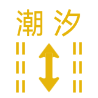

# trafficLane

车道线映射关系。

| trafficLane（16进制） | 显示内容参考样式 | 含义 |
| --- | --- | --- |
| 0001 |  | 公交车道。 |
| 0002 |  | 未选中车道-公交车道。 |
| 0003 |  | 可变车道。 |
| 0004 |  | 未选中车道-可变车道。 |
| 0005 |  | 未划线车道。 |
| 0006 |  | 未选中车道-未划线车道。 |
| 0007 |  | 左转掉头车道。 |
| 0008 |  | 未选中车道-左转掉头车道。 |
| 0009 |  | 左转车道。 |
| 000A |  | 未选中车道-左转车道。 |
| 000B |  | 直行车道。 |
| 000C |  | 未选中车道-直行车道。 |
| 000D |  | 右转车道。 |
| 000E |  | 未选中车道-右转车道。 |
| 000F |  | 右转掉头车道。 |
| 0010 |  | 未选中车道-右转掉头车道。 |
| 0011 |  | 双向行驶车道。 |
| 0012 |  | 双向左转车道。 |
| 0013 |  | 双向右转车道。 |
| 0014 |  | 未选中车道-双向车道。 |
| 0015 |  | 左转直行双向行驶车道。 |
| 0016 |  | 左转直行双向直行车道。 |
| 0017 |  | 左转直行双向左转车道。 |
| 0018 |  | 未选中车道-左转直行双向行驶车道。 |
| 0019 |  | 右转直行双向行驶车道。 |
| 001A |  | 右转直行双向右转车道。 |
| 001B |  | 右转直行双向直行车道。 |
| 001C |  | 未选中车道-右转直行双向行驶车道。 |
| 001D |  | 左转掉头直行双向行驶车道。 |
| 001E |  | 左转掉头直行双向左转掉头车道。 |
| 001F |  | 左转掉头直行双向直行车道。 |
| 0020 |  | 未选中车道-左转掉头直行双向行驶车道。 |
| 0021 |  | 右转掉头直行双向行驶车道。 |
| 0022 |  | 右转掉头直行双向直行车道。 |
| 0023 |  | 右转掉头直行双向右转掉头车道。 |
| 0024 |  | 未选中车道-右转掉头直行双向行驶车道。 |
| 0025 |  | 左转掉头左转双向行驶车道。 |
| 0026 |  | 左转掉头左转双向左转掉头车道。 |
| 0027 |  | 左转掉头左转双向左转车道。 |
| 0028 |  | 未选中车道-左转掉头左转双向行驶车道。 |
| 0029 |  | 右转掉头右转双向行驶车道。 |
| 002A |  | 右转掉头右转双向右转车道。 |
| 002B |  | 右转掉头右转双向右转掉头车道。 |
| 002C |  | 未选中车道-右转掉头右转双向行驶车道。 |
| 002D |  | 右转掉头左转双向行驶车道。 |
| 002E |  | 右转掉头左转双向右转掉头车道。 |
| 002F |  | 右转掉头左转双向左转车道。 |
| 0030 |  | 未选中车道-右转掉头左转双向行驶车道。 |
| 0031 |  | 右转左转掉头双向行驶车道。 |
| 0032 |  | 右转左转掉头双向右转车道。 |
| 0033 |  | 右转左转掉头双向左转掉头车道。 |
| 0034 |  | 未选中车道-右转左转掉头双向行驶车道。 |
| 0035 |  | 左转直行右转三向行驶车道。 |
| 0036 |  | 左转直行右转三向直行车道。 |
| 0037 |  | 左转直行右转三向右转车道。 |
| 0038 |  | 左转直行右转三向左转车道。 |
| 0039 |  | 未选中车道-左转直行右转三向行驶车道。 |
| 003A |  | 左转掉头左转直行三向行驶车道。 |
| 003B |  | 左转掉头左转直行三向直行车道。 |
| 003C |  | 左转掉头左转直行三向左转车道。 |
| 003D |  | 左转掉头左转直行三向左转掉头车道。 |
| 003E |  | 未选中车道-左转掉头左转直行三向行驶车道。 |
| 003F |  | 左转掉头直行右转三向行驶车道。 |
| 0040 |  | 左转掉头直行右转三向左转掉头车道。 |
| 0041 |  | 左转掉头直行右转三向直行车道。 |
| 0042 |  | 左转掉头直行右转三向右转车道。 |
| 0043 |  | 未选中车道-左转掉头直行右转三向行驶车道。 |
| 0044 |  | 左转掉头左转右转三向行驶车道。 |
| 0045 |  | 左转掉头左转右转三向右转车道。 |
| 0046 |  | 左转掉头左转右转三向左转掉头车道。 |
| 0047 |  | 左转掉头左转右转三向左转车道。 |
| 0048 |  | 未选中车道-左转掉头左转右转三向行驶车道。 |
| 0049 |  | 左转掉头左转直行右转四向直行车道。 |
| 004A |  | 左转掉头左转直行右转四向左转车道。 |
| 004B |  | 左转掉头左转直行右转四向右转车道。 |
| 004C |  | 左转掉头左转直行右转四向左转掉头车道。 |
| 004D |  | 左转掉头左转直行右转四向行驶车道。 |
| 004E |  | 未选中车道-左转掉头左转直行右转四向行驶车道。 |
| 004F |  | 向右前方行驶车道。 |
| 0050 |  | 未选中车道-向右前方行驶车道。 |
| 0051 |  | 直行右前方行驶双向直行车道。 |
| 0052 |  | 直行右前方行驶双向右前方行驶车道。 |
| 0053 |  | 直行右前方行驶双向车道。 |
| 0054 |  | 未选中车道-直行右前方行驶双向车道。 |
| 0055 |  | 右前方行驶右转双向右前方行驶车道。 |
| 0056 |  | 右前方行驶右转双向右转车道。 |
| 0057 |  | 右前方行驶右转双向车道。 |
| 0058 |  | 未选中车道-右前方行驶右转双向车道。 |
| 0059 |  | 直行右前方行驶右转三向直行车道。 |
| 005A |  | 直行右前方行驶右转三向右前方行驶车道。 |
| 005B |  | 直行右前方行驶右转三向右转车道。 |
| 005C |  | 直行右前方行驶右转三向车道。 |
| 005D |  | 未选中车道-直行右前方行驶右转三向车道。 |
| 005E |  | 向右后方行驶车道。 |
| 005F |  | 未选中车道-向右后方行驶车道。 |
| 0060 |  | 直行右后方行驶双向直行车道。 |
| 0061 |  | 直行右后方行驶双向右后行驶车道。 |
| 0062 |  | 直行右后方行驶双向行驶车道。 |
| 0063 |  | 未选中车道-直行右后方行驶双向行驶车道。 |
| 0064 |  | 右前右后行驶双向右前方行驶车道。 |
| 0065 |  | 右前右后行驶双向右后方行驶车道。 |
| 0066 |  | 右前右后行驶双向行驶车道。 |
| 0067 |  | 未选中车道-右前右后行驶双向行驶车道。 |
| 0068 |  | 直行右前右后行驶三向直行车道。 |
| 0069 |  | 直行右前右后行驶三向右前行驶车道。 |
| 006A |  | 直行右前右后行驶三向右后行驶车道。 |
| 006B |  | 直行右前右后行驶三向行驶车道。 |
| 006C |  | 未选中车道-直行右前右后行驶三向行驶车道。 |
| 006D |  | 右转右后行驶双向右转车道。 |
| 006E |  | 右转右后行驶双向向右后行驶车道。 |
| 006F |  | 右转右后行驶双向行驶车道。 |
| 0070 |  | 未选中车道-右转右后行驶双向行驶车道。 |
| 0071 |  | 直行右转右后行驶三向直行车道。 |
| 0072 |  | 直行右转右后行驶三向右转车道。 |
| 0073 |  | 直行右转右后行驶三向右后行驶车道。 |
| 0074 |  | 直行右转右后行驶三向行驶车道。 |
| 0075 |  | 未选中车道-直行右转右后行驶三向行驶车道。 |
| 0076 |  | 直行右前右转右后四向直行车道。 |
| 0077 |  | 直行右前右转右后四向右前行驶车道。 |
| 0078 |  | 直行右前右转右后四向右转车道。 |
| 0079 |  | 直行右前右转右后四向右后行驶车道。 |
| 007A |  | 直行右前右转右后四向行驶车道。 |
| 007B |  | 未选中车道-直行右前右转右后四向行驶车道。 |
| 007C |  | 右前左转掉头双向右前行驶车道。 |
| 007D |  | 右前左转掉头双向左转掉头车道。 |
| 007E |  | 右前左转掉头双向行驶车道。 |
| 007F |  | 未选中车道-右前左转掉头双向行驶车道。 |
| 0080 |  | 左转掉头直行右前三向直行车道。 |
| 0081 |  | 左转掉头直行右前三向右前行驶车道。 |
| 0082 |  | 左转掉头直行右前三向左转掉头车道。 |
| 0083 |  | 左转掉头直行右前三向行驶车道。 |
| 0084 |  | 未选中车道-左转掉头直行右前三向行驶车道。 |
| 0085 |  | 左转掉头直行右后三向直行车道。 |
| 0086 |  | 左转掉头直行右后三向右后行驶车道。 |
| 0087 |  | 左转掉头直行右后三向左转掉头车道。 |
| 0088 |  | 左转掉头直行右后三向行驶车道。 |
| 0089 |  | 未选中车道-左转掉头直行右后三向行驶车道。 |
| 008A |  | 左转掉头直行右转右后四向直行车道。 |
| 008B |  | 左转掉头直行右转右后四向右转车道。 |
| 008C |  | 左转掉头直行右转右后四向右后行驶车道。 |
| 008D |  | 左转掉头直行右转右后四向左转掉头车道。 |
| 008E |  | 左转掉头直行右转右后四向行驶车道。 |
| 008F |  | 未选中车道-左转掉头直行右转右后四向行驶车道。 |
| 0090 |  | 向左后行驶车道。 |
| 0091 |  | 未选中车道-向左后行驶车道。 |
| 0092 |  | 左后直行双向直行车道。 |
| 0093 |  | 左后直行双向左后行驶车道。 |
| 0094 |  | 左后直行双向行驶车道。 |
| 0095 |  | 未选中车道-左后直行双向行驶车道。 |
| 0096 |  | 左后右前双向右前行驶车道。 |
| 0097 |  | 左后右前双向左后行驶车道。 |
| 0098 |  | 左后右前双向行驶车道。 |
| 0099 |  | 未选中车道-左后右前双向行驶车道。 |
| 009A |  | 左后直行右前三向直行车道。 |
| 009B |  | 左后直行右前三向右前行驶车道。 |
| 009C |  | 左后直行右前三向左后行驶车道。 |
| 009D |  | 左后直行右前三向行驶车道。 |
| 009E |  | 未选中车道-左后直行右前三向行驶车道。 |
| 009F |  | 左后右转双向右转车道。 |
| 00A0 |  | 左后右转双向左后行驶车道。 |
| 00A1 |  | 左后右转双向行驶车道。 |
| 00A2 |  | 未选中车道-左后右转双向行驶车道。 |
| 00A3 |  | 左后直行右转三向直行车道。 |
| 00A4 |  | 左后直行右转三向右转车道。 |
| 00A5 |  | 左后直行右转三向左后行驶车道。 |
| 00A6 |  | 左后直行右转三向行驶车道。 |
| 00A7 |  | 未选中车道-左后直行右转三向行驶车道。 |
| 00A8 |  | 左后右后双向右后行驶车道。 |
| 00A9 |  | 左后右后双向左后行驶车道。 |
| 00AA |  | 左后右后双向行驶车道。 |
| 00AB |  | 未选中车道-左后右后双向行驶车道。 |
| 00AC |  | 左后直行右后三向直行车道。 |
| 00AD |  | 左后直行右后三向右后行驶车道。 |
| 00AE |  | 左后直行右后三向左后行驶车道。 |
| 00AF |  | 左后直行右后三向行驶车道。 |
| 00B0 |  | 未选中车道-左后直行右后三向行驶车道。 |
| 00B1 |  | 左后右前右后三向右前行驶车道。 |
| 00B2 |  | 左后右前右后三向右后行驶车道。 |
| 00B3 |  | 左后右前右后三向左后行驶车道。 |
| 00B4 |  | 左后右前右后三向行驶车道。 |
| 00B5 |  | 未选中车道-左后右前右后三向行驶车道。 |
| 00B6 |  | 左后右转右后三向右转车道。 |
| 00B7 |  | 左后右转右后三向右后行驶车道。 |
| 00B8 |  | 左后右转右后三向左后行驶车道。 |
| 00B9 |  | 左后右转右后三向行驶车道。 |
| 00BA |  | 未选中车道-左后右转右后三向行驶车道。 |
| 00BB |  | 左后车道左转掉头双向左转掉头车道。 |
| 00BC |  | 左后车道左转掉头双向左后行驶车道。 |
| 00BD |  | 左后车道左转掉头双向行驶车道。 |
| 00BE |  | 未选中车道-左后车道左转掉头双向行驶车道。 |
| 00BF |  | 直行左转掉头左后行驶三向直行车道。 |
| 00C0 |  | 直行左转掉头左后行驶三向左转掉头车道。 |
| 00C1 |  | 直行左转掉头左后行驶三向左后行驶车道。 |
| 00C2 |  | 直行左转掉头左后行驶三向行驶车道。 |
| 00C3 |  | 未选中车道-直行左转掉头左后行驶三向行驶车道。 |
| 00C4 |  | 直行左后行驶左后掉头右转四向直行车道。 |
| 00C5 |  | 直行左后行驶左后掉头右转四向右转车道。 |
| 00C6 |  | 直行左后行驶左后掉头右转四向左转掉头车道。 |
| 00C7 |  | 直行左后行驶左后掉头右转四向左后行驶车道。 |
| 00C8 |  | 直行左后行驶左后掉头右转四向行驶车道。 |
| 00C9 |  | 未选中车道-直行左后行驶左后掉头右转四向行驶车道。 |
| 00CA |  | 右前行驶左转双向右前行驶车道。 |
| 00CB |  | 右前行驶左转双向左转车道。 |
| 00CC |  | 右前行驶左转双向行驶车道。 |
| 00CD |  | 未选中车道-右前行驶左转双向行驶车道。 |
| 00CE |  | 左转直行右前行驶三向直行车道。 |
| 00CF |  | 左转直行右前行驶三向右前行驶车道。 |
| 00D0 |  | 左转直行右前行驶三向左转车道。 |
| 00D1 |  | 左转直行右前行驶三向行驶车道。 |
| 00D2 |  | 未选中车道-左转直行右前行驶三向行驶车道。 |
| 00D3 |  | 左转右前行驶右转三向右前行驶车道。 |
| 00D4 |  | 左转右前行驶右转三向右转车道。 |
| 00D5 |  | 左转右前行驶右转三向左转车道。 |
| 00D6 |  | 左转右前行驶右转三向行驶车道。 |
| 00D7 |  | 未选中车道-左转右前行驶右转三向行驶车道。 |
| 00D8 |  | 左转直行右前行驶右转四向直行车道。 |
| 00D9 |  | 左转直行右前行驶右转四向右前行驶车道。 |
| 00DA |  | 左转直行右前行驶右转四向右转车道。 |
| 00DB |  | 左转直行右前行驶右转四向左转车道。 |
| 00DC |  | 左转直行右前行驶右转四向行驶车道。 |
| 00DD |  | 未选中车道-左转直行右前行驶右转四向行驶车道。 |
| 00DE |  | 左转右后行驶双向右后行驶车道。 |
| 00DF |  | 左转右后行驶双向左转车道。 |
| 00E0 |  | 左转右后行驶双向行驶车道。 |
| 00E1 |  | 未选中车道-左转右后行驶双向行驶车道。 |
| 00E2 |  | 左转直行右后行驶三向直行车道。 |
| 00E3 |  | 左转直行右后行驶三向右后行驶车道。 |
| 00E4 |  | 左转直行右后行驶三向左转车道。 |
| 00E5 |  | 左转直行右后行驶三向行驶车道。 |
| 00E6 |  | 未选中车道-左转直行右后行驶三向行驶车道。 |
| 00E7 |  | 左转直行右前右后行驶四向直行车道。 |
| 00E8 |  | 左转直行右前右后行驶四向右前行驶车道。 |
| 00E9 |  | 左转直行右前右后行驶四向右后行驶车道。 |
| 00EA |  | 左转直行右前右后行驶四向左转车道。 |
| 00EB |  | 左转直行右前右后行驶四向行驶车道。 |
| 00EC |  | 未选中车道-左转直行右前右后行驶四向行驶车道。 |
| 00ED |  | 左转右转右后行驶三向右转车道。 |
| 00EE |  | 左转右转右后行驶三向右后行驶车道。 |
| 00EF |  | 左转右转右后行驶三向左转车道。 |
| 00F0 |  | 左转右转右后行驶三向行驶车道。 |
| 00F1 |  | 未选中车道-左转右转右后行驶三向行驶车道。 |
| 00F2 |  | 左转直行右转右后行驶四向直行车道。 |
| 00F3 |  | 左转直行右转右后行驶四向右转车道。 |
| 00F4 |  | 左转直行右转右后行驶四向右后行驶车道。 |
| 00F5 |  | 左转直行右转右后行驶四向左转车道。 |
| 00F6 |  | 左转直行右转右后行驶四向行驶车道。 |
| 00F7 |  | 未选中车道-左转直行右转右后行驶四向行驶车道。 |
| 00F8 |  | 左转掉头左转直行右后行驶四向直行车道。 |
| 00F9 |  | 左转掉头左转直行右后行驶四向右后行驶车道。 |
| 00FA |  | 左转掉头左转直行右后行驶四向左转掉头车道。 |
| 00FB |  | 左转掉头左转直行右后行驶四向左转车道。 |
| 00FC |  | 左转掉头左转直行右后行驶四向行驶车道。 |
| 00FD |  | 未选中车道-左转掉头左转直行右后行驶四向行驶车道。 |
| 00FE |  | 左后行驶左转双向左后行驶车道。 |
| 00FF |  | 左后行驶左转双向左转车道。 |
| 0100 |  | 左后行驶左转双向行驶车道。 |
| 0101 |  | 未选中车道-左后行驶左转双向行驶车道。 |
| 0102 |  | 左后行驶左转直行三向直行车道。 |
| 0103 |  | 左后行驶左转直行三向左后行驶车道。 |
| 0104 |  | 左后行驶左转直行三向左转车道。 |
| 0105 |  | 左后行驶左转直行三向行驶车道。 |
| 0106 |  | 未选中车道-左后行驶左转直行三向行驶车道。 |
| 0107 |  | 左后行驶左转直行右转四向直行车道。 |
| 0108 |  | 左后行驶左转直行右转四向右转车道。 |
| 0109 |  | 左后行驶左转直行右转四向左后行驶车道。 |
| 010A |  | 左后行驶左转直行右转四向左转车道。 |
| 010B |  | 左后行驶左转直行右转四向行驶车道。 |
| 010C |  | 未选中车道-左后行驶左转直行右转四向行驶车道。 |
| 010D |  | 左转掉头左后行驶左转直行四向直行车道。 |
| 010E |  | 左转掉头左后行驶左转直行四向左转掉头车道。 |
| 010F |  | 左转掉头左后行驶左转直行四向左后行驶车道。 |
| 0110 |  | 左转掉头左后行驶左转直行四向左转车道。 |
| 0111 |  | 左转掉头左后行驶左转直行四向行驶车道。 |
| 0112 |  | 未选中车道-左转掉头左后行驶左转直行四向行驶车道。 |
| 0113 |  | 左转掉头左后行驶左转直行右前行驶右转六向直行车道。 |
| 0114 |  | 左转掉头左后行驶左转直行右前行驶右转六向右前行驶车道。 |
| 0115 |  | 左转掉头左后行驶左转直行右前行驶右转六向右转车道。 |
| 0116 |  | 左转掉头左后行驶左转直行右前行驶右转六向左转掉头车道。 |
| 0117 |  | 左转掉头左后行驶左转直行右前行驶右转六向左后行驶车道。 |
| 0118 |  | 左转掉头左后行驶左转直行右前行驶右转六向左转车道。 |
| 0119 |  | 左转掉头左后行驶左转直行右前行驶右转六向行驶车道。 |
| 011A |  | 未选中车道-左转掉头左后行驶左转直行右前行驶右转六向行驶车道。 |
| 011B |  | 向左前行驶车道。 |
| 011C |  | 未选中车道-向左前行驶车道。 |
| 011D |  | 左前行驶直行双向直行车道。 |
| 011E |  | 左前行驶直行双向左前行驶车道。 |
| 011F |  | 左前行驶直行双向行驶车道。 |
| 0120 |  | 未选中车道-左前行驶直行双向行驶车道。 |
| 0121 |  | 左前右前行驶双向右前行驶车道。 |
| 0122 |  | 左前右前行驶双向左前行驶车道。 |
| 0123 |  | 左前右前行驶双向行驶车道。 |
| 0124 |  | 未选中车道-左前右前行驶双向行驶车道。 |
| 0125 |  | 左前行驶直行右前行驶三向直行车道。 |
| 0126 |  | 左前行驶直行右前行驶三向右前行驶车道。 |
| 0127 |  | 左前行驶直行右前行驶三向左前行驶车道。 |
| 0128 |  | 左前行驶直行右前行驶三向行驶车道。 |
| 0129 |  | 未选中车道-左前行驶直行右前行驶三向行驶车道。 |
| 012A |  | 左前行驶右转双向右转车道。 |
| 012B |  | 左前行驶右转双向左前行驶车道。 |
| 012C |  | 左前行驶右转双向行驶车道。 |
| 012D |  | 未选中车道-左前行驶右转双向行驶车道。 |
| 012E |  | 左前行驶直行右转三向直行车道。 |
| 012F |  | 左前行驶直行右转三向右转车道。 |
| 0130 |  | 左前行驶直行右转三向左前行驶车道。 |
| 0131 |  | 左前行驶直行右转三向行驶车道。 |
| 0132 |  | 未选中车道-左前行驶直行右转三向行驶车道。 |
| 0133 |  | 左前右前行驶右转三向右前行驶车道。 |
| 0134 |  | 左前右前行驶右转三向右转车道。 |
| 0135 |  | 左前右前行驶右转三向左前行驶车道。 |
| 0136 |  | 左前右前行驶右转三向行驶车道。 |
| 0137 |  | 未选中车道-左前右前行驶右转三向行驶车道。 |
| 0138 |  | 左前行驶直行右前行驶右转四向直行车道。 |
| 0139 |  | 左前行驶直行右前行驶右转四向右前行驶车道。 |
| 013A |  | 左前行驶直行右前行驶右转四向右转车道。 |
| 013B |  | 左前行驶直行右前行驶右转四向左前行驶车道。 |
| 013C |  | 左前行驶直行右前行驶右转四向行驶车道。 |
| 013D |  | 未选中车道-左前行驶直行右前行驶右转四向行驶车道。 |
| 013E |  | 左前行驶右后行驶双向右后行驶车道。 |
| 013F |  | 左前行驶右后行驶双向左前行驶车道。 |
| 0140 |  | 左前行驶右后行驶双向行驶车道。 |
| 0141 |  | 未选中车道-左前行驶右后行驶双向行驶车道。 |
| 0142 |  | 左前行驶直行右后行驶三向直行车道。 |
| 0143 |  | 左前行驶直行右后行驶三向右后行驶车道。 |
| 0144 |  | 左前行驶直行右后行驶三向左前行驶车道。 |
| 0145 |  | 左前行驶直行右后行驶三向行驶车道。 |
| 0146 |  | 未选中车道-左前行驶直行右后行驶三向行驶车道。 |
| 0147 |  | 左前行驶直行右前右后行驶四向直行车道。 |
| 0148 |  | 左前行驶直行右前右后行驶四向右前行驶车道。 |
| 0149 |  | 左前行驶直行右前右后行驶四向右后行驶车道。 |
| 014A |  | 左前行驶直行右前右后行驶四向左前行驶车道。 |
| 014B |  | 左前行驶直行右前右后行驶四向行驶车道。 |
| 014C |  | 未选中车道-左前行驶直行右前右后行驶四向行驶车道。 |
| 014D |  | 左前行驶直行右转右后行驶四向直行车道。 |
| 014E |  | 左前行驶直行右转右后行驶四向右转车道。 |
| 014F |  | 左前行驶直行右转右后行驶四向右后行驶车道。 |
| 0150 |  | 左前行驶直行右转右后行驶四向左前行驶车道。 |
| 0151 |  | 左前行驶直行右转右后行驶四向行驶车道。 |
| 0152 |  | 未选中车道-左前行驶直行右转右后行驶四向行驶车道。 |
| 0153 |  | 左转掉头左前行驶双向左转掉头车道。 |
| 0154 |  | 左转掉头左前行驶双向左前行驶车道。 |
| 0155 |  | 左转掉头左前行驶双向行驶车道。 |
| 0156 |  | 未选中车道-左转掉头左前行驶双向行驶车道。 |
| 0157 |  | 左转掉头左前行驶直行三向直行车道。 |
| 0158 |  | 左转掉头左前行驶直行三向左转掉头车道。 |
| 0159 |  | 左转掉头左前行驶直行三向左前行驶车道。 |
| 015A |  | 左转掉头左前行驶直行三向行驶车道。 |
| 015B |  | 未选中车道-左转掉头左前行驶直行三向行驶车道。 |
| 015C |  | 左转掉头左前行驶直行右前行驶四向直行车道。 |
| 015D |  | 左转掉头左前行驶直行右前行驶四向右前行驶车道。 |
| 015E |  | 左转掉头左前行驶直行右前行驶四向左转掉头车道。 |
| 015F |  | 左转掉头左前行驶直行右前行驶四向左前行驶车道。 |
| 0160 |  | 左转掉头左前行驶直行右前行驶四向行驶车道。 |
| 0161 |  | 未选中车道-左转掉头左前行驶直行右前行驶四向行驶车道。 |
| 0162 |  | 左转掉头左前行驶右转三向右转车道。 |
| 0163 |  | 左转掉头左前行驶右转三向左转掉头车道。 |
| 0164 |  | 左转掉头左前行驶右转三向左前行驶车道。 |
| 0165 |  | 左转掉头左前行驶右转三向行驶车道。 |
| 0166 |  | 未选中车道-左转掉头左前行驶右转三向行驶车道。 |
| 0167 |  | 左转掉头左前行驶直行右转四向直行车道。 |
| 0168 |  | 左转掉头左前行驶直行右转四向右转车道。 |
| 0169 |  | 左转掉头左前行驶直行右转四向左转掉头车道。 |
| 016A |  | 左转掉头左前行驶直行右转四向左前行驶车道。 |
| 016B |  | 左转掉头左前行驶直行右转四向行驶车道。 |
| 016C |  | 未选中车道-左转掉头左前行驶直行右转四向行驶车道。 |
| 016D |  | 左后左前行驶双向左后行驶车道。 |
| 016E |  | 左后左前行驶双向左前行驶车道。 |
| 016F |  | 左后左前行驶双向行驶车道。 |
| 0170 |  | 未选中车道-左后左前行驶双向行驶车道。 |
| 0171 |  | 左后左前行驶直行三向直行车道。 |
| 0172 |  | 左后左前行驶直行三向左后行驶车道。 |
| 0173 |  | 左后左前行驶直行三向左前行驶车道。 |
| 0174 |  | 左后左前行驶直行三向行驶车道。 |
| 0175 |  | 未选中车道-左后左前行驶直行三向行驶车道。 |
| 0176 |  | 左后左前行驶直行右转四向直行车道。 |
| 0177 |  | 左后左前行驶直行右转四向右转车道。 |
| 0178 |  | 左后左前行驶直行右转四向左后行驶车道。 |
| 0179 |  | 左后左前行驶直行右转四向左前行驶车道。 |
| 017A |  | 左后左前行驶直行右转四向行驶车道。 |
| 017B |  | 未选中车道-左后左前行驶直行右转四向行驶车道。 |
| 017C |  | 左后左前右后行驶三向右后行驶车道。 |
| 017D |  | 左后左前右后行驶三向左后行驶车道。 |
| 017E |  | 左后左前右后行驶三向左前行驶车道。 |
| 017F |  | 左后左前右后行驶三向行驶车道。 |
| 0180 |  | 未选中车道-左后左前右后行驶三向行驶车道。 |
| 0181 |  | 左后左前行驶直行右后行驶四向直行车道。 |
| 0182 |  | 左后左前行驶直行右后行驶四向右后行驶车道。 |
| 0183 |  | 左后左前行驶直行右后行驶四向左后行驶车道。 |
| 0184 |  | 左后左前行驶直行右后行驶四向左前行驶车道。 |
| 0185 |  | 左后左前行驶直行右后行驶四向行驶车道。 |
| 0186 |  | 未选中车道-左后左前行驶直行右后行驶四向行驶车道。 |
| 0187 |  | 左转掉头左后左前行驶直行四向直行车道。 |
| 0188 |  | 左转掉头左后左前行驶直行四向左转掉头车道。 |
| 0189 |  | 左转掉头左后左前行驶直行四向左后行驶车道。 |
| 018A |  | 左转掉头左后左前行驶直行四向左前行驶车道。 |
| 018B |  | 左转掉头左后左前行驶直行四向行驶车道。 |
| 018C |  | 未选中车道-左转掉头左后左前行驶直行四向行驶车道。 |
| 018D |  | 左转左前行驶双向左转车道。 |
| 018E |  | 左转左前行驶双向左前行驶车道。 |
| 018F |  | 左转左前行驶双向行驶车道。 |
| 0190 |  | 未选中车道-左转左前行驶双向行驶车道。 |
| 0191 |  | 左转左前行驶直行三向直行车道。 |
| 0192 |  | 左转左前行驶直行三向左转车道。 |
| 0193 |  | 左转左前行驶直行三向左前行驶车道。 |
| 0194 |  | 左转左前行驶直行三向行驶车道。 |
| 0195 |  | 未选中车道-左转左前行驶直行三向行驶车道。 |
| 0196 |  | 左转左前行驶直行右前行驶四向直行车道。 |
| 0197 |  | 左转左前行驶直行右前行驶四向右前行驶车道。 |
| 0198 |  | 左转左前行驶直行右前行驶四向左转车道。 |
| 0199 |  | 左转左前行驶直行右前行驶四向左前行驶车道。 |
| 019A |  | 左转左前行驶直行右前行驶四向行驶车道。 |
| 019B |  | 未选中车道-左转左前行驶直行右前行驶四向行驶车道。 |
| 019C |  | 左转左前行驶右转三向右转车道。 |
| 019D |  | 左转左前行驶右转三向左转车道。 |
| 019E |  | 左转左前行驶右转三向左前行驶车道。 |
| 019F |  | 左转左前行驶右转三向行驶车道。 |
| 01A0 |  | 未选中车道-左转左前行驶右转三向行驶车道。 |
| 01A1 |  | 左转左前行驶直行右转四向直行车道。 |
| 01A2 |  | 左转左前行驶直行右转四向右转车道。 |
| 01A3 |  | 左转左前行驶直行右转四向左转车道。 |
| 01A4 |  | 左转左前行驶直行右转四向左前行驶车道。 |
| 01A5 |  | 左转左前行驶直行右转四向行驶车道。 |
| 01A6 |  | 未选中车道-左转左前行驶直行右转四向行驶车道。 |
| 01A7 |  | 左转左前行驶右前行驶右转四向右前行驶车道。 |
| 01A8 |  | 左转左前行驶右前行驶右转四向右转车道。 |
| 01A9 |  | 左转左前行驶右前行驶右转四向左转车道。 |
| 01AA |  | 左转左前行驶右前行驶右转四向左前行驶车道。 |
| 01AB |  | 左转左前行驶右前行驶右转四向行驶车道。 |
| 01AC |  | 未选中车道-左转左前行驶右前行驶右转四向行驶车道。 |
| 01AD |  | 左转左前行驶直行右后行驶四向直行车道。 |
| 01AE |  | 左转左前行驶直行右后行驶四向右后行驶车道。 |
| 01AF |  | 左转左前行驶直行右后行驶四向左转车道。 |
| 01B0 |  | 左转左前行驶直行右后行驶四向左前行驶车道。 |
| 01B1 |  | 左转左前行驶直行右后行驶四向行驶车道。 |
| 01B2 |  | 未选中车道-左转左前行驶直行右后行驶四向行驶车道。 |
| 01B3 |  | 左转左前行驶直行右转右后行驶五向直行车道。 |
| 01B4 |  | 左转左前行驶直行右转右后行驶五向右转车道。 |
| 01B5 |  | 左转左前行驶直行右转右后行驶五向右后行驶车道。 |
| 01B6 |  | 左转左前行驶直行右转右后行驶五向左转车道。 |
| 01B7 |  | 左转左前行驶直行右转右后行驶五向左前行驶车道。 |
| 01B8 |  | 左转左前行驶直行右转右后行驶五向行驶车道。 |
| 01B9 |  | 未选中车道-左转左前行驶直行右转右后行驶五向行驶车道。 |
| 01BA |  | 左转掉头左转左前行驶三向左转掉头车道。 |
| 01BB |  | 左转掉头左转左前行驶三向左转车道。 |
| 01BC |  | 左转掉头左转左前行驶三向左前行驶车道。 |
| 01BD |  | 左转掉头左转左前行驶三向行驶车道。 |
| 01BE |  | 未选中车道-左转掉头左转左前行驶三向行驶车道。 |
| 01BF |  | 左转掉头左转左前行驶直行四向直行车道。 |
| 01C0 |  | 左转掉头左转左前行驶直行四向左转掉头车道。 |
| 01C1 |  | 左转掉头左转左前行驶直行四向左转车道。 |
| 01C2 |  | 左转掉头左转左前行驶直行四向左前行驶车道。 |
| 01C3 |  | 左转掉头左转左前行驶直行四向行驶车道。 |
| 01C4 |  | 未选中车道-左转掉头左转左前行驶直行四向行驶车道。 |
| 01C5 |  | 左后行驶左转左前行驶直行四向直行车道。 |
| 01C6 |  | 左后行驶左转左前行驶直行四向左后行驶车道。 |
| 01C7 |  | 左后行驶左转左前行驶直行四向左转车道。 |
| 01C8 |  | 左后行驶左转左前行驶直行四向左前行驶车道。 |
| 01C9 |  | 左后行驶左转左前行驶直行四向行驶车道。 |
| 01CA |  | 未选中车道-左后行驶左转左前行驶直行四向行驶车道。 |
| 01CB |  | 左转掉头左后行驶左转左前行驶直行五向直行车道。 |
| 01CC |  | 左转掉头左后行驶左转左前行驶直行五向左转掉头车道。 |
| 01CD |  | 左转掉头左后行驶左转左前行驶直行五向左后行驶车道。 |
| 01CE |  | 左转掉头左后行驶左转左前行驶直行五向左转车道。 |
| 01CF |  | 左转掉头左后行驶左转左前行驶直行五向左前行驶车道。 |
| 01D0 |  | 左转掉头左后行驶左转左前行驶直行五向行驶车道。 |
| 01D1 |  | 未选中车道-左转掉头左后行驶左转左前行驶直行五向行驶车道。 |
| 01D2 |  | 右前行驶右转掉头双向右前行驶车道。 |
| 01D3 |  | 右前行驶右转掉头双向右转掉头车道。 |
| 01D4 |  | 右前行驶右转掉头双向行驶车道。 |
| 01D5 |  | 未选中车道-右前行驶右转掉头双向行驶车道。 |
| 01D6 |  | 直行右前行驶右转掉头三向直行车道。 |
| 01D7 |  | 直行右前行驶右转掉头三向右前行驶车道。 |
| 01D8 |  | 直行右前行驶右转掉头三向右转掉头车道。 |
| 01D9 |  | 直行右前行驶右转掉头三向行驶车道。 |
| 01DA |  | 未选中车道-直行右前行驶右转掉头三向行驶车道。 |
| 01DB |  | 直行右转右转掉头三向直行车道。 |
| 01DC |  | 直行右转右转掉头三向右转车道。 |
| 01DD |  | 直行右转右转掉头三向右转掉头车道。 |
| 01DE |  | 直行右转右转掉头三向行驶车道。 |
| 01DF |  | 未选中车道-直行右转右转掉头三向行驶车道。 |
| 01E0 |  | 左转直行右转掉头三向直行车道。 |
| 01E1 |  | 左转直行右转掉头三向左转车道。 |
| 01E2 |  | 左转直行右转掉头三向右转掉头车道。 |
| 01E3 |  | 左转直行右转掉头三向行驶车道。 |
| 01E4 |  | 未选中车道-左转直行右转掉头三向行驶车道。 |
| 01E5 |  | 左前行驶直行右转掉头三向直行车道。 |
| 01E6 |  | 左前行驶直行右转掉头三向左前行驶车道。 |
| 01E7 |  | 左前行驶直行右转掉头三向右转掉头车道。 |
| 01E8 |  | 左前行驶直行右转掉头三向行驶车道。 |
| 01E9 |  | 未选中车道-左前行驶直行右转掉头三向行驶车道。 |
| 01EA |  | 潮汐车道。 |
| 03E7 | - | 无效值。 |
