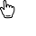
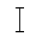
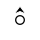
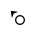
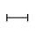

# @ohos.multimodalInput.pointer (鼠标光标)

本模块提供鼠标光标管理能力，包括查询、设置鼠标光标属性。


- 本模块首批接口从API version 9开始支持。后续版本的新增接口，采用上角标单独标记接口的起始版本。

#### 导入模块

```
import { pointer } from '@kit.InputKit';
```

#### pointer.setPointerVisible

setPointerVisible(visible: boolean, callback: AsyncCallback<void>): void

设置当前窗口的鼠标光标是否显示，使用callback异步回调。

系统能力：SystemCapability.MultimodalInput.Input.Pointer

参数：

| 参数名 | 类型 | 必填 | 说明 |
| --- | --- | --- | --- |
| visible | boolean | 是 | 当前窗口鼠标光标是否显示。true表示显示，false表示不显示。 |
| callback | AsyncCallback | 是 | 回调函数。当设置鼠标光标显示状态成功，err为undefined，否则为错误对象。 |

错误码：

以下错误码的详细介绍请参见[通用错误码](https://developer.huawei.com/consumer/cn/doc/harmonyos-references/errorcode-universal)。

| 错误码ID | 错误信息 |
| --- | --- |
| 401 | Parameter error. Possible causes: 1. Mandatory parameters are left unspecified; 2. Incorrect parameter types; 3. Parameter verification failed. |
| 801 | Capability not supported. |

示例：

```
import { pointer } from '@kit.InputKit';
import { BusinessError } from '@kit.BasicServicesKit';

@Entry
@Component
struct Index {
  build() {
    RelativeContainer() {
      Text()
        .onClick(() => {
          try {
            // 设置鼠标指针可见性
            pointer.setPointerVisible(true, (error: BusinessError) => {
              if (error) {
                console.error(`Failed to set pointer cursor visible, Code: ${(error as BusinessError).code}, message: ${(error as BusinessError).message}.`);
                return;
              }
              console.info(`Succeeded in setting pointer cursor visible.`);
            });
          } catch (error) {
            console.error(`Failed to set pointer cursor visible, Code: ${(error as BusinessError).code}, message: ${(error as BusinessError).message}.`);
          }
        })
    }
  }
}
```

#### pointer.setPointerVisible

setPointerVisible(visible: boolean): Promise<void>

设置当前窗口的鼠标光标是否显示，使用Promise异步回调。

系统能力：SystemCapability.MultimodalInput.Input.Pointer

参数：

| 参数名 | 类型 | 必填 | 说明 |
| --- | --- | --- | --- |
| visible | boolean | 是 | 当前窗口鼠标光标是否显示。true表示显示，false表示不显示。 |

返回值：

| 类型 | 说明 |
| --- | --- |
| Promise | Promise对象，无返回结果。 |

错误码：

以下错误码的详细介绍请参见[通用错误码](https://developer.huawei.com/consumer/cn/doc/harmonyos-references/errorcode-universal)。

| 错误码ID | 错误信息 |
| --- | --- |
| 401 | Parameter error. Possible causes: 1. Mandatory parameters are left unspecified; 2. Incorrect parameter types; 3. Parameter verification failed. |
| 801 | Capability not supported. |

示例：

```
import { pointer } from '@kit.InputKit';
import { BusinessError } from '@kit.BasicServicesKit';

@Entry
@Component
struct Index {
  build() {
    RelativeContainer() {
      Text()
        .onClick(() => {
          try {
            // 设置鼠标指针可见性
            pointer.setPointerVisible(false).then(() => {
              console.info(`Succeeded in setting pointer cursor visible.`);
            }).catch((error: BusinessError) => {
              console.error(`Failed to set pointer cursor, Code: ${(error as BusinessError).code}, message: ${(error as BusinessError).message}.`);
            })
          } catch (error) {
            console.error(`Failed to set pointer cursor, Code: ${(error as BusinessError).code}, message: ${(error as BusinessError).message}.`);
          }
        })
    }
  }
}
```

#### pointer.setPointerVisibleSync10+

setPointerVisibleSync(visible: boolean): void

设置当前窗口鼠标光标的显示状态，使用同步方式。

系统能力：SystemCapability.MultimodalInput.Input.Pointer

参数：

| 参数名 | 类型 | 必填 | 说明 |
| --- | --- | --- | --- |
| visible | boolean | 是 | 当前窗口鼠标光标是否显示。true表示显示，false表示不显示。 |

错误码：

以下错误码的详细介绍请参见[通用错误码](https://developer.huawei.com/consumer/cn/doc/harmonyos-references/errorcode-universal)。

| 错误码ID | 错误信息 |
| --- | --- |
| 401 | Parameter error. Possible causes: 1. Mandatory parameters are left unspecified; 2. Incorrect parameter types; 3. Parameter verification failed. |

示例：

```
import { pointer } from '@kit.InputKit';
import { BusinessError } from '@kit.BasicServicesKit';

@Entry
@Component
struct Index {
  build() {
    RelativeContainer() {
      Text()
        .onClick(() => {
          try {
            // 同步设置鼠标指针可见性
            pointer.setPointerVisibleSync(false);
            console.info(`Succeeded in setting pointer cursor visible.`);
          } catch (error) {
            console.error(`Failed to set pointer cursor visible, Code: ${(error as BusinessError).code}, message: ${(error as BusinessError).message}.`);
          }
        })
    }
  }
}
```

#### pointer.isPointerVisible

isPointerVisible(callback: AsyncCallback<boolean>): void

获取鼠标光标显示状态，使用callback异步回调。

系统能力：SystemCapability.MultimodalInput.Input.Pointer

参数：

| 参数名 | 类型 | 必填 | 说明 |
| --- | --- | --- | --- |
| callback | AsyncCallback | 是 | 回调函数。当获取鼠标光标显示状态成功，err为undefined，data为鼠标光标状态（true为显示，false为隐藏）；否则为错误对象。 |

错误码：

以下错误码的详细介绍请参见[通用错误码](https://developer.huawei.com/consumer/cn/doc/harmonyos-references/errorcode-universal)。

| 错误码ID | 错误信息 |
| --- | --- |
| 401 | Parameter error. Possible causes: 1. Mandatory parameters are left unspecified; 2. Incorrect parameter types; 3. Parameter verification failed. |

示例：

```
import { pointer } from '@kit.InputKit';
import { BusinessError } from '@kit.BasicServicesKit';

@Entry
@Component
struct Index {
  build() {
    RelativeContainer() {
      Text()
        .onClick(() => {
          try {
            // 查询鼠标指针是否可见
            pointer.isPointerVisible((error: BusinessError, visible: boolean) => {
              if (error) {
                console.error(`Failed to get pointer visible, Code: ${(error as BusinessError).code}, message: ${(error as BusinessError).message}.`);
                return;
              }
              console.info(`Succeeded in getting pointer visible, visible: ${JSON.stringify(visible)}.`);
            });
          } catch (error) {
            console.error(`Failed to get pointer visible, Code: ${(error as BusinessError).code}, message: ${(error as BusinessError).message}.`);
          }
        })
    }
  }
}
```

#### pointer.isPointerVisible

isPointerVisible(): Promise<boolean>

获取鼠标光标显示状态，使用Promise异步回调。

系统能力：SystemCapability.MultimodalInput.Input.Pointer

返回值：

| 类型 | 说明 |
| --- | --- |
| Promise | Promise对象。返回true表示鼠标光标为显示状态；返回false表示鼠标光标为隐藏状态。 |

示例：

```
import { pointer } from '@kit.InputKit';
import { BusinessError } from '@kit.BasicServicesKit';

@Entry
@Component
struct Index {
  build() {
    RelativeContainer() {
      Text()
        .onClick(() => {
          try {
            // 查询鼠标指针是否可见
            pointer.isPointerVisible().then((visible: boolean) => {
              console.info(`Succeeded in getting pointer visible, visible: ${JSON.stringify(visible)}.`);
            }).catch((error: BusinessError) => {
              console.error(`Failed to get pointer, Code: ${(error as BusinessError).code}, message: ${(error as BusinessError).message}.`);
            })
          } catch (error) {
            console.error(`Failed to get pointer visible, Code: ${(error as BusinessError).code}, message: ${(error as BusinessError).message}.`);
          }
        })
    }
  }
}
```

#### pointer.isPointerVisibleSync10+

isPointerVisibleSync(): boolean

获取当前窗口鼠标光标的显示状态，使用同步方式。

系统能力：SystemCapability.MultimodalInput.Input.Pointer

返回值：

| 类型 | 说明 |
| --- | --- |
| boolean | 返回鼠标光标显示或隐藏状态。true代表显示状态，false代表隐藏状态。 |

示例：

```
import { pointer } from '@kit.InputKit';
import { BusinessError } from '@kit.BasicServicesKit';

@Entry
@Component
struct Index {
  build() {
    RelativeContainer() {
      Text()
        .onClick(() => {
          try {
            let visible: boolean = pointer.isPointerVisibleSync();
            console.info(`Succeeded in getting pointer visible, visible: ${JSON.stringify(visible)}.`);
          } catch (error) {
            console.error(`Failed to get pointer visible, Code: ${(error as BusinessError).code}, message: ${(error as BusinessError).message}.`);
          }
        })
    }
  }
}
```

#### pointer.getPointerStyle

getPointerStyle(windowId: number, callback: AsyncCallback<PointerStyle>): void

获取指定窗口的鼠标样式类型，此接口仅支持获取本应用进程内窗口的鼠标样式类型，使用callback异步回调。

系统能力：SystemCapability.MultimodalInput.Input.Pointer

参数：

| 参数名 | 类型 | 必填 | 说明 |
| --- | --- | --- | --- |
| windowId | number | 是 | 窗口ID。取值范围为大于等于-1的整数，取值为-1时表示全局窗口。 窗口ID合法并且对应窗口存在时，返回窗口的鼠标光标样式。 窗口ID合法但窗口不存在时，默认返回全局鼠标光标样式。 如果通过[setPointerStyle](#pointersetpointerstyle)接口为不存在的窗口设置了鼠标光标样式，使用本接口可以正常获取到该光标样式。 |
| callback | AsyncCallback | 是 | 回调函数。当获取鼠标样式类型成功时，err为undefined，data为鼠标样式类型；否则为错误对象。在特定场景（在设置自定义光标样式的窗口上获取样式）下返回DEVELOPER_DEFINED_ICON。 |

错误码：

以下错误码的详细介绍请参见[通用错误码](https://developer.huawei.com/consumer/cn/doc/harmonyos-references/errorcode-universal)。

| 错误码ID | 错误信息 |
| --- | --- |
| 401 | Parameter error. Possible causes: 1. Mandatory parameters are left unspecified; 2. Incorrect parameter types; 3. Parameter verification failed. |

示例：

```
import { pointer } from '@kit.InputKit';
import { BusinessError } from '@kit.BasicServicesKit';
import { window } from '@kit.ArkUI';

@Entry
@Component
struct Index {
  build() {
    RelativeContainer() {
      Text()
        .onClick(() => {
          // 获取应用内最近一个窗口
          window.getLastWindow(this.getUIContext().getHostContext(), (error: BusinessError, win: window.Window) => {
            if (error.code) {
              console.error(`Failed to obtain the top window, Code: ${(error as BusinessError).code}, message: ${(error as BusinessError).message}.`);
              return;
            }
            let windowId = win.getWindowProperties().id;
            if (windowId < 0) {
              console.info(`Invalid windowId.`);
              return;
            }
            try {
              // 获取鼠标指针样式
              pointer.getPointerStyle(windowId, (error: BusinessError, style: pointer.PointerStyle) => {
                if (error) {
                  console.error(`Failed to get pointer style, Code: ${(error as BusinessError).code}, message: ${(error as BusinessError).message}.`);
                  return;
                }
                console.info(`Succeeded in getting pointer style, style: ${JSON.stringify(style)}.`);
              });
            } catch (error) {
              console.error(`Failed to get pointer style, Code: ${(error as BusinessError).code}, message: ${(error as BusinessError).message}.`);
            }
          });
        })
    }
  }
}
```

#### pointer.getPointerStyle

getPointerStyle(windowId: number): Promise<PointerStyle>

获取鼠标样式类型，此接口仅支持获取本应用进程内窗口的鼠标样式类型，使用Promise异步回调。

系统能力：SystemCapability.MultimodalInput.Input.Pointer

参数：

| 参数名 | 类型 | 必填 | 说明 |
| --- | --- | --- | --- |
| windowId | number | 是 | 窗口ID。取值范围为大于等于-1的整数，取值为-1时表示全局窗口。 窗口ID合法并且对应窗口存在时，返回窗口的鼠标光标样式。 窗口ID合法但窗口不存在时，默认返回全局鼠标光标样式。 如果通过[setPointerStyle](#pointersetpointerstyle-1)接口为不存在的窗口设置了鼠标光标样式，使用本接口可以正常获取到该光标样式。 |

返回值：

| 类型 | 说明 |
| --- | --- |
| Promise | Promise对象，返回鼠标样式类型。 |

错误码：

以下错误码的详细介绍请参见[通用错误码](https://developer.huawei.com/consumer/cn/doc/harmonyos-references/errorcode-universal)。

| 错误码ID | 错误信息 |
| --- | --- |
| 401 | Parameter error. Possible causes: 1. Mandatory parameters are left unspecified; 2. Incorrect parameter types; 3. Parameter verification failed. |

示例：

```
import { pointer } from '@kit.InputKit';
import { BusinessError } from '@kit.BasicServicesKit';
import { window } from '@kit.ArkUI';

@Entry
@Component
struct Index {
  build() {
    RelativeContainer() {
      Text()
        .onClick(() => {
          // 获取应用内最近一个窗口
          window.getLastWindow(this.getUIContext().getHostContext(), (error: BusinessError, win: window.Window) => {
            if (error.code) {
              console.error(`Failed to obtain the top window, Code: ${(error as BusinessError).code}, message: ${(error as BusinessError).message}.`);
              return;
            }
            let windowId = win.getWindowProperties().id;
            if (windowId < 0) {
              console.info(`Invalid windowId.`);
              return;
            }
            try {
              // 获取鼠标指针样式
              pointer.getPointerStyle(windowId).then((style: pointer.PointerStyle) => {
                console.info(`Succeeded in getting pointer style, style: ${JSON.stringify(style)}.`);
              }).catch((error: BusinessError) => {
                console.error(`Failed to get pointer style, Code: ${(error as BusinessError).code}, message: ${(error as BusinessError).message}.`);
              });
            } catch (error) {
              console.error(`Failed to get pointer style, Code: ${(error as BusinessError).code}, message: ${(error as BusinessError).message}.`);
            }
          });
        })
    }
  }
}
```

#### pointer.getPointerStyleSync10+

getPointerStyleSync(windowId: number): PointerStyle

查询指定窗口的鼠标样式类型，如向东箭头、向西箭头、向南箭头、向北箭头等。

系统能力：SystemCapability.MultimodalInput.Input.Pointer

参数：

| 参数名 | 类型 | 必填 | 说明 |
| --- | --- | --- | --- |
| windowId | number | 是 | 窗口ID。取值范围为大于等于-1的整数，取值为-1时表示全局窗口。 窗口ID合法并且对应窗口存在时，返回窗口的鼠标光标样式。 窗口ID合法但窗口不存在时，默认返回全局鼠标光标样式。 如果通过[setPointerStyleSync](#pointersetpointerstylesync10)接口为不存在的窗口设置了鼠标光标样式，使用本接口可以正常获取到该光标样式。 |

返回值：

| 类型 | 说明 |
| --- | --- |
| [PointerStyle](#pointerstyle) | 返回鼠标样式类型。 |

错误码：

以下错误码的详细介绍请参见[通用错误码](https://developer.huawei.com/consumer/cn/doc/harmonyos-references/errorcode-universal)。

| 错误码ID | 错误信息 |
| --- | --- |
| 401 | Parameter error. Possible causes: 1. Mandatory parameters are left unspecified; 2. Incorrect parameter types; 3. Parameter verification failed. |

示例：

```
import { pointer } from '@kit.InputKit';
import { BusinessError } from '@kit.BasicServicesKit';

@Entry
@Component
struct Index {
  build() {
    RelativeContainer() {
      Text()
        .onClick(() => {
          let windowId = -1;
          try {
            let style: pointer.PointerStyle = pointer.getPointerStyleSync(windowId);
            console.info(`Succeeded in getting pointer style, style: ${JSON.stringify(style)}.`);
          } catch (error) {
            console.error(`Failed to get pointer style, Code: ${(error as BusinessError).code}, message: ${(error as BusinessError).message}.`);
          }
        })
    }
  }
}
```

#### pointer.setPointerStyle

setPointerStyle(windowId: number, pointerStyle: PointerStyle, callback: AsyncCallback<void>): void

设置指定窗口的鼠标样式类型，此接口仅支持设置本应用进程内窗口的鼠标样式类型，如需通过UIExtensionAbility进程设置宿主窗口的鼠标样式类型，请参阅[setCursor](https://developer.huawei.com/consumer/cn/doc/harmonyos-references/arkts-apis-uicontext-cursorcontroller#setcursor12)，使用callback异步回调。

系统能力：SystemCapability.MultimodalInput.Input.Pointer

参数：

| 参数名 | 类型 | 必填 | 说明 |
| --- | --- | --- | --- |
| windowId | number | 是 | 窗口ID。取值范围为大于等于0的整数。 窗口ID合法并且对应窗口存在时，可以设置窗口的鼠标光标样式。 窗口ID合法但窗口不存在时，也可以设置鼠标光标样式。 设置结果可通过[getPointerStyle](#pointergetpointerstyle)获取。 |
| pointerStyle | [PointerStyle](#pointerstyle) | 是 | 鼠标样式。 不能传入DEVELOPER_DEFINED_ICON作为参数。 |
| callback | AsyncCallback | 是 | 回调函数。当设置鼠标样式类型成功，err为undefined，否则为错误对象。 |

错误码：

以下错误码的详细介绍请参见[通用错误码](https://developer.huawei.com/consumer/cn/doc/harmonyos-references/errorcode-universal)。

| 错误码ID | 错误信息 |
| --- | --- |
| 401 | Parameter error. Possible causes: 1. Mandatory parameters are left unspecified; 2. Incorrect parameter types; 3. Parameter verification failed. |

示例：

```
import { pointer } from '@kit.InputKit';
import { BusinessError } from '@kit.BasicServicesKit';
import { window } from '@kit.ArkUI';

@Entry
@Component
struct Index {
  build() {
    RelativeContainer() {
      Text()
        .onClick(() => {
          // 获取应用内最近一个窗口
          window.getLastWindow(this.getUIContext().getHostContext(), (error: BusinessError, win: window.Window) => {
            if (error.code) {
              console.error(`Failed to obtain the top window, Code: ${(error as BusinessError).code}, message: ${(error as BusinessError).message}.`);
              return;
            }
            let windowId = win.getWindowProperties().id;
            if (windowId < 0) {
              console.info(`Invalid windowId.`);
              return;
            }
            try {
              // 设置鼠标指针样式
              pointer.setPointerStyle(windowId, pointer.PointerStyle.CROSS, error => {
                console.info(`Succeeded in setting pointer style.`);
              });
            } catch (error) {
              console.error(`Failed to set pointer style, Code: ${(error as BusinessError).code}, message: ${(error as BusinessError).message}.`);
            }
          });
        })
    }
  }
}
```

#### pointer.setPointerStyle

setPointerStyle(windowId: number, pointerStyle: PointerStyle): Promise<void>

设置指定窗口的鼠标样式类型，此接口仅支持设置本应用进程内窗口的鼠标样式类型，如需通过UIExtensionAbility进程设置宿主窗口的鼠标样式类型，请参阅[setCursor](https://developer.huawei.com/consumer/cn/doc/harmonyos-references/arkts-apis-uicontext-cursorcontroller#setcursor12)，使用Promise异步回调。

系统能力：SystemCapability.MultimodalInput.Input.Pointer

参数：

| 参数名 | 类型 | 必填 | 说明 |
| --- | --- | --- | --- |
| windowId | number | 是 | 窗口ID。取值范围为大于等于0的整数。 窗口ID合法并且对应窗口存在时，可以设置窗口的鼠标光标样式。 窗口ID合法但窗口不存在时，也可以设置鼠标光标样式。 设置结果可通过[getPointerStyle](#pointergetpointerstyle-1)获取。 |
| pointerStyle | [PointerStyle](#pointerstyle) | 是 | 鼠标样式。 |

返回值：

| 类型 | 说明 |
| --- | --- |
| Promise | Promise对象，无返回结果。 |

错误码：

以下错误码的详细介绍请参见[通用错误码](https://developer.huawei.com/consumer/cn/doc/harmonyos-references/errorcode-universal)。

| 错误码ID | 错误信息 |
| --- | --- |
| 401 | Parameter error. Possible causes: 1. Mandatory parameters are left unspecified; 2. Incorrect parameter types; 3. Parameter verification failed. |

示例：

```
import { pointer } from '@kit.InputKit';
import { BusinessError } from '@kit.BasicServicesKit';
import { window } from '@kit.ArkUI';

@Entry
@Component
struct Index {
  build() {
    RelativeContainer() {
      Text()
        .onClick(() => {
          // 获取应用内最近一个窗口
          window.getLastWindow(this.getUIContext().getHostContext(), (error: BusinessError, win: window.Window) => {
            if (error.code) {
              console.error(`Failed to obtain the top window, Code: ${(error as BusinessError).code}, message: ${(error as BusinessError).message}.`);
              return;
            }
            let windowId = win.getWindowProperties().id;
            if (windowId < 0) {
              console.info(`Invalid windowId.`);
              return;
            }
            try {
              // 设置鼠标指针样式
              pointer.setPointerStyle(windowId, pointer.PointerStyle.CROSS).then(() => {
                console.info(`Succeeded in setting pointer style.`);
              }).catch((error: BusinessError) => {
                console.error(`Failed to set pointer style, Code: ${(error as BusinessError).code}, message: ${(error as BusinessError).message}.`);
              });
            } catch (error) {
              console.error(`Failed to set pointer style, Code: ${(error as BusinessError).code}, message: ${(error as BusinessError).message}.`);
            }
          });
        })
    }
  }
}
```

#### pointer.setPointerStyleSync10+

setPointerStyleSync(windowId: number, pointerStyle: PointerStyle): void

设置指定窗口的鼠标样式类型，使用同步方式返回结果。

系统能力：SystemCapability.MultimodalInput.Input.Pointer

参数：

| 参数名 | 类型 | 必填 | 说明 |
| --- | --- | --- | --- |
| windowId | number | 是 | 窗口ID。取值范围为大于等于0的整数。 窗口ID合法并且对应窗口存在时，可以设置窗口的鼠标光标样式。 窗口ID合法但窗口不存在时，也可以设置鼠标光标样式。 设置结果可通过[getPointerStyleSync](#pointergetpointerstylesync10)获取。 |
| pointerStyle | [PointerStyle](#pointerstyle) | 是 | 鼠标样式。 |

错误码：

以下错误码的详细介绍请参见[通用错误码](https://developer.huawei.com/consumer/cn/doc/harmonyos-references/errorcode-universal)。

| 错误码ID | 错误信息 |
| --- | --- |
| 401 | Parameter error. Possible causes: 1. Mandatory parameters are left unspecified; 2. Incorrect parameter types; 3. Parameter verification failed. |

示例：

```
import { pointer } from '@kit.InputKit';
import { BusinessError } from '@kit.BasicServicesKit';
import { window } from '@kit.ArkUI';

@Entry
@Component
struct Index {
  build() {
    RelativeContainer() {
      Text()
        .onClick(() => {
          // 获取应用内最近一个窗口
          window.getLastWindow(this.getUIContext().getHostContext(), (error: BusinessError, win: window.Window) => {
            if (error.code) {
              console.error(`Failed to obtain the top window, Code: ${(error as BusinessError).code}, message: ${(error as BusinessError).message}.`);
              return;
            }
            let windowId = win.getWindowProperties().id;
            if (windowId < 0) {
              console.info(`Invalid windowId.`);
              return;
            }
            try {
              // 同步设置鼠标指针样式
              pointer.setPointerStyleSync(windowId, pointer.PointerStyle.CROSS);
              console.info(`Succeeded in setting pointer style.`);
            } catch (error) {
              console.error(`Failed to get pointer size, Code: ${(error as BusinessError).code}, message: ${(error as BusinessError).message}.`);
            }
          });
        })
    }
  }
}
```

#### PrimaryButton10+

鼠标主键类型。

系统能力：SystemCapability.MultimodalInput.Input.Pointer

| 名称 | 值 | 说明 |
| --- | --- | --- |
| LEFT | 0 | 鼠标左键。 |
| RIGHT | 1 | 鼠标右键。 |

#### RightClickType10+

右键菜单的触发方式。

系统能力：SystemCapability.MultimodalInput.Input.Pointer

| 名称 | 值 | 说明 |
| --- | --- | --- |
| TOUCHPAD_RIGHT_BUTTON | 1 | 按压触控板右键区域。 |
| TOUCHPAD_LEFT_BUTTON | 2 | 按压触控板左键区域。 |
| TOUCHPAD_TWO_FINGER_TAP | 3 | 双指轻击或双指按压触控板。 |
| TOUCHPAD_TWO_FINGER_TAP_OR_RIGHT_BUTTON20+ | 4 | 双指轻击或双指按压触控板、或按压触控板右键区域。 |
| TOUCHPAD_TWO_FINGER_TAP_OR_LEFT_BUTTON20+ | 5 | 双指轻击或双指按压触控板、或按压触控板左键区域。 |

#### PointerStyle

鼠标光标样式类型。

系统能力：SystemCapability.MultimodalInput.Input.Pointer

| 名称 | 值 | 说明 | 图示 |
| --- | --- | --- | --- |
| DEFAULT | 0 | 默认 |  |
| EAST | 1 | 向东箭头 |  |
| WEST | 2 | 向西箭头 |  |
| SOUTH | 3 | 向南箭头 |  |
| NORTH | 4 | 向北箭头 |  |
| WEST_EAST | 5 | 向西东箭头 |  |
| NORTH_SOUTH | 6 | 向北南箭头 |  |
| NORTH_EAST | 7 | 向东北箭头 |  |
| NORTH_WEST | 8 | 向西北箭头 |  |
| SOUTH_EAST | 9 | 向东南箭头 |  |
| SOUTH_WEST | 10 | 向西南箭头 |  |
| NORTH_EAST_SOUTH_WEST | 11 | 东北西南调整 |  |
| NORTH_WEST_SOUTH_EAST | 12 | 西北东南调整 |  |
| CROSS | 13 | 准确选择 |  |
| CURSOR_COPY | 14 | 复制 |  |
| CURSOR_FORBID | 15 | 不可用 |  |
| COLOR_SUCKER | 16 | 取色器 |  |
| HAND_GRABBING | 17 | 并拢的手 |  |
| HAND_OPEN | 18 | 张开的手 |  |
| HAND_POINTING | 19 | 手形指针 |  |
| HELP | 20 | 帮助选择 |  |
| MOVE | 21 | 移动 |  |
| RESIZE_LEFT_RIGHT | 22 | 内部左右调整 |  |
| RESIZE_UP_DOWN | 23 | 内部上下调整 |  |
| SCREENSHOT_CHOOSE | 24 | 截图十字准星 |  |
| SCREENSHOT_CURSOR | 25 | 截图 |  |
| TEXT_CURSOR | 26 | 文本选择 |  |
| ZOOM_IN | 27 | 放大 |  |
| ZOOM_OUT | 28 | 缩小 |  |
| MIDDLE_BTN_EAST | 29 | 向东滚动 |  |
| MIDDLE_BTN_WEST | 30 | 向西滚动 |  |
| MIDDLE_BTN_SOUTH | 31 | 向南滚动 |  |
| MIDDLE_BTN_NORTH | 32 | 向北滚动 |  |
| MIDDLE_BTN_NORTH_SOUTH | 33 | 向南北滚动 |  |
| MIDDLE_BTN_NORTH_EAST | 34 | 向东北滚动 |  |
| MIDDLE_BTN_NORTH_WEST | 35 | 向西北滚动 |  |
| MIDDLE_BTN_SOUTH_EAST | 36 | 向东南滚动 |  |
| MIDDLE_BTN_SOUTH_WEST | 37 | 向西南滚动 |  |
| MIDDLE_BTN_NORTH_SOUTH_WEST_EAST | 38 | 四向锥形移动 |  |
| HORIZONTAL_TEXT_CURSOR10+ | 39 | 垂直文本选择 |  |
| CURSOR_CROSS10+ | 40 | 十字光标 |  |
| CURSOR_CIRCLE10+ | 41 | 圆形光标 |  |
| LOADING10+ | 42 | 正在载入动画光标 **元服务API：** 从API version 12开始，该接口支持在元服务中使用。 |  |
| RUNNING10+ | 43 | 后台运行中动画光标 **元服务API：** 从API version 12开始，该接口支持在元服务中使用。 |  |
| MIDDLE_BTN_EAST_WEST18+ | 44 | 向东西滚动 |  |
| RUNNING_LEFT22+ | 45 | 后台运行中动画光标(拓展1) |  |
| RUNNING_RIGHT22+ | 46 | 后台运行中动画光标(拓展2) |  |
| AECH_DEVELOPER_DEFINED_ICON22+ | 47 | 圆形自定义光标 |  |
| SCREENRECORDER_CURSOR20+ | 48 | 录屏光标 |  |
| LASER_CURSOR22+ | 49 | 悬浮光标。手写笔进入空鼠模式时使用该光标，无法直接设置 。 空鼠模式支持通过手写笔在空中转动来控制屏幕上虚拟光标的移动，并借助笔身按键实现上下翻页功能，用于演示PPT、隔空操作等场景。 |  |
| LASER_CURSOR_DOT22+ | 50 | 点击光标。手写笔进入空鼠模式时使用该光标，无法直接设置 。 空鼠模式支持通过手写笔在空中转动来控制屏幕上虚拟光标的移动，并借助笔身按键实现上下翻页功能，用于演示PPT、隔空操作等场景。 |  |
| LASER_CURSOR_DOT_RED22+ | 51 | 激光笔光标。手写笔进入空鼠模式时使用该光标，无法直接设置 。 空鼠模式支持通过手写笔在空中转动来控制屏幕上虚拟光标的移动，并借助笔身按键实现上下翻页功能，用于演示PPT、隔空操作等场景。 |  |
| DEVELOPER_DEFINED_ICON22+ | -100 | 自定义光标，开发者可使用[setCustomCursor](#pointersetcustomcursor15)设置自定义光标，不支持使用[setPointerStyle](#pointersetpointerstyle-1)直接设置。 | 自定义光标样式，通过接口设置。该参数用于getPointerStyle在特定场景（在设置自定义光标样式的窗口上获取样式）下返回数据，不能作为setCustomCursor、setPointerStyle接口入参使用。 |

#### pointer.setCustomCursor11+

setCustomCursor(windowId: number, pixelMap: image.PixelMap, focusX?: number, focusY?: number): Promise<void>

设置指定窗口的自定义光标样式，此接口仅支持设置本应用进程内窗口的自定义光标样式，如需通过UIExtensionAbility进程设置宿主窗口的自定义光标样式，请参阅[setCustomCursor](https://developer.huawei.com/consumer/cn/doc/harmonyos-references/arkts-apis-uicontext-cursorcontroller#setcustomcursor)，使用Promise异步回调。

应用窗口布局改变、热区切换、页面跳转、光标移出再回到窗口、光标在窗口不同区域移动，以上场景可能导致光标切换回系统样式，需要开发者重新设置光标样式。

系统能力：SystemCapability.MultimodalInput.Input.Pointer

参数：

| 参数名 | 类型 | 必填 | 说明 |
| --- | --- | --- | --- |
| windowId | number | 是 | 窗口ID。取值为大于0的整数。 |
| pixelMap | [image.PixelMap](https://developer.huawei.com/consumer/cn/doc/harmonyos-references/arkts-apis-image-pixelmap) | 是 | 自定义光标资源。 |
| focusX | number | 否 | 自定义光标焦点x，取值范围：大于等于0，默认为0，单位为像素（px）。 |
| focusY | number | 否 | 自定义光标焦点y，取值范围：大于等于0，默认为0，单位为像素（px）。 |

返回值：

| 类型 | 说明 |
| --- | --- |
| Promise | Promise对象，无返回结果。 |

错误码：

以下错误码的详细介绍请参见[通用错误码](https://developer.huawei.com/consumer/cn/doc/harmonyos-references/errorcode-universal)。

| 错误码ID | 错误信息 |
| --- | --- |
| 401 | Parameter error. Possible causes: 1. Mandatory parameters are left unspecified; 2. Incorrect parameter types; 3. Parameter verification failed. |

示例：

```
import { pointer } from '@kit.InputKit';
import { image } from '@kit.ImageKit';
import { BusinessError } from '@kit.BasicServicesKit';
import { window } from '@kit.ArkUI';

@Entry
@Component
struct Index {
  build() {
    RelativeContainer() {
      Text()
        .onClick(() => {
          // app_icon为示例资源，请开发者根据实际需求配置资源文件。
          this.getUIContext()?.getHostContext()?.resourceManager.getMediaContent(
            $r("app.media.app_icon").id, (error: BusinessError, svgFileData: Uint8Array) => {
            const svgBuffer: ArrayBuffer = svgFileData.buffer.slice(0);
            let svgImageSource: image.ImageSource = image.createImageSource(svgBuffer);
            let svgDecodingOptions: image.DecodingOptions = { desiredSize: { width: 50, height: 50 } };
            // 创建PixelMap
            svgImageSource.createPixelMap(svgDecodingOptions).then((pixelMap) => {
              window.getLastWindow(this.getUIContext().getHostContext(), (error: BusinessError, win: window.Window) => {
                let windowId = win.getWindowProperties().id;
                try {
                  pointer.setCustomCursor(windowId, pixelMap).then(() => {
                    console.info(`Succeeded in setting custom cursor.`);
                  });
                } catch (error) {
                  console.error(`Failed to set custom cursor, Code: ${(error as BusinessError).code}, message: ${(error as BusinessError).message}.`);
                }
              });
            }).catch((error: BusinessError) => {
                console.error(`Failed to create pixel map promise, Code: ${(error as BusinessError).code}, message: ${(error as BusinessError).message}.`);
              });
          });
        })
    }
  }
}
```

#### CustomCursor15+

自定义光标资源。

系统能力：SystemCapability.MultimodalInput.Input.Pointer

| 名称 | 类型 | 只读 | 可选 | 说明 |
| --- | --- | --- | --- | --- |
| pixelMap | [image.PixelMap](https://developer.huawei.com/consumer/cn/doc/harmonyos-references/arkts-apis-image-pixelmap) | 否 | 否 | 自定义光标。最小限制为资源图本身的最小限制。最大限制为256 x 256px。 |
| focusX | number | 否 | 是 | 自定义光标焦点的水平坐标。该坐标受自定义光标大小的限制。最小值为0，最大值为资源图的宽度最大值，该参数缺省时默认为0，单位为像素（px）。 |
| focusY | number | 否 | 是 | 自定义光标焦点的垂直坐标。该坐标受自定义光标大小的限制。最小值为0，最大值为资源图的高度最大值，该参数缺省时默认为0，单位为像素（px）。 |

#### CursorConfig15+

自定义光标配置。

系统能力：SystemCapability.MultimodalInput.Input.Pointer

| 名称 | 类型 | 只读 | 可选 | 说明 |
| --- | --- | --- | --- | --- |
| followSystem | boolean | 否 | 否 | 是否根据系统设置调整光标大小。false表示使用自定义光标样式大小，true表示根据系统设置调整光标大小，可调整范围为：[光标资源图大小，256×256]。 |

#### pointer.setCustomCursor15+

setCustomCursor(windowId: number, cursor: CustomCursor, config: CursorConfig): Promise<void>

设置指定窗口的自定义光标样式，此接口仅支持设置本应用进程内窗口的自定义光标样式，如需通过UIExtensionAbility进程设置宿主窗口的自定义光标样式，请参阅[setCustomCursor](https://developer.huawei.com/consumer/cn/doc/harmonyos-references/arkts-apis-uicontext-cursorcontroller#setcustomcursor)，使用Promise异步回调。

应用窗口布局改变、热区切换、页面跳转、光标移出再回到窗口、光标在窗口不同区域移动，以上场景可能导致光标切换回系统样式，需要开发者重新设置光标样式。

系统能力：SystemCapability.MultimodalInput.Input.Pointer

参数：

| 参数名 | 类型 | 必填 | 说明 |
| --- | --- | --- | --- |
| windowId | number | 是 | 窗口ID。取值为大于0的整数。 |
| cursor | [CustomCursor](#customcursor15) | 是 | 自定义光标资源。 |
| config | [CursorConfig](#cursorconfig15) | 是 | 自定义光标配置，用于配置是否根据系统设置调整光标大小。如果CursorConfig中followSystem设置为true，则光标大小的可调整范围为：[光标资源图大小，256×256]。 |

返回值：

| 类型 | 说明 |
| --- | --- |
| Promise | Promise对象，无返回结果。 |

错误码：

以下错误码的详细介绍请参见[通用错误码](https://developer.huawei.com/consumer/cn/doc/harmonyos-references/errorcode-universal)和[鼠标光标错误码](https://developer.huawei.com/consumer/cn/doc/harmonyos-references/errorcode-pointer)。

| 错误码ID | 错误信息 |
| --- | --- |
| 401 | Parameter error. Possible causes: 1. Abnormal windowId parameter passed in. 2. Abnormal pixelMap parameter passed in; 3. Abnormal focusX parameter passed in.4. Abnormal focusY parameter passed in. |
| 26500001 | Invalid windowId. Possible causes: The window id does not belong to the current process. |

示例：

```
import { pointer } from '@kit.InputKit';
import { image } from '@kit.ImageKit';
import { BusinessError } from '@kit.BasicServicesKit';
import { window } from '@kit.ArkUI';

@Entry
@Component
struct Index {
  build() {
    RelativeContainer() {
      Text()
        .onClick(() => {
          // app_icon为示例资源，请开发者根据实际需求配置资源文件。
          this.getUIContext()?.getHostContext()?.resourceManager.getMediaContent(
            $r("app.media.app_icon").id, (error: BusinessError, svgFileData: Uint8Array) => {
            const svgBuffer: ArrayBuffer = svgFileData.buffer.slice(0);
            let svgImageSource: image.ImageSource = image.createImageSource(svgBuffer);
            let svgDecodingOptions: image.DecodingOptions = { desiredSize: { width: 50, height: 50 } };
            // 创建PixelMap
            svgImageSource.createPixelMap(svgDecodingOptions).then((pixelMap) => {
              // 获取应用内最近一个窗口
              window.getLastWindow(this.getUIContext().getHostContext(), (error: BusinessError, win: window.Window) => {
                let windowId = win.getWindowProperties().id;
                try {
                  // 设置自定义光标
                  pointer.setCustomCursor(windowId, { pixelMap: pixelMap, focusX: 25, focusY: 25 },
                    { followSystem: false }).then(() => {
                    console.info(`Succeeded in setting custom cursor.`);
                  });
                } catch (error) {
                  console.error(`Failed to set custom cursor, Code: ${(error as BusinessError).code}, message: ${(error as BusinessError).message}.`);
                }
              });
            }).catch((error: BusinessError) => {
                console.error(`Failed to create pixel map promise, Code: ${(error as BusinessError).code}, message: ${(error as BusinessError).message}.`);
              });
          });
        })
    }
  }
}
```

#### pointer.setCustomCursorSync11+

setCustomCursorSync(windowId: number, pixelMap: image.PixelMap, focusX?: number, focusY?: number): void

设置指定窗口的自定义光标样式，使用同步方式进行设置。

应用窗口布局改变、热区切换、页面跳转、光标移出再回到窗口、光标在窗口不同区域移动，以上场景可能导致光标切换回系统样式，需要开发者重新设置光标样式。

系统能力：SystemCapability.MultimodalInput.Input.Pointer

参数：

| 参数名 | 类型 | 必填 | 说明 |
| --- | --- | --- | --- |
| windowId | number | 是 | 窗口ID。取值为大于0的整数。 |
| pixelMap | [image.PixelMap](https://developer.huawei.com/consumer/cn/doc/harmonyos-references/arkts-apis-image-pixelmap) | 是 | 自定义光标资源。 |
| focusX | number | 否 | 自定义光标焦点x，取值范围：大于等于0，默认为0，单位为像素（px）。 |
| focusY | number | 否 | 自定义光标焦点y，取值范围：大于等于0，默认为0，单位为像素（px）。 |

错误码：

以下错误码的详细介绍请参见[通用错误码](https://developer.huawei.com/consumer/cn/doc/harmonyos-references/errorcode-universal)。

| 错误码ID | 错误信息 |
| --- | --- |
| 401 | Parameter error. Possible causes: 1. Mandatory parameters are left unspecified; 2. Incorrect parameter types; 3. Parameter verification failed. |

示例：

```
import { pointer } from '@kit.InputKit';
import { image } from '@kit.ImageKit';
import { BusinessError } from '@kit.BasicServicesKit';
import { window } from '@kit.ArkUI';

@Entry
@Component
struct Index {
  build() {
    RelativeContainer() {
      Text()
        .onClick(() => {
          // app_icon为示例资源，请开发者根据实际需求配置资源文件。
          this.getUIContext()?.getHostContext()?.resourceManager.getMediaContent(
            $r("app.media.app_icon").id, (error: BusinessError, svgFileData: Uint8Array) => {
            const svgBuffer = svgFileData.buffer;
            let svgImageSource: image.ImageSource = image.createImageSource(svgBuffer);
            // 光标图片宽高
            let svgDecodingOptions: image.DecodingOptions = { desiredSize: { width: 50, height: 50 } };
            // 创建PixelMap
            svgImageSource.createPixelMap(svgDecodingOptions).then((pixelMap) => {
              // 获取应用内最近一个窗口
              window.getLastWindow(this.getUIContext().getHostContext(), (error: BusinessError, win: window.Window) => {
                let windowId = win.getWindowProperties().id;
                try {
                  // 同步设置自定义光标
                  pointer.setCustomCursorSync(windowId, pixelMap, 25, 25);
                  console.info(`Succeeded in setting custom cursor sync.`);
                } catch (error) {
                  console.error(`Failed to set custom cursor sync, Code: ${(error as BusinessError).code}, message: ${(error as BusinessError).message}.`);
                }
              });
            }).catch((error: BusinessError) => {
              console.error(`Failed to create pixel map promise, Code: ${(error as BusinessError).code}, message: ${(error as BusinessError).message}.`);
            });
          });
        }
      )
    }
  }
}
```
