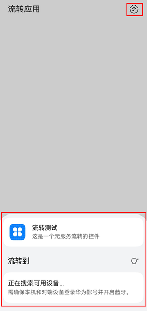
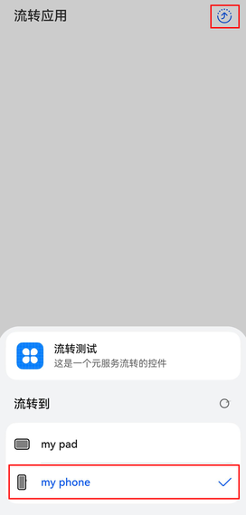
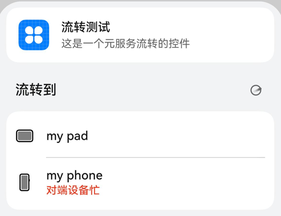

# CollaborationDevicePicker (流转控件)

该模块提供流转入口组件，点击流转入口组件后，会拉起设备选择面板。

与devicePicker.[createDevicePickerController](https://developer.huawei.com/consumer/cn/doc/harmonyos-references/servicecollaboration-devicepicker#createdevicepickercontroller)配合使用，通过创建的controller可以与设备选择面板进行交互。

起始版本： 4.0.0(10)

#### 导入模块

```
import { CollaborationDevicePicker } from '@kit.ServiceCollaborationKit';
```

#### CollaborationDevicePicker

模型约束： 此模块的接口仅可在Stage模型下使用。

装饰器类型： @Component

系统能力： SystemCapability.Collaboration.DevicePicker

起始版本： 4.0.0(10)

| 名称 | 类型 | 只读 | 可选 | 说明 |
| --- | --- | --- | --- | --- |
| controller | devicePicker.[DevicePickerController](https://developer.huawei.com/consumer/cn/doc/harmonyos-references/servicecollaboration-devicepicker#devicepickercontroller) | 否 | 否 | 设备选择控制器，通过该控制器与设备选择界面进行交互。 |
| attribute | devicePicker.[DevicePickerAttribute](https://developer.huawei.com/consumer/cn/doc/harmonyos-references/servicecollaboration-devicepicker#devicepickerattribute) | 否 | 否 | 设备选择属性，指定设备选择界面的应用描述信息，如果不指定，默认使用调用者所属ability配置文件中的信息。 |

#### [h2]build

build(): void

struct的默认构造函数，开发者无法直接调用此方法。

模型约束： 此模块的接口仅可在Stage模型下使用。

系统能力： SystemCapability.Collaboration.DevicePicker

起始版本： 4.0.0(10)

示例：

```
import { devicePicker, CollaborationDevicePicker } from '@kit.ServiceCollaborationKit';

@Entry
@Component
struct Index {
  controller: devicePicker.DevicePickerController = devicePicker.createDevicePickerController();

  build() {
    Column() {
      // 流转控件，应用流转的入口
      CollaborationDevicePicker({
        controller: this.controller, attribute: {
          abilityName: '流转测试',
          abilityDesc: '这是一个流转测试的控件',
          abilityIcon: $r('sys.media.ohos_app_icon'),
          businessDesc: '流转到'
        }
      })
    }.width('100%').alignItems(HorizontalAlign.Center)
  }
}
```

| **图1** 设备选择界面的应用描述信息效果图 | **图2** 点击流转入口组件后，拉起设备选择面板效果图 | **图3** 设备流转成功后效果图 | **图4** 流转失败效果图 |
| --- | --- | --- | --- |
| 设备选择界面最上方为应用描述部分，包括应用图标、应用名称、应用描述信息 | 页面右上角为流转图标，点击后会从设备底部弹出设备选择面板 | 流转图标和设备信息会变蓝色 | 流转失败效果图 |
