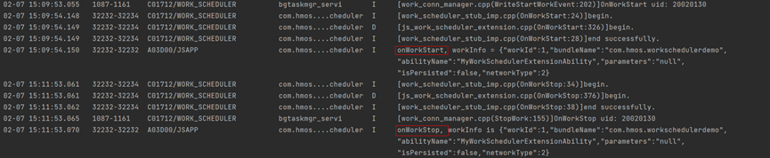

延迟任务申请成功之后，需要等到条件满足后才可以执行延迟任务回调，为了快速验证延迟任务回调功能是否正确，可以通过以下hidumper命令手动触发延迟任务执行回调。

```
hdc shell hidumper -s 1904 -a '-t com.hmos.workschedulerdemo MyWorkSchedulerExtensionAbility'
```

com.hmos.workschedulerdemo、MyWorkSchedulerExtensionAbility需要替换为需要查询应用的bundleName和abilityName。


