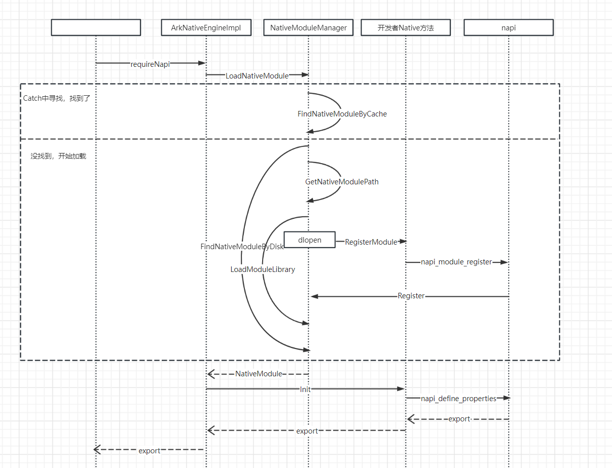

napi\_module结构体包含模块注册所需的信息，具体定义如下：

```
static napi_module demoModule = {
  .nm_version = 1, // Nm version number, default value is 1, type is int
  .nm_flags = 0, // Nm identifier, type unsigned int
  .nm_filename = nullptr, // File name, not currently paid attention to, use default value, type is char*
  .nm_register_func = Init, // Specify the entry function for nm, type napi_addon_register_func
  .nm_modname = "entry", // Specify the module name for TS page import, type char*
  .nm_priv = ((void*)0),  // Not paying attention for now, just use the default, type is void*
  .reserved = { 0 } // Not paying attention for now, just use the default value, type is void*
};
```

在requireNapi中，loadNativeModule加载模块，会先通过FindNativeModuleByCache在缓存中寻找目标module，如果在缓存中找到，使用GetNativeModulePath拼接so路径，最后用LoadModuleLibrary打开so；如果没有在缓存中找到，则要先查找dlopen打开对应so，打开so后，native中的extern "C" \_\_attribute\_\_((constructor)) void RegisterModule(void)函数进行NativeModule加载，然后完成static napi\_value Init(napi\_env env, napi\_value export)中的实际注册动作，返回一个js对象export，该js对象上挂载了开发者提供的native方法，以便于开发者在js侧调用。模块加载流程简介如下图：


