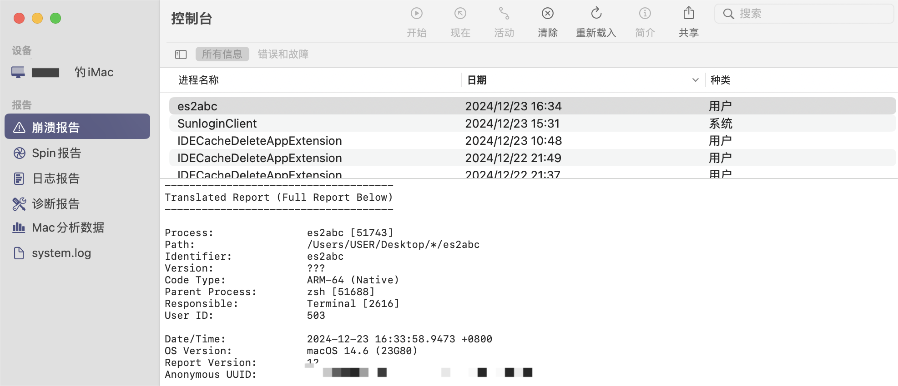
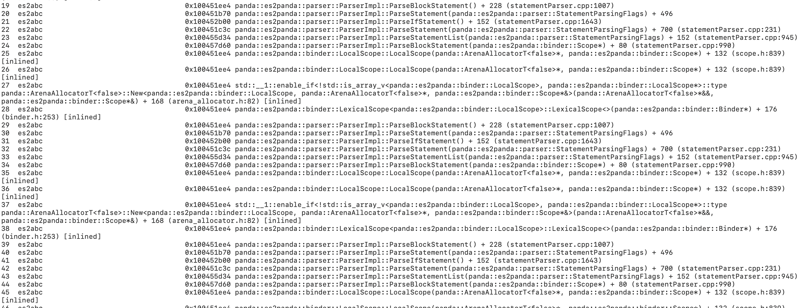

**问题现象**

出现Failed to execute es2abc错误，但未提供具体的错误日志，导致问题难以定位和分析。

**问题场景**

在源码中使用了大量深度嵌套的代码，例如几百层的if-else、类型转换和括号嵌套，这在编译时会导致递归调用超出栈容量上限，从而引发es2abc闪退，并且没有生成相关错误日志。

**定位方案**

在Windows上，可以打开事件管理器，找到Windows日志中的应用程序日志，查看对应的时间。如果找到es2abc.exe的崩溃日志，并且异常代码为0xc00000fd，表示该程序因栈溢出而崩溃。


在mac上，可以进入控制台，点击崩溃报告，找到es2abc,双击查看崩溃日志。



如果出现下图中所示，调用栈出现大量反复的调用相同的函数，那么极有可能是出现了大量递归导致栈溢出。



**解决措施**

排查代码中是否存在大量重复嵌套的场景，例如几百层的 if-else 语句、类型转换或括号嵌套，并对其进行拆分或优化。

问题代码示例：

以下问题场景包括但不限于：

```
if (condition) {
     if (condition) {
         if (condition) {
             if (condition) {
                 if (condition) {
                     if (condition) {
                         ...
                     }
                 }
             }
         }
     }
 }
[
     [
         [
             [
                 [
                     [
                         [
                             [
                                 ...
                            ]
                         ]
                     ]
                 ]
             ]
         ]
     ]
 ]
```

```
!!!!!!!!!!
!!!!!!!!!!
...
!!!!!a
```

```
var a = 1
a as Int as Int as Int as Int as Int ...
```
