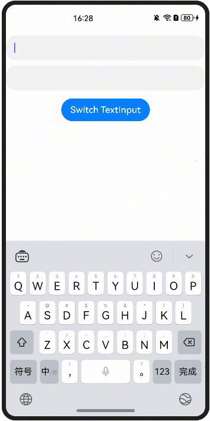
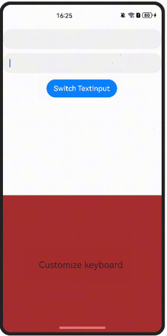

软键盘的收起和弹出与输入框的获焦和失焦相关。可以通过 focusControl 动态控制输入框焦点的转移，从而控制软键盘的显示和隐藏。将焦点转移到目标输入框可以实现键盘的动态切换。参考代码如下：

```
@Entry
@Component
struct DynamicControlKeyboard {
  // Whether focus is on "key1" TextInput
  private flag: boolean = true;
  @Builder
  customKeyboardBuilder() {
    Row() {
      Text('Customize keyboard')
    }
    .justifyContent(FlexAlign.Center)
    .width('1260px')
    .height('1161px')
    .backgroundColor(Color.Brown)
  }
  build() {
    Column({space: 10}) {
      TextInput()
        .key('key1')
        .onAppear(() => {
          focusControl.requestFocus('key1');
        })
        .defaultFocus(true)
      TextInput()
        .key('key2')
        .customKeyboard(this.customKeyboardBuilder())
      Button('Switch TextInput')
        .onClick(() => {
          if (this.flag) {
            console.info('TextInput2 ==> ' + focusControl.requestFocus('key2'));
          } else {
            console.info('TextInput1 ==> ' + focusControl.requestFocus('key1'));
          }
          this.flag = !this.flag;
        })
      Button()
        .width(0)
        .height(0)
        .key('key3')
    }
    .padding({ top: 20 })
    .width('100%')
    .height('100%')
    .onClick(() => {
      focusControl.requestFocus('key3');
    })
  }
}
```

效果如图所示：



**参考链接**

[focusControl](https://developer.huawei.com/consumer/cn/doc/harmonyos-references/ts-universal-attributes-focus#focuscontrol9)
