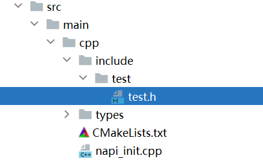

请按照以下示例进行配置：

**例1****：**

目录结构：

CMakeLists.txt配置头文件搜索路径：

include\_directories($\{NATIVERENDER\_ROOT\_PATH\}/include)

cpp文件中引用头文件:

#include 'test.h'

**例2****：**

目录结构：

CMakeLists.txt配置头文件搜索路径：

include\_directories($\{NATIVERENDER\_ROOT\_PATH\})

cpp文件中引用头文件:

#include 'include/test/test.h'

**例3：**

目录结构：

CMakeLists.txt配置头文件搜索路径：

include\_directories($\{NATIVERENDER\_ROOT\_PATH\}/include)

cpp文件中引用头文件:

#include 'test/test.h'

**例4:**

目录结构：

CMakeLists.txt配置头文件搜索路径:

include\_directories($\{NATIVERENDER\_ROOT\_PATH\}/include/test)

cpp文件中引用头文件:

#include 'test.h'
