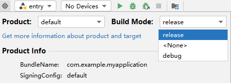
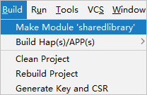
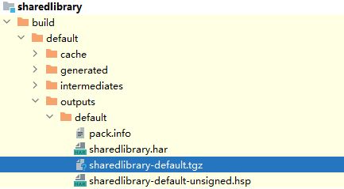

如需在应用内共享HSP，请将HSP共享包上传至私仓。动态共享包HSP不能直接发布在私仓内，需要先转换为.tgz包。请按以下操作编译生成\*.tgz包。

1. 将编译模式设为release。

   
2. 选中HSP模块的根目录，点击Build > Make Module {libraryName}，启动构建。

   
3. 构建完成后，build目录下生成HSP包产物，其中.tgz用来上传至私仓（请参考[将三方库发布到 ohpm-repo](https://developer.huawei.com/consumer/cn/doc/harmonyos-guides/ide-ohpm-repo-quickstart#zh-cn_topic_0000001792256157_将三方库发布到ohpm-repo)）。

   
4. 上传到仓库，然后使用 `ohpm install` 命令将依赖安装到工程的oh-package.json5文件的dependencies字段中，即可查看对外共享的 HSP 方法。

**参考链接**

[创建HSP模块](https://developer.huawei.com/consumer/cn/doc/harmonyos-guides/ide-hsp#section79378499185)
