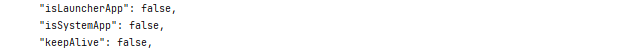

1. 连接设备。
2. 执行以下命令打印日志（Bundle Name获取参考：[bundleManager.getBundleInfoForSelf](https://developer.huawei.com/consumer/cn/doc/harmonyos-references/js-apis-bundlemanager#bundlemanagergetbundleinfoforself)）：

   ```
   hdc shell bm dump -n <Bundle Name>
   ```
3. 当isSystemApp字段返回值为true时，表示当前应用是系统应用。

   返回的部分结果如下图所示：

   

   
