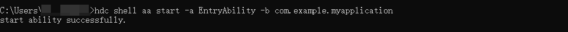

使用命令拉起指定UIAbility：

```
hdc shell aa start -a <UIAbility Name> -b <Bundle Name>
```

启动成功时，返回"start ability successfully."，启动失败时，返回"error: failed to start ability"，同时会包含相应的失败信息。

示例如下：

```
hdc shell aa start -a EntryAbility -b com.example.myapplication
```



**参考链接**

[aa工具](https://developer.huawei.com/consumer/cn/doc/harmonyos-guides/aa-tool)
