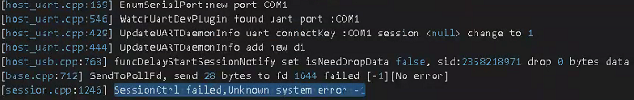

**问题现象**

hdc访问不了设备。hdc list targets -v出现unknown状态。

查看hdc.log日志

**可能原因**

系统兼容问题。在win10上安装vpn工具astrill后，会导致出现这样问题。

**解决措施**

* 当前版本hdc建议卸载掉vpn软件，注意不是停掉vpn，而是卸载vpn。
* 参考[hdc版本配套表](https://developer.huawei.com/consumer/cn/doc/harmonyos-guides/hdc#hdc版本配套表)升级最新版本后重试。
