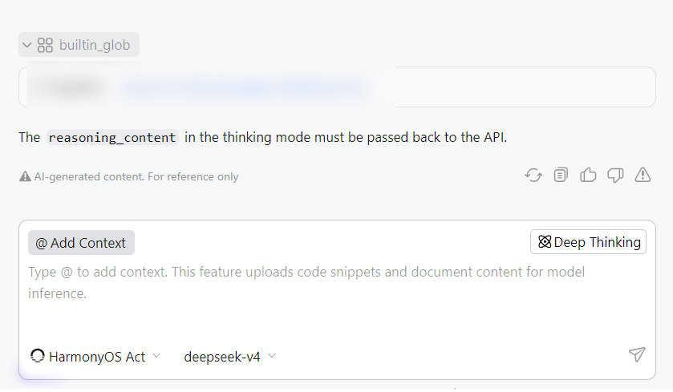
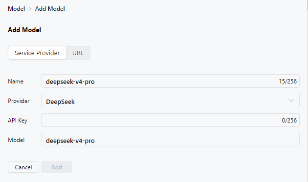

**问题现象**

DevEco Studio 6.1.0 Release（6.1.0.850）及以上版本，在CodeGenie中通过URL方式配置deepseek-v4模型后，过程中界面提示“The reasoning\_content in the thinking mode must be passed back to the API.”。

**解决措施**

使用Service Provider（服务提供商）方式配置模型，并在使用过程中打开深度思考。

