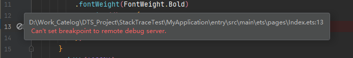
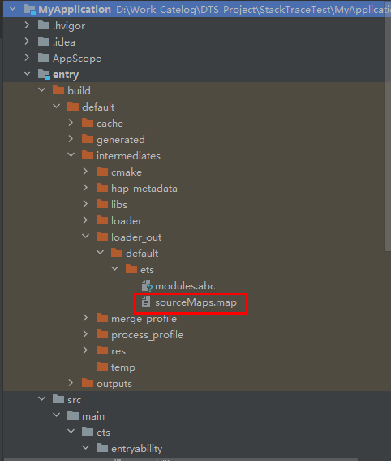
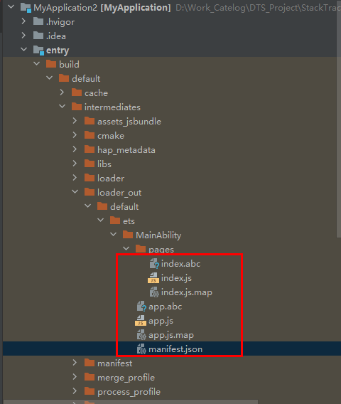
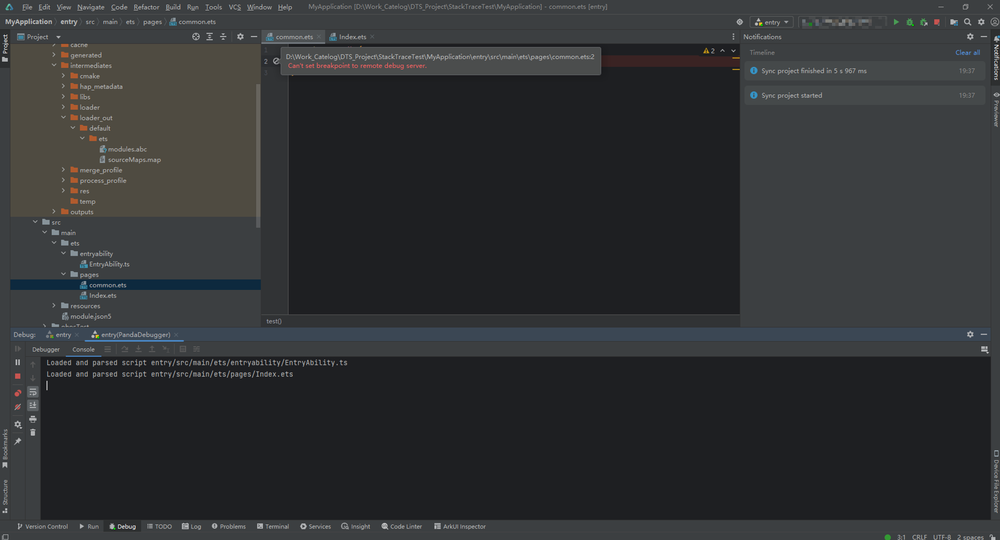
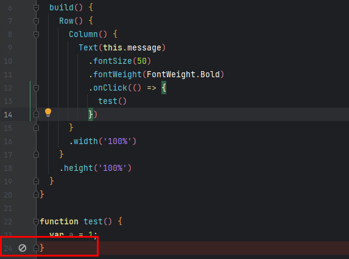

**问题现象**

调试过程中无法添加断点，提示“Can't set breakpoint to remote debug server”，如图所示。

**解决措施**

请使用以下方法排查原因：

1. 检查是否存在xx.map文件。如果不存在，则需重新编译构建生成map文件，然后进行断点调试。

   * 对于stage模型工程，需检查sourceMaps.map文件是否存在。该文件由编译构建生成，位于模块的“entry\build\default\intermediates\loader\_out\default”目录下，如下图所示：

     **图1** stage模型工程中sourceMaps.map文件目录
     
   * 对于FA模型工程，需检查断点所在文件对应的map文件是否存在。该文件由编译构建生成，位于模块的“entry\build\default\intermediates\loader\_out\default”目录下，如下图所示：

     **图2** FA模型工程中map文件目录
     

2. 检查代码文件是否已加载。启动调试后，如果断点所在代码文件未加载（已加载的代码文件会显示在下方**Console**中），则断点将无法添加。程序运行并加载代码文件后，断点即可正常添加。代码文件未加载的原因是未被入口模块直接或间接引入。

   **图3** 断点所在代码文件未加载
   
3. 断点添加位置无效。ArkTS不支持在方法的右括号单独所在行添加断点。

   **图4** 断点位置无效
   
