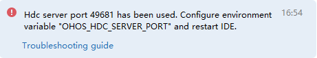
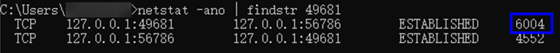
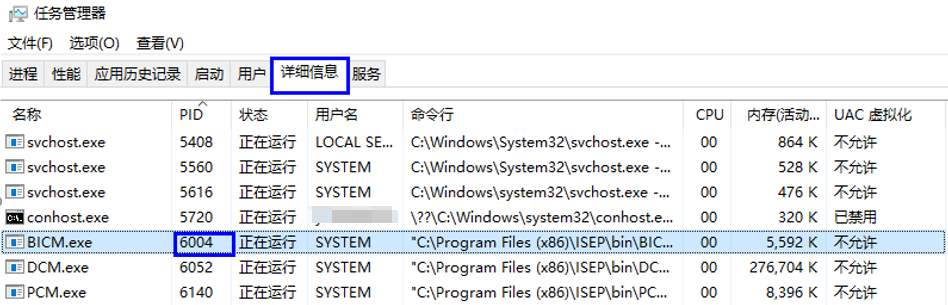
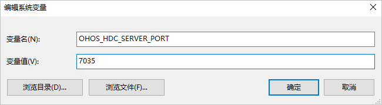

**问题现象**

在设备中运行HAP时，提示“Hdc server port XXXX已被使用。请配置环境变量‘OHOS\_HDC\_SERVER\_PORT’并重启DevEco Studio。”



**解决措施**

HDC的默认端口8710导致服务无法启动。解决方法如下：

方式一：结束掉占用该端口的应用。

1. 运行CMD命令行工具，输入“netstat -ano | findstr *端口号*”，查询占用端口号的进程PID。

   
2. 打开任务管理器，选择详细信息页，查看PID对应的应用。

   
3. 结束掉对应应用后，重启DevEco Studio。

方式二：为HDC端口号设置其他的环境变量。

* Windows环境变量设置方法：

  在**此电脑 > 属性 > 高级系统设置 > 高级 > 环境变量**中，添加变量名OHOS\_HDC\_SERVER\_PORT，变量值设置为任意未占用的端口，例如7035。

  

  环境变量配置完成后，关闭并重启DevEco Studio。
* macOS环境变量设置方法：
  1. 打开终端，执行以下命令，根据输出结果执行不同命令。

     ```
     echo $SHELL
     ```

     + 如果输出结果为/bin/bash，则执行以下命令以打开.bash\_profile文件。

       ```
       vi ~/.bash_profile
       ```
     + 如果输出结果为/bin/zsh，则执行以下命令以打开.zshrc文件。

       ```
       vi ~/.zshrc
       ```
  2. 按字母“i”，进入**Insert**模式。
  3. 输入以下内容，添加OHOS\_HDC\_SERVER\_PORT端口信息。

     ```
     OHOS_HDC_SERVER_PORT=7035
     launchctl setenv OHOS_HDC_SERVER_PORT $OHOS_HDC_SERVER_PORT
     export OHOS_HDC_SERVER_PORT
     ```
  4. 编辑完成后，单击**Esc**键退出编辑模式，然后输入“:wq”并单击**Enter**键保存。
  5. 执行以下命令，使环境变量生效。
     + 如果[步骤1](#zh-cn_topic_0000001166752005_li1264071053012)打开的是.bash\_profile文件，请执行如下命令：

       ```
       source ~/.bash_profile
       ```
     + 如果[步骤1](#zh-cn_topic_0000001166752005_li1264071053012)打开的是.zshrc文件，请执行如下命令：

       ```
       source ~/.zshrc
       ```
  6. 环境变量配置完成后，关闭并重启DevEco Studio。

方式三：如果查询端口未被占用，检查端口是否被防火墙拦截。如果被拦截，放行端口，然后重启DevEco Studio重新尝试。
