**问题现象**

执行热重载过程中，如果当前修改不支持热重载，控制台会打印蓝色重启链接，提示重新安装并重启。

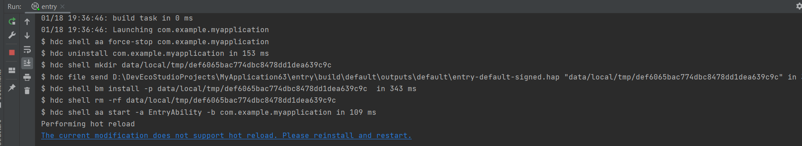

**解决措施**

DevEco Studio的热重载功能支持特定的代码场景。如果修改的代码超出支持范围，系统将提示“当前修改不支持”，并要求重启。具体支持的代码范围，请参阅[Hot Reload使用约束](/docs/tools/coding-debug/ide-hot-reload#section995453874915)。

**常见不支持代码场景**

* 不支持@Entry装饰器的struct Index内成员变量和成员函数的新增或修改。

  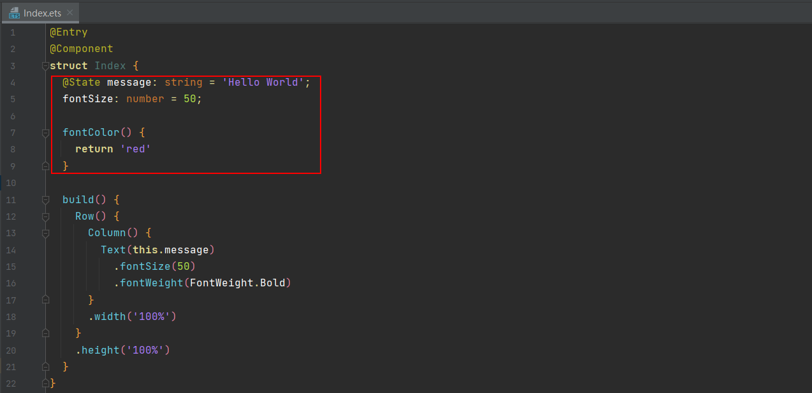
* 不支持@Entry入口文件内class成员函数的新增。

  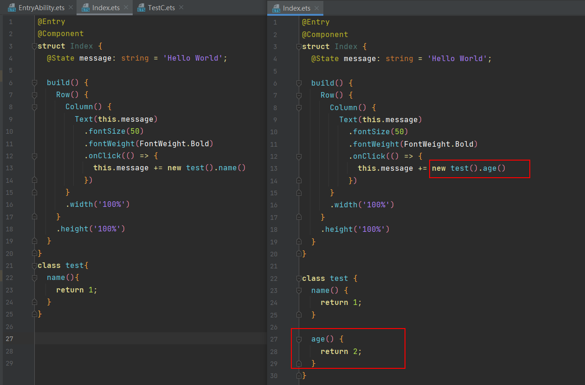
* 不支持@Entry入口文件内枚举的修改。

  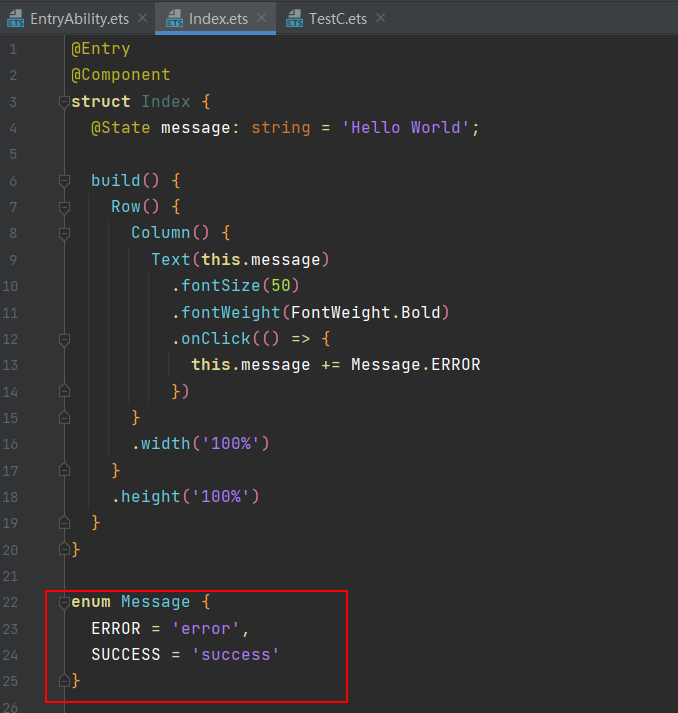
* 不支持import未加载的模块的新增、修改。

  若一个代码文件在热重载启动时未被当前文件导入，则不支持在热重载过程中新增对该代码文件的导入。如下图所示，TestC.ets在热重载启动时未在Index.ets中导入，则在热重载过程中不支持在Index.ets中新增导入TestC.ets的语句。

  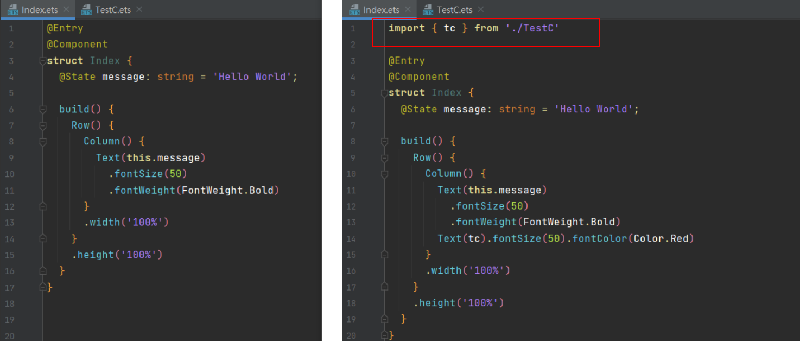

  如果热重载启动之前import语句处于置灰状态，此文件在编译过程中将不会被编译，属于未加载的模块。

  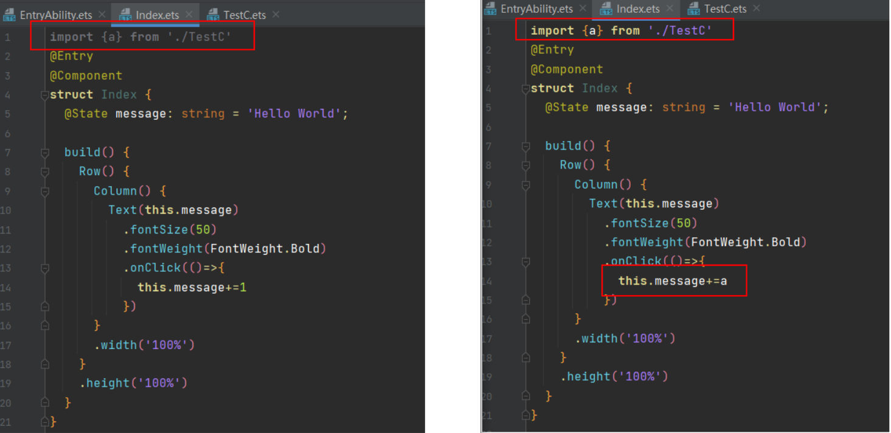
* 不支持顶层闭包变量的修改（但支持顶层闭包的新增、删除）。

  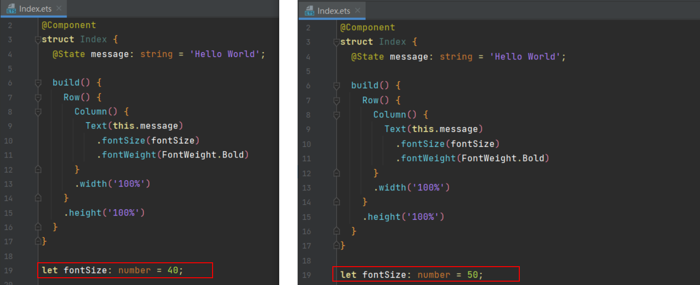
* 支持class类继承，但class继承类和被继承类都不可以放在@Entry入口文件中，建议将class写在非@Entry入口文件中。

  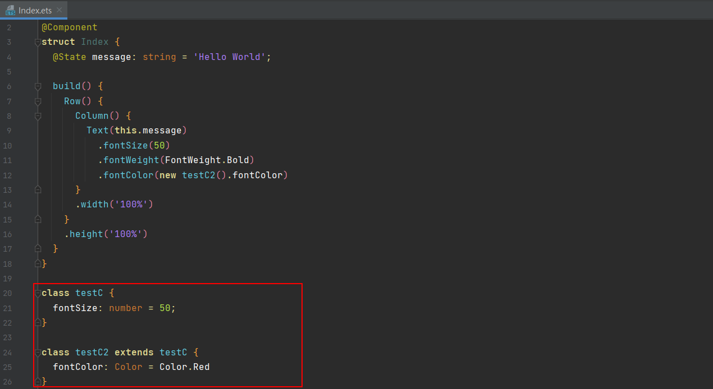
* 不支持@Entry入口文件内大部分装饰器的修改。

  当前Hot Reload不支持大部分装饰器的修改。@Entry入口文件内支持@Styles装饰器的新增和修改，支持@Builder装饰器的修改，但不支持新增，不支持@State装饰器的新增和修改。

  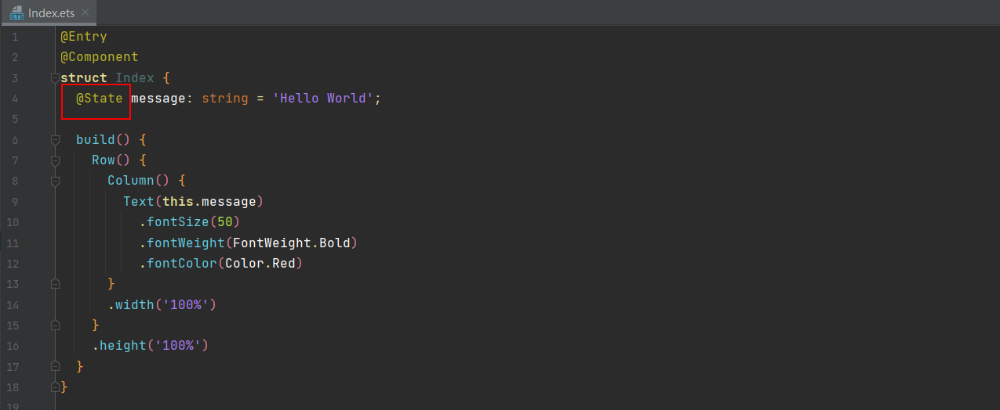
* 不支持在@Entry文件内新增、修改其他struct自定义组件。建议以import方式引入。

  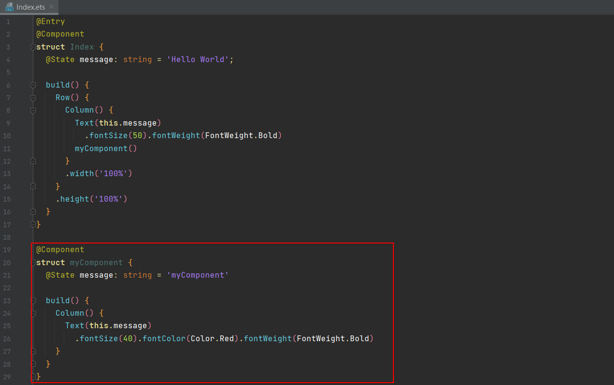
* 不支持在@Entry文件内新增、修改与@State变量重名的class或函数。

  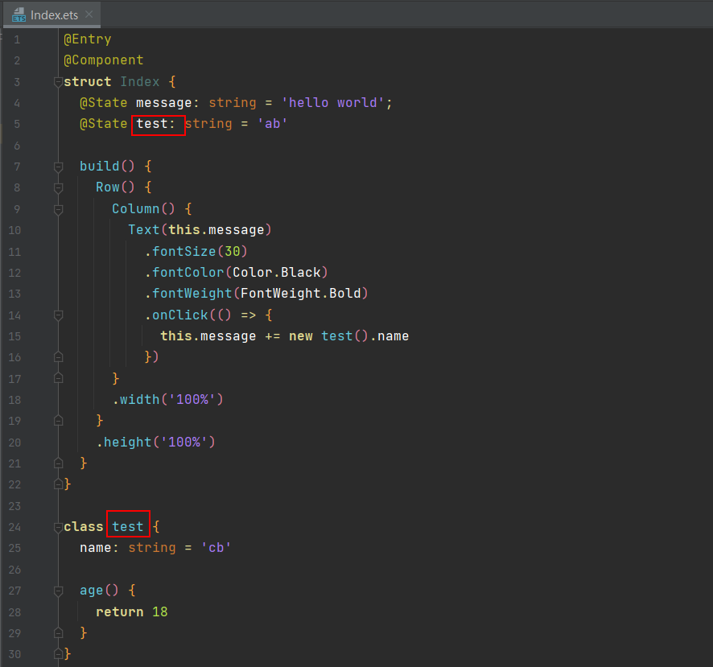
* 不支持修改非ets/ts代码文件。

  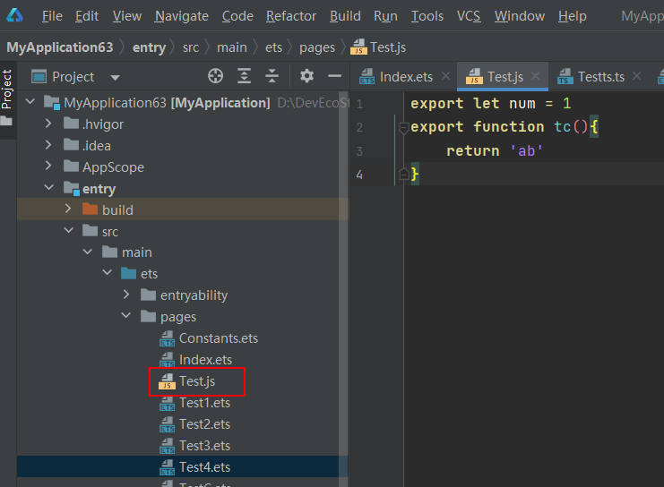
* 不支持修改worker线程文件。

  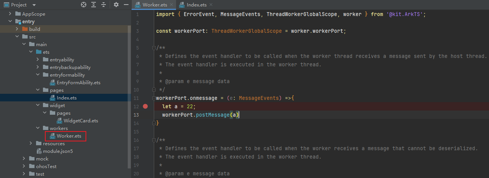
