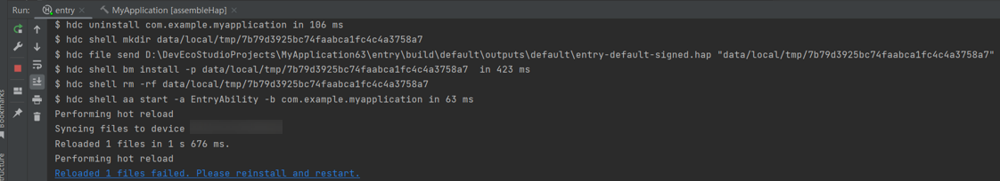
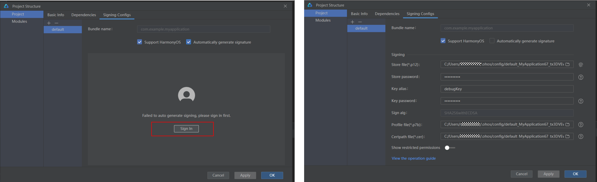
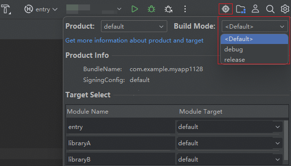

**问题现象**

热重载执行结果失败，控制台打印蓝色重启链接：“Reloaded 1 files failed. Please reinstall and restart.”

**解决措施**

热重载的最后一步是将补丁包安装到设备并执行quickfix命令。如果quickfix命令执行失败，热重载也会失败。

导致补丁包安装失败的原因可检查以下几个方面：

* 检查工程签名是否正确，热重载需要使用debug签名（不支持release签名），否则热重载将无法执行。

  
* 检查工程的Build Mode，热重载不支持release模式，支持debug和\<None\>。

  
