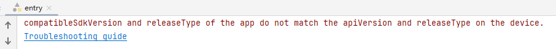
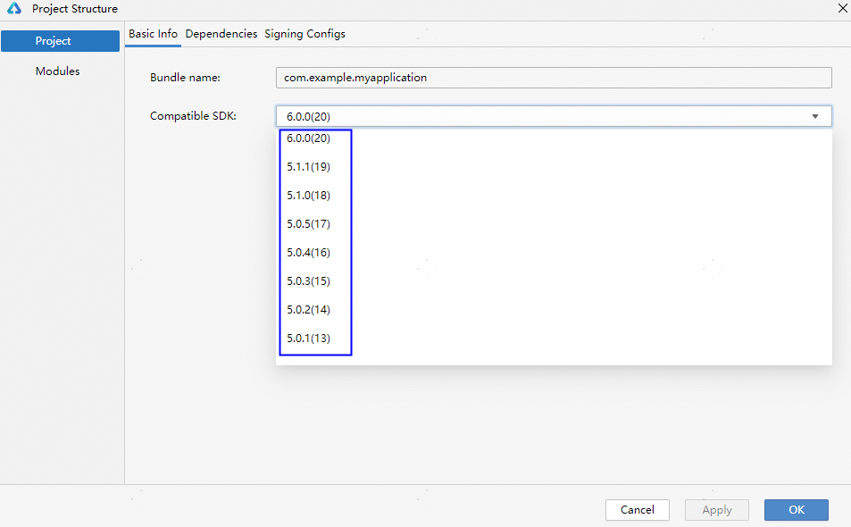

**问题现象**

在启动调试或运行应用/服务时，安装HAP出现错误，提示“compatibleSdkVersion和releaseType与设备上的apiVersion和releaseType不匹配。”

**解决措施**

出现该问题是因为当前工程配置的最低兼容版本高于设备镜像版本。

使用命令hdc shell param get const.ohos.apiversion查询当前设备的 API 版本，并对比工程级build-profile.json5配置文件中的compatibleSdkVersion字段。如果版本不匹配，可以使用以下解决办法：

方法一：请升级设备镜像版本以匹配当前工程版本。在系统设置界面升级设备系统。

方法二：降低工程的API版本，点击DevEco Studio右上角的，Compatible SDK选择更低的版本号，以兼容设备的API版本。

* 如果执行命令后返回“[Fail]ExecuteCommand need connect-key? please confirm a device by help info”，可能是连接了多台调试设备，或者模拟器和真机同时使用。
  + 如果同时连接了模拟器和真机，请断开模拟器。
  + 如果连接了多台设备，每次执行命令时需要使用-t参数指定目标设备的标识符。您可先执行**hdc list targets命令**查询连接的设备，再通过**hdc -t *connect-key* shell param get const.ohos.apiversion**命令指定要连接的目标设备，其中connect-key为设备标识符，即**hdc list targets**返回的信息。
