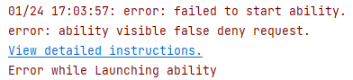

**问题现象**

启动调试或运行应用/服务时，如果安装HAP出错，提示“error: failed to start ability. error: ability visible false deny request”，请检查应用的可见性设置。

**解决措施**

* 在Stage模型工程的module.json5文件中，将abilities字段内的exported设置为true。
* FA模型工程：在config.json文件的abilities字段中，将visible设置为true。
