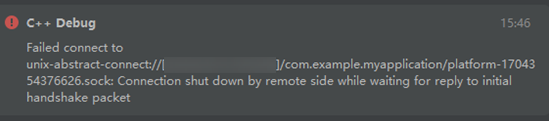

**问题现象**

启动C++调试时出现错误，提示“Failed to connect to unix-abstract-connect://\\*\\*\\*\\*\\*\\*\\*\\*\\*.sock: Connection shut down by remote side while waiting for reply to initial handshake packet”。

**解决措施**

1. 如果设备镜像与DevEco Studio版本不匹配，请尝试更换设备镜像版本以解决问题。
2. 签名使用了release证书，请更换为debug证书。
3. 到设备路径 /data/local/tmp/debugserver/ 下，删除与应用包名相同的文件夹。
