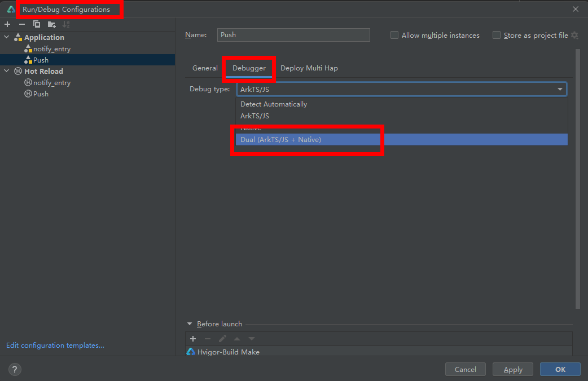

**问题现象**

在DevEco Studio上的C/C++代码处打断点，调试运行时断点不生效。

**可能原因**

DevEco Studio进行ArkTS/JS + Native混合调试时需要配置DevEco Studio的调试模式。

**解决措施**

选择配置项：Run/Debug Configurations > Debugger > Dual(ArkTS/JS + Native)

