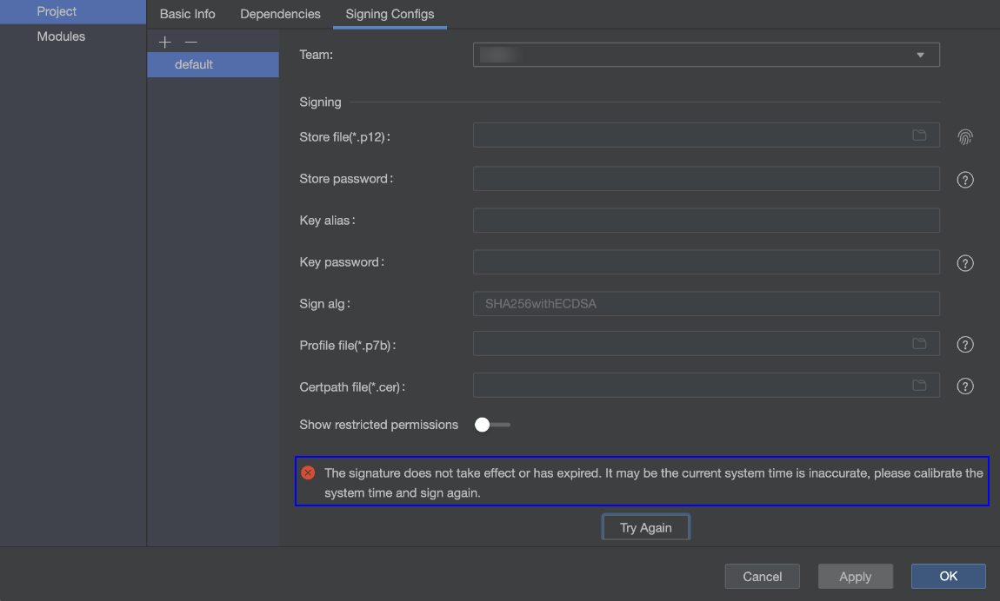

**问题现象**

应用在进行自动签名时，签名失败，提示“The signature does not take effect or has expired. The current system time may be inaccurate. Please calibrate the system time and sign again.”

**解决措施**

出现报错是因为电脑的系统时间与北京时间不一致。请在系统设置中将时间设置为北京时间。

Windows：

1. 在开始菜单中搜索并打开“控制面板”。
2. 点击“时钟和区域”> “日期和时间”。
3. 在弹出的窗口中点击“更改日期和时间”。
4. 修改后点击“确定”保存。

macOS：

1. 在桌面点击左上角菜单，选择“系统设置”。
2. 在侧边栏点击“通用”> “日期与时间”。
3. 点击时间旁边的“设置”按钮，手动输入日期和时间。

如果您使用的是公司或学校管理的设备，可能会受到MDM（移动设备管理）限制，无法更改时间设置，这种情况下需要联系公司或学校的IT管理员。
