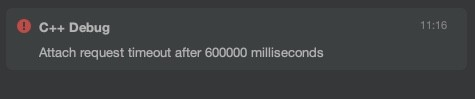
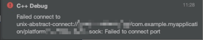

**问题现象：**Native调试长时间没有启动，最后DevEco Studio超时报错"Attach request timeout after 600000 milliseconds"或Native调试启动后报错"Failed to connect port"。





**可能原因：**

linux或MacOS 下 /etc/hosts文件被修改。

**解决措施：**

1. 在/etc/hosts文件后添加如下内容：

   ```
   127.0.0.1 localhost
   255.255.255.255 broadcasthost
   ::1 localhost
   ```
2. 重启电脑使修改生效。
