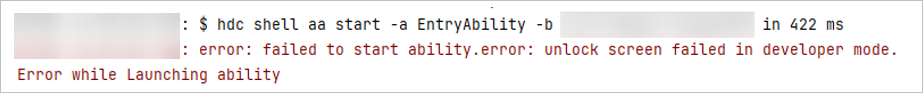

**问题现象**

在启动调试或运行应用/服务时，如果安装HAP失败并显示“error: failed to start ability. error: unlock screen failed in developer mode”错误信息，表示在开发者模式下未能成功解锁屏幕。

**解决措施**

该问题的原因是在锁屏状态下，设备设置了锁屏密码，导致应用无法正常启动。

* 方法一：通过设置显示和亮度中的屏幕休眠选项，延长自动休眠时间。
* 方法二：应用开发时，可不设置锁屏密码。应用启动时，设备将自动亮屏并启动应用。
