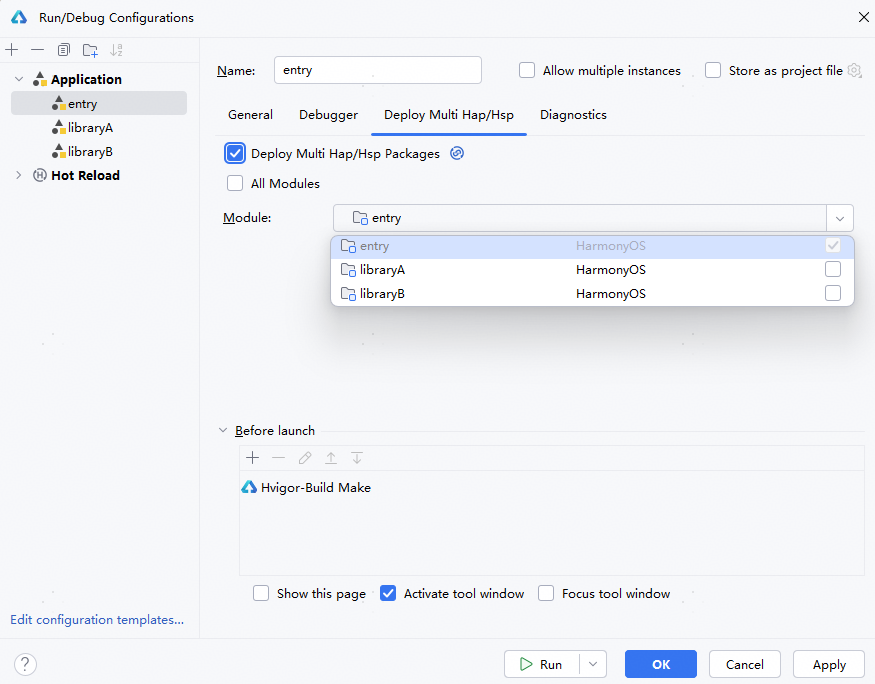

**问题现象**

启动调试或运行应用/服务时，应用运行崩溃，提示错误信息“errorMsg: hap path error”。

**解决措施**

如果依赖的应用包未安装，建议进入**Run/Debug Configurations > Deploy Multi Hap****/Hsp**页签，勾选**Deploy Multi Hap/Hsp Packages**，选择所需依赖的应用包，然后重新运行应用。

