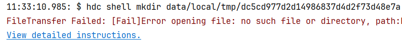

**问题现象**

DevEco Studio安装HAP时报错“FileTransfer Failed: [Fail]Error opening file: no such file or directory”。

**解决措施**

出现该问题的原因是path路径的安装包不存在，可以检查签名HAP包是否没打包成功，修改签名，正常打出签名HAP包后再运行。

**参考链接**

[对HAP/APP进行签名](https://developer.huawei.com/consumer/cn/doc/harmonyos-guides/ide-command-line-building-app#section103321051433)
