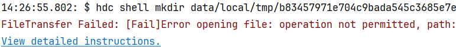

**问题现象**

DevEco Studio安装HAP时报错“FileTransfer Failed: [Fail]Error opening file: operation not permitted”。

**解决措施**

出现该问题的原因是安装包HAP所在路径没有权限。

1、Windows系统建议将工程移出C盘，然后重新运行。

2、MAC系统为DevEco Studio获取完全磁盘访问权，请进入**“系统设置”>“隐私与安全性”>“完全磁盘访问权限”**，在列表中勾选DevEco Studio软件并重启。
