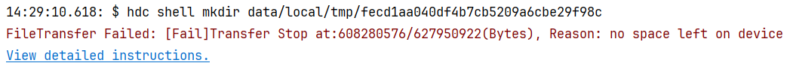

**问题现象**

DevEco Studio安装HAP时报错“FileTransfer Failed: [Fail]Transfer Stop at:XXX, Reason: no space left on device”。

**解决措施**

设备磁盘空间不足，无法写入数据。请检查设备磁盘空间。如果是模拟器，可以点击“Wipe User Data”清除模拟器数据，然后重新运行模拟器。
