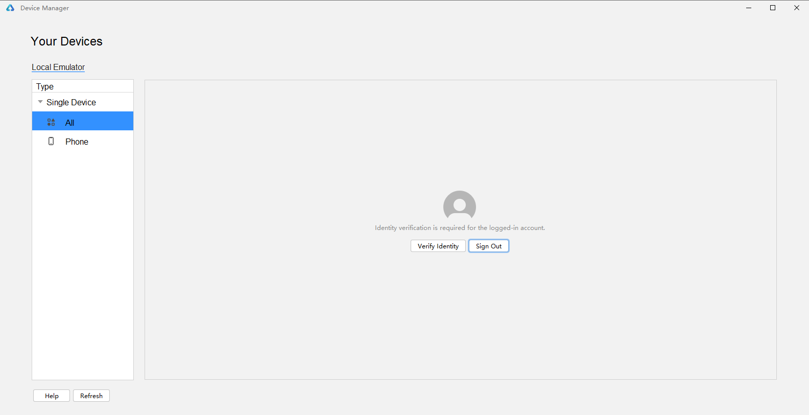
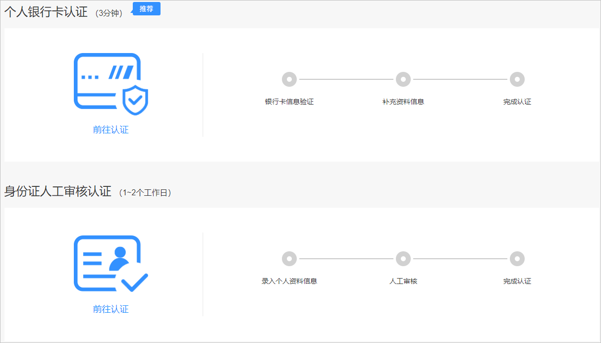
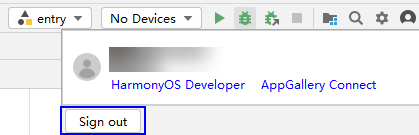
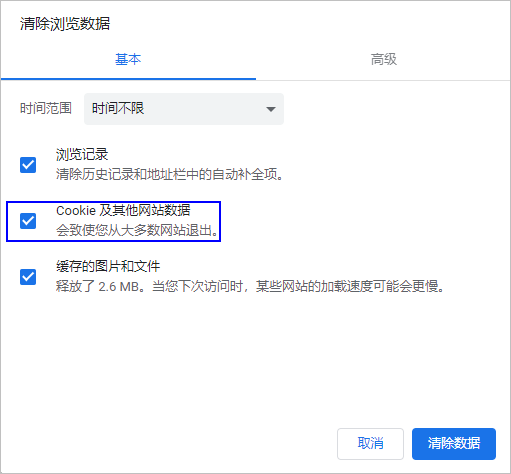

**问题现象**

使用本地模拟器时，需用实名认证的开发者账号登录授权。若账号未实名认证，本地模拟器会提示需要实名认证。

**解决措施**

原因包括以下两种情况：

* 华为账号未实名认证，请开发者按照如下步骤进行处理。
* 刚完成实名认证但认证未生效，开发者可根据步骤4清除浏览器Cookie后重试。

1. 点击上图中的**Verify Identity**，前往开发者联盟实名认证。
2. 根据浏览器界面提示进行实名认证，具体指导可以参考[实名认证介绍](https://developer.huawei.com/consumer/cn/doc/start/itrna-0000001076878172)。个人开发者可以选择银行卡认证或者身份证认证。

   
3. 认证完成后，在DevEco Studio界面，点击右上角个人中心，点击Sign out退出，重新登录。

   
4. （可选）如果实名认证后重新登录，仍提示需要进行实名认证，可清除浏览器 **Cookie（快捷键 Ctrl+Shift+Del）**后重试。

   
