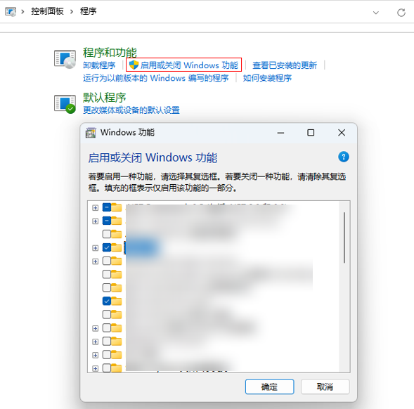
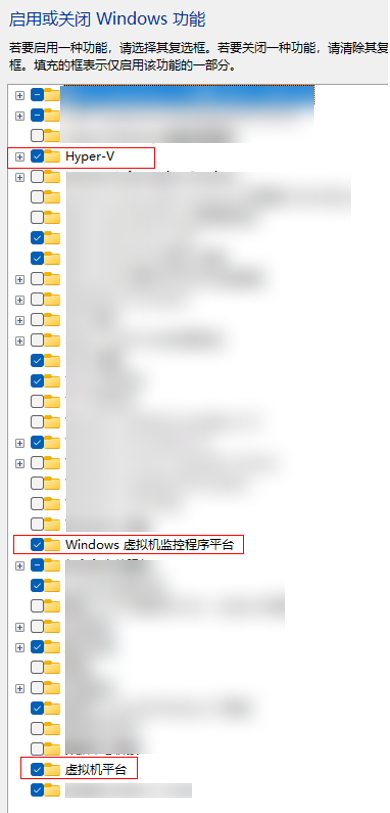

**问题现象**一

启动模拟器时，如果未开启Hyper-V，或在虚拟环境中使用模拟器，会弹窗提示“Hyper-V not enabled”。


**解决措施**

1. 请确保模拟器的[使用环境](/docs/tools/coding-debug/ide-emulator-requirements)符合要求。
2. 如果CPU支持虚拟化，打开控制面板 > 程序 > 程序与功能 > 启动或关闭Windows功能（对于Windows 11系统，需打开系统 > 可选功能，在相关设置中点击更多Windows功能），找到并勾选“Hyper-V”、“Windows虚拟机监控程序平台”和“虚拟机平台”，点击确定并重启电脑。若勾选后启动模拟器仍提示错误，需以管理员权限打开命令行窗口，执行 `bcdedit /set hypervisorlaunchtype auto`，然后重启电脑。

   

   
3. 若勾选后启动模拟器仍然提示该错误，需要以管理员权限打开命令行窗口执行以下命令，并重启电脑。

   ```
   bcdedit /set hypervisorlaunchtype auto
   ```
4. 如果上述步骤无法解决问题，打开任务管理器，切换到“性能”选项卡。如果显示虚拟化已禁用或未开启，说明BIOS中虚拟化功能未开启。请根据计算机主板型号，进入 BIOS 设置界面，开启虚拟化功能。

   

如果安装和开启Hyper-V的过程遇到其他问题，请根据系统版本查阅相关文档。更多关于Hyper-V安装请参考[安装 Hyper-V](https://learn.microsoft.com/zh-cn/virtualization/hyper-v-on-windows/quick-start/enable-hyper-v?f=255&MSPPError=-2147217396)，[Windows 和 Windows Server 上的 Hyper-V 的系统要求](https://learn.microsoft.com/zh-cn/virtualization/hyper-v-on-windows/reference/hyper-v-requirements)。
