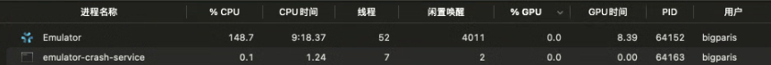
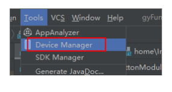
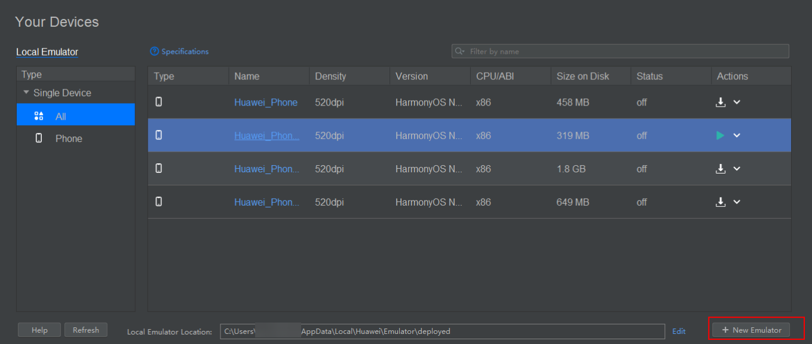

**问题描述**

打开活动检测器，发现模拟器的CPU占用率为80%。

**解决措施**

1.打开模拟器设备管理页面。

2.选择“新建模拟器”弹窗。

3.复制路径并用文件夹打开system-image\HarmonyOS-NEXT-DB1\phone\_x86。

4.打开features.ini文件，将bootanimation.feature.key的值改为true，保存后重启模拟器。

