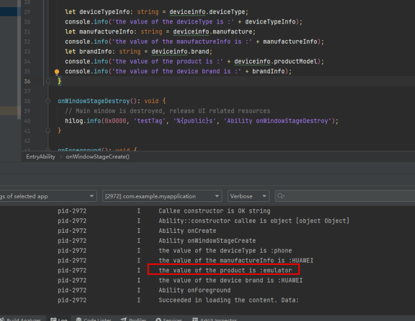

**问题现象**

在调试应用代码时，需要判断当前运行的设备是真机还是模拟器，可以通过检查特定的系统属性或环境变量来实现区分。

**解决措施**

在应用中，使用[@ohos.deviceInfo](https://developer.huawei.com/consumer/cn/doc/harmonyos-references/js-apis-device-info)模块的productModel属性来区分真机和模拟器。模拟器上，productModel的值为emulator。

